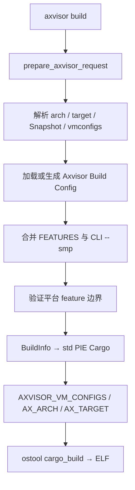

# Axvisor 构建

`cargo xtask axvisor build` 通过 `Axvisor::prepare_request()` 解析 arch、target、Build Config 和 VM 配置，然后调用 `axvisor/build/mod.rs::load_cargo_config()`。编译的固定 package 是 `axvisor`，直接构建结果为 ELF。

## 1. 构建流程

Axvisor 的构建先解析 VM 来源，再验证 feature 边界并生成 Cargo 环境；`AXVISOR_VM_CONFIGS` 只在最终装配阶段写入。下图展示各阶段的职责顺序。



### 1.1 配置装载

默认配置路径为：

```text
tmp/axbuild/config/axvisor/build-<target>.toml
```

文件存在时可以是纯 `BuildInfo`，也可以是含 `target` 和 `vm_configs` 的 board 文件。`load_build_config()` 的行为如下：

1. 若是 board 文件，读取其 target、BuildInfo 和 VM 列表；CLI `--smp` 覆盖其中 CPU 数。
2. 若是纯 BuildInfo，使用已解析请求的 target，VM 列表为空。
3. 若文件缺失，寻找 `os/axvisor/configs/board/` 下名称以 `qemu-` 开头且 target 匹配的 board；找到即复制并加载。
4. 若仍找不到，创建 `features = []` 的默认 BuildInfo。

这解释了为何选择一个 board config 可以同时确定驱动能力、CPU 数和默认 VM 列表；而手工的 BuildInfo 只负责编译能力。

### 1.2 特性校验

加载后，axbuild 合并 `FEATURES` 环境变量并校验 feature。公共验证器检查 Cargo feature 名称，Axvisor 还检查以下嵌套平台形式：

- `axplat-dyn/*`；
- `ax-std/<platform>` 这类嵌套平台选择；
- 直接把已登记 axplat 平台名作为 feature。

这些验证将硬件能力、平台选择和虚拟化后端分别约束在 Board、VM 与 QEMU 配置层。

### 1.3 Cargo 装配

共享 BuildInfo 将裸机 target 映射到 musl PIE JSON target，开启 std-aware 构建，并准备交叉 C 环境、linker wrapper 和占位库。Axvisor 之后：

- 固定 Cargo package 和 binary 为 `axvisor`；
- 写入 `AX_ARCH` 与原始裸机 `AX_TARGET`；
- 选择 CLI `--vmconfigs`，或在 CLI 为空时选择 Build Config 的 `vm_configs`；
- 非空 VM 列表以平台路径分隔符写入 `AXVISOR_VM_CONFIGS`；
- 对 feature 排序去重。

基础 Cargo 的 `to_bin` 固定为 `false`。`axvisor build` 因而只保证 ELF；QEMU 路径在读取 TOML 后再明确设置其 `to_bin`。

## 2. 虚拟化后端

构建 x86 guest 场景时，Build Config 选择 `vmx` 或 `svm` feature，QEMU TOML 声明对应 CPU 扩展。该组合将 Intel、AMD 和 CI 场景的虚拟化要求保留在可审阅的配置中。

## 3. 命令示例

这些命令分别验证默认构建、board-derived VM 配置以及 CLI 对 VM 列表的覆盖。

```bash
# 直接构建
cargo xtask axvisor build --arch aarch64

# 使用 board-derived 配置与其 VM 列表
cargo xtask axvisor build --config os/axvisor/configs/board/qemu-x86_64.toml

# 用 CLI 覆盖 VM 列表
cargo xtask axvisor build --arch x86_64 \
  --vmconfigs os/axvisor/configs/vms/qemu/x86_64/linux-vmx-smp1.toml
```
