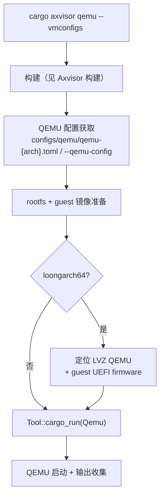

# Axvisor 运行

`cargo xtask axvisor qemu/uboot/board` 在构建基础上增加运行环节：将编译好的 Axvisor 和 Guest VM 配置部署到 QEMU 虚拟机、U-Boot 引导或远程板卡中执行。本节描述 Axvisor 三种运行目标的特有行为；通用的 QEMU 配置获取、ostool 执行机制详见 [参数与配置](../configuration)，构建详见 [Axvisor 构建](./build)。

Axvisor 是三套子系统中**运行环境最特殊**的：loongarch64 需要 LVZ 扩展版 QEMU，且需要为 Guest VM 准备 rootfs 和 UEFI firmware。

## 子命令

| 子命令 | 运行目标 | 说明 |
|--------|----------|------|
| `cargo axvisor qemu` | QEMU 虚拟机 | 编译并在 QEMU 中运行（含 rootfs/guest 镜像准备） |
| `cargo axvisor uboot` | U-Boot 引导 | 编译并通过 U-Boot 运行 |
| `cargo axvisor board` | 远程板卡 | 编译并在远程板卡运行 |

## QEMU 运行



### QEMU 配置获取

Axvisor 未显式指定 `--qemu-config` 时，使用 `os/axvisor/configs/qemu/qemu-{arch}.toml` 预置模板。

### rootfs 与 guest 镜像准备

Axvisor 在 QEMU 运行前会准备所有 `--vmconfigs` 引用的 rootfs 和 guest 镜像。rootfs 选择支持三级回退（详见 [参数与配置](../configuration)）：用户显式 `--rootfs` → VM config 同目录下的 `rootfs.img` → managed rootfs。

### LoongArch LVZ QEMU

Axvisor 的 loongarch64 target 需要带 **LVZ（Loongson Virtualization Extension）** 的定制 QEMU，标准发行版的 QEMU 不包含此扩展。`AppContext::scoped_qemu_path()` 按以下优先级定位 LVZ 版 QEMU：

1. `AXBUILD_QEMU_SYSTEM_LOONGARCH64`（指向可执行文件）
2. `AXBUILD_QEMU_DIR`（指向目录）
3. `$HOME/QEMU-LVZ/build`、`$HOME/qemu-lvz/build`
4. workspace 根及其祖先目录下的 `QEMU-LVZ/build`、`qemu-lvz/build`

找到后通过 `PathRestoreGuard`（RAII）临时把该目录注入 PATH 最前面，运行结束后恢复原始 PATH。

### LoongArch Linux Guest UEFI firmware

若 `--vmconfigs` 中的 Linux guest 使用 `/guest/linux/linux-qemu`，`axvisor/rootfs.rs` 会把 VM config 复制到 `tmp/axbuild/axvisor/loongarch64/` 并填入可找到的 LoongArch UEFI firmware 路径，搜索顺序：

1. `/tmp/ostool/ovmf/loongarch64/code.fd`
2. `tmp/ostool/ovmf/loongarch64/code.fd`
3. `tmp/loongarch-uefi-stage1/assets/qemu-binary/QEMU_EFI.fd`

## U-Boot 运行

`cargo axvisor uboot` 编译后通过 U-Boot 运行，调用 `Tool::cargo_run(Uboot)`。U-Boot 配置通过 `--uboot-config` 指定。U-Boot 运行模式用于需要通过 U-Boot 引导加载器的物理板卡场景。

## 板卡运行

`cargo axvisor board` 编译后在远程板卡运行，通过 ostool-server 交互。需要指定 `--server` 和 `--port` 参数或通过 `cargo xtask board config` 预先配置。板卡管理命令详见 [板卡管理](../board)。

## 参数

**通用参数**（`qemu` / `uboot` / `board`）：`--arch`、`--target`、`--config`、`--plat-dyn`、`--smp`、`--debug`、`--vmconfigs`。默认架构 `aarch64`。

**QEMU 额外参数**：`--qemu-config <PATH>`、`--rootfs <IMAGE>`
**Board 额外参数**：`--board-config <PATH>`、`-b/--board-type <TYPE>`、`--server <HOST>`、`--port <PORT>`

## 用法示例

```bash
# 构建 + QEMU 运行（默认 aarch64）
cargo axvisor build
cargo axvisor qemu --vmconfigs os/axvisor/configs/vm/aarch64-linux.toml

# 多个 Guest
cargo axvisor qemu \
    --vmconfigs configs/vm/aarch64-linux.toml \
    --vmconfigs configs/vm/aarch64-starry.toml

# loongarch64（自动定位 LVZ QEMU）
cargo axvisor qemu --arch loongarch64 --vmconfigs configs/vm/loongarch64-linux.toml

# 板卡流程
cargo axvisor config ls
cargo axvisor defconfig <board>
cargo axvisor board
```
