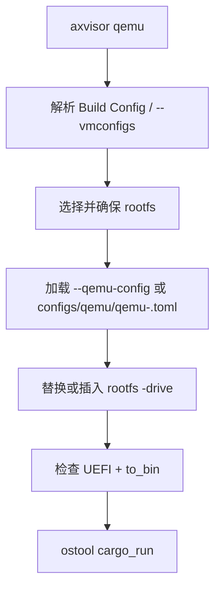

# Axvisor 运行

Axvisor 的 QEMU 流程把 host 启动配置、hypervisor 构建配置、VM 描述和 rootfs 选择分开处理。`axvisor/rootfs.rs` 只补 rootfs drive 和检查 `to_bin`/UEFI 契约；它不会根据架构擅自注入 CPU、firmware 或 guest 启动参数。

## 1. QEMU 启动

Axvisor QEMU 运行先选择 rootfs，再读取 host 启动 TOML 并检查产物格式；VM 配置只提供 guest 语义。下图对应 `axvisor/rootfs.rs::qemu()` 的主要步骤。



默认 QEMU 模板位于：

```text
os/axvisor/configs/qemu/qemu-<arch>.toml
```

QEMU TOML 拥有 machine、CPU、accelerator、firmware、device、UEFI 和 `to_bin`。x86 VMX、SVM、UEFI 等场景分别通过对应 test case 的 build/QEMU TOML 表达。

### 1.1 根文件系统

QEMU rootfs 路径的选择顺序为：

1. CLI `--rootfs`，经 image storage 解析后的路径；
2. 第一个 VM config 中 `[kernel].kernel_path` 同目录的现有 `rootfs.img`；
3. 当前 arch 的 managed `rootfs-<arch>-alpine.img`。

显式 rootfs 或 managed rootfs 会在启动前确保可用；若 VM 配置已有 kernel sibling `rootfs.img`，它被视为用例/guest 自己管理的镜像，axbuild 不额外下载默认 rootfs。最终路径由 `patch_qemu_rootfs_path()` 放入 QEMU drive；若模板漏掉 `-drive`，补丁会插入一个 `disk0` raw drive。

### 1.2 启动产物

`build` 默认产出 ELF。QEMU 路径读取实际 TOML 后将 `cargo.to_bin` 设为 `qemu.to_bin`：

- `to_bin = true` 时，运行器为 QEMU 准备 BIN；
- `to_bin = false` 时直接保留 ELF；
- `uefi = true` 且 `to_bin = false` 是明确错误。Axvisor 在启动前报告该错误，要求配置显式设置 `to_bin = true`。

仓库的 Axvisor x86_64 和 loongarch64 默认 QEMU 配置均将 UEFI 和 BIN 选择写在 TOML 中。guest UEFI firmware 的路径属于 VM config（例如 `boot_protocol = "uefi"` 与 `uefi_firmware_path`），不由 axbuild 运行时重写。

### 1.3 LVZ QEMU

在 `loongarch64` 上，`AppContext::scoped_qemu_path()` 会为 Cargo/QEMU 调用选择 LVZ QEMU：

1. `AXBUILD_QEMU_SYSTEM_LOONGARCH64` 指定的可执行文件；
2. `AXBUILD_QEMU_DIR` 指定的目录；
3. `$HOME/QEMU-LVZ/build` 或 `$HOME/qemu-lvz/build`；
4. workspace 根及其祖先的 `QEMU-LVZ/build` 或 `qemu-lvz/build`。

找到后临时把目录置于 `PATH` 前端，结束后恢复。其余 QEMU 参数仍由 TOML 给出。

## 2. U-Boot 启动

`axvisor uboot` 通过 `--uboot-config` 或 ostool 的配置发现执行 build+run。

## 3. 板卡启动

`axvisor board` 通过 ostool-server 运行；显式 `--board-config` 优先，否则 axbuild 解析当前 Cargo 配置对应的 board run config。它复用 Build Config 的 VM 列表和环境变量。

## 4. 命令示例

以下命令覆盖 aarch64 guest、x86 VMX case 和 LoongArch LVZ 启动三个不同的运行契约。

```bash
# aarch64 QEMU guest
cargo xtask axvisor qemu \
  --vmconfigs os/axvisor/configs/vms/qemu/aarch64/linux-smp1.toml

# x86 UEFI/VMX case 使用它自己的启动契约
cargo xtask axvisor test qemu --arch x86_64 --test-case smoke-vmx

# LoongArch LVZ
cargo xtask axvisor qemu --arch loongarch64 \
  --vmconfigs os/axvisor/configs/vms/qemu/loongarch64/linux-rootfs-smp1.toml
```
