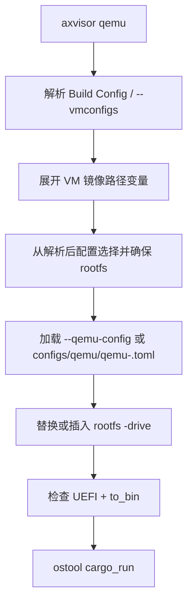

# Axvisor 运行

Axvisor 的 QEMU 流程把 host 启动配置、hypervisor 构建配置、VM 描述和 rootfs 选择分开处理。`axvisor/rootfs.rs` 只补 rootfs drive 和检查 `to_bin`/UEFI 契约；它不会根据架构擅自注入 CPU、firmware 或 guest 启动参数。

## 1. QEMU 启动

Axvisor QEMU 运行先解析 VM 镜像路径，再用同一组配置选择 rootfs，随后读取 host 启动
TOML 并检查产物格式；VM 配置只提供 guest 语义。下图对应 `axvisor/rootfs.rs::qemu()`
的主要步骤。


```mermaid
flowchart TD
    A["axvisor qemu"] --> B["解析 Build Config / --vmconfigs"]
    B --> C["展开 VM 镜像路径变量"]
    C --> D["从解析后配置选择并确保 rootfs"]
    D --> E["加载 --qemu-config 或 configs/qemu/qemu-<arch>.toml"]
    E --> F["替换或插入 rootfs -drive"]
    F --> G["检查 UEFI + to_bin"]
    G --> H["ostool cargo_run"]
```

默认 QEMU 模板位于：

```text
os/axvisor/configs/qemu/qemu-<arch>.toml
```

QEMU TOML 拥有 machine、CPU、accelerator、firmware、device、UEFI 和 `to_bin`。x86 VMX、SVM、UEFI 等场景分别通过对应 test case 的 build/QEMU TOML 表达。

### 1.1 根文件系统

QEMU rootfs 路径的选择顺序为：

1. CLI `--rootfs`，经 image storage 解析后的路径；
2. 第一个 VM config 中 `[kernel].kernel_path` 同目录的现有 `rootfs.img`；
3. 当前 arch 的 managed `rootfs-<arch>-alpine.img`。

显式 rootfs 或 managed rootfs 会在启动前确保可用；若 VM 配置已有 kernel sibling `rootfs.img`，它被视为用例/guest 自己管理的镜像，axbuild 不额外下载默认 rootfs。最终路径由 `patch_qemu_rootfs_path()` 放入 QEMU drive；若模板漏掉 `-drive`，补丁会插入一个 `disk0` raw drive。

### 1.2 启动产物

`build` 默认产出 ELF。QEMU 路径读取实际 TOML 后将 `cargo.to_bin` 设为 `qemu.to_bin`：

- `to_bin = true` 时，运行器为 QEMU 准备 BIN；
- `to_bin = false` 时直接保留 ELF；
- `uefi = true` 且 `to_bin = false` 是明确错误。Axvisor 在启动前报告该错误，要求配置显式设置 `to_bin = true`。

仓库的 Axvisor x86_64 和 loongarch64 默认 QEMU 配置均将 UEFI 和 BIN 选择写在 TOML 中。
guest UEFI firmware 的路径属于 VM config（例如 `boot_protocol = "uefi"` 与
`uefi_firmware_path`）；axbuild 只在构建前展开受支持的路径变量，不改变 guest 固件 ABI。

### 1.3 LVZ QEMU

在 `loongarch64` 上，`AppContext::scoped_qemu_path()` 会为 Cargo/QEMU 调用选择 LVZ QEMU：

1. `AXBUILD_QEMU_SYSTEM_LOONGARCH64` 指定的可执行文件；
2. `AXBUILD_QEMU_DIR` 指定的目录；
3. `$HOME/QEMU-LVZ/build` 或 `$HOME/qemu-lvz/build`；
4. workspace 根及其祖先的 `QEMU-LVZ/build` 或 `qemu-lvz/build`。

找到后临时把目录置于 `PATH` 前端，结束后恢复。其余 QEMU 参数仍由 TOML 给出。

### 1.4 网页管理台

带管理台的运行需要先生成前端产物，再用端口转发把内核的监听地址暴露到宿主机。内核读取 `web-ui/dist`，而 Cargo 不调用 npm，产物缺失时内核构建会直接失败，因此产物构建必须排在二进制构建之前。

```bash
cd os/axvisor/web-ui
npm ci
npm run build
```

产物就绪后，用 `web-ui` 特性内嵌静态资源、用 `browser-console` 启用终端网关，并在 QEMU 配置里加入端口转发。使用 `no-auto-start` 可以让默认客户机停在 `Ready`，便于观察登记表与配置池。

```bash
cargo xtask axvisor qemu \
  -c test-suit/axvisor/normal/qemu-web-ui/build-aarch64-unknown-none-softfloat.toml \
  --qemu-config test-suit/axvisor/normal/qemu-web-ui/web-ui/qemu-aarch64-hostfwd.toml \
  --arch aarch64
```

转发参数由用例目录里的 `web-ui/qemu-aarch64.toml` 派生：把它 `args` 中的网络项换成下面这一对，另存为 `qemu-aarch64-hostfwd.toml`，其余字段保持不变。

```text
-netdev user,id=net0,hostfwd=tcp::8080-:8080 -device virtio-net-pci,netdev=net0
```

启动日志出现下面这行说明监听已就绪，此时浏览器访问 `http://localhost:8080/`。控制面按 local host 信任模型设计，没有鉴权，也不需要填写任何票据。

```text
management HTTP server (axum) listening on 0.0.0.0:8080
```

手工检查覆盖自动化用例之外的部分：根路径返回内嵌页面，`/assets/` 下的资源带不可变缓存策略，未知路径返回 404；`GET /api/vms/pool` 的不可用条目带原因；同一终端通道的第二个订阅者收到 409；`/ws/events` 先发全量快照再发增量帧，而登记表仍以 `GET /api/vms` 为准。

| 现象 | 原因 | 处理 |
| :-- | :-- | :-- |
| 构建报缺少 UI 资产 | `web-ui/dist` 为空或没有生成 | 先执行产物构建步骤再重建 |
| 产物已存在但仍报缺少 UI 资产 | 复用了缺少产物那次生成的资源表，把产物目录整份移走再移回不会改变时间戳 | 删除构建目录下对应的 axvisor 产物目录后重建，或更新产物目录内文件的时间戳 |
| 页面返回 404 但日志显示监听成功 | 该构建没有启用 `web-ui` | 在构建配置里启用该特性 |
| 浏览器无法连接 | QEMU 配置没有 `hostfwd` | 加入端口转发参数 |
| 界面看不到终端面板 | 该构建没有启用 `browser-console` | 启用该特性 |

五种现象分别落在产物、端口与特性配置三处，按处理栏的提示逐项排查即可。

## 2. U-Boot 启动

`axvisor uboot` 通过 `--uboot-config` 或 ostool 的配置发现执行 build+run。

## 3. 板卡启动

`axvisor board` 通过 ostool-server 运行；显式 `--board-config` 优先，否则 axbuild 解析当前 Cargo 配置对应的 board run config。它复用 Build Config 的 VM 列表和环境变量。

## 4. 命令示例

以下命令覆盖 aarch64 guest、x86 VMX case 和 LoongArch LVZ 启动三个不同的运行契约。

```bash
# aarch64 QEMU guest
cargo xtask axvisor qemu \
  --vmconfigs os/axvisor/configs/vms/qemu/aarch64/linux-smp1.toml

# x86 UEFI/VMX case 验证宿主启动与宿主 NVMe 文件读写
cargo xtask axvisor test qemu --arch x86_64 --test-case smoke-vmx

# LoongArch LVZ
cargo xtask axvisor qemu --arch loongarch64 \
  --vmconfigs os/axvisor/configs/vms/qemu/loongarch64/linux-rootfs-smp1.toml
```
