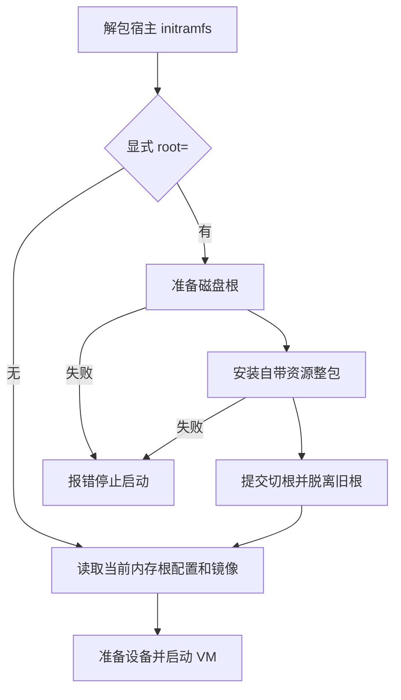

# Axvisor 运行

Axvisor 的 QEMU 流程把 host 启动配置、hypervisor 构建配置、VM 描述和 rootfs 选择分开处理。`axvisor/rootfs.rs` 识别并改写已接入的宿主根盘，检查 `to_bin`/UEFI 契约；它不会根据架构擅自注入 CPU、firmware 或 guest 启动参数。

## 1. QEMU 启动

`axvisor/rootfs.rs::qemu()` 读取宿主 QEMU 配置，准备所需磁盘和客户机镜像，再用 `bundle::attach()` 生成宿主归档。内核初始化文件系统后，`builtin::prepare_root()` 在加载 VM 前完成可选安装及切根。


```mermaid
flowchart TD
    A[解包宿主 initramfs] --> B{显式 root=}
    B -->|无| G[读取当前内存根配置和镜像]
    B -->|有| C[准备磁盘根]
    C --> D[安装自带资源整包]
    D --> E[提交切根并脱离旧根]
    E --> G
    C -->|失败| F[报错停止启动]
    D -->|失败| F
    G --> H[准备设备并启动 VM]
```

没有块设备驱动或磁盘根时，可以省略 `root=`，直接从 initramfs 运行客户机。显式 `root=` 无法满足时报告错误，不启动 VM。

默认 QEMU 模板位于：

```text
os/axvisor/configs/qemu/qemu-<arch>.toml
```

QEMU TOML 拥有 machine、CPU、accelerator、firmware、device、UEFI 和 `to_bin`。x86 VMX、SVM、UEFI 等场景分别通过对应 test case 的 build/QEMU TOML 表达。

### 1.1 根文件系统

QEMU rootfs 路径的选择顺序为：

1. CLI `--rootfs`，经 image storage 解析后的路径；
2. 第一个 VM config 中 `[kernel].kernel_path` 同目录的现有 `rootfs.img`；
3. 当前 arch 的 managed `rootfs-<arch>-alpine.img`。

只在 QEMU 已有可识别的宿主根盘接线时准备或改写根盘，不为纯 initramfs 场景自动接入磁盘。`disk0` 或唯一匿名文件后端可作为宿主盘；其他明确命名的 guest/data drive 保持原值。显式 `root=` 缺少宿主盘接线会在运行前报错。

磁盘根上的自带资源目录固定为 `/guest/builtin`。源目录存在时整包替换；空包清空旧资源，源目录缺失时保留已安装版本。Ext4 使用 `EXCHANGE` 发布；FAT 使用备份与失败回滚，不保证断电原子性。安装失败时不切根、不启动客户机。可写客户机磁盘不参与替换。

`/guest/vm_default` 中有效非空配置优先；空目录或目录缺失时使用 `/guest/builtin/configs`，无效用户配置明确报错。HTTP 或命令行重建 VM 可直接引用安装后的启动镜像路径。

### 1.2 启动产物

`build` 默认产出 ELF。QEMU 路径读取实际 TOML 后将 `cargo.to_bin` 设为 `qemu.to_bin`：

- `to_bin = true` 时，运行器为 QEMU 准备 BIN；
- `to_bin = false` 时直接保留 ELF；
- `uefi = true` 且 `to_bin = false` 是明确错误。Axvisor 在启动前报告该错误，要求配置显式设置 `to_bin = true`。

仓库的 Axvisor x86_64 和 loongarch64 默认 QEMU 配置均将 UEFI 和 BIN 选择写在 TOML 中。
guest UEFI firmware 的路径属于 VM config（例如 `boot_protocol = "uefi"` 与
`uefi_firmware_path`）；axbuild 只在打包时展开受支持的路径变量，不改变 guest 固件 ABI。

### 1.3 LVZ QEMU

在 `loongarch64` 上，`AppContext::scoped_qemu_path()` 会为 Cargo/QEMU 调用选择 LVZ QEMU：

1. `AXBUILD_QEMU_SYSTEM_LOONGARCH64` 指定的可执行文件；
2. `AXBUILD_QEMU_DIR` 指定的目录；
3. `$HOME/QEMU-LVZ/build` 或 `$HOME/qemu-lvz/build`；
4. workspace 根及其祖先的 `QEMU-LVZ/build` 或 `qemu-lvz/build`。

找到后临时把目录置于 `PATH` 前端，结束后恢复。其余 QEMU 参数仍由 TOML 给出。

## 2. U-Boot 启动

`axvisor uboot` 通过 `--uboot-config` 或 ostool 的配置发现执行 build+run。

## 3. 板卡启动

`axvisor board` 通过 ostool-server 运行；显式 `--board-config` 优先，否则 axbuild 解析当前 Cargo 配置对应的 board run config。它复用 Build Config 的 VM 列表，并将生成的宿主归档加入启动配置；FIT ramdisk、UEFI 和 HTTP Boot 使用现有交接协议。构建机可取得的镜像放入自带包，板卡 rootfs 已有的绝对资源路径可保留并在切根后加载。

## 4. 命令示例

以下命令覆盖 aarch64 guest、x86 VMX case 和 LoongArch LVZ 启动三个不同的运行契约。

```bash
# aarch64 QEMU guest
cargo xtask axvisor qemu \
  --vmconfigs os/axvisor/configs/vms/qemu/aarch64/linux-smp1.toml

# x86 UEFI/VMX case 验证宿主启动与宿主 NVMe 文件读写
cargo xtask axvisor test qemu --arch x86_64 --test-case smoke-vmx

# LoongArch LVZ
cargo xtask axvisor qemu --arch loongarch64 \
  --vmconfigs os/axvisor/configs/vms/qemu/loongarch64/linux-rootfs-smp1.toml
```
