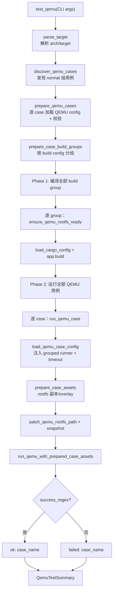
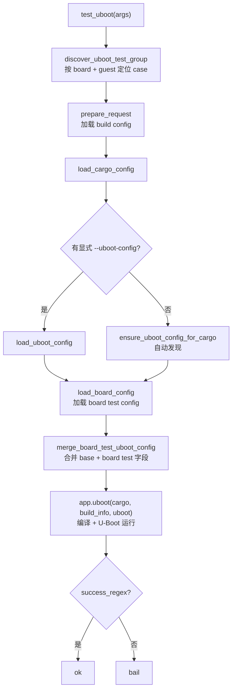

# Axvisor 测试

Axvisor 复用了与 [StarryOS 测试](../starry/test) 相同的测试基础设施（用例发现、资产准备、结果判定），因为两者都是完整 OS/Hypervisor 级别的测试，需要在 rootfs 用户空间中执行测试命令。六种 pipeline 类型（plain/grouped/C/sh/python/rust）的处理逻辑完全相同。

测试编排（用例发现、分组构建、资产准备、结果判定）由 `scripts/axbuild/src/test/` 提供统一框架，核心原则是 **OS 只构建一次，逐 case 运行**。共享框架的完整说明见 [测试基础设施](../test_infra)；本文描述 Axvisor 特有的测试目录结构、三种测试模式（QEMU / U-Boot / Board）的差异，以及 Axvisor 独有的 `test uboot` 模式。

## 1. 测试接口

Axvisor 将 QEMU、U-Boot 和板卡测试置于同一入口下，但每种模式选择不同的运行资产和结果判定路径。命令参数如下，`test uboot` 是三套系统中唯一的 U-Boot 测试接口。

```text
cargo xtask axvisor test qemu  [--test-group <g>] [--test-case <c>] [--list]
cargo xtask axvisor test uboot --board <type> [--guest <image>] [--uboot-config <cfg>]   # Axvisor 独有
cargo xtask axvisor test board --board <type> --server <h> --port <p> [--test-case <c>] [--list]
```

## 2. 用例发现

Axvisor 测试资产位于：

```text
test-suit/axvisor/
└── normal/
    └── <case>/
        └── qemu-{arch}.toml
```

与 StarryOS 的平铺结构不同，Axvisor 用 `normal` 测试组目录组织用例。发现算法统一通过 `build-{target}.toml` 定位构建组、`qemu-{arch}.toml` 定位用例。

## 3. 运行模式

三种模式共享 case 发现和构建组概念，但宿主环境、启动链路及筛选参数不同。下表用于在 CI 或板端故障时选择正确的复现入口。

| 模式 | 命令 | 运行环境 | 适用场景 |
|------|------|----------|----------|
| `test qemu` | `cargo axvisor test qemu` | QEMU 虚拟机 | 常规功能验证（CI 主力） |
| `test uboot` | `cargo axvisor test uboot`（**Axvisor 独有**） | 远程板卡 + U-Boot 引导 | 验证 hypervisor 在真实硬件 + U-Boot 链路上的行为 |
| `test board` | `cargo axvisor test board` | 远程板卡 | 板级回归 |

### 3.1 QEMU 测试

最常用的测试模式，在 QEMU 中启动 Axvisor 和配置的 Guest VM。执行链位于 `axvisor/test/qemu.rs::test_qemu()`，采用**两阶段**策略：先编译所有 build group，再运行所有 QEMU 用例。



两阶段设计（`Phase 1` / `Phase 2`）的动机：先暴露所有编译错误，避免在 QEMU 上浪费时间后才发现某个 build group 无法编译。

关键步骤的源码行为：

| 步骤 | 源码位置 | 行为 |
|------|----------|------|
| 用例发现 | `discovery.rs::discover_qemu_cases()` | 扫描 `test-suit/axvisor/<group>/`，默认 group 为 `normal` |
| VM 配置 | `qemu_group_build_context()` | 从 `AXVISOR_VM_CONFIGS` 环境变量解析 VM 配置路径，相对路径相对于 workspace 根 |
| rootfs 准备 | `rootfs::ensure_qemu_rootfs_ready()` | 每个 build group 编译前准备当前 arch 的 managed rootfs |
| grouped 校验 | `validate_grouped_qemu_commands()` | 检查 `test_commands` 无空命令 |
| 结果判定 | `QemuTestSummary` | 收集所有 case 的 pass/fail，最终 `finish_with_total_detail()` 统一判定退出码 |

单个 case 运行（`run_qemu_case` → `load_qemu_case_config`）：注入 grouped runner（marker 前缀 `AXVISOR`）、`apply_timeout_scale`、准备 rootfs 资产（走共享 `test/case/` 层）、patch rootfs 路径、UEFI 时改写 snapshot 为 per-drive。Axvisor 不启用 backtrace capture（`capture_backtrace = None`）。

### 3.2 U-Boot 测试

Axvisor 是唯一支持 U-Boot 测试模式的子系统。`cargo axvisor test uboot --board <TYPE>` 在远程板卡上通过 U-Boot 引导 Axvisor 和 Guest。执行链位于 `axvisor/test/board.rs::test_uboot()`。



| 参数 | 说明 |
|------|------|
| `--board <TYPE>`（必需） | ostool-server 上的板卡类型 |
| `--guest <IMAGE>` | 指定 guest 镜像（默认 `linux`） |
| `--uboot-config <CFG>` | U-Boot 配置文件，省略时自动发现 |

关键步骤：

- **用例定位**：`discover_uboot_test_group()` 按 board 名和 guest 名定位唯一的 board test group。
- **U-Boot config 合并**：`merge_board_test_uboot_config()` 把 base config（来自 `--uboot-config` 或自动发现）与 board test config（来自 `board-test-*.toml`）合并。合并策略：board test 的 `success_regex`、`fail_regex`、`uboot_cmd`、`shell_prefix`、`shell_init_cmd` **覆盖** base；地址类字段（`kernel_load_addr`、`fit_load_addr`、`bootm_addr`）仅在 board test 提供时覆盖；base 的 `local`（串口、波特率）和 `dtb_file` **保留**。
- **编译与运行**：`app.uboot()` 一次性完成编译和 U-Boot 运行，由合并后的 U-Boot config 判定结果。

该模式验证完整的"U-Boot → Axvisor → Guest"引导链路，覆盖真实硬件上 U-Boot 加载 Axvisor ELF、Axvisor 初始化硬件虚拟化扩展、再启动 Guest 的全流程。

### 3.3 板卡测试

板级测试通过 `board-{board_name}.toml` 配置文件定义。执行链位于 `axvisor/test/board.rs::test_board()`，使用 `BoardTestRunState` 逐 group 运行并收集结果（与 QEMU 测试的 `QemuTestSummary` 类似）。

每个 board test group 的处理：

1. `prepare_request()` 加载 build config（`SnapshotPersistence::Discard`）
2. `load_cargo_config()` 装配 Cargo
3. `load_board_config()` 加载 board test config（`board-test-*.toml`）
4. `app.board()` 编译 + 部署到远程板卡，由 board config 的正则判定结果

`--test-case` 和 `--board` 支持按用例名和板卡名过滤；`--list` 列出所有 board test group。发现算法通过 `discover_board_test_groups()` 递归扫描，board 配置按板卡名命名（`board-{name}.toml`），通过 `nearest_build_wrapper()` 向上查找最近的构建配置。

## 4. 资产管线

Axvisor 测试的六种 pipeline 类型与 StarryOS 完全一致，因为两者都需要在 rootfs 用户空间中执行测试命令。`resolve_case_pipeline()` 按固定优先级检测每个用例目录的特征文件，同一目录同时出现多个 pipeline 触发条件会直接报错：

| Pipeline | 触发条件 | Axvisor 使用情况 |
|----------|----------|-----------------|
| Grouped | `test_commands` 非空 | 多命令聚合 case |
| C | 含 `c/` 子目录 | C 测试程序 |
| Shell | 含 `sh/` 子目录 | shell 脚本测试 |
| Python | 含 `python/` 子目录 | Python 测试 |
| Rust | 含 `rust/` 子目录（须含 `Cargo.toml`） | Rust 测试程序（交叉编译为 musl 静态二进制） |
| Plain | 以上均不满足 | 最常见，纯 QEMU 启动验证 |

pipeline 类型、检测优先级、资产准备、rootfs 缓存和 grouped runner 协议的完整说明见 [测试基础设施](../test_infra)。Axvisor 的 `prepare_staging_root` 钩子为空操作（`|_| Ok(())`），不做 StarryOS 那样的 DNS 注入和 APK 区域配置。
