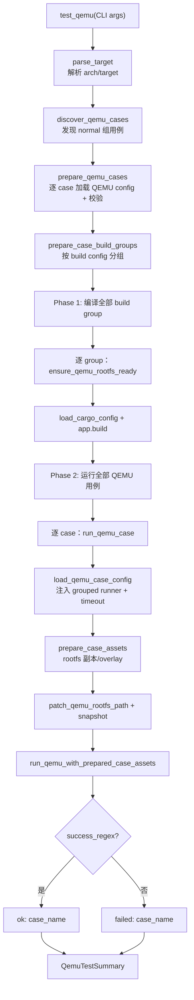
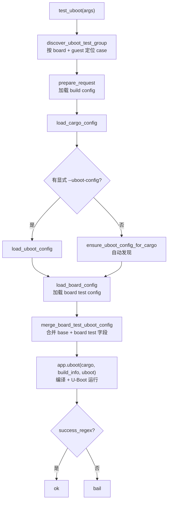

# Axvisor 测试

Axvisor 复用了与 [StarryOS 测试](../starry/test) 相同的测试基础设施（用例发现、资产准备、结果判定），因为两者都是完整 OS/Hypervisor 级别的测试，需要在 rootfs 用户空间中执行测试命令。六种 pipeline 类型（plain/grouped/C/sh/python/rust）的处理逻辑完全相同。

测试编排（用例发现、分组构建、资产准备、结果判定）由 `scripts/axbuild/src/test/` 提供统一框架，核心原则是 **OS 只构建一次，逐 case 运行**。共享框架的完整说明见 [测试基础设施](../test_infra)；本文描述 Axvisor 特有的测试目录结构、三种测试模式（QEMU / U-Boot / Board）的差异，以及 Axvisor 独有的 `test uboot` 模式。

## 1. 测试接口

Axvisor 将 QEMU、U-Boot 和板卡测试置于同一入口下，但每种模式选择不同的运行资产和结果判定路径。命令参数如下，`test uboot` 是三套系统中唯一的 U-Boot 测试接口。

```text
cargo xtask axvisor test qemu  [--test-group <g>] [--test-case <c>] [--list]
cargo xtask axvisor test uboot --board <type> [--guest <image>] [--uboot-config <cfg>]   # Axvisor 独有
cargo xtask axvisor test board --board <type> --server <h> --port <p> [--test-case <c>] [--list]
```

`test qemu` 另有固件相关参数（仅 UEFI 分组用例需要，见 §3.3）：

```text
cargo xtask axvisor test qemu [--firmware-bundle-path <dir>] [--allow-unverified-firmware]
```

## 2. 用例发现

Axvisor 测试资产位于：

```text
test-suit/axvisor/
├── normal/
│   └── <case>/
│       └── qemu-{arch}.toml
└── uefi/
    └── ovmf-entry/
        ├── qemu-x86_64-vmx.toml
        ├── qemu-x86_64-svm.toml
        ├── build-x86_64-unknown-none-vmx.toml
        └── build-x86_64-unknown-none-svm.toml
```

与 StarryOS 的平铺结构不同，Axvisor 用分组目录（`normal`、`uefi`）组织用例，默认组为 `normal`，通过 `--test-group <g>` 切换。发现算法统一通过 `build-{target}.toml` 定位构建组、`qemu-{arch}.toml` 定位用例。

## 3. 运行模式

三种模式共享 case 发现和构建组概念，但宿主环境、启动链路及筛选参数不同。下表用于在 CI 或板端故障时选择正确的复现入口。

| 模式 | 命令 | 运行环境 | 适用场景 |
|------|------|----------|----------|
| `test qemu` | `cargo axvisor test qemu` | QEMU 虚拟机 | 常规功能验证（CI 主力） |
| `test uboot` | `cargo axvisor test uboot`（**Axvisor 独有**） | 远程板卡 + U-Boot 引导 | 验证 hypervisor 在真实硬件 + U-Boot 链路上的行为 |
| `test board` | `cargo axvisor test board` | 远程板卡 | 板级回归 |

### 3.1 QEMU 测试

最常用的测试模式，在 QEMU 中启动 Axvisor 和配置的 Guest VM。执行链位于 `axvisor/test/qemu.rs::test_qemu()`，采用**两阶段**策略：先编译所有 build group，再运行所有 QEMU 用例。


```mermaid
flowchart TD
    A["test_qemu(CLI args)"] --> B["parse_target<br/>解析 arch/target"]
    B --> C["discover_qemu_cases<br/>发现 normal 组用例"]
    C --> D["prepare_qemu_cases<br/>逐 case 加载 QEMU config + 校验"]
    D --> E["prepare_case_build_groups<br/>按 build config 分组"]
    E --> F["Phase 1: 编译全部 build group"]
    F --> F1["逐 group：ensure_qemu_rootfs_ready"]
    F1 --> F2["load_cargo_config + app.build"]
    F2 --> G["Phase 2: 运行全部 QEMU 用例"]
    G --> H["逐 case：run_qemu_case"]
    H --> I["load_qemu_case_config<br/>注入 grouped runner + timeout"]
    I --> J["prepare_case_assets<br/>rootfs 副本/overlay"]
    J --> K["patch_qemu_rootfs_path + snapshot"]
    K --> L["run_qemu_with_prepared_case_assets"]
    L --> M{"success_regex?"}
    M -->|是| N["ok: case_name"]
    M -->|否| O["failed: case_name"]
    N --> P["QemuTestSummary"]
    O --> P
```

两阶段设计（`Phase 1` / `Phase 2`）的动机：先暴露所有编译错误，避免在 QEMU 上浪费时间后才发现某个 build group 无法编译。

关键步骤的源码行为：

| 步骤 | 源码位置 | 行为 |
|------|----------|------|
| 用例发现 | `discovery.rs::discover_qemu_cases()` | 扫描 `test-suit/axvisor/<group>/`，默认 group 为 `normal`，可通过 `--test-group uefi` 切换 |
| VM 配置 | `qemu_group_build_context()` | 读取 axbuild 已解析并写入 `AXVISOR_VM_CONFIGS` 的 VM 配置路径 |
| rootfs 准备 | `rootfs::ensure_qemu_rootfs_ready()` | 每个 build group 编译前准备当前 arch 的 managed rootfs |
| grouped 校验 | `validate_grouped_qemu_commands()` | 检查 `test_commands` 无空命令 |
| 结果判定 | `QemuTestSummary` | 收集所有 case 的 pass/fail，最终 `finish_with_total_detail()` 统一判定退出码 |

单个 case 运行（`run_qemu_case` → `load_qemu_case_config`）：注入 grouped runner（marker 前缀 `AXVISOR`）、`apply_timeout_scale`、准备 rootfs 资产（走共享 `test/case/` 层）、patch rootfs 路径、UEFI 时改写 snapshot 为 per-drive。Axvisor 不启用 backtrace capture（`capture_backtrace = None`）。

### 3.2 U-Boot 测试

Axvisor 是唯一支持 U-Boot 测试模式的子系统。`cargo axvisor test uboot --board <TYPE>` 在远程板卡上通过 U-Boot 引导 Axvisor 和 Guest。执行链位于 `axvisor/test/board.rs::test_uboot()`。


```mermaid
flowchart TD
    A["test_uboot(args)"] --> B["discover_uboot_test_group<br/>按 board + guest 定位 case"]
    B --> C["prepare_request<br/>加载 build config"]
    C --> D["load_cargo_config"]
    D --> E{"有显式 --uboot-config?"}
    E -->|是| F["load_uboot_config"]
    E -->|否| G["ensure_uboot_config_for_cargo<br/>自动发现"]
    F --> H["load_board_config<br/>加载 board test config"]
    G --> H
    H --> I["merge_board_test_uboot_config<br/>合并 base + board test 字段"]
    I --> J["app.uboot(cargo, build_info, uboot)<br/>编译 + U-Boot 运行"]
    J --> K{"success_regex?"}
    K -->|是| L["ok"]
    K -->|否| M["bail"]
```

| 参数 | 说明 |
|------|------|
| `--board <TYPE>`（必需） | ostool-server 上的板卡类型 |
| `--guest <IMAGE>` | 指定 guest 镜像（默认 `linux`） |
| `--uboot-config <CFG>` | U-Boot 配置文件，省略时自动发现 |

关键步骤：

- **用例定位**：`discover_uboot_test_group()` 按 board 名和 guest 名定位唯一的 board test group。
- **U-Boot config 合并**：`merge_board_test_uboot_config()` 把 base config（来自 `--uboot-config` 或自动发现）与 board test config（来自 `board-test-*.toml`）合并。合并策略：board test 的 `success_regex`、`fail_regex`、`uboot_cmd`、`shell_prefix`、`shell_init_cmd` **覆盖** base；地址类字段（`kernel_load_addr`、`fit_load_addr`、`bootm_addr`）仅在 board test 提供时覆盖；base 的 `local`（串口、波特率）和 `dtb_file` **保留**。
- **编译与运行**：`app.uboot()` 一次性完成编译和 U-Boot 运行，由合并后的 U-Boot config 判定结果。

该模式验证完整的"U-Boot → Axvisor → Guest"引导链路，覆盖真实硬件上 U-Boot 加载 Axvisor ELF、Axvisor 初始化硬件虚拟化扩展、再启动 Guest 的全流程。

### 3.3 UEFI 分组与固定 OVMF bundle

`test-suit/axvisor/uefi/ovmf-entry/` 承载 x86_64 的固定 OVMF 固件诊断用例（两个变体 `ovmf-entry-vmx` 与 `ovmf-entry-svm`，按宿主 CPU 的 VMX/SVM 能力分别选择）。该用例以 `-kernel` 启动 Axvisor 宿主，再由 Axvisor 把嵌套 OVMF 作为 UEFI guest 固件加载；`success_regex` 以 `(?s)VCpu[0] running...` 锚定嵌套 VM 后匹配 `SecCoreStartupWithStack`（guest COM1 输出），表示嵌套固件已进入 SEC 阶段。前缀锚定是必需的：QEMU 层为引导 Axvisor 宿主而注入的 pflash OVMF 会输出相同的 SEC 行，裸 `SecCoreStartupWithStack\(` 会误匹配宿主固件。该用例是阶段 1 的 SEC 启动诊断，而非完整 guest boot。

```bash
cargo xtask axvisor test qemu --arch x86_64 --test-group uefi \
  --test-case ovmf-entry-svm --firmware-bundle-path <bundle 目录>
cargo xtask axvisor test qemu --arch x86_64 --test-group uefi \
  --test-case ovmf-entry-vmx --firmware-bundle-path <bundle 目录>
```

接线要点（与替换实现一致）：

- **固定 profile**：`scripts/axbuild/src/axvisor/ovmf.rs` 定义 profile 名 `qemu_x86_64_axvisor_ovmf_debug` 及固定布局：CODE `0xffc84000`（size `0x37c000`，reset vector `0xfffffff0`）、VARS `0xffc00000`（size `0x84000`）、combined `0x400000`。固件目录（ostool cache）含 `code.fd` 与 `vars.fd`，布局按固定常量校验，SHA-256 由 ostool 校验，不联网下载。
- **`--firmware-bundle-path <dir>`**：指定上游固件目录（ostool cache，含 `code.fd`/`vars.fd`）。`--allow-unverified-firmware` 允许本地未验证的 `code.fd`（仅打印 SHA-256 供参考，不参与结果判定）。不带固件目录时 ovmf-entry 用例在 prepare 阶段 fail-fast 报错，不会在 `Booting from ROM..` 挂起，也不会静默使用发行版 OVMF；`--list` 不需要固件。
- **QEMU 层 `uefi = false`**：避免 ostool 注入自带 FAT ESP。runner 注入 pflash unit 0（只读 CODE，已验证文件）与 unit 1（每次运行新建的 VARS 副本），`-kernel` 启动 Axvisor 宿主。
- **嵌套 OVMF**：VM 配置 `os/axvisor/configs/vms/qemu/x86_64/ovmf-entry.toml` 声明 `guest_type = "passthrough"`、`boot_protocol = "uefi"`、`bios_load_addr = 0xffc84000`、`firmware_profile = "qemu_x86_64_axvisor_ovmf_debug"`。默认 `image_location = "fs"` + `kernel_path = "/guest/ovmf/OVMF_CODE.fd"`（文件不存在时报错，是显式 fallback）；有固件目录时 runner 改写为 `image_location = "memory"` 并经 `include_bytes!` 嵌入已验证 CODE，与 QEMU 层 pflash 的 CODE 逐字节一致。
- **loader 强制校验**：`firmware_profile` 启用时，x86 loader（`virtualization/axvm/src/arch/x86_64/boot/mod.rs`）强制 `code_size = 0x37c000`、`bios_load_addr = 0xffc84000`、reset `0xfffffff0`；`axvmconfig` 拒绝非 UEFI boot 协议声明 profile。
- **成功判据**：`success_regex = ["(?m)^.*Nested OVMF fw_cfg accessed"]`。嵌套 OVMF 固件启动早期访问 fw_cfg（PIO 0x510/0x511/0x514），经 axvisor 设备模型打印 `Nested OVMF fw_cfg accessed` marker（Info 级）。marker 天然只属嵌套 guest（宿主 OVMF 的 fw_cfg 访问在 QEMU 层，不经过 axvisor 设备模型），无需 VM 锚定，不受 2048 字节匹配窗口限制。
- **non-gating**：`uefi` 分组天然不纳入 CI gating。CI 的 x86_64 行只运行 `smoke-svm`/`smoke-vmx`（`normal` 组），`ovmf-entry-*` 需在本地显式用 `--test-group uefi` 验证。

### 3.4 板卡测试

板级测试通过 `board-{board_name}.toml` 配置文件定义。执行链位于 `axvisor/test/board.rs::test_board()`，使用 `BoardTestRunState` 逐 group 运行并收集结果（与 QEMU 测试的 `QemuTestSummary` 类似）。

每个 board test group 的处理：

1. `prepare_request()` 加载 build config（`SnapshotPersistence::Discard`）
2. `load_cargo_config()` 装配 Cargo
3. `load_board_config()` 加载 board test config（`board-test-*.toml`）
4. `app.board()` 编译 + 部署到远程板卡，由 board config 的正则判定结果

`--test-case` 和 `--board` 支持按用例名和板卡名过滤；`--list` 列出所有 board test group。发现算法通过 `discover_board_test_groups()` 递归扫描，board 配置按板卡名命名（`board-{name}.toml`），通过 `nearest_build_wrapper()` 向上查找最近的构建配置。

ROCK 4D 用例从板卡文件系统加载 BSP kernel 和 guest DTB，运行前必须单独准备这两项持久化资产。完整命令见 [ROCK 4D Linux Guest](./rock-4d)。

## 4. 资产管线

Axvisor 测试的六种 pipeline 类型与 StarryOS 完全一致，因为两者都需要在 rootfs 用户空间中执行测试命令。`resolve_case_pipeline()` 按固定优先级检测每个用例目录的特征文件，同一目录同时出现多个 pipeline 触发条件会直接报错：

| Pipeline | 触发条件 | Axvisor 使用情况 |
|----------|----------|-----------------|
| Grouped | `test_commands` 非空 | 多命令聚合 case |
| C | 含 `c/` 子目录 | C 测试程序 |
| Shell | 含 `sh/` 子目录 | shell 脚本测试 |
| Python | 含 `python/` 子目录 | Python 测试 |
| Rust | 含 `rust/` 子目录（须含 `Cargo.toml`） | Rust 测试程序（交叉编译为 musl 静态二进制） |
| Plain | 以上均不满足 | 最常见，纯 QEMU 启动验证 |

pipeline 类型、检测优先级、资产准备、rootfs 缓存和 grouped runner 协议的完整说明见 [测试基础设施](../test_infra)。Axvisor 的 `prepare_staging_root` 钩子为空操作（`|_| Ok(())`），不做 StarryOS 那样的 DNS 注入和 APK 区域配置。
