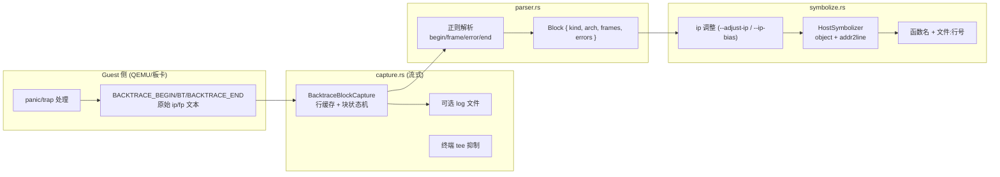

# Backtrace 符号化

`cargo xtask backtrace` 是 axbuild 的 host 端 backtrace 符号化工具。当内核或 app 在 QEMU、U-Boot、板卡上运行并 panic/trap 时，guest 侧会输出形如 `BACKTRACE_BEGIN ... BT <idx> ip=0x... fp=0x... ... BACKTRACE_END` 的原始地址块；这些地址对用户毫无意义。backtrace 模块负责将这些地址块解析为栈帧，并用 host 上的 ELF（带 debug info）把每个 `ip` 还原成 `函数+文件:行号`。

它有两种工作模式：

- **离线 CLI 模式**：`cargo xtask backtrace symbolize --elf <path> [--log <path>]`，从文件或 stdin 读取日志并一次性符号化。
- **流式 capture 模式**：由 `cargo xtask <os> test qemu` 在 QEMU 运行期间自动调用，逐块边捕获边符号化，无需用户介入。

## 架构概览



## 模块组成

| 代码位置 | 作用 |
|----------|------|
| `scripts/axbuild/src/backtrace/mod.rs` | CLI 入口、`SymbolizeArgs` 定义与子命令分发 |
| `scripts/axbuild/src/backtrace/capture.rs` | QEMU 输出流捕获：行缓存、块状态机、log 持久化、终端 tee 抑制 |
| `scripts/axbuild/src/backtrace/parser.rs` | 正则解析 `BACKTRACE_BEGIN`/`BT`/`BT_ERROR`/`BACKTRACE_END` |
| `scripts/axbuild/src/backtrace/symbolize.rs` | ELF 加载、`ip` 调整、addr2line 符号化、QEMU 日志保留策略 |
| `scripts/axbuild/src/backtrace/paths.rs` | 在工作区中定位待符号化的 ELF（如 `arceos_rust_elf_path`、`std_test_elf_path`） |
| `scripts/axbuild/src/backtrace/tests.rs` | 解析与符号化的回归测试 |

## 块格式与解析

parser 使用四条正则在行流上驱动一个有限状态机：

| 标记 | 正则（简化） | 含义 |
|------|--------------|------|
| `BACKTRACE_BEGIN` | `BACKTRACE_BEGIN\b.*\bkind=([^\s]+)\b(?:.*\barch=([^\s]+)\b)?` | 块开始，捕获 `kind` 与可选 `arch` |
| `BT` | `\bBT\s+(\d+)\s+ip=0x([0-9a-fA-F]+)(?:\s+fp=0x([0-9a-fA-F]+))?` | 单个栈帧，序号 + `ip` + 可选 `fp` |
| `BT_ERROR` | `\bBT_ERROR\s+([^\s]+)` | 解析期间 guest 报告的错误 |
| `BACKTRACE_END` | `BACKTRACE_END\b` | 块结束 |

状态机遇到下一个 `BACKTRACE_BEGIN` 时会先关闭当前块，因此即使日志中块没有显式 `END`（例如 guest 在 panic 后硬复位）也能尽量恢复。`infer_kind_filter` 会先用例名（`-raw`/`-panic`/`-trap` 后缀或路径段）推断 `kind`，否则当所有块 kind 一致时取该 kind，否则输出全部块。

## CLI 用法

```bash
# 从文件符号化
cargo xtask backtrace symbolize --elf target/x86_64/debug/arceos-httpserver --log qemu.log

# 从 stdin 符号化（典型：管道 QEMU 输出）
cargo run -p arceos-httpserver --target ... | cargo xtask backtrace symbolize --elf ...

# 关闭 call-site 调整，或施加地址偏移（如 KASLR slide）
cargo xtask backtrace symbolize --elf ... --adjust-ip false
cargo xtask backtrace symbolize --elf ... --ip-bias -0xffff_ffff_8000_0000
```

| 参数 | 默认 | 说明 |
|------|------|------|
| `--elf <PATH>` | 必填 | 用于符号化的 ELF（必须保留 debug info） |
| `--log <PATH>` | stdin | 输入日志路径，省略则读 stdin |
| `--kind <KIND>` | 自动 | 仅符号化匹配的块 kind |
| `--adjust-ip <BOOL>` | `true` | 符号化前 `ip -= 1`，匹配典型 call-site 调整 |
| `--ip-bias <I64>` | `0` | 符号化前对 `ip` 施加有符号偏移，用于运行时地址 slide |

## 流式 capture 与日志保留

测试运行时，`BacktraceQemuCapture` 描述一次 QEMU 运行的捕获配置，`BacktraceBlockCapture` 是其实例化的逐行状态机：

- **`suppress_terminal_raw_blocks`**：原始 `BACKTRACE_*`/`BT` 行不再 tee 到终端，避免地址垃圾刷屏；符号化结果由 `BacktraceSymbolizeSession` 在块结束时即时输出。
- **`write_log_during_capture`**：同时把原始块追加到 `log_path`，便于失败后离线重符号化。
- **`stream_symbolize`**：`BacktraceSymbolizeSession` 持有 ELF 路径，ELF 解析通过 `OnceLock` 惰性且只发生一次；addr2line 的 `Loader` 非 `Sync`，所有访问经由 `OnceLock` 同步化 API（参见源码中 `arc_with_non_send_sync` 的安全说明）。

QEMU 日志的保留/删除策略由 `SymbolizeAfterQemuOutcome` 驱动：

| Outcome | 含义 | 日志处理 |
|---------|------|----------|
| `Skipped` | 无标记或无可解析块 | 不写入日志 |
| `Symbolized` | 成功符号化 | 默认删除；`TGOSKITS_KEEP_QEMU_LOG=1` 保留 |
| `Failed` | 解析/ELF/输出失败 | 保留日志便于排查 |

测试命令行对应开关：`--no-symbolize` 跳过流式符号化（仍可离线手动跑），`--keep-qemu-log` 等价于设置 `TGOSKITS_KEEP_QEMU_LOG=1`。

## 集成点

backtrace 模块对外暴露两类入口：

- **CLI**：`lib.rs::Commands::Backtrace` → `backtrace::execute()` → `symbolize::symbolize_cli()`，供用户和脚本调用。
- **库内部**：`capture::*`、`symbolize::{maybe_symbolize_after_qemu, BacktraceSymbolizeSession, arceos_rust_elf_path, std_test_elf_path}` 被 `arceos/`、`starry/`、`test/std` 等子系统的 QEMU 测试流程直接调用，实现“一次运行、即时符号化、按需留日志”的闭环。
