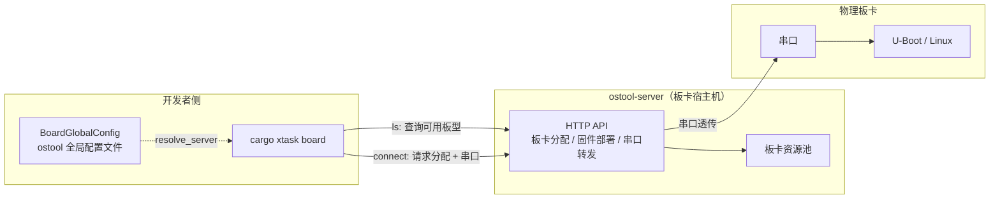

# 板卡管理

`cargo xtask board` 是顶层板卡管理命令，封装了与 `ostool-server` 的交互。`ostool-server` 运行在连接物理板卡的宿主机上，提供板卡分配、固件部署和串口交互的 API。本命令用于**分配/查看/连接**远程板卡，与 `cargo xtask <os> board`（在板卡上运行 OS，详见 [Axvisor 运行 §板卡运行](./axvisor/runtime#板卡运行) 或 [StarryOS 运行 §板卡运行](./starry/runtime#板卡运行)）是两个不同层次：前者管板子，后者把编译产物刷到板子上跑。

## 架构概览

板卡管理涉及三个角色：开发者的 axbuild 进程、ostool-server（板卡宿主机上的服务）、物理板卡。`cargo xtask board` 命令是前两者的桥梁，通过 HTTP API 与 ostool-server 交互完成板卡分配和串口连接。



## CLI 结构

`board::Command` 枚举定义三个子命令，参数由 `BoardServerArgs` 统一承载服务器连接信息：

```rust
enum Command {
    Ls(BoardServerArgs),        // 列出可用远程板卡类型
    Connect(ArgsConnect),       // 分配板卡并连接串口
    Config,                     // 编辑 ostool 全局配置
}

struct BoardServerArgs {
    server: Option<String>,     // ostool-server 主机
    port: Option<u16>,          // ostool-server 端口
}

struct ArgsConnect {
    board_type: String,         // 板卡类型（如 OrangePi-5-Plus）
    server: BoardServerArgs,    // 服务器参数
}
```

| 子命令 | 参数 | 说明 |
|--------|------|------|
| `ls` | `--server <H>` `--port <P>`（可选） | 列出 ostool-server 上可用的远程板卡类型 |
| `connect` | `-b/--board-type <TYPE>`（必需）、`--server <H>` `--port <P>`（可选） | 分配一块指定类型的板卡并连接到它的串口终端 |
| `config` | 无 | 编辑默认的板卡服务器配置（ostool 全局配置） |

## 服务器配置解析

`--server` 与 `--port` 是可选的。未提供时按以下顺序解析（`BoardGlobalConfig::resolve_server`）：

1. 命令行 `--server` / `--port` 显式参数
2. ostool 全局配置文件中保存的默认值（由 `cargo xtask board config` 编辑）
3. ostool 内置的默认服务器地址

`load_board_global_config_with_notice()` 会在缺失配置时给出明确提示，引导用户用 `cargo xtask board config` 完成**一次性**配置。`resolve_server` 把显式参数与配置默认值合并：显式参数优先，缺失的字段回退到配置文件。

## 子命令行为

### ls

`Command::Ls` 加载全局配置 → `resolve_server` 解析服务器地址 → `fetch_board_types` 通过 HTTP 请求 ostool-server 获取可用板卡类型列表 → `render_board_table` 以表格形式输出（板型名称、数量、状态等）。`--server`/`--port` 可临时指定非默认服务器。

### connect

`Command::Connect` 是最常用的交互命令。流程：加载全局配置 → 解析服务器 → `connect_board` 向 ostool-server 请求分配一块指定类型的板卡 → 分配成功后把板卡串口透传到当前终端（stdin/stdout 透传），开发者获得与板卡串口的直接交互能力。

`connect` 会**占用**板卡资源（其他用户在该板卡被释放前无法使用），因此使用完毕后需通过退出终端（Ctrl+C / Ctrl+D）释放板卡。

### config

`Command::Config` 调用 `board::config()`，打开 ostool 全局配置文件（路径由 ostool 决定，通常位于用户配置目录）供编辑。保存的 `server` 和 `port` 值成为后续 `ls`/`connect` 命令的默认值。首次使用板卡前需执行一次此命令完成服务器配置。

## 用法示例

```bash
# 查看可用的板卡类型
cargo xtask board ls

# 配置默认 ostool-server（首次使用前执行一次）
cargo xtask board config

# 分配一块 OrangePi-5-Plus 并连接串口
cargo xtask board connect -b OrangePi-5-Plus

# 临时指定其他 ostool-server 实例
cargo xtask board ls --server board-host.local --port 1234
```

## 与 OS 板卡运行的关系

`cargo xtask <os> board`（如 `cargo starry board`、`cargo axvisor board`）在内部也会调用 ostool-server，但它假定板卡分配由 ostool 自动协商，并额外完成"编译 → 刷写固件 → 收集串口输出"的完整流程。`cargo xtask board connect` 用于**人工**串口调试：你想手动进入 U-Boot、观察引导日志、或在板卡 Linux 上准备文件时使用它。两者共用同一份服务器配置。

板卡相关的物理操作（如 U-Boot fsck 修复、Linux 侧 rootfs 部署）属于更专门的运维流程，详见相关技能文档。

## 模块组成

| 代码位置 | 作用 |
|----------|------|
| `scripts/axbuild/src/board.rs` | CLI 入口：`Command` 枚举、`ArgsConnect` / `BoardServerArgs` 参数定义、子命令分发 |
| `ostool::board`（外部 crate） | 板卡管理的底层实现：`BoardGlobalConfig`（全局配置）、`fetch_board_types`（HTTP 查询）、`connect_board`（分配 + 串口透传）、`render_board_table`（表格输出）、`config`（配置编辑） |

axbuild 的 `board.rs` 是薄封装层，仅负责 CLI 解析和参数透传，全部业务逻辑在 `ostool::board` 中实现。这种分层使得 ostool 可独立于 axbuild 用于其他场景（如直接命令行调用 ostool CLI）。
