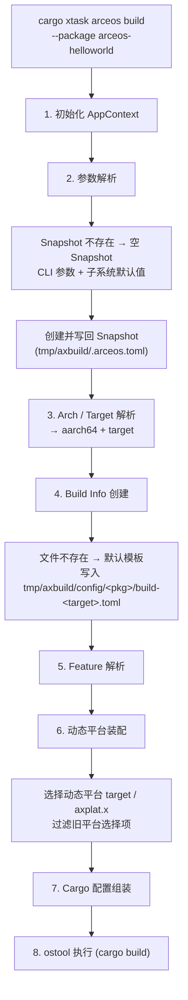
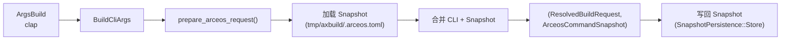
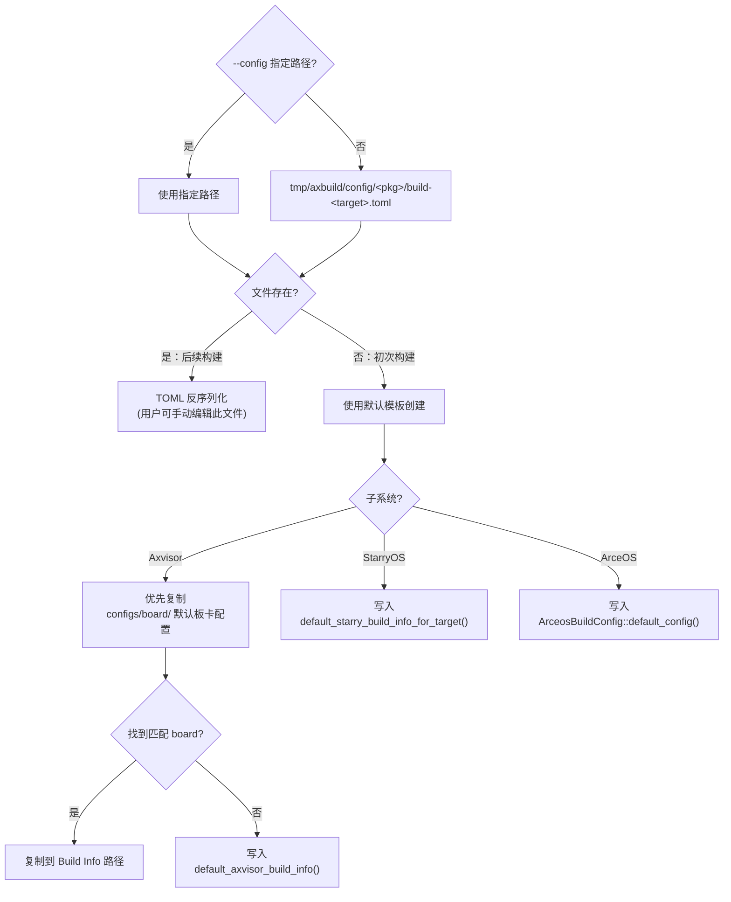
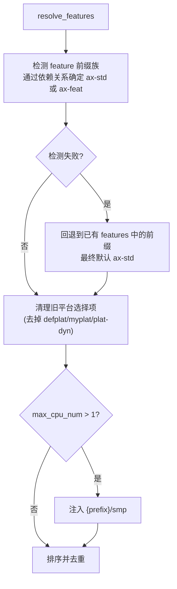
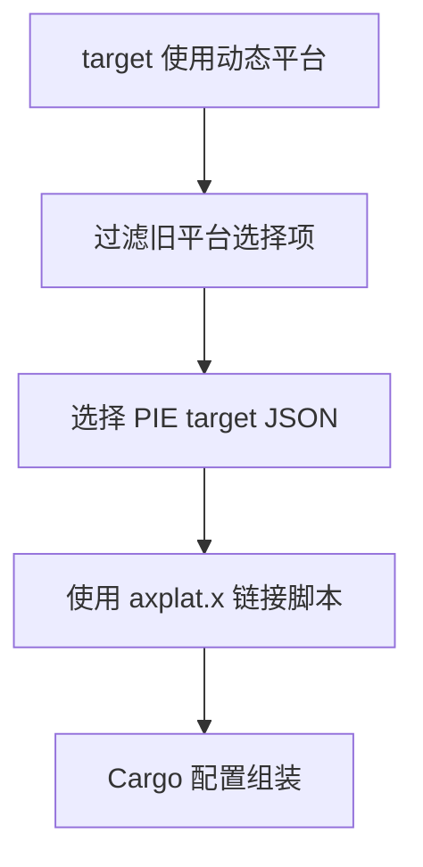
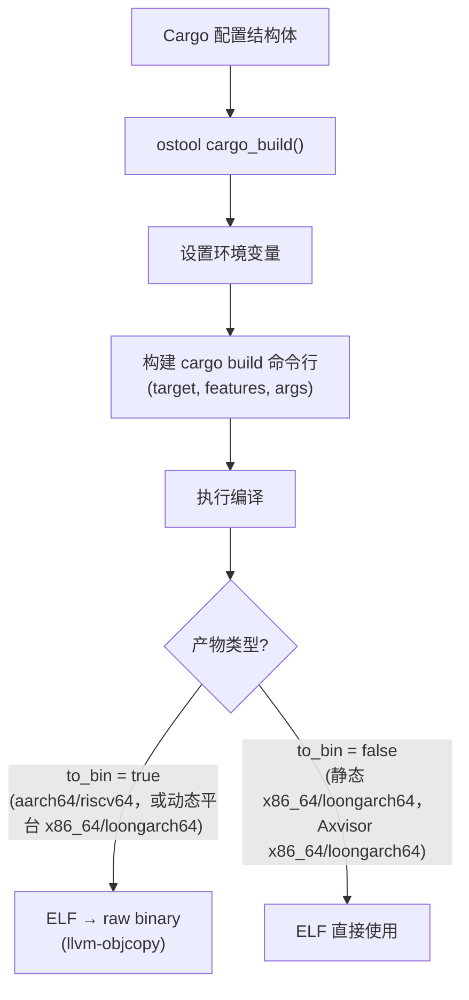

# 构建过程

从用户输入 `cargo xtask <os> build` 到编译产物的完整过程。构建过程分为八个阶段，依次完成上下文初始化、参数解析、架构映射、配置加载、Feature 解析、动态平台装配、Cargo 参数组装和最终编译执行。构建配置细节见 [配置](/docs/build/configuration)，底层执行见 [运行](/docs/build/run)。

构建过程的核心目标是**将用户友好的高层参数（如 `--arch aarch64`、`--smp 4`）转换为 Cargo 能理解的底层编译参数（target triple、features、环境变量、链接器脚本等）**。三套子系统共享前四个阶段的逻辑，在 Feature 解析和动态平台装配阶段开始分化，最终都汇聚到统一的 ostool `cargo_build()` 调用。

## 流程总览

八个阶段从前到后构成一条连续的流水线，每阶段以上一阶段的输出为输入。以下展示**初次构建**（无任何已有配置文件）的完整流程：



**后续构建**时，三类配置文件均已存在，流程简化为：
- **阶段 2**：从已有 Snapshot 加载参数，与 CLI 合并
- **阶段 4**：直接 TOML 反序列化已有 Build Info 文件（用户可手动编辑该文件调整配置）
- **阶段 6**：动态平台 target、链接脚本与旧平台选择项过滤重新计算

三类配置文件的详细说明见 [参数与配置](/docs/build/configuration)，底层执行见 [运行](/docs/build/run)。

## 1. 初始化 AppContext

每个子系统的入口（`ArceOS::new()`、`Starry::new()`、`Axvisor::new()`）创建 `AppContext`：

```rust
pub struct AppContext {
    invocation: Invocation,           // ostool 调用上下文（封装 Tool 与配置）
    build_config_path: Option<PathBuf>,
    root: PathBuf,                    // workspace 根目录
    member_dirs: HashMap<String, PathBuf>, // 已解析的 workspace member 目录缓存
    original_path: OsString,          // 原始 PATH（用于 LoongArch 恢复）
    debug: bool,
}
```

初始化步骤：
1. `find_workspace_root()` 通过编译期常量 `env!("CARGO_MANIFEST_DIR")` 获取 axbuild crate 所在目录，向上查找含 `Cargo.toml`（带 `[workspace]`）的祖先目录定位 workspace root。注意 `env!` 是编译期宏（非 `std::env::var`），路径在编译时即已固定
2. `support::logging::init_logging()` 配置 tracing subscriber
3. `Self::new_invocation()` 初始化 ostool `Invocation`（封装 `Tool` 与 `InvocationOptions`）
4. **AIC8800 Wi-Fi firmware 自动拉取**：`ensure_aic8800_firmware()` 检查 `components/aic8800/firmware/` 下的 8 个固件文件（来自 `lxowalle/aic8800-sdio-firmware`），缺失时自动下载并验证 SHA-256。此步骤在 `Clippy` 和 `Starry` 命令入口前执行，确保编译 `aic8800` 相关包时 firmware blobs 已就位（其他子系统按需调用）

`AppContext` 是构建和运行的执行上下文，贯穿整个生命周期。`invocation` 字段持有 ostool 的调用上下文，封装了与 cargo、QEMU 等外部工具的交互；`original_path` 保存原始 PATH 环境变量，用于 LoongArch LVZ QEMU 临时修改 PATH 后通过 `PathRestoreGuard`（RAII）恢复；`debug` 控制是否输出详细日志。`member_dirs`（`HashMap<String, PathBuf>`）惰性缓存已解析的 workspace member 目录路径，避免同一包在多次构建/测试流程中重复调用 `cargo metadata`。

## 2. 参数解析

CLI 参数经 clap 解析后，由 `context/resolve.rs` 转化为 `ResolvedXxxRequest`。以 ArceOS 为例：



合并规则：

| 参数 | 合并策略 |
|------|---------|
| `package`、`arch`、`target` | CLI 优先，回退 Snapshot |
| `smp` | CLI 覆盖 Snapshot |
| `qemu_config`、`uboot_config` | 仅完全继承 Snapshot 时复用 |

clap 解析得到原始 CLI 结构体后，`prepare_*_request()` 函数加载 Snapshot 文件并执行合并。Snapshot 文件位于 `tmp/axbuild/.{os}.toml`（ArceOS → `.arceos.toml`，StarryOS → `.starry.toml`，Axvisor → `.axvisor.toml`），保存最近一次命令的参数状态。

合并策略的核心原则是**用户显式指定的参数永远优先**。此外，`arch` 和 `target` 之间存在交叉抑制：当 CLI 指定了 `--arch` 时不会从 Snapshot 继承 `target`（反之亦然），确保两者始终来自同一来源。`qemu_config` 和 `uboot_config` 仅在 `package`、`arch`、`target` 三者都从 Snapshot 继承时才复用，避免将测试场景的配置意外带入正常开发流程。

合并完成后，`ResolvedRequest` 和新的 `CommandSnapshot` 一并产出。**Snapshot 在构建开始前即写回文件**（而非构建成功后），由 `SnapshotPersistence` 枚举控制：用户手动调用的命令使用 `Store`（保留参数供下次复用），测试套件使用 `Discard`（不污染用户的 Snapshot 文件）。设置环境变量 `AXBUILD_NO_SNAPSHOT=1` 会禁止本次命令写回 Snapshot；当前实现仍会读取已有 Snapshot，因此要完全摆脱历史参数时需要显式传入关键参数或删除对应的 `tmp/axbuild/.{os}.toml`。

## 3. Arch / Target 解析

由 `context/arch.rs` 的 `resolve_arch_and_target()` 维护统一映射表（详见 [配置](/docs/build/configuration#arch--target-映射)）。

此阶段将合并后的 `arch` 和 `target` 参数解析为确定值。解析优先级：用户显式指定 → Snapshot 回退 → 子系统默认值。当两者都未指定时，使用子系统默认值（ArceOS → aarch64，StarryOS → riscv64，Axvisor → aarch64）。

解析完成后，`ResolvedRequest` 中的 `arch` 和 `target` 字段即为确定值，后续所有阶段（Build Info 路径、feature 装配、Cargo target）均使用此结果。动态平台是唯一维护路径，后续构建装配会固定选择动态平台 target 和链接脚本。

## 4. Build Info 加载或创建

构建配置存放在 `tmp/axbuild/config/<package>/build-<target>.toml`，由 `BuildInfo` 描述（详见 [配置](/docs/build/configuration#build-info)）。



**初次构建**时文件不存在，各子系统会按源码中的策略创建默认配置。ArceOS 写入 `ArceosBuildConfig::default_config()`，即默认 `BuildInfo` 加空的 `app-c` 字段；StarryOS 写入 `default_starry_build_info_for_target()`，目标支持动态平台时会清空默认 features；Axvisor 才会优先从 `os/axvisor/configs/board/` 查找与 target 匹配的默认板卡配置并复制，找不到时写入清空 features 的默认 BuildInfo。StarryOS 的板卡默认配置通过 `cargo starry defconfig <board>` 显式生成，不在普通首次构建时自动复制。

**后续构建**时文件已存在，直接 TOML 反序列化。用户可以在两次构建之间手动编辑该文件来调整 features、环境变量等配置（如添加 `paging` feature 或修改 `AX_LOG` 级别），修改会在下次构建时生效。

## 5. Feature 解析

Feature 解析阶段包含三个子步骤：遗留别名归一化、前缀族检测和 SMP feature 注入。

### 5a. 遗留别名归一化

加载 Build Info 后，首先执行 `normalize_legacy_feature_aliases()`，将旧的 feature 名自动映射为新名：

| 旧名 | 新名 |
|------|------|
| `axstd` | `ax-std` |
| `axstd/*` | `ax-std/*` |
| `axfeat` | `ax-feat` |
| `axfeat/*` | `ax-feat/*` |

归一化后如果 features 列表发生了变化，会自动排序去重。此步骤确保旧版配置文件无需手动迁移。

### 5b. 前缀族检测与 SMP feature 注入

`BuildInfo::resolve_features()` 执行以下步骤：



Feature 解析需要处理多个维度：feature 前缀族（通过分析包的 Cargo.toml 依赖关系确定使用 `ax-std` 还是 `ax-feat` 前缀）、旧平台选择项过滤、以及 SMP 支持。

**前缀族检测**通过检查包的直接依赖来确定：如果包依赖 `ax-std` 则使用 `ax-std/` 前缀，依赖 `ax-feat` 则使用 `ax-feat/` 前缀。当检测失败（包不直接依赖两者）时，会回退到已有 features 列表中的前缀线索，最终默认使用 `ax-std`。

**Makefile feature 注入**：如果设置了 `FEATURES` 环境变量（兼容传统 Makefile 工作流），`makefile_features_from_env()` 会解析其中的逗号/空格分隔的 feature 列表，自动添加前缀族前缀后合并到 BuildInfo 的 features 中。

## 6. 动态平台装配

当前构建链以 `axplat-dyn` 为唯一维护路径。Build config 不再提供平台选择开关，旧 `plat_dyn` 字段会被拒绝；构建过程不再生成 `.axconfig.toml`。



动态平台下，硬件信息来自启动时的固件表、FDT/ACPI 和 `somehal`/`axplat-dyn` 运行时发现结果；`axbuild` 不再合并平台 `axconfig.toml`，也不再向 Cargo 注入 `AX_CONFIG_PATH`。

LoongArch QEMU 已迁移到默认 `axplat-dyn` 路径。旧写法 `ax-hal/loongarch64-qemu-virt` 或 `--plat loongarch64-qemu-virt` 不再表示当前推荐路径；应改为 `--arch loongarch64`，并按需保留 UEFI/设备等真实启动链能力开关；这些不是平台选择项。

## 7. Cargo 配置组装

`BuildInfo` 转换为 `ostool::build::config::Cargo`：

```rust
Cargo {
    env,              // 环境变量
    target,           // target triple
    package,          // workspace 包名
    features,         // Cargo features
    args,             // 额外参数（链接器脚本等）
    to_bin,           // 是否把 ELF 继续转换为 raw binary
    ...
}
```

链接器参数由动态平台 target JSON 与 std linker wrapper 统一处理。

各子系统的额外补丁：
- **StarryOS**：注入 `AX_ARCH`、`AX_TARGET`
- **Axvisor**：注入 `AX_ARCH`、`AX_TARGET`、`AXVISOR_VM_CONFIGS`；额外过滤旧平台选择项

此阶段将前面所有阶段的输出（Build Info 中的 features 和环境变量、arch 解析的 target、动态平台 target 配置）组装为 ostool 能理解的 `Cargo` 配置结构体。动态平台使用 `axplat.x`，支持运行时平台注册和固件表发现。

**Axvisor 旧平台选择项过滤**：Axvisor 的旧 board 配置文件中可能声明旧静态平台或 `plat-dyn` 占位项。`axbuild` 在 feature 解析阶段过滤这些旧写法，避免平台选择项泄漏到最终 Cargo 配置。

## 8. 执行

最终执行阶段将组装好的 `Cargo` 配置传给 ostool 的 `cargo_build()`。ostool 负责设置环境变量（`AX_LOG`、`SMP` 等）、构建 `cargo build` 命令行（`--target`、`--features`、链接器参数等）、处理输出流和退出码。`AppContext::build()` 调用 `Tool::cargo_build()` 完成编译，产出 ELF / BIN 等产物。



编译成功后，产物位于 `target/{target}/release/` 或 `target/{target}/debug/` 目录下。`to_bin` 不是简单按架构二分：通用 std 构建中 `aarch64`/`riscv64` 默认转 raw binary，`x86_64`/`loongarch64` 在静态路径下保留 ELF，但动态平台路径会因 `default_to_bin_for_target_config()` 继续生成 bin；Axvisor 在最终补丁阶段覆盖为 `aarch64`/`riscv64` 转 bin、`x86_64`/`loongarch64` 保留 ELF。编译产物供后续的运行（QEMU / U-Boot / Board）或测试阶段使用。

### 编译期文件写入（write_if_changed）

axbuild 在生成构建辅助文件（如 ArceOS std 的 `.cargo/config.toml`、fake libc 预构建脚本和 linker wrapper）时使用 `write_if_changed` 模式：写入前先读取已有内容，内容相同时跳过写入。这避免了因时间戳更新导致 cargo 不必要的重建——cargo 的增量编译依赖文件 mtime 判断是否需要重新编译，`write_if_changed` 确保只有真正变化的配置才会触发重建。

### 环境变量作用域保护（EnvRestoreGuard）

`AppContext::build()` 和 `qemu()` 等执行方法在调用 ostool 前通过 `EnvRestoreGuard::set(&cargo.env)` 临时设置构建所需的环境变量，该 guard 使用 RAII 模式（`Drop` trait）确保作用域结束时自动恢复原始环境变量值，避免构建环境变量污染后续操作。
