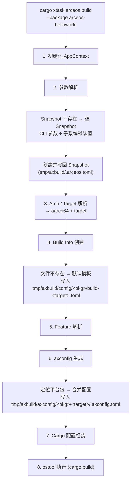
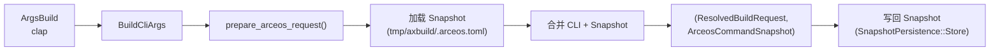
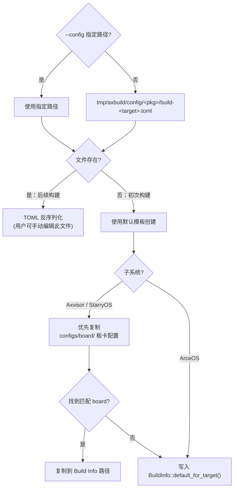
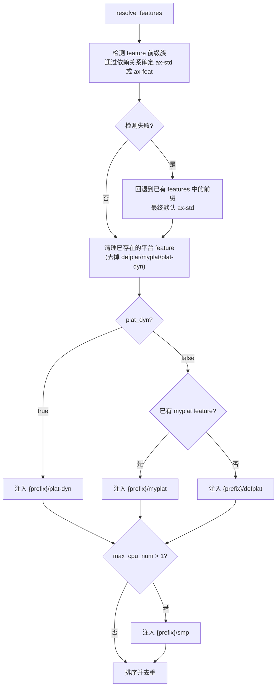
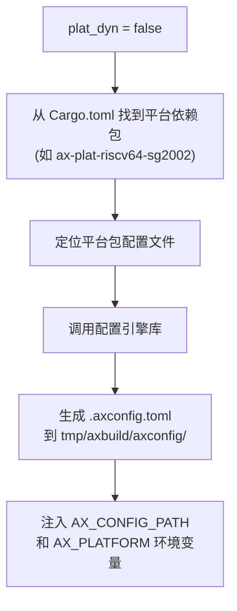
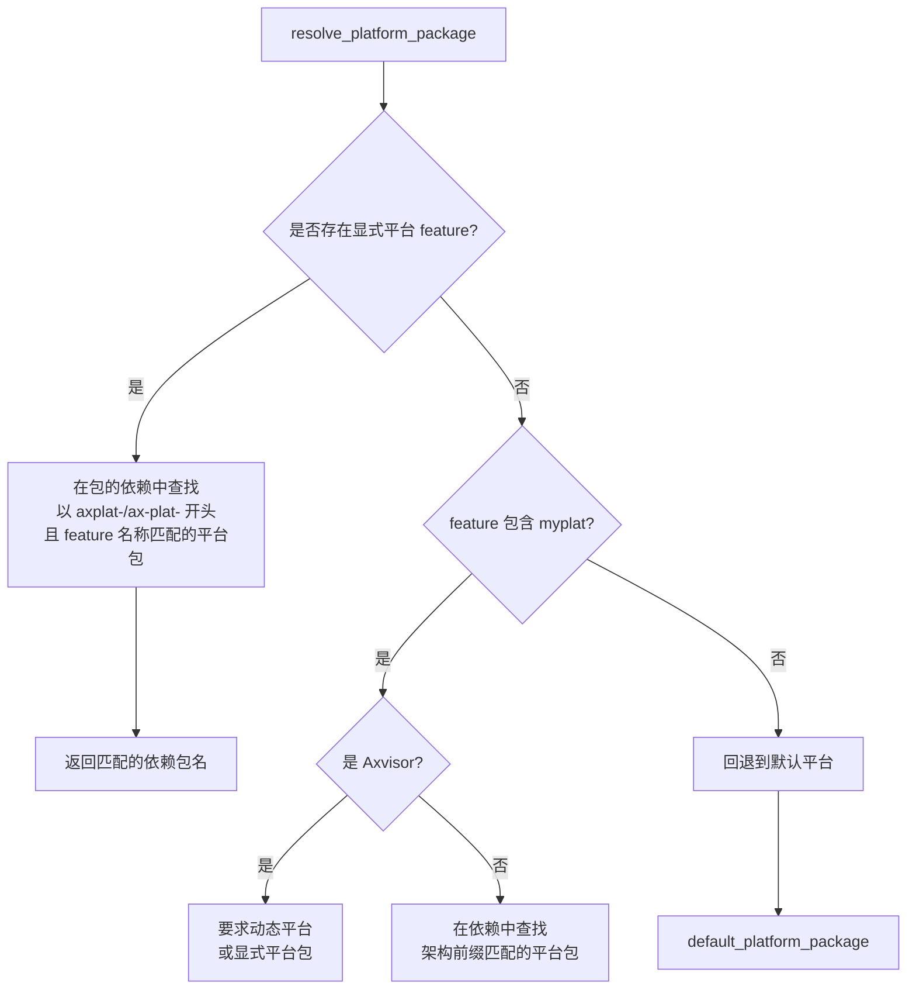
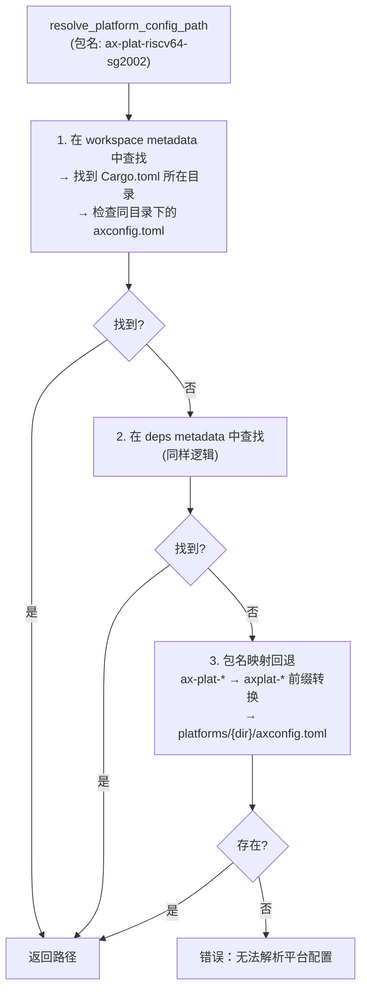
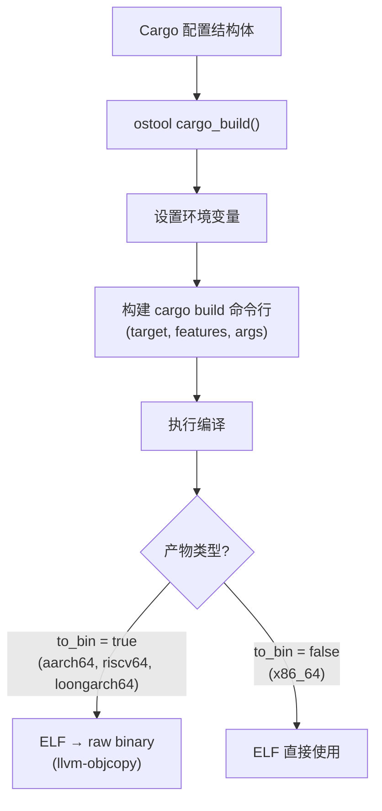

# 构建过程

从用户输入 `cargo xtask <os> build` 到编译产物的完整过程。构建过程分为八个阶段，依次完成上下文初始化、参数解析、架构映射、配置加载、Feature 解析、平台配置生成、Cargo 参数组装和最终编译执行。构建配置细节见 [配置](/docs/build/configuration)，底层执行见 [运行](/docs/build/run)。

构建过程的核心目标是**将用户友好的高层参数（如 `--arch aarch64`、`--smp 4`）转换为 Cargo 能理解的底层编译参数（target triple、features、环境变量、链接器脚本等）**。三套子系统共享前四个阶段的逻辑，在 Feature 解析和 axconfig 生成阶段开始分化，最终都汇聚到统一的 ostool `cargo_build()` 调用。

## 流程总览

八个阶段从前到后构成一条连续的流水线，每阶段以上一阶段的输出为输入。以下展示**初次构建**（无任何已有配置文件）的完整流程：



**后续构建**时，三类配置文件均已存在，流程简化为：
- **阶段 2**：从已有 Snapshot 加载参数，与 CLI 合并
- **阶段 4**：直接 TOML 反序列化已有 Build Info 文件（用户可手动编辑该文件调整配置）
- **阶段 6**：axconfig 重新生成（每次构建都会重新生成，确保与平台包配置同步）

三类配置文件的详细说明见 [参数与配置](/docs/build/configuration)，底层执行见 [运行](/docs/build/run)。

## 1. 初始化 AppContext

每个子系统的入口（`ArceOS::new()`、`Starry::new()`、`Axvisor::new()`）创建 `AppContext`：

```rust
pub struct AppContext {
    tool: Tool,               // ostool Tool 实例
    build_config_path: Option<PathBuf>,
    root: PathBuf,            // workspace 根目录
    axvisor_dir: Option<PathBuf>, // Axvisor 源码目录（惰性初始化）
    original_path: OsString,  // 原始 PATH（用于 LoongArch 恢复）
    debug: bool,
}
```

初始化步骤：
1. 通过编译期常量 `env!("CARGO_MANIFEST_DIR")` 获取 axbuild crate 所在目录，向上两级定位 workspace root。注意 `env!` 是编译期宏（非 `std::env::var`），路径在编译时即已固定
2. `support::logging::init_logging()` 配置 tracing subscriber
3. `Tool::new(ToolConfig::default())` 初始化 ostool 底层工具

`AppContext` 是构建和运行的执行上下文，贯穿整个生命周期。`tool` 字段持有 ostool 的 `Tool` 实例，封装了与 cargo、QEMU 等外部工具的交互；`original_path` 保存原始 PATH 环境变量，用于 LoongArch LVZ QEMU 临时修改 PATH 后恢复；`debug` 控制是否输出详细日志。`member_dirs`（`HashMap<String, PathBuf>`）惰性缓存已解析的 workspace member 目录路径，避免同一包在多次构建/测试流程中重复调用 `cargo metadata`。

## 2. 参数解析

CLI 参数经 clap 解析后，由 `context/resolve.rs` 转化为 `ResolvedXxxRequest`。以 ArceOS 为例：



合并规则：

| 参数 | 合并策略 |
|------|---------|
| `package`、`arch`、`target` | CLI 优先，回退 Snapshot |
| `smp`、`plat_dyn` | CLI 覆盖 Snapshot |
| `qemu_config`、`uboot_config` | 仅完全继承 Snapshot 时复用 |

clap 解析得到原始 CLI 结构体后，`prepare_*_request()` 函数加载 Snapshot 文件并执行合并。Snapshot 文件位于 `tmp/axbuild/.{os}.toml`（ArceOS → `.arceos.toml`，StarryOS → `.starry.toml`，Axvisor → `.axvisor.toml`），保存最近一次命令的参数状态。

合并策略的核心原则是**用户显式指定的参数永远优先**。此外，`arch` 和 `target` 之间存在交叉抑制：当 CLI 指定了 `--arch` 时不会从 Snapshot 继承 `target`（反之亦然），确保两者始终来自同一来源。`qemu_config` 和 `uboot_config` 仅在 `package`、`arch`、`target` 三者都从 Snapshot 继承时才复用，避免将测试场景的配置意外带入正常开发流程。

合并完成后，`ResolvedRequest` 和新的 `CommandSnapshot` 一并产出。**Snapshot 在构建开始前即写回文件**（而非构建成功后），由 `SnapshotPersistence` 枚举控制：用户手动调用的命令使用 `Store`（保留参数供下次复用），测试套件使用 `Discard`（不污染用户的 Snapshot 文件）。设置环境变量 `AXBUILD_NO_SNAPSHOT=1` 可完全跳过 Snapshot 的读写。

## 3. Arch / Target 解析

由 `context/arch.rs` 的 `resolve_arch_and_target()` 维护统一映射表（详见 [配置](/docs/build/configuration#arch--target-映射)）。

此阶段将合并后的 `arch` 和 `target` 参数解析为确定值。解析优先级：用户显式指定 → Snapshot 回退 → 子系统默认值。当两者都未指定时，使用子系统默认值（ArceOS → aarch64，StarryOS → riscv64，Axvisor → aarch64）。

解析完成后，`ResolvedRequest` 中的 `arch` 和 `target` 字段即为确定值，后续所有阶段（Build Info 路径、axconfig 生成、Cargo target）均使用此结果。此阶段还会根据 target 判断是否支持动态平台（仅 `aarch64-*` 支持 `plat_dyn`），其他架构的 `plat_dyn` 会被强制回退为 `false`。

## 4. Build Info 加载或创建

构建配置存放在 `tmp/axbuild/config/<package>/build-<target>.toml`，由 `BuildInfo` 描述（详见 [配置](/docs/build/configuration#build-info)）。



**初次构建**时文件不存在，`ensure_build_info()` 用默认模板创建并写入。对于 Axvisor 和 StarryOS，优先从各自的 `configs/board/` 目录中查找与当前 target 匹配的默认板卡配置（如 `qemu-aarch64.toml`），找到则直接复制为 Build Info 文件，无需手动编写；未找到时回退到通用默认模板。ArceOS 直接使用 `BuildInfo::default_for_target()` 生成默认值。

**后续构建**时文件已存在，直接 TOML 反序列化。用户可以在两次构建之间手动编辑该文件来调整 features、环境变量等配置（如添加 `paging` feature 或修改 `AX_LOG` 级别），修改会在下次构建时生效。

## 5. Feature 解析

Feature 解析阶段包含三个子步骤：遗留别名归一化、前缀族检测和平台/SMP feature 注入。

### 5a. 遗留别名归一化

加载 Build Info 后，首先执行 `normalize_legacy_feature_aliases()`，将旧的 feature 名自动映射为新名：

| 旧名 | 新名 |
|------|------|
| `axstd` | `ax-std` |
| `axstd/*` | `ax-std/*` |
| `axfeat` | `ax-feat` |
| `axfeat/*` | `ax-feat/*` |

归一化后如果 features 列表发生了变化，会自动排序去重。此步骤确保旧版配置文件无需手动迁移。

### 5b. 前缀族检测与平台 feature 注入

`BuildInfo::resolve_features()` 执行以下步骤：



Feature 解析是构建过程中最复杂的阶段之一。它需要处理多个维度：feature 前缀族（通过分析包的 Cargo.toml 依赖关系确定使用 `ax-std` 还是 `ax-feat` 前缀）、平台类型（动态/静态/自定义）、以及 SMP 支持。

**前缀族检测**通过检查包的直接依赖来确定：如果包依赖 `ax-std` 则使用 `ax-std/` 前缀，依赖 `ax-feat` 则使用 `ax-feat/` 前缀。当检测失败（包不直接依赖两者）时，会回退到已有 features 列表中的前缀线索，最终默认使用 `ax-std`。

**Makefile feature 注入**：如果设置了 `FEATURES` 环境变量（兼容传统 Makefile 工作流），`makefile_features_from_env()` 会解析其中的逗号/空格分隔的 feature 列表，自动添加前缀族前缀后合并到 BuildInfo 的 features 中。

## 6. axconfig 生成

当 `plat_dyn = false` 时需预生成平台配置：



ArceOS 的平台配置（如内存布局、中断控制器地址、串口基地址等）由 `axbuild` 复用配置引擎库从平台包配置文件中合并生成 `.axconfig.toml`。在动态平台模式下（`plat_dyn = true`），这些配置由运行时动态加载；在静态模式下，必须在编译前预生成并注入 `AX_CONFIG_PATH` 环境变量，使得 OS 源码中的配置宏能在编译期读取配置。

### 6a. 平台包解析

平台配置生成的关键前提是**确定使用哪个平台包**。仓库中 `axplat` 平台实现主要位于 `platforms/`，少量非 `ax-plat-*` 平台仍位于独立 `platforms/` 目录；同一平台应只保留一个包入口：

| 目录 | 命名示例 | 包名格式 | 定位方式 |
|------|---------|---------|---------|
| `platforms/` | `ax-plat-riscv64-sg2002/` | `ax-plat-riscv64-sg2002` | Workspace member，通过 cargo metadata 直接定位 |
| `platforms/` | `ax-plat-loongarch64-qemu-virt/` | `ax-plat-loongarch64-qemu-virt` | Workspace/deps metadata；必要时可按目录约定回退 |

`axbuild` 通过 `resolve_platform_package()` 按以下优先级确定平台包：



**默认平台映射**（`default_platform_package()`）：

| 架构 | 默认平台包 |
|------|-----------|
| `aarch64` | 无静态默认平台；默认使用 `plat_dyn = true` |
| `x86_64` | `ax-plat-x86-pc` |
| `riscv64` | 无静态默认平台；默认使用 `plat_dyn = true` |
| `loongarch64` | `ax-plat-loongarch64-qemu-virt` |

**平台包命名规则**：
- 新命名格式 `ax-plat-{arch}-{board}`（如 `ax-plat-riscv64-sg2002`），是当前推荐格式
- 旧命名格式 `axplat-{arch}-{board}`，向后兼容
- `linker_platform_name()` 去掉两种前缀后得到相同的平台名（用于 feature 匹配），例如 `ax-plat-riscv64-sg2002` 和 `axplat-riscv64-sg2002` 都映射为 `riscv64-sg2002`

### 6b. 平台配置文件查找

确定平台包名后，`resolve_platform_config_path()` 按三级回退策略定位 `axconfig.toml`：


**两级 metadata 查找**：第1步 `workspace metadata` 查找的是 workspace `Cargo.toml` 的 `[workspace.members]` 中声明的包。对 `platforms/` 下的平台包（如 `ax-plat-riscv64-sg2002`），其 `Cargo.toml`（如 `platforms/ax-plat-riscv64-sg2002/Cargo.toml`）旁即为 `axconfig.toml`。第2步 `deps metadata` 查找的是传递依赖中的包，覆盖平台包位于 workspace 外部或被间接依赖的场景。只有在两步都找不到时，才进入第3步的目录约定回退。

**回退路径的包名 ↔ 目录名映射**：

当通过 workspace/debug metadata 均找不到平台包的 `axconfig.toml` 时，`find_local_platform_config_path()` 执行包名到目录名的转换：

- `ax-plat-riscv64-sg2002` → 去掉前缀 `ax-plat-` → `riscv64-sg2002` → 重新拼为 `axplat-riscv64-sg2002`
- 最终路径：`platforms/ax-plat-riscv64-sg2002/axconfig.toml`

这一映射确保平台包位于 `platforms/` 时，`axbuild` 能正确找到配置文件。平台名（`platform` 字段）优先从 `axconfig.toml` 中的 `platform` 键读取，读取失败时回退到 `linker_platform_name()` 从包名中提取。

### 6c. 配置合并与生成

平台配置定位完成后，`generate_axconfig()` 合并两个配置源：

1. **defconfig**：`os/arceos/configs/defconfig.toml` —— 包含所有配置项的默认值
2. **平台 config**：上一步定位到的平台 `axconfig.toml` —— 覆盖特定平台的配置

合并时还会注入构建时参数：`arch`、`platform` 名称、`plat.max-cpu-num`（来自 `max_cpu_num`），以及用户通过 Build Info 指定的 `axconfig_overrides`。最终生成的 `.axconfig.toml` 写入 `tmp/axbuild/axconfig/<pkg>/<target>/.axconfig.toml`。

## 7. Cargo 配置组装

`BuildInfo` 转换为 `ostool::build::config::Cargo`：

```rust
Cargo {
    env,              // 环境变量
    target,           // target triple
    package,          // workspace 包名
    features,         // Cargo features
    args,             // 额外参数（链接器脚本等）
    to_bin,           // 是否 --bin（x86_64 不需要）
    ...
}
```

链接器参数：
- **plat_dyn**：`-Clink-arg=-Taxplat.x`
- **静态平台**：`-Clink-arg=-Tlinker.x -Clink-arg=-no-pie -Clink-arg=-znostart-stop-gc`

各子系统的额外补丁：
- **StarryOS**：注入 `AX_ARCH`、`AX_TARGET`、`AX_PLATFORM`
- **Axvisor**：注入 `AX_ARCH`、`AX_TARGET`、`AXVISOR_VM_CONFIGS`；额外执行 Axvisor 独有的 `defplat` → `myplat` 归一化

此阶段将前面所有阶段的输出（Build Info 中的 features 和环境变量、arch 解析的 target、axconfig 的路径）组装为 ostool 能理解的 `Cargo` 配置结构体。链接器脚本的选择取决于平台模式：动态平台使用 `Taxplat.x`（支持运行时平台注册），静态平台使用 `Tlinker.x`（编译期绑定）。

**Axvisor 平台 feature 归一化**：Axvisor 的 board 配置文件中通常声明 `ax-std/defplat`（表示"使用默认平台"），但 Cargo 编译时需要 `ax-std/myplat`（"使用自定义平台"）才能正确启用静态平台绑定。`axbuild` 通过 `normalize_axvisor_platform_features()` 在两个位置执行归一化——`BuildInfo` 解析后和 `patch_axvisor_cargo_config()` 最终组装时——将 `defplat` 替换为 `myplat`，并在既非动态平台又无任何平台 feature 时自动注入 `myplat`，确保 Axvisor 的静态平台编译始终正确。

## 8. 执行

最终执行阶段将组装好的 `Cargo` 配置传给 ostool 的 `cargo_build()`。ostool 负责设置环境变量（`AX_LOG`、`SMP`、`AX_CONFIG_PATH` 等）、构建 `cargo build` 命令行（`--target`、`--features`、链接器参数等）、处理输出流和退出码。`AppContext::build()` 调用 `Tool::cargo_build()` 完成编译，产出 ELF / BIN 等产物。



编译成功后，产物位于 `target/{target}/release/` 或 `target/{target}/debug/` 目录下。对于 aarch64、riscv64、loongarch64（`to_bin = true`），还会调用 `llvm-objcopy` 将 ELF 转为 raw binary，因为裸机环境需要纯二进制格式；x86_64 直接使用 ELF 产物。编译产物供后续的运行（QEMU / U-Boot / Board）或测试阶段使用。

### 编译期文件写入（write_if_changed）

axbuild 在生成构建辅助文件（如 ArceOS std 的 `.cargo/config.toml`、fake libc 预构建脚本和 linker wrapper）时使用 `write_if_changed` 模式：写入前先读取已有内容，内容相同时跳过写入。这避免了因时间戳更新导致 cargo 不必要的重建——cargo 的增量编译依赖文件 mtime 判断是否需要重新编译，`write_if_changed` 确保只有真正变化的配置才会触发重建。

### 环境变量作用域保护（EnvRestoreGuard）

`AppContext::build()` 和 `qemu()` 等执行方法在调用 ostool 前通过 `EnvRestoreGuard::set(&cargo.env)` 临时设置构建所需的环境变量，该 guard 使用 RAII 模式（`Drop` trait）确保作用域结束时自动恢复原始环境变量值，避免构建环境变量污染后续操作。
