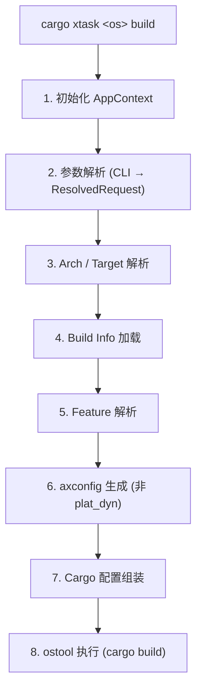
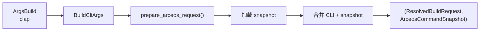
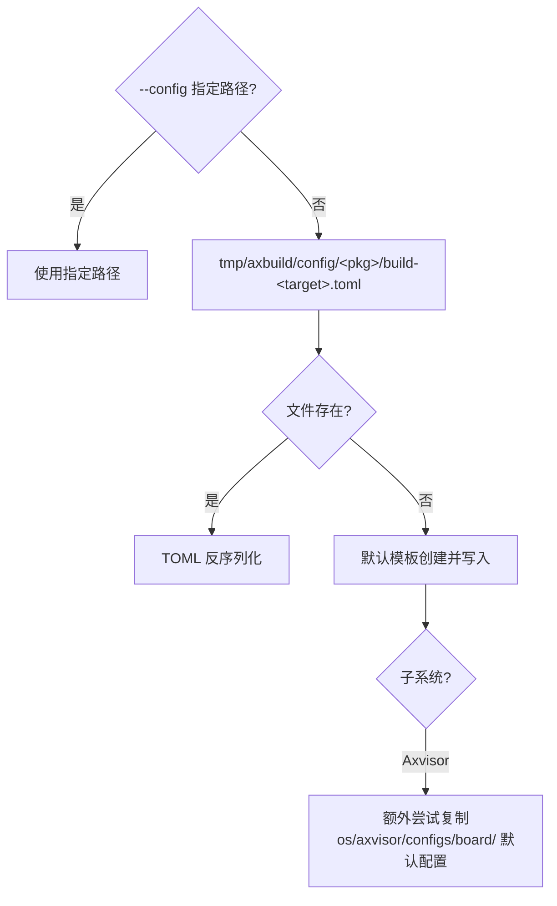
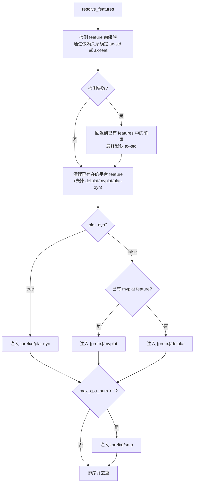
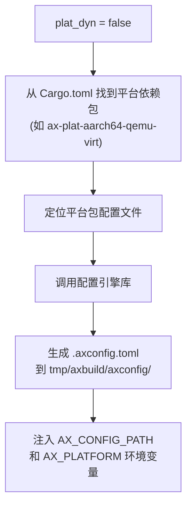

# 构建管线

从用户输入 `cargo xtask <os> build` 到编译产物的完整管线。构建过程分为八个阶段，依次完成上下文初始化、参数解析、架构映射、配置加载、Feature 解析、平台配置生成、Cargo 参数组装和最终编译执行。构建配置细节见 [配置](/docs/build/configuration)，底层执行见 [运行](/docs/build/run)。

构建管线的核心目标是**将用户友好的高层参数（如 `--arch aarch64`、`--smp 4`）转换为 Cargo 能理解的底层编译参数（target triple、features、环境变量、链接器脚本等）**。三套子系统共享前四个阶段的逻辑，在 Feature 解析和 axconfig 生成阶段开始分化，最终都汇聚到统一的 ostool `cargo_build()` 调用。

## 流程总览

八个阶段从前到后构成一条连续的流水线，每阶段以上一阶段的输出为输入：



## 1. 初始化 AppContext

每个子系统的入口（`ArceOS::new()`、`Starry::new()`、`Axvisor::new()`）创建 `AppContext`：

```rust
pub struct AppContext {
    tool: Tool,               // ostool Tool 实例
    build_config_path: Option<PathBuf>,
    root: PathBuf,            // workspace 根目录
    axvisor_dir: Option<PathBuf>, // Axvisor 源码目录（惰性初始化）
    original_path: OsString,  // 原始 PATH（用于 LoongArch 恢复）
    debug: bool,
}
```

初始化步骤：
1. 通过 `CARGO_MANIFEST_DIR` 向上两级定位 workspace root
2. `support::logging::init_logging()` 配置 tracing subscriber
3. `Tool::new(ToolConfig::default())` 初始化 ostool 底层工具

`AppContext` 是构建和运行的执行上下文，贯穿整个生命周期。`tool` 字段持有 ostool 的 `Tool` 实例，封装了与 cargo、QEMU 等外部工具的交互；`original_path` 保存原始 PATH 环境变量，用于 LoongArch LVZ QEMU 临时修改 PATH 后恢复；`debug` 控制是否输出详细日志。

## 2. 参数解析

CLI 参数经 clap 解析后，由 `context/resolve.rs` 转化为 `ResolvedXxxRequest`。以 ArceOS 为例：



合并规则：

| 参数 | 合并策略 |
|------|---------|
| `package`、`arch`、`target` | CLI 优先，回退 snapshot |
| `smp`、`plat_dyn` | CLI 覆盖 snapshot |
| `qemu_config`、`uboot_config` | 仅完全继承 snapshot 时复用 |

clap 解析得到原始 CLI 结构体后，`prepare_*_request()` 函数加载 Snapshot 并执行合并。合并策略的核心原则是**用户显式指定的参数永远优先**——即使 Snapshot 中有不同值。这保证了用户可以通过在命令行上添加参数来覆盖 Snapshot 的设置，而不会因为遗忘清空 Snapshot 而得到意外行为。

## 3. Arch / Target 解析

由 `context/arch.rs` 维护统一映射表（详见 [配置](/docs/build/configuration#arch--target-映射)）。

此阶段将合并后的 `arch` 和 `target` 参数解析为确定值。如果两者都未指定，使用子系统的默认值（ArceOS → aarch64，StarryOS → riscv64，Axvisor → aarch64）。

## 4. Build Info 加载

构建配置存放在 `tmp/axbuild/config/<package>/build-<target>.toml`，由 `BuildInfo` 描述（详见 [配置](/docs/build/configuration#build-info)）。



Build Info 加载是构建管线中与用户交互最密切的环节。用户可以通过 `--config` 指定自定义路径，也可以直接编辑自动生成的 TOML 文件来调整 features 和环境变量。对于 Axvisor，首次加载时还会从预设配置目录复制板卡默认配置，简化初始配置流程。

## 5. Feature 解析

Feature 解析阶段包含三个子步骤：遗留别名归一化、前缀族检测和平台/SMP feature 注入。

### 5a. 遗留别名归一化

加载 Build Info 后，首先执行 `normalize_legacy_feature_aliases()`，将旧的 feature 名自动映射为新名：

| 旧名 | 新名 |
|------|------|
| `axstd` | `ax-std` |
| `axstd/*` | `ax-std/*` |
| `axfeat` | `ax-feat` |
| `axfeat/*` | `ax-feat/*` |

归一化后如果 features 列表发生了变化，会自动排序去重。此步骤确保旧版配置文件无需手动迁移。

### 5b. 前缀族检测与平台 feature 注入

`BuildInfo::resolve_features()` 执行以下步骤：



Feature 解析是构建管线中最复杂的阶段之一。它需要处理多个维度：feature 前缀族（通过分析包的 Cargo.toml 依赖关系确定使用 `ax-std` 还是 `ax-feat` 前缀）、平台类型（动态/静态/自定义）、以及 SMP 支持。

**前缀族检测**通过检查包的直接依赖来确定：如果包依赖 `ax-std` 则使用 `ax-std/` 前缀，依赖 `ax-feat` 则使用 `ax-feat/` 前缀。当检测失败（包不直接依赖两者）时，会回退到已有 features 列表中的前缀线索，最终默认使用 `ax-std`。

**Makefile feature 注入**：如果设置了 `FEATURES` 环境变量（兼容传统 Makefile 工作流），`makefile_features_from_env()` 会解析其中的逗号/空格分隔的 feature 列表，自动添加前缀族前缀后合并到 BuildInfo 的 features 中。

## 6. axconfig 生成

当 `plat_dyn = false` 时需预生成平台配置：



ArceOS 的平台配置（如内存布局、中断控制器地址、串口基地址等）由 `axbuild` 复用配置引擎库从平台包配置文件中合并生成 `.axconfig.toml`。在动态平台模式下（`plat_dyn = true`），这些配置由运行时动态加载；在静态模式下，必须在编译前预生成并注入 `AX_CONFIG_PATH` 环境变量，使得 OS 源码中的配置宏能在编译期读取配置。

## 7. Cargo 配置组装

`BuildInfo` 转换为 `ostool::build::config::Cargo`：

```rust
Cargo {
    env,              // 环境变量
    target,           // target triple
    package,          // workspace 包名
    features,         // Cargo features
    args,             // 额外参数（链接器脚本等）
    to_bin,           // 是否 --bin（x86_64 不需要）
    ...
}
```

链接器参数：
- **plat_dyn**：`-Clink-arg=-Taxplat.x`
- **静态平台**：`-Clink-arg=-Tlinker.x -Clink-arg=-no-pie -Clink-arg=-znostart-stop-gc`

各子系统的额外补丁：
- **StarryOS**：注入 `AX_ARCH`、`AX_TARGET`、`AX_PLATFORM`
- **Axvisor**：注入 `AX_ARCH`、`AX_TARGET`、`AXVISOR_VM_CONFIGS`；`defplat` → `myplat`

此阶段将前面所有阶段的输出（Build Info 中的 features 和环境变量、arch 解析的 target、axconfig 的路径）组装为 ostool 能理解的 `Cargo` 配置结构体。链接器脚本的选择取决于平台模式：动态平台使用 `Taxplat.x`（支持运行时平台注册），静态平台使用 `Tlinker.x`（编译期绑定）。

## 8. 执行

`AppContext::build()` 调用 `Tool::cargo_build()` 完成编译，产出 ELF / BIN 等产物。

最终执行阶段将组装好的 `Cargo` 配置传给 ostool 的 `cargo_build()`。ostool 负责设置环境变量、构建 `cargo build` 命令行、处理输出流和退出码。编译成功后，产物（ELF 文件或 raw binary）位于 `target/{target}/release/` 或 `target/{target}/debug/` 目录下，供后续的运行或测试阶段使用。
