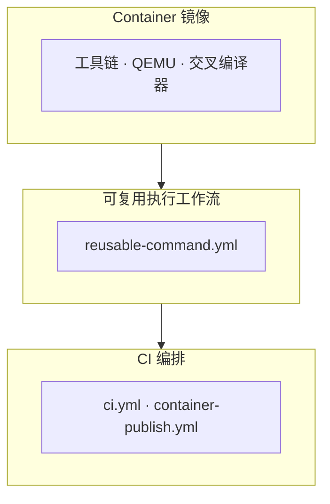
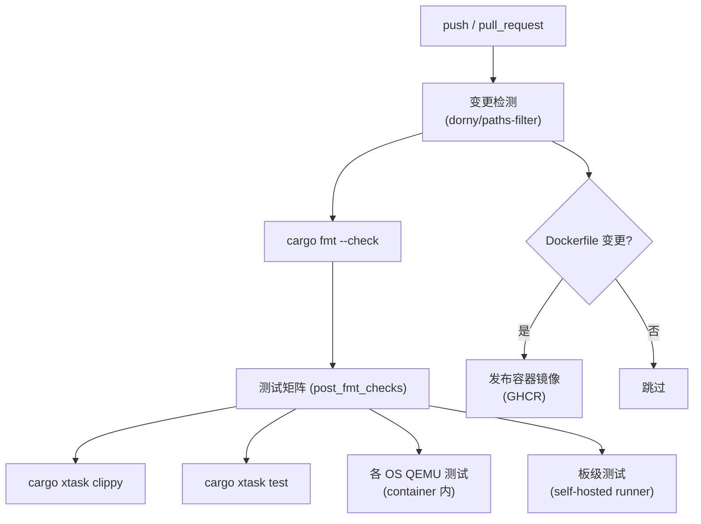

# 自动 CI 测试

TGOSKits 将构建与运行依赖收敛到统一的 container 镜像，由 GitHub Actions 和本地开发流程共同消费。CI 系统的目标是**确保每次代码变更都经过格式检查、静态分析和自动化测试的完整验证**，同时通过容器化保证本地开发环境与 CI 环境的一致性。

CI 的设计遵循"环境即代码"原则：工具链版本（Rust、QEMU、交叉编译器）全部固定在 Dockerfile 中，避免因环境差异导致"本地通过 CI 不通过"的问题。开发者可以通过 `cargo xtask` 在本地复现完整的 CI 流水线，无需手动安装任何依赖。

## 三层架构

CI 体系由 Container 镜像、可复用工作流和 CI 编排三层组成，各层职责分明：



| 层级 | 作用 | 主要入口 |
|------|------|----------|
| Container 镜像 | 固化工具链、QEMU、交叉编译器 | `container/Dockerfile`、`container/Dockerfile.axvisor-lvz` |
| 可复用工作流 | 统一在 host 或 container 中执行命令 | `.github/workflows/reusable-command.yml` |
| CI 编排 | 选择测试矩阵、决定何时发布镜像 | `.github/workflows/ci.yml`、`.github/workflows/container-publish.yml` |

三层架构将关注点分离：Container 镜像层确保可重现的构建环境，可复用工作流层提供标准化的命令执行接口（支持在 container 或 bare metal 上运行），CI 编排层决定测试矩阵和发布策略。`reusable-command.yml` 是关键的中间层——它接收命令和参数作为输入，在指定的环境中执行，返回结果给上层编排。

## 基础镜像

基础镜像定义在 `container/Dockerfile`，以 `ubuntu:24.04` 为底。

| 类别 | 内容 |
|------|------|
| 系统基础 | `build-essential`、`clang`、`cmake`、`make`、`meson`、`ninja-build`、`pkg-config`、`python3` |
| 文件系统/镜像工具 | `dosfstools`、`e2fsprogs`、`xz-utils` |
| QEMU | 源码构建 `QEMU_VERSION=10.2.1`，覆盖 `aarch64`、`riscv64`、`x86_64`、`loongarch64` |
| Rust 环境 | 依据 `rust-toolchain.toml` 安装 toolchain + `cargo-binutils`；配置生成由 `scripts/axbuild` 内部处理 |
| 交叉编译工具链 | `aarch64`、`riscv64`、`x86_64`、`loongarch64` 的 musl 交叉编译器 |

基础镜像从源码编译 QEMU（而非使用发行版包）以确保所有目标架构的支持和版本一致性。Rust 工具链版本通过 `rust-toolchain.toml` 固定，CI 构建时自动读取该文件安装对应版本。交叉编译器使用 musl libc 变体，与 ArceOS 和 StarryOS 的用户态测试环境匹配。

## LVZ 扩展镜像

`container/Dockerfile.axvisor-lvz` 基于基础镜像扩展，额外构建 `QEMU-LVZ`，暴露 `AXBUILD_QEMU_SYSTEM_LOONGARCH64` 环境变量。

LVZ 扩展镜像用于 Axvisor 在 loongarch64 架构上的测试。龙芯的硬件虚拟化扩展（LVZ）需要定制版 QEMU，基础镜像中的标准 QEMU 不支持。该镜像从 `QEMU-LVZ` 仓库源码编译并安装到独立路径，通过 `AXBUILD_QEMU_SYSTEM_LOONGARCH64` 环境变量告知 axbuild 使用该版本。

## CI 流水线

### 工作流文件

| 文件 | 职责 |
|------|------|
| `ci.yml` | 主 CI 编排：变更检测 → 格式检查 → 测试矩阵 → 镜像发布 |
| `reusable-command.yml` | 可复用工作流：在 host 或 container 中执行单条命令 |
| `container-publish.yml` | 可复用工作流：构建并推送容器镜像到 GHCR |
| `docs.yml` | 文档站点构建与部署（见 [文档部署](/docs/contributing/docs)） |
| `release-plz.yml` | 自动版本发布 |

### 触发条件

CI 在以下情况触发：

- **push / pull_request**：自动触发，但 `*.md`、`docs/**` 等纯文档变更会跳过
- **workflow_dispatch**：手动触发，可选择只发布容器镜像（`base` / `axvisor-lvz` / `both`）

并发控制：同一分支连续推送会取消旧的运行（`concurrency` 配置）。

### 变更检测

CI 首先通过 `dorny/paths-filter` 检测变更范围，决定后续执行哪些任务：

| 检测路径 | 触发的任务 |
|----------|-----------|
| `components/`, `os/`, `scripts/`, `xtask/` 等 | CI 检查（fmt → clippy → 测试矩阵） |
| `container/Dockerfile`, `rust-toolchain.toml` | 发布基础容器镜像 |
| `container/Dockerfile.axvisor-lvz` | 发布 LVZ 扩展镜像 |



### 测试矩阵

格式检查通过后，CI 并行执行以下测试矩阵（全部在容器内运行）：

| 测试项 | 命令 | 使用镜像 |
|--------|------|---------|
| Clippy | `cargo xtask clippy` | `ghcr.io/rcore-os/tgoskits-container:latest` |
| Sync-lint | `cargo xtask sync-lint` | `ghcr.io/rcore-os/tgoskits-container:latest` |
| Std 测试 | `cargo xtask test` | `ghcr.io/rcore-os/tgoskits-container:latest` |
| ArceOS aarch64 | `cargo xtask arceos test qemu --arch aarch64` | `ghcr.io/rcore-os/tgoskits-container:latest` |
| ArceOS riscv64 | `cargo xtask arceos test qemu --arch riscv64` | `ghcr.io/rcore-os/tgoskits-container:latest` |
| ArceOS x86_64 | `cargo xtask arceos test qemu --arch x86_64` | `ghcr.io/rcore-os/tgoskits-container:latest` |
| ArceOS loongarch64 | `cargo xtask arceos test qemu --arch loongarch64` | `ghcr.io/rcore-os/tgoskits-container:latest` |
| StarryOS aarch64 | `cargo xtask starry test qemu --arch aarch64` | `ghcr.io/rcore-os/tgoskits-container:latest` |
| StarryOS riscv64 | `cargo xtask starry test qemu --arch riscv64` | `ghcr.io/rcore-os/tgoskits-container:latest` |
| StarryOS x86_64 | `cargo xtask starry test qemu --arch x86_64` | `ghcr.io/rcore-os/tgoskits-container:latest` |
| StarryOS loongarch64 | `cargo xtask starry test qemu --arch loongarch64` | `ghcr.io/rcore-os/tgoskits-container:latest` |
| Axvisor aarch64 | `cargo xtask axvisor test qemu --arch aarch64` | `ghcr.io/rcore-os/tgoskits-container:latest` |
| Axvisor riscv64 | `cargo xtask axvisor test qemu --arch riscv64` | `ghcr.io/rcore-os/tgoskits-container:latest` |
| Axvisor loongarch64 | `cargo xtask axvisor test qemu --arch loongarch64` | **LVZ 镜像** |

### Self-hosted 测试

以下测试需要物理设备，运行在 self-hosted runner 上（仅 `rcore-os` 组织内执行）：

| 测试项 | Runner 标签 | 命令 |
|--------|------------|------|
| Axvisor x86_64 | `self-hosted`, `linux`, `intel` | `cargo xtask axvisor test qemu --arch x86_64` |
| Axvisor OrangePi-5-Plus | `self-hosted`, `linux`, `board` | `cargo xtask axvisor test board --board orangepi-5-plus-linux` |
| StarryOS OrangePi-5-Plus | `self-hosted`, `linux`, `board` | `cargo xtask starry test board --board orangepi-5-plus` |

### Stress 测试

StarryOS 的压力测试（Stress starry *）仅在 target 为 `main` 的 PR 中执行，当前命令为 `echo "TODO!"`（占位）。

## 容器镜像发布

### 镜像地址

| 镜像 | 地址 | 用途 |
|------|------|------|
| 基础镜像 | `ghcr.io/rcore-os/tgoskits-container:latest` | CI 测试 + 本地开发 |
| LVZ 扩展镜像 | `ghcr.io/rcore-os/tgoskits-container-axvisor-lvz:latest` | Axvisor loongarch64 测试 |

### 发布触发

容器镜像在以下条件满足时自动发布：

- **触发事件**：push 到 `main` 或 `dev` 分支
- **路径条件**：
  - 基础镜像：`container/Dockerfile` 或 `rust-toolchain.toml` 有变更
  - LVZ 镜像：`container/Dockerfile.axvisor-lvz` 或 `rust-toolchain.toml` 有变更
- **手动触发**：通过 `workflow_dispatch` 选择发布 `base` / `axvisor-lvz` / `both`

LVZ 扩展镜像依赖基础镜像，发布时会等待基础镜像构建完成后再构建。

### 本地使用预构建镜像

开发者可以直接拉取 CI 使用的预构建镜像：

```bash
# 拉取基础镜像
docker pull ghcr.io/rcore-os/tgoskits-container:latest

# 进入开发环境
docker run -it --rm \
  -v "$(pwd)":/workspace \
  -w /workspace \
  ghcr.io/rcore-os/tgoskits-container:latest
```

这确保本地环境与 CI 环境完全一致。

## 命名规则

### 文件命名

| 文件类型 | 格式 | 示例 |
|----------|------|------|
| QEMU 配置 | `qemu-{arch}.toml` | `qemu-aarch64.toml`、`qemu-x86_64.toml` |
| 板级配置 | `board-{board_name}.toml` | `board-orangepi-5-plus.toml` |
| 构建配置 | `build-{target}.toml` | `build-x86_64-unknown-none.toml` |

统一的命名规则使得 axbuild 可以通过文件名模式自动发现和匹配配置文件。例如 `discover_qemu_cases()` 通过匹配 `qemu-{arch}.toml` 文件来定位测试用例，`discover_build_wrappers()` 通过匹配 `build-{target}.toml` 来识别构建组。

### 架构命名

| 架构缩写 | 完整 Target |
|----------|-------------|
| `x86_64` | `x86_64-unknown-none` |
| `aarch64` | `aarch64-unknown-none-softfloat` |
| `riscv64` | `riscv64gc-unknown-none-elf` |
| `loongarch64` | `loongarch64-unknown-none-softfloat` |
