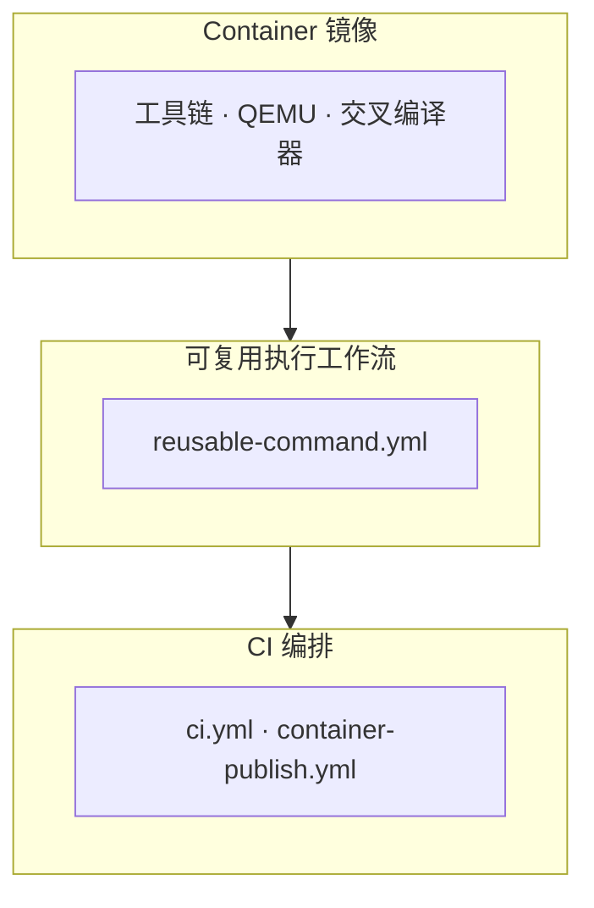

# 自动 CI 测试

本文档说明 `.github/workflows/ci.yml`、`.github/workflows/reusable-command.yml` 和容器镜像在 CI 中的职责，以及当前测试矩阵、缓存策略和 self-hosted runner 的使用方式。

TGOSKits 将大部分构建与运行依赖收敛到统一的 container 镜像，由 GitHub Actions 和本地开发流程共同消费。需要物理设备、虚拟化能力或专用机器环境的任务则运行在 self-hosted runner 上。

## 三层架构



| 层级 | 作用 | 主要入口 |
|------|------|----------|
| Container 镜像 | 固化工具链、QEMU、交叉编译器 | `container/Dockerfile`、`container/Dockerfile.axvisor-lvz` |
| 可复用工作流 | 统一在 host 或 container 中执行命令 | `.github/workflows/reusable-command.yml` |
| CI 编排 | 选择测试矩阵、决定何时发布镜像 | `.github/workflows/ci.yml`、`.github/workflows/container-publish.yml` |

## 触发条件

| 事件 | 说明 |
|------|------|
| `push` | 排除纯文档变更（`*.md`、`docs/**` 等），其余路径触发 CI |
| `pull_request` | 同上 |
| `workflow_dispatch` | 手动触发，仅用于发布容器镜像（`base` / `axvisor-lvz` / `both`），不执行 CI 检查 |

`dev` 分支的 `push` 和手动触发使用 `concurrency.queue: max` 串行排队运行，避免多个 dev CI 同时占用 runner。其他分支、`main` 分支、PR 以及非 `dev` 手动触发不会进入 dev 队列；新 run 会在最早的 `cancel_stale_runs` 阶段取消同一分支或同一 PR 上仍在 queued/running 的旧 CI run。

## 执行流水线

```text
cancel_stale_runs
  |
  `-- detect_changes
  |
  +-- [ci_checks == true]
  |     `-- static_checks (fmt/publish-dry-run || sync-lint || spin-lint)  fail-fast: true
  |           `-- test_checks (所有测试并发)     fail-fast: true
  |
  `-- [push/dispatch 到 main/dev]
        +-- publish_base_container
        `-- publish_axvisor_lvz_container       依赖 base 成功后才运行
```

`static_checks` 作为测试矩阵的前置门禁：格式检查、workspace 发布 dry-run、sync-lint 或 spin-lint 不通过时，后续测试不会启动。`static_checks` 和 `test_checks` 都启用 `fail-fast: true`，任意矩阵项失败会取消同矩阵内其他任务，减少 runner 占用。

## 变更检测

`detect_changes` 使用 `dorny/paths-filter@v4` 判断后续任务是否需要运行：

| 检测路径 | 触发任务 |
|----------|----------|
| `.cargo/`、`.github/workflows/{ci,reusable-command,container-publish}.yml`、`Cargo.toml`、`Cargo.lock`、`rust-toolchain.toml`、`bootloader/axloader/`、`components/`、`drivers/`、`memory/`、`net/`、`os/`、`platforms/`、`scripts/`、`test-suit/`、`virtualization/`、`xtask/` 等 | CI 检查 |
| `container/Dockerfile`、`rust-toolchain.toml` | 发布基础容器镜像 |
| `container/Dockerfile.axvisor-lvz`、`rust-toolchain.toml` | 发布 LVZ 扩展镜像 |

push 到 `main` / `dev` 时强制运行 CI 检查。若非 `main` / `dev` 分支的 push 已存在 open PR，则跳过重复的 push CI，由 pull request CI 覆盖同一提交。

`detect_changes` 内部还负责输出跳过原因：

- `Summarize skipped CI checks`：说明 CI 检查为什么被跳过。
- `Summarize manual container branch restriction`：说明手动容器发布为什么因分支限制被跳过。

## Static Checks

`static_checks` 是并行矩阵，全部通过后才进入 `test_checks`。

| Job 名称 | Runner | 使用容器 | Cache Key | 功能说明 |
|----------|--------|----------|-----------|----------|
| Check formatting | `self-hosted linux qcs`（非 `rcore-os` 回退到 `ubuntu-latest` + `base` 容器） | 通常否 | 无 | `cargo fmt --all -- --check` 和 `cargo publish --workspace --dry-run --no-verify` |
| Run sync-lint | `ubuntu-latest` | 是（`base`） | 无 | `cargo xtask sync-lint --since <base>`；需要完整 git 历史，并上传编译好的 `tg-xtask` 供后续容器 job 复用 |
| Run spin-lint | `ubuntu-latest` | 是（`base`） | 无 | `cargo xtask spin-lint`，校验 vendored `spin` 迁移约束 |

## Test Checks

`test_checks` 依赖 `static_checks` 全部通过后并发执行。

| Job 名称 | Runner | 使用容器 | Cache Key | 功能说明 |
|----------|--------|----------|-----------|----------|
| Run clippy | `self-hosted linux qcs` | 否 | 无 | `cargo xtask clippy --since <base>`；需要完整 git 历史；fork PR 回退到 `ubuntu-latest` + `base` 容器 |
| Test with std | `self-hosted linux qcs` | 否 | 无 | `cargo xtask test`，运行 `scripts/test/std_crates.csv` 中的 host 测试；fork PR 回退到 `ubuntu-latest` + `base` 容器 |
| Test axvisor aarch64 qemu | `self-hosted linux qcs` | 否 | 无 | `cargo xtask axvisor test qemu --arch aarch64`；`rcore-os` 仓库使用 self-hosted，fork PR 回退到 `ubuntu-latest` + `base` 容器 |
| Test axvisor riscv64 qemu | `self-hosted linux qcs` | 否 | 无 | `cargo xtask axvisor test qemu --arch riscv64`；`rcore-os` 仓库使用 self-hosted，fork PR 回退到 `ubuntu-latest` + `base` 容器 |
| Test axvisor loongarch64 qemu | `ubuntu-latest` | 是（`axvisor-lvz`） | `test-axvisor-loongarch64` | `cargo xtask axvisor test qemu --arch loongarch64`，使用带 LVZ 支持的镜像 |
| Test starry riscv64 qemu | `ubuntu-latest` | 是（`base`） | `test-starry-riscv64` | `cargo xtask starry test qemu --arch riscv64` |
| Test starry aarch64 qemu | `ubuntu-latest` | 是（`base`） | `test-starry-aarch64` | `cargo xtask starry test qemu --arch aarch64` |
| Test starry loongarch64 qemu | `ubuntu-latest` | 是（`base`） | `test-starry-loongarch64` | `cargo xtask starry test qemu --arch loongarch64` |
| Test starry x86_64 qemu | `ubuntu-latest` | 是（`base`） | `test-starry-x86_64` | `cargo xtask starry test qemu --arch x86_64` |
| Test arceos x86_64 qemu | `self-hosted linux qcs` | 否 | 无 | `cargo xtask arceos test qemu --arch x86_64`；仅 `rcore-os` 仓库触发 |
| Test arceos riscv64 qemu | `self-hosted linux qcs` | 否 | 无 | `cargo xtask arceos test qemu --arch riscv64`；仅 `rcore-os` 仓库触发 |
| Test arceos aarch64 qemu | `self-hosted linux qcs` | 否 | 无 | `cargo xtask arceos test qemu --arch aarch64`；仅 `rcore-os` 仓库触发 |
| Test arceos loongarch64 qemu | `self-hosted linux qcs` | 否 | 无 | `cargo xtask arceos test qemu --arch loongarch64`；仅 `rcore-os` 仓库触发 |
| Test axvisor self-hosted x86_64(svm) | `self-hosted linux amd kvm` | 否 | 无 | `cargo xtask axvisor test qemu --arch x86_64 --test-case smoke-svm`；仅 `rcore-os` 仓库触发 |
| Test axvisor self-hosted x86_64(vmx) | `self-hosted linux intel kvm` | 否 | 无 | `cargo xtask axvisor test qemu --arch x86_64 --test-case smoke-vmx`；仅 `rcore-os` 仓库触发 |
| Test axvisor self-hosted x86_64(vmx) UEFI | `self-hosted linux intel kvm` | 否 | 无 | 安装/定位 OVMF，生成 nimbos UEFI VM config，并运行 `cargo xtask axvisor test qemu --arch x86_64 --test-group uefi --test-case qemu-nimbos`；仅 `rcore-os` 仓库触发 |
| Test axloader HTTP smoke | `self-hosted linux intel kvm` | 否 | 无 | 安装 `x86_64-unknown-uefi` target 与 OVMF，运行 `cargo axloader test qemu --target x86_64-unknown-uefi`；仅 `rcore-os` 仓库触发 |
| Test axvisor self-hosted board orangepi-5-plus-linux | `self-hosted linux board` | 否 | 无 | `cargo xtask axvisor test board --board orangepi-5-plus-linux`；物理板卡；仅 `rcore-os` 仓库触发 |
| Test axvisor self-hosted board roc-rk3568-pc-linux | `self-hosted linux board` | 否 | 无 | `cargo xtask axvisor test board --board roc-rk3568-pc-linux`；物理板卡；仅 `rcore-os` 仓库触发 |
| Test axvisor self-hosted board phytiumpi-linux | `self-hosted linux board` | 否 | 无 | `cargo xtask axvisor test board --board phytiumpi-linux`；物理板卡；仅 `rcore-os` 仓库触发 |
| Test starry self-hosted board orangepi-5-plus | `self-hosted linux board` | 否 | 无 | `cargo xtask starry test board --board orangepi-5-plus`；物理板卡；仅 `rcore-os` 仓库触发 |
| Test starry self-hosted board aka-00-sg2002 | `self-hosted linux board` | 否 | 无 | `cargo xtask starry test board --board aka-00-sg2002`；物理板卡；仅 `rcore-os` 仓库触发 |
| Test starry self-hosted board visionfive2 | `self-hosted linux board` | 否 | 无 | `cargo xtask starry test board --board visionfive2`；物理板卡；仅 `rcore-os` 仓库触发 |

StarryOS stress 测试条目保留在 workflow 中，但当前处于注释状态。启用后仅用于 target 为 `main` 的 PR。

## Self-Hosted Runner 约定

self-hosted runner 任务优先在 `rcore-os` 仓库内运行。带 `self_hosted_owner` 的任务在 fork PR 或非 `rcore-os` 仓库中会回退到 `ubuntu-latest` + 对应容器，避免没有对应 runner 时长时间排队。迁移到 self-hosted 的任务直接在原生 runner 环境中运行，不再套 Docker container。

现有 label 约定：

| Label | 用途 |
|-------|------|
| `self-hosted`, `linux`, `qcs` | clippy、std 测试、ArceOS QEMU 测试、Axvisor aarch64/riscv64 QEMU |
| `self-hosted`, `linux`, `intel`, `kvm` | Axvisor x86_64 KVM 测试 |
| `self-hosted`, `linux`, `board` | 物理板卡测试 |

## Cache 策略

| Cache Key | 使用 Job | 保存时机 | 说明 |
|-----------|----------|----------|------|
| `test-axvisor-loongarch64` | Test axvisor loongarch64 QEMU | `push` 事件 | Axvisor loongarch64 编译产物 |
| `test-starry-riscv64/aarch64/loongarch64/x86_64` | Test starry riscv64/aarch64/loongarch64/x86_64 QEMU | `push` 事件 | StarryOS QEMU 编译产物 |
| 无（`cache_key: ""`） | static checks、self-hosted x86_64/board 类 job | - | 不启用 `Swatinem/rust-cache`；self-hosted 任务依赖 runner 本地磁盘缓存 |

self-hosted runner 不设置 `cache_key`，避免 `Swatinem/rust-cache@v2` 的 post-job 清理影响 runner 上跨次运行自然积累的共享缓存。

## 容器镜像

CI 使用两个容器镜像：

| 镜像 | Dockerfile | 用途 |
|------|------------|------|
| `base` | `container/Dockerfile` | sync-lint、StarryOS QEMU，以及 clippy、std、self-hosted QEMU 测试在 fork PR 或非 `rcore-os` 仓库中的回退环境 |
| `axvisor-lvz` | `container/Dockerfile.axvisor-lvz` | Axvisor loongarch64 QEMU，额外包含 LVZ 支持 |

基础镜像以 `ubuntu:24.04` 为底，内置 Rust 工具链、QEMU、musl cross-toolchain、libav、libudev 等依赖。容器内的 musl cross-toolchain 已通过 `PATH` 配置好，`reusable-command.yml` 会在 container job 启动时验证 QEMU user emulators 和 musl compiler 是否存在，不再在运行时动态下载。

## 容器发布

| Job 名称 | Runner | 触发条件 | 功能说明 |
|----------|--------|----------|----------|
| Publish base container | `ubuntu-latest` | push 到 `main` / `dev` 且基础镜像相关路径变更，或手动选择发布 `base` / `both` | 构建并推送 `ghcr.io/<repo>-container:latest` |
| Publish axvisor-lvz container | `ubuntu-latest` | push 到 `main` / `dev` 且 LVZ 镜像相关路径变更，或手动选择发布 `axvisor-lvz` / `both` | 构建并推送 `ghcr.io/<repo>-container-axvisor-lvz:latest` |

`axvisor-lvz` 镜像依赖基础镜像。若同一次运行需要发布基础镜像，LVZ 镜像会等待基础镜像发布成功后再构建。

## 本地使用预构建镜像

开发者可以直接拉取 CI 使用的预构建镜像：

```bash
docker pull ghcr.io/rcore-os/tgoskits-container:latest

docker run -it --rm \
  -v "$(pwd)":/workspace \
  -w /workspace \
  ghcr.io/rcore-os/tgoskits-container:latest
```

## `reusable-command.yml`

所有 `static_checks` 和 `test_checks` 中的 job 均通过 `.github/workflows/reusable-command.yml` 执行。该 workflow 根据 `inputs.use_container` 在两个互斥 job 中选择一个：

| Job | 说明 |
|-----|------|
| `run_host` | 不使用容器，直接在 runner 原生环境中执行命令 |
| `run_container` | 使用指定镜像执行命令，并在启动时验证 QEMU user emulator 和 musl cross-toolchain |

`runs_on` 使用 JSON 字符串输入并通过 `fromJson(inputs.runs_on)` 转为 GitHub Actions runner label 数组。Rust 编译缓存仅在 `cache_key != ""` 时启用，`push` 事件保存，PR 事件只读取不保存。

## 命名规则

| 文件类型 | 格式 | 示例 |
|----------|------|------|
| QEMU 配置 | `qemu-{arch}.toml` | `qemu-aarch64.toml`、`qemu-x86_64.toml` |
| 板级配置 | `board-{board_name}.toml` | `board-orangepi-5-plus.toml` |
| 构建配置 | `build-{target}.toml` | `build-x86_64-unknown-none.toml` |

| 架构缩写 | 完整 Target |
|----------|-------------|
| `x86_64` | `x86_64-unknown-none` |
| `aarch64` | `aarch64-unknown-none-softfloat` |
| `riscv64` | `riscv64gc-unknown-none-elf` |
| `loongarch64` | `loongarch64-unknown-none-softfloat` |
