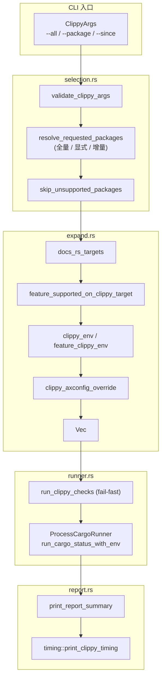

# Clippy 检查

`cargo xtask clippy` 是 axbuild 对整个 TGOSKits workspace 执行静态检查的统一入口。它不是简单地 `cargo clippy --workspace`：因为 workspace 中混合了 host 端 bin 工具、`#![no_std]` 内核 crate、需要特定 target/feature/axconfig 才能编译的 OS 包，直接全量 clippy 会大量误报。clippy 模块针对每个包按其声明的 feature 矩阵和 docs.rs `metadata.targets` 展开成多个 `ClippyCheck`，再以 `fail-fast` 方式逐一运行，把结果收敛成可读报告。

## 架构概览



## 模块组成

| 代码位置 | 作用 |
|----------|------|
| `scripts/axbuild/src/clippy/mod.rs` | CLI 入口、模块级常量（如 `AXSTD_STD_*`、`AX_HAL_PACKAGE`） |
| `scripts/axbuild/src/clippy/selection.rs` | 参数校验、包选择（全量 / `--package` / `--since` 增量）、不支持的包过滤 |
| `scripts/axbuild/src/clippy/check.rs` | `ClippyCheck` / `ClippyCheckKind` / `ClippyDepsMode` / `ClippyAxconfigOverride` 数据模型与 `cargo_args` 构造 |
| `scripts/axbuild/src/clippy/expand.rs` | 把每个包按 feature × target 展开为 `ClippyCheck` 列表 |
| `scripts/axbuild/src/clippy/env.rs` | 为每个 check 计算所需环境变量（如 `AX_CONFIG_PATH`）与 axconfig override |
| `scripts/axbuild/src/clippy/targets.rs` | 从 docs.rs metadata 提取包支持的 target，以及 feature↔target 兼容性判断 |
| `scripts/axbuild/src/clippy/runner.rs` | `CargoRunner` trait 与 `ProcessCargoRunner`，fail-fast 执行 |
| `scripts/axbuild/src/clippy/report.rs` | `ClippyRunReport` 聚合与人类可读报告 |
| `scripts/axbuild/src/clippy/timing.rs` | 起止时间记录与耗时打印 |
| `scripts/axbuild/src/clippy/tests.rs`, `tests/` | 展开与选择逻辑的回归测试 |

## 包选择策略

`ClippyArgs` 提供三种互斥的包选择模式，由 `validate_clippy_args` 强制约束：

| 模式 | 触发条件 | 行为 |
|------|----------|------|
| 全量 | `--all` 或不带任何参数 | 对全部 workspace 成员执行 `NoDeps` 检查 |
| 显式 | `--package <name>`（可多次） | 仅指定包，未知包名直接报错 |
| 增量 | `--since <git-ref>` | 通过 `support::git::select_incremental_packages` 选出变更包及其反向依赖顶层包 |

`--since` 模式下，变更包以 `NoDeps` 检查，**被影响的反向依赖顶层包**以 `WithDeps` 检查（一并扫描依赖该包的代码）。当 git diff 失败或路径越出 workspace 时回退到全量扫描，并在终端打印回退原因。

`skip_unsupported_packages` 会跳过当前不能裸 clippy 的包，目前包括：

| 包 | 原因 |
|----|------|
| `axvisor` | 需要 Axvisor target/build 配置；应走 `cargo xtask axvisor` 流程 |
| `mingo` | 依赖 chainloader Makefile、BSP feature 和自定义 `RUSTFLAGS` |

## Check 展开规则

`expand_clippy_checks` 对每个 `SelectedClippyPackage` 按 (target × feature) 笛卡尔积展开：

1. **target** 来自 `docs_rs_targets(package)`，从 docs.rs metadata 读取包声明支持的 target；为空时取单个 `None`（host target）。
2. **feature** 取包 `Cargo.toml` 中除 `default` 外的全部 feature；`ax-std` 额外注入一个名为 `default` 的特殊 feature。
3. 每个 (target, base) 组合产生一个 base check；`NoDeps` 模式下再为每个该 target 支持的 feature 产生一个 feature check。
4. feature check 若声明了 axconfig override，则通过 `ClippyAxconfigOverride::generate` 先生成 `axconfig.toml`，并把 `AX_CONFIG_PATH` 注入环境。

`ax-std` 的 `default` feature 被特殊重写为 `std-compat,plat-dyn,fs,multitask,irq,net`（常量 `AXSTD_STD_CLIPPY_FEATURES`），target 固定为 `x86_64-unknown-none`，以便在没有真实平台的情况下覆盖 std 兼容层。

### target 来源与归一化

`docs_rs_targets(package)` 从包 `Cargo.toml` 的 `[package.metadata.docs.rs]` 或 `[package.metadata.docs]` 节读取 `targets` 数组。两个节都支持，`docs.rs` 优先于 `docs.rs`：

```toml
[package.metadata.docs.rs]
targets = ["aarch64-unknown-linux-gnu", "riscv64gc-unknown-none-elf"]
```

读取后通过 `CLIPPY_TARGET_ALIASES` 归一化，把等价 target 映射到统一的规范形式，避免因别名差异产生重复 check：

| 原始 target | 归一化为 |
|-------------|----------|
| `aarch64-unknown-linux-gnu` | `aarch64-unknown-none-softfloat` |
| `aarch64-unknown-none` | `aarch64-unknown-none-softfloat` |
| `loongarch64-unknown-none` | `loongarch64-unknown-none-softfloat` |

归一化后用 `BTreeSet` 去重，最终返回有序且唯一的 target 列表。包未声明 docs.rs targets 时返回空列表，展开阶段以单个 `None`（host target）代替。

### feature 与 target 兼容性

并非每个 feature 都在所有 target 上有意义。`feature_supported_on_clippy_target` 过滤掉不兼容的 (feature, target) 组合，核心规则围绕 `ax-hal` 平台 feature：

`ax-hal` 包的 `plat-dyn` feature 仅在四个架构上可用（`AX_HAL_PLATFORM_FEATURE_TARGET_ARCHES`）：

| feature | 支持的架构 |
|---------|-----------|
| `plat-dyn` | aarch64、loongarch64、riscv64、x86_64 |

如果一个包的某 feature 直接或间接依赖 `ax-hal/plat-dyn`，但当前 target 的架构不在支持列表中，该 feature check 会被跳过。依赖关系通过解析包 `Cargo.toml` 中该 feature 的 `features` 数组（形如 `ax-hal/plat-dyn` 或 `ax-hal?/plat-dyn`）递归判断。

### 环境变量与 axconfig override

`clippy_env(package)` 检查包目录下是否存在 `axconfig.toml`（常量 `AXCONFIG_FILE`），存在则注入 `AX_CONFIG_PATH` 环境变量指向它。这使得依赖编译期配置宏的包（如需要内存布局、SMP 数值的 crate）在 clippy 时也能获得正确的配置。

更复杂的情况是 feature 级别的 axconfig override。包可在 `Cargo.toml` 中声明：

```toml
[package.metadata.axbuild.clippy-feature-axconfig-overrides]
my-feature = ["plat.max-cpu-num=8", "plat.phys-memory-size=0x80000000"]
```

`feature_axconfig_overrides` 解析这段 metadata，返回 `HashMap<feature, Vec<override>>`。当展开到该 feature 的 check 时，`clippy_axconfig_override` 构造一个 `ClippyAxconfigOverride`：

- `target`：当前 check 的 target
- `platform_config`：包目录下的 `axconfig.toml`
- `out_config`：`tmp/axbuild/axconfig/<pkg>/<target>/clippy/<feature>/.axconfig.toml`
- `overrides`：用户声明的键值对

`ClippyAxconfigOverride::generate` 调用 `build::generate_axconfig` 合并 defconfig + 平台 config + overrides，生成专属的 `.axconfig.toml`。`feature_clippy_env` 随后把 `AX_CONFIG_PATH` 指向这个生成的文件（覆盖 base env 中的同名变量）。

`ax-std` 的 `default` feature 走另一条路径：`axstd_std_clippy_env` 调用 `build::prepare_std_build_env` 准备一整套 std 兼容环境（target 固定 `x86_64-unknown-none`，plat-dyn = true）。

## 单个 Check 的执行

`ClippyCheck::cargo_args()` 构造命令行：

- Base check：`clippy -p <pkg>`
- Feature check：`clippy -p <pkg> --no-default-features --features <feature>`
- `ax-std` default 特判：替换为 `--features std-compat,plat-dyn,fs,multitask,irq,net`
- `NoDeps`：在 `clippy` 后插入 `--no-deps`，避免依赖 crate 的告警污染结果
- 有 target：追加 `--target <target>`
- 固定尾部：`-- -D warnings`（任何告警即失败）

`ProcessCargoRunner::run_clippy` 在执行前如有 axconfig override 会先调 `generate()` 写盘，然后调用 `support::process::run_cargo_status_with_env`，把 `check.env` 中的环境变量（如 `AX_CONFIG_PATH`）传入子进程。

## 执行模型与报告

`run_clippy_checks` 采用 **fail-fast**：任何一个 check 非零退出就 `bail!`，剩余 check 不再执行，并在错误信息中带出剩余数量。这样在 CI 上能尽快暴露首个问题，避免长输出被截断。

### 执行流程

`ProcessCargoRunner::run_clippy` 对每个 check 执行：

1. 如果 check 声明了 axconfig override，先调用 `ClippyAxconfigOverride::generate` 生成 `.axconfig.toml`
2. 调用 `check.cargo_args()` 构造命令行
3. 调用 `support::process::run_cargo_status_with_env(workspace_root, &args, &check.env)` 执行 cargo clippy 子进程，注入环境变量

每个 check 执行前打印计划行（`print_clippy_check_plan`），格式形如 `[N/M] <label>`，让用户知道当前进度和剩余数量。成功打印 `ok: <label>`，失败则 bail。

### 报告聚合

`ClippyRunReport` 按 package 维度聚合检查结果：

```rust
struct ClippyRunReport {
    packages: Vec<ClippyPackageReport>,  // 每个 package 一条
    passed_checks: usize,                // 总通过数
}

struct ClippyPackageReport {
    package: String,
    total_checks: usize,          // 该 package 的 check 总数
    failed_checks: Vec<String>,   // 失败 check 的 label 列表
}
```

`print_report_summary` 遍历所有 package，对有失败的输出其 `failed_checks` 列表；`print_clippy_timing` 输出从开始到结束的总耗时。所有 check 通过时打印 `all clippy checks passed`。

### 计时

`timing.rs` 在命令开始时记录 `Local::now()`（用于打印 `clippy started at: YYYY-MM-DD HH:MM:SS %z`）和 `Instant::now()`（用于精确计时）。命令结束时 `print_clippy_timing` 输出格式化的总耗时。这样 CI 日志中既有人类可读的开始时间，也有精确的耗时数据用于性能回归观察。

## 用法示例

```bash
# 全量 workspace clippy（CI 默认）
cargo xtask clippy
cargo xtask clippy --all

# 只检查指定包
cargo xtask clippy --package axcpu --page_table_multiarch

# 增量：只检查自某个 git ref 以来变更及受影响的包
cargo xtask clippy --since origin/main
```

> 在执行 `starry`、`clippy` 等可能触发 `aic8800` 编译的命令前，`lib.rs::run_root_cli` 会调用 `firmware::ensure_aic8800_firmware` 预拉 Wi-Fi 固件 blob，因此 clippy 命令本身不要求用户预先准备固件。
