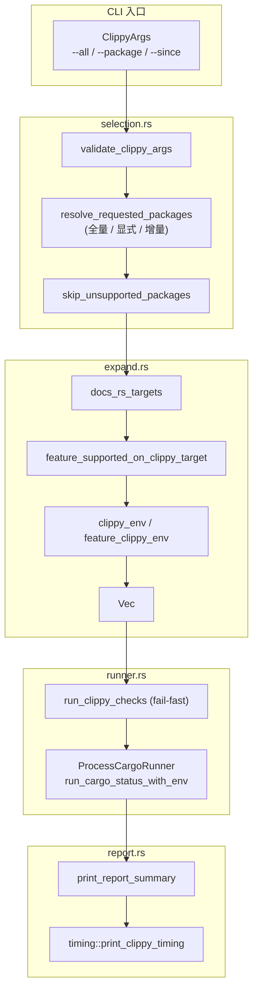

# Clippy 检查

`cargo xtask clippy` 是 axbuild 对整个 TGOSKits workspace 执行静态检查的统一入口。它不是简单地 `cargo clippy --workspace`：因为 workspace 中混合了 host 端 bin 工具、`#![no_std]` 内核 crate 和需要特定 target/feature 的 OS 包，直接全量 clippy 会大量误报。clippy 模块针对每个包按其声明的 feature 矩阵和 docs.rs `metadata.targets` 展开成多个 `ClippyCheck`，再以 `fail-fast` 方式逐一运行，把结果收敛成可读报告。

## 1. 执行架构

Clippy 先从 workspace metadata 选择 package，再将 package 的 target 与 feature 展开为独立 check；每个 check 最终以 `-D warnings` 执行。下图描述 `run_workspace_clippy_command()` 到进程执行器的调用关系。


```mermaid
flowchart TB
    subgraph CLI["CLI 入口"]
        ARGS["ClippyArgs<br/>--all / --package / --since"]
    end

    subgraph Selection["selection.rs"]
        VALID["validate_clippy_args"]
        RESOLVE["resolve_requested_packages<br/>(全量 / 显式 / 增量)"]
        SKIP["skip_unsupported_packages"]
    end

    subgraph Expand["expand.rs"]
        TARGETS["docs_rs_targets"]
        FEAT["feature_supported_on_clippy_target"]
        ENV["clippy_env / feature_clippy_env"]
        CHECKS["Vec<ClippyCheck>"]
    end

    subgraph Runner["runner.rs"]
        RUN["run_clippy_checks (fail-fast)"]
        PROC["ProcessCargoRunner<br/>run_cargo_status_with_env"]
    end

    subgraph Report["report.rs"]
        SUM["print_report_summary"]
        TIME["timing::print_clippy_timing"]
    end

    ARGS --> VALID --> RESOLVE --> SKIP --> TARGETS
    TARGETS --> FEAT --> ENV --> CHECKS
    CHECKS --> RUN --> PROC --> SUM --> TIME
```

## 2. 模块职责

Clippy 的代码按选择、展开、执行和报告划分，避免参数解析与 Cargo 调用耦合。下表给出维护某类行为时应修改的模块。

| 代码位置 | 作用 |
|----------|------|
| `scripts/axbuild/src/clippy/mod.rs` | CLI 入口、模块级常量（如 `AXSTD_STD_*`、`AX_HAL_PACKAGE`） |
| `scripts/axbuild/src/clippy/selection.rs` | 参数校验、包选择（全量 / `--package` / `--since` 增量）、不支持的包过滤 |
| `scripts/axbuild/src/clippy/check.rs` | `ClippyCheck` / `ClippyCheckKind` 数据模型与 `cargo_args` 构造 |
| `scripts/axbuild/src/clippy/configurations.rs` | 解析并校验 package metadata 中声明的命名 target 配置 |
| `scripts/axbuild/src/clippy/expand.rs` | 把每个包按 feature × target 展开为 `ClippyCheck` 列表 |
| `scripts/axbuild/src/clippy/env.rs` | 为特殊 check 计算所需环境变量；普通包当前不额外注入环境变量 |
| `scripts/axbuild/src/clippy/targets.rs` | 从 docs.rs metadata 提取包支持的 target，以及 feature↔target 兼容性判断 |
| `scripts/axbuild/src/clippy/runner.rs` | `CargoRunner` trait 与 `ProcessCargoRunner`，fail-fast 执行 |
| `scripts/axbuild/src/clippy/report.rs` | `ClippyRunReport` 聚合与人类可读报告 |
| `scripts/axbuild/src/clippy/timing.rs` | 起止时间记录与耗时打印 |
| `scripts/axbuild/src/clippy/tests.rs`, `tests/` | 展开与选择逻辑的回归测试 |

## 3. 包选择

`ClippyArgs` 提供三种互斥的包选择模式，由 `validate_clippy_args` 强制约束：

| 模式 | 触发条件 | 行为 |
|------|----------|------|
| 全量 | `--all` 或不带任何参数 | 对全部 workspace 成员执行完整检查矩阵 |
| 显式 | `--package <name>`（可多次） | 仅指定包，未知包名直接报错 |
| 增量 | `--since <git-ref>` | 选择直接变更包，以及受影响的 `ax-std` / `starryos` OS 根 |

`--since` 模式先通过 `support::git::select_incremental_packages` 计算直接变更包和完整反向依赖闭包，再选择 `changed ∪ (affected ∩ {ax-std, starryos})`。中间路径和其他顶层包不会进入 Clippy 计划；直接变更的 OS 根会去重。所有选中包都使用 `--no-deps` 并展开完整 feature、target 和命名配置矩阵。当 git diff 失败或路径越出 workspace 时回退到全量扫描，并在终端打印回退原因。

CI 为 Incremental Clippy 单独获取最近 100 层 Git 历史。增量基线或 merge-base 超出该范围，或者 force-push 使历史断开时，Clippy 会保守回退到全 workspace 扫描；其他 CI 检查保持各自的 checkout 深度。

`--no-deps` 只禁止 Clippy 检查依赖 crate；Cargo 仍会编译选中包完成类型检查所需的依赖。

`skip_unsupported_packages` 会跳过当前不能裸 clippy 的包，目前包括：

| 包 | 原因 |
|----|------|
| `axvisor` | 需要 Axvisor target/build 配置；应走 `cargo xtask axvisor` 流程 |
| `mingo` | 依赖 chainloader Makefile、BSP feature 和自定义 `RUSTFLAGS` |

## 4. 检查展开

`expand_clippy_checks` 对每个选中的 workspace package 按 (target × feature) 笛卡尔积展开：

1. **target** 来自 `docs_rs_targets(package)`，从 docs.rs metadata 读取包声明支持的 target；为空时取单个 `None`（host target）。
2. **feature** 取包 `Cargo.toml` 中除 `default` 外的全部 feature；`ax-std` 额外注入一个名为 `default` 的特殊 feature。
3. 每个 (target, base) 组合产生一个 base check，再为每个该 target 支持的 feature 产生一个 feature check。
4. feature check 使用对应 feature 名执行；`host-test` 是 workspace 的宿主测试约定，不参与 docs.rs target 矩阵，而是在 host target 上单独检查一次并加上 `--tests`，让 Clippy 编译单元测试和集成测试目标。普通包不额外注入构建环境变量。
5. 包还可以通过 `[package.metadata.clippy]` 声明命名配置；每条配置按一个明确 target、完整 feature 集和环境变量额外生成 check。

命名配置用于 docs.rs target × 单 feature 矩阵无法表达的正式构建组合。它保留包的默认 feature，再额外启用配置中的完整 feature 集：

```toml
[[package.metadata.clippy.configurations]]
name = "aarch64-system"
target = "aarch64-unknown-none-softfloat"
features = ["ax-runtime/display", "input", "smp"]

[package.metadata.clippy.configurations.env]
AX_ARCH = "aarch64"
AX_TARGET = "aarch64-unknown-none-softfloat"
SMP = "4"
```

配置名必须在包内唯一，名称、target 和 feature 必须非空且不能带首尾空白。配置与 feature 会排序去重，环境变量按键排序，因此 check 顺序、命令参数和日志在不同运行间保持一致。命名配置不会把包的所有单 feature 机械展开到目标架构；平台专属组合应显式声明，从而避免把 SG2002、K230 等 feature 编译到错误 target。

`ax-std` 的 `default` feature 被特殊重写为 `std-compat,fs,net`（常量 `AXSTD_STD_CLIPPY_FEATURES`），target 固定为 `x86_64-unknown-none`，以便在没有真实平台的情况下覆盖 std 兼容层。IRQ 与多任务调度属于基础能力，不再通过 feature 注入。

### 4.1 目标归一化

`docs_rs_targets(package)` 从包 `Cargo.toml` 的 `[package.metadata.docs.rs]` 或 `[package.metadata.docs]` 节读取 `targets` 数组。两个节都支持，`docs.rs` 优先于嵌套的 `docs.rs`：

```toml
[package.metadata.docs.rs]
targets = ["aarch64-unknown-linux-gnu", "riscv64gc-unknown-none-elf"]
```

读取后通过 `CLIPPY_TARGET_ALIASES` 归一化，把等价 target 映射到统一的规范形式，避免因别名差异产生重复 check：

| 原始 target | 归一化为 |
|-------------|----------|
| `aarch64-unknown-linux-gnu` | `aarch64-unknown-none-softfloat` |
| `aarch64-unknown-none` | `aarch64-unknown-none-softfloat` |
| `loongarch64-unknown-none` | `loongarch64-unknown-none-softfloat` |

归一化后用 `BTreeSet` 去重，最终返回有序且唯一的 target 列表。包未声明 docs.rs targets 时返回空列表，展开阶段以单个 `None`（host target）代替。

### 4.2 特性约束

`feature_supported_on_clippy_target` 保留了按 target 约束 feature 的扩展点：它会检查 `ax-hal/<feature>` 或 `ax-hal?/<feature>` 依赖是否出现在内置的架构约束表中，并在没有 target 或架构不匹配时跳过该 feature check。

`AX_HAL_PLATFORM_FEATURE_TARGET_ARCHES` 当前为空，因此 `feature_supported_on_clippy_target()` 不会为 `ax-hal` feature 增加额外 target 限制；普通 feature check 在 docs.rs metadata 声明的每个 target 上展开。

### 4.3 执行环境

`clippy_env(package)` 为普通 package 返回空环境。`ax-std` 的 `default` feature 通过 `feature_clippy_env()` 写入 `AX_TARGET=x86_64-unknown-none`，为 std-only check 提供原始 target 名称。

## 5. 单项执行

`ClippyCheck::cargo_args()` 构造命令行：

- Base check：`clippy --no-deps -p <pkg>`
- Feature check：`clippy --no-deps -p <pkg> --no-default-features --features <feature>`；当 feature 为 `host-test` 时额外传入 `--tests`
- Named configuration check：`clippy --no-deps -p <pkg> --features <feature-a>,<feature-b> --target <target>`，并注入配置声明的环境变量
- `ax-std` default 特判：替换为 `--features std-compat,fs,net`
- 所有 check 都带 `--no-deps`，避免依赖 crate 的告警污染结果
- 有 target：追加 `--target <target>`
- 固定尾部：`-- -D warnings`（任何告警即失败）

`ProcessCargoRunner::run_clippy` 调用 `support::process::run_cargo_status_with_env`，把 `check.env` 中的环境变量传入子进程。

## 6. 报告处理

`run_clippy_checks` 采用 **fail-fast**：任何一个 check 非零退出就 `bail!`，剩余 check 不再执行，并在错误信息中带出剩余数量。这样在 CI 上能尽快暴露首个问题，避免长输出被截断。

### 6.1 执行顺序

`ProcessCargoRunner::run_clippy` 对每个 check 执行：

1. 调用 `check.cargo_args()` 构造命令行
2. 调用 `support::process::run_cargo_status_with_env(workspace_root, &args, &check.env)` 执行 cargo clippy 子进程，注入环境变量

每个 check 执行前打印计划行（`print_clippy_check_plan`），格式形如 `[N/M] <label>`，让用户知道当前进度和剩余数量。成功打印 `ok: <label>`，失败则 bail。

### 6.2 结果汇总

`ClippyRunReport` 按 package 维度聚合检查结果：

```rust
struct ClippyRunReport {
    packages: Vec<ClippyPackageReport>,  // 每个 package 一条
    passed_checks: usize,                // 总通过数
}

struct ClippyPackageReport {
    package: String,
    total_checks: usize,          // 该 package 的 check 总数
    failed_checks: Vec<String>,   // 失败 check 的 label 列表
}
```

`print_report_summary` 遍历所有 package，对有失败的输出其 `failed_checks` 列表；`print_clippy_timing` 输出从开始到结束的总耗时。所有 check 通过时打印 `all clippy checks passed`。

### 6.3 耗时统计

`timing.rs` 在命令开始时记录 `Local::now()`（用于打印 `clippy started at: YYYY-MM-DD HH:MM:SS %z`）和 `Instant::now()`（用于精确计时）。命令结束时 `print_clippy_timing` 输出格式化的总耗时。这样 CI 日志中既有人类可读的开始时间，也有精确的耗时数据用于性能回归观察。

## 7. 命令示例

这些命令分别覆盖全量、指定 package 和增量选择三种入口，它们会经过相同的展开与报告流程。

```bash
# 全量 workspace clippy（CI 默认）
cargo xtask clippy
cargo xtask clippy --all

# 只检查指定包
cargo xtask clippy --package ax-cpu --package page-table-generic

# 增量：只检查自某个 git ref 以来变更及受影响的包
cargo xtask clippy --since origin/main
```

> `aic8800` 的 crate build script 会根据固定 manifest 从本地 cache 读取并校验 Wi-Fi 固件 blob；cache 缺失时才从固定 upstream 下载。首次构建因此需要网络或预置且校验通过的 cache，后续 `starry`、`clippy` 等命令复用同一供应路径。
