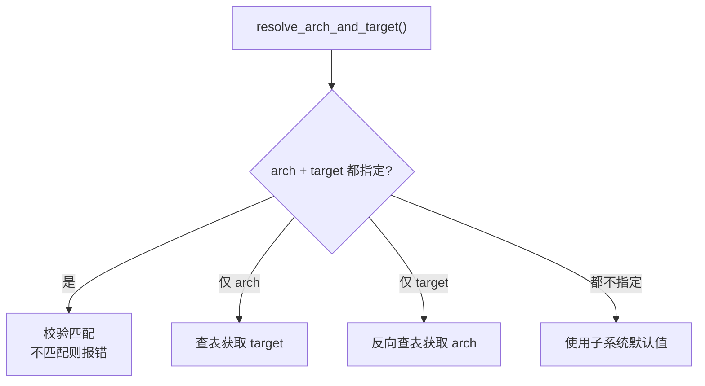
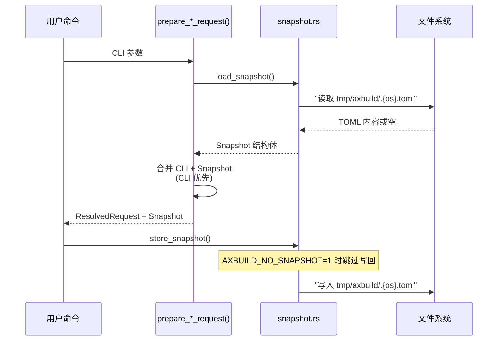
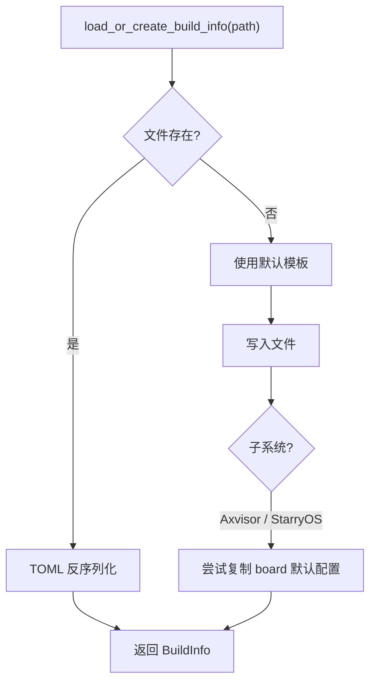

# 参数与配置

axbuild 管理两类核心配置文件：Snapshot 为 CLI 提供参数回退，Build Info 收敛构建参数。动态平台硬件信息由运行时发现，不再由 axbuild 生成 .axconfig.toml。

1. **Snapshot**（`tmp/axbuild/.{os}.toml`）—— 最近一次命令参数的持久化，使短命令可以复用之前的 `--arch`、`--package` 等参数
2. **Build Info**（`tmp/axbuild/config/<package>/build-<target>.toml`）—— 构建配置核心，描述 features、环境变量和平台行为
此外，**Arch / Target 映射**是配置解析的共享基础，维护 arch ↔ target 的对应关系和子系统默认值。三套子系统共享这套配置框架，但各有自己的默认值和定制行为。所有配置逻辑集中在 `scripts/axbuild/src/context/` 和 `scripts/axbuild/src/build.rs` 中。

## Arch / Target 映射

`context/arch.rs` 维护统一的 arch ↔ target 映射表，三套子系统共享映射关系，但默认值不同。

TGOSKits 支持四种 CPU 架构，每种架构对应一个固定的 target triple。`context/arch.rs` 中的 `resolve_arch_and_target()` 函数负责处理用户通过 `--arch` 和 `--target` 传入的参数，确保两者一致或在只指定其一时自动补全另一个。这种设计使得用户可以用简短的 `--arch aarch64` 代替完整的 `--target aarch64-unknown-none-softfloat`。

### 映射表

| `--arch` | target triple | 说明 |
|----------|---------------|------|
| `aarch64` | `aarch64-unknown-none-softfloat` | ARM 64 位 |
| `x86_64` | `x86_64-unknown-none` | x86 64 位 |
| `riscv64` | `riscv64gc-unknown-none-elf` | RISC-V 64 位 |
| `loongarch64` | `loongarch64-unknown-none-softfloat` | 龙芯 64 位 |

### 解析规则

`resolve_arch_and_target()` 根据用户提供的参数组合选择对应的解析策略：



| 指定方式 | 行为 |
|----------|------|
| `--arch` + `--target` | 校验匹配，不匹配则报错 |
| 仅 `--arch` | 自动查找 target |
| 仅 `--target` | 自动反向查找 arch |
| 都不指定 | 使用子系统默认值 |

当用户同时提供 `--arch` 和 `--target` 时，系统会校验两者的映射关系，如果不匹配则立即报错，防止因参数不一致导致编译失败。四个分支中最常用的是"仅 `--arch`"和"都不指定"——前者允许用户快速切换架构，后者依赖 Snapshot 中保存的上次参数。

### 默认值

各子系统使用不同的默认架构，对应其最常用的开发和测试目标：

| 子系统 | 默认 arch | 默认 target |
|--------|-----------|-------------|
| ArceOS | `aarch64` | `aarch64-unknown-none-softfloat` |
| StarryOS | `riscv64` | `riscv64gc-unknown-none-elf` |
| Axvisor | `aarch64` | `aarch64-unknown-none-softfloat` |

### 特殊行为

除默认值差异外，各架构还有一些需要注意的特殊行为：

- **默认动态平台**：构建系统默认走 `axplat-dyn` 路径，Build Info 中不再提供旧平台选择开关。独立自定义平台通过 `AX_PLATFORM_CRATE` 和对应 `ax-hal` feature 显式选择，详见 [平台层 / 自定义平台](../architecture/platform/custom)。
- **to_bin**：通用 ArceOS/Starry std 构建会生成 raw binary；Axvisor 另有覆盖：`aarch64`/`riscv64` 生成 bin，`x86_64`/`loongarch64` 保留 ELF。
- **LoongArch QEMU**：运行 Axvisor loongarch64 时自动搜索 LVZ 版 QEMU（详见 [Axvisor 运行 §LoongArch LVZ QEMU](./axvisor/runtime#loongarch-lvz-qemu)）

LoongArch QEMU 现在默认走 `axplat-dyn`，不再以平台 crate 作为当前平台路径。旧配置中的平台 feature 或 `--plat` 参数应迁移为动态平台写法：保留 `--arch loongarch64`，并按需保留 UEFI/设备等真实启动链能力开关；这些不是平台选择项。

### 扩展字段

`ArchSpec` 除了 arch ↔ target 映射外，还为每个架构定义了用于 rootfs 管理、StarryOS 平台路径和 C 测试交叉编译的扩展字段：

| 架构 | 默认 rootfs 镜像 | StarryOS 平台路径 | GNU 工具前缀 | qemu-user 二进制 |
|------|-----------------|------------------|-------------|-----------------|
| `aarch64` | `rootfs-aarch64-alpine.img` | 动态平台 | `aarch64-linux-musl` | `qemu-aarch64-static` |
| `x86_64` | `rootfs-x86_64-alpine.img` | 动态平台 | `x86_64-linux-musl` | `qemu-x86_64-static` |
| `riscv64` | `rootfs-riscv64-alpine.img` | 动态平台 | `riscv64-linux-musl` | `qemu-riscv64-static` |
| `loongarch64` | `rootfs-loongarch64-alpine.img` | 动态平台 | `loongarch64-linux-musl` | `qemu-loongarch64-static` |

这些字段由 `CrossCompileSpec` 承载，被 StarryOS 和 Axvisor 的 C/Python 测试用例的 prebuild 环境和 CMake 交叉编译流程所使用。动态平台支持的 QEMU 构建默认不再绑定静态 StarryOS 平台。

## Snapshot

Snapshot 保存最近一次的参数状态，使短命令可以复用之前的 `--arch`、`--package` 等参数。

Snapshot 机制解决了一个常见的工作流痛点：用户首次执行 `cargo xtask arceos build --package arceos-httpserver --arch aarch64` 后，后续只需 `cargo xtask arceos qemu` 即可自动复用之前的 package 和 arch 设置，无需每次都重复输入完整参数。Snapshot 以 TOML 文件的形式存储在 `tmp/axbuild/` 目录下，每次成功执行命令后自动更新。

### 文件位置

| 子系统 | 文件 |
|--------|------|
| ArceOS | `tmp/axbuild/.arceos.toml` |
| StarryOS | `tmp/axbuild/.starry.toml` |
| Axvisor | `tmp/axbuild/.axvisor.toml` |

### 示例

典型的 ArceOS Snapshot 文件内容如下，包含 package 名称、架构和 QEMU/U-Boot 运行配置：

```toml
# tmp/axbuild/.arceos.toml
package = "arceos-httpserver"
arch = "aarch64"
target = "aarch64-unknown-none-softfloat"

[qemu]
qemu_config = "test-suit/arceos/..."

[uboot]
uboot_config = "..."
```

### 读写时序

命令执行时 Snapshot 的加载与写回遵循严格的时序，确保 CLI 参数与持久化状态正确合并：



每次命令执行时，`resolve.rs` 先从文件系统加载 Snapshot，然后将 CLI 参数与 Snapshot 合并（CLI 显式指定的参数优先），最终得到完整的 `ResolvedRequest`。**合并后的参数在构建开始前即写回 Snapshot 文件**（而非构建成功后），由 `SnapshotPersistence` 控制是否写回。设置环境变量 `AXBUILD_NO_SNAPSHOT` 为任意非空且非 `0` 的值（如 `1`、`yes`、`true`）只会禁止本次命令写回 Snapshot；当前源码仍会读取已有 Snapshot，因此需要完全忽略历史参数时应显式传入关键参数或删除 `tmp/axbuild/.{os}.toml`。

`SnapshotPersistence` 枚举控制是否写回：用户手动调用的命令使用 `Store`（保留参数供下次复用），测试套件使用 `Discard`（不污染用户的 Snapshot 文件）。

### 合并策略

CLI 参数与 Snapshot 的合并遵循"用户显式指定优先"原则：

| 参数 | 规则 |
|------|------|
| `package`、`arch`、`target` | CLI 优先，回退 snapshot |
| `smp` | CLI 覆盖 snapshot |
| `qemu_config`、`uboot_config` | 仅完全继承 snapshot 时复用 |

`qemu_config` 和 `uboot_config` 的合并策略比较特殊：只有当用户完全没有提供相关参数，且 Snapshot 中有值时才复用，避免将测试场景的配置意外带入正常开发流程。

此外，`arch` 和 `target` 之间存在交叉抑制：当 CLI 指定了 `--arch` 时不会从 snapshot 继承 `target`（反之亦然），确保两者始终来自同一来源（CLI 或 snapshot），避免因 CLI 的 `--arch` 与 snapshot 的 `target` 不一致而产生错误组合。

### 子系统 Snapshot 差异

三套子系统的 Snapshot 结构因各自命令参数不同而存在差异：

| 子系统 | 独有字段 | 说明 |
|--------|---------|------|
| **ArceOS** | `package`（必填） | 每个包对应独立应用，必须显式指定；Snapshot 中的 `package` 自动复用 |
| **StarryOS** | `config` | Build Info 路径（使用 `--config` 指定或自动生成），Snapshot 保存最近使用的配置路径 |
| **Axvisor** | `config`、`axvisor_dir`（惰性初始化） | Axvisor 源码目录在首次访问时通过 `cargo metadata` 惰性定位并缓存 |

三者共享的字段：`arch`、`target`、`smp`。QEMU/U-Boot 运行时配置（`qemu_config`、`uboot_config`）在各自 Snapshot 的子结构中独立存储。

## Build Info

Build Info 是构建配置的核心数据结构，描述 features、环境变量和平台行为。

Build Info 是连接用户参数与 Cargo 构建的桥梁。它将散落在各处的配置（CLI 参数、Snapshot、子系统默认值、平台约定）收敛为一个统一的数据结构，最终被转换为 ostool 的 `Cargo` 配置执行编译。Build Info 以 TOML 文件的形式持久化到 `tmp/axbuild/config/` 目录，用户可以通过编辑该文件直接微调构建参数（如添加 features、修改环境变量），而无需修改源码。

### 文件位置

```text
tmp/axbuild/config/
└── <package>/build-<target>.toml
```

由 `default_build_info_path_in_workspace()` 生成路径。可通过 `--config` 覆盖。

首次构建时，系统会在上述路径创建默认的 Build Info 文件；后续构建直接读取该文件。用户可以直接编辑该文件来调整 features、环境变量等配置，修改会在下次构建时生效。

### BuildInfo

三套子系统共用 `BuildInfo` 作为核心配置类型：

```rust
pub struct BuildInfo {
    pub env: HashMap<String, String>,    // 构建时环境变量
    pub features: Vec<String>,           // Cargo features
    pub log: LogLevel,                   // 日志级别
    pub max_cpu_num: Option<usize>,      // SMP 核数
}
```

子系统定制：
- **ArceOS**：构建配置外层是 `ArceosBuildConfig`，除扁平化的 `BuildInfo` 外还可包含 `app-c` 字段；若 `--config` 指向含 `app-c` 的配置且未显式 `--package`，请求会自动选择 `ax-libc` 并进入 C app 构建路径。
- **StarryOS**：`default_starry_build_info_for_target()` 会先取 `BuildInfo::default()`，若目标支持动态平台则清空默认 features。
- **Axvisor**：`default_axvisor_build_info()` 清空默认 features；board 配置可额外携带 `target` 和 `vm_configs`，并在构建时注入 `AXVISOR_VM_CONFIGS`。

### 默认值

新建 BuildInfo 时使用以下默认值：

| 字段 | 默认值 | 说明 |
|------|--------|------|
| `env` | `{}` | 默认不注入额外环境变量；网络地址等需要由具体 build config 或子系统配置显式提供 |
| `features` | `["ax-std"]` | 最小 feature 集 |
| `log` | `Warn` | 默认日志级别 |
| `max_cpu_num` | `None` | 不限制（单核） |

### 验证规则

- `max_cpu_num`：值为 0 时报错（必须大于 0）
- 旧 `plat_dyn` 字段：已移除，配置中出现该字段会报错

### Axvisor x86 虚拟化后端检测

Axvisor 在 x86_64 架构上需要虚拟化后端 support（Intel VMX 或 AMD SVM）。`axvisor/build/x86.rs` 中的 `normalize_backend_features()` 负责自动检测或验证：

1. **已显式指定**：若 features 中包含 `vmx` 或 `svm`，直接使用（两者同时存在则报错）
2. **未指定时自动检测**：通过 CPUID 读取宿主 CPU 厂商信息：
   - `GenuineIntel` → `vmx`
   - `AuthenticAMD` → `svm`
3. **环境变量覆盖**：设置 `AXVISOR_X86_BACKEND=vmx|intel|svm|amd` 跳过 CPUID 检测

### 加载流程

`load_or_create_build_info()` 按以下逻辑获取或创建 Build Info 文件：



当 Build Info 文件不存在时，不同子系统的创建策略不同：

| 子系统 | 缺失时行为 |
|--------|------------|
| ArceOS | 写入 `ArceosBuildConfig::default_config()`，也就是默认 `BuildInfo` 加空 `app-c` |
| StarryOS | 写入 `default_starry_build_info_for_target(target)`；不会自动复制 board 配置。需要板卡默认配置时应使用 `cargo starry defconfig <board>` |
| Axvisor | 先在 `os/axvisor/configs/board/` 中查找 target 匹配的默认 board 配置并复制；找不到时写入清空 features 的默认 Axvisor BuildInfo |

### 环境变量注入

Build Info 的字段在编译时转换为以下环境变量：

| 环境变量 | 来源 | 说明 |
|----------|------|------|
| `AX_LOG` | `log` | 日志级别 |
| `SMP` | `max_cpu_num` | CPU 核数 |
| `AX_IP` / `AX_GW` | `BuildInfo.env` 或具体配置文件 | QEMU slirp 网络 IP / 网关；默认 BuildInfo 不自动设置 |
| `AX_PLATFORM` | 平台检测 | 平台名 |
| `FEATURES` | 外部环境变量 | Makefile 兼容的 feature 注入（逗号/空格分隔） |
| `AX_ARCH` | arch 解析 | 架构名 |
| `AX_TARGET` | target 解析 | target triple |
| `AXVISOR_VM_CONFIGS` | `--vmconfigs` | VM 配置列表 |

这些环境变量在 Cargo 编译时通过 `--env` 传递，被 OS 源码中的 `env!()` 宏在编译期读取。其中 `AX_LOG` 控制日志过滤级别，`SMP` 决定系统启动的 CPU 核数。各子系统还会额外注入自己的环境变量（如 Axvisor 的 `AXVISOR_VM_CONFIGS`）。

`FEATURES` 环境变量提供与传统 Makefile 工作流的兼容性：`makefile_features_from_env()` 解析逗号/空格分隔的 feature 列表，自动添加前缀族前缀后合并到 BuildInfo。

---

## 环境变量速查表

axbuild 在编译期和运行时使用多个环境变量，分布在配置、运行和测试各阶段。下表按类别汇总所有环境变量。

### 编译期注入

这些环境变量在 Cargo 编译时通过 `--env` 传递，被 OS 源码中的 `env!()` 宏在编译期读取。

| 变量 | 来源 | 说明 |
|------|------|------|
| `AX_LOG` | `BuildInfo.log` | 日志过滤级别 |
| `SMP` | `BuildInfo.max_cpu_num` | 启动 CPU 核数 |
| `AX_IP` / `AX_GW` | `BuildInfo.env` | QEMU slirp 网络 IP / 网关 |
| `AX_PLATFORM` | 平台检测 | 平台名（如 `riscv64-custom`；动态平台构建通常不设置） |
| `AX_ARCH` | arch 解析 | CPU 架构名 |
| `AX_TARGET` | target 解析 | target triple |
| `AXVISOR_VM_CONFIGS` | `--vmconfigs` | VM 配置文件列表（仅 Axvisor） |
| `FEATURES` | 外部环境变量 | Makefile 兼容 feature 注入（逗号/空格分隔） |

### 运行时行为控制

| 变量 | 默认值 | 说明 |
|------|--------|------|
| `AXBUILD_NO_SNAPSHOT` | — | 设为任意非空且非 `0` 的值（如 `1`）禁止本次命令写回 Snapshot；不跳过读取已有 Snapshot |
| `AXBUILD_QEMU_SYSTEM_LOONGARCH64` | — | 指定 LVZ 扩展版 QEMU 可执行文件路径（仅 Axvisor loongarch64） |
| `AXBUILD_QEMU_DIR` | — | 指定 LVZ 扩展版 QEMU 所在目录（仅 Axvisor loongarch64） |
| `AXBUILD_TEST_TIMEOUT_SCALE` | `1.0` | 线性缩放所有测试用例超时值（CI 慢环境） |
| `STARRY_APK_REGION` | `china` | StarryOS APK 镜像源区域：`china`/`cn`（`mirrors.cernet.edu.cn`）或 `us`/`usa`（`dl-cdn.alpinelinux.org`） |
| `TGOS_IMAGE_LOCAL_STORAGE` | `<workspace>/tmp/axbuild/rootfs` | TGOS 镜像本地存储路径（覆盖 `ImageConfig.local_storage`，影响 `cargo xtask image` 与所有子系统的 rootfs 拉取） |
| `TGOS_IMAGE_REGISTRY_FALLBACK_URL` | `.../rcore-os/tgosimages/.../v0.0.6.toml` | TGOS 镜像注册表的 fallback URL（当 `default.toml` 拉取失败时使用） |
| `AXVISOR_X86_BACKEND` | — | Axvisor x86_64 虚拟化后端强制选择：`vmx`/`intel` 或 `svm`/`amd`（跳过 CPUID 自动检测） |
| `AXLOADER_X86_64_UEFI_FIRMWARE` | — | axloader HTTP smoke test 优先使用的 OVMF 固件路径（仅 `cargo xtask axloader test qemu`） |
| `AXVISOR_X86_64_UEFI_FIRMWARE` | — | axloader HTTP smoke test 的兼容旧变量；Axvisor UEFI CI 也会用它向 `setup_qemu.sh` 传递 OVMF 路径 |
| `AXBUILD_KEEP_QEMU_LOG` | — | 设为非空保留 QEMU 运行日志（用于 backtrace 符号化后的事后分析） |
| `FEATURES` | — | 兼容传统 Makefile 工作流的 feature 注入（逗号/空格分隔，自动添加前缀族前缀） |
