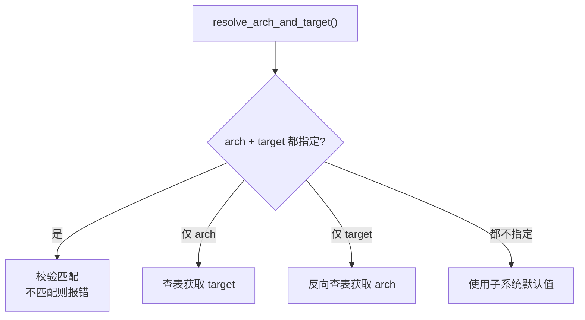
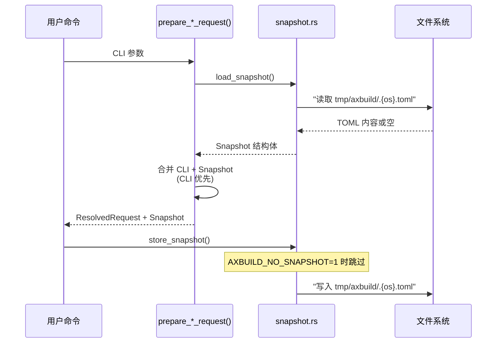
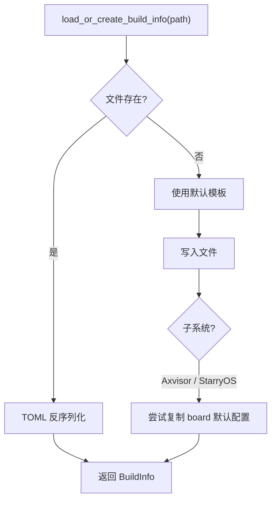
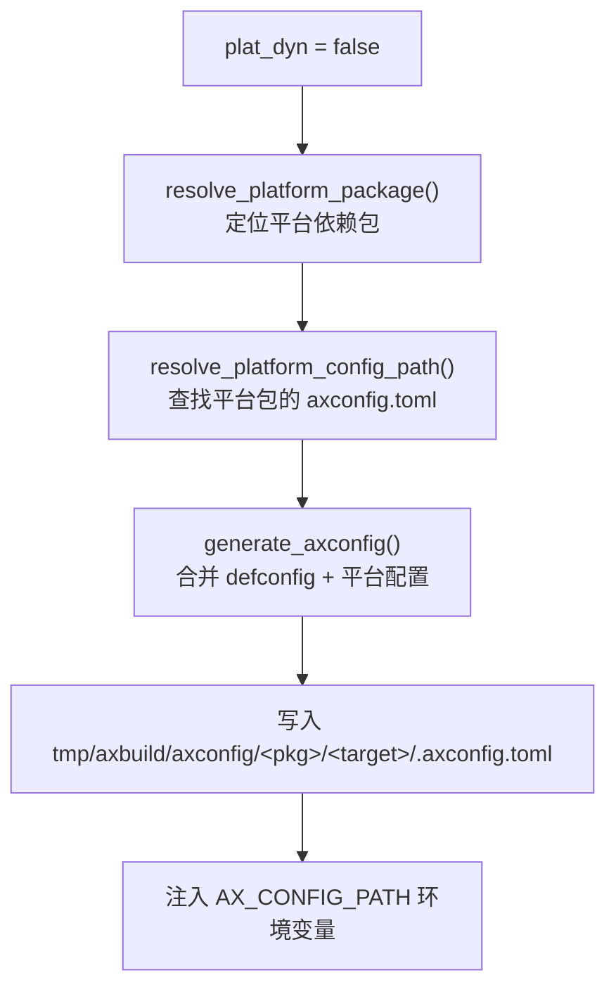

# 参数与配置

axbuild 管理三类配置文件，这三类配置文件按流水线顺序依次参与：Snapshot 为 CLI 提供参数回退 → Build Info 收敛构建参数 → axconfig 从平台包生成硬件配置供编译期使用。在构建管线的不同阶段生成和使用：

1. **Snapshot**（`tmp/axbuild/.{os}.toml`）—— 最近一次命令参数的持久化，使短命令可以复用之前的 `--arch`、`--package` 等参数
2. **Build Info**（`tmp/axbuild/config/<package>/build-<target>.toml`）—— 构建配置核心，描述 features、环境变量和平台行为
3. **axconfig**（`tmp/axbuild/axconfig/<package>/<target>/.axconfig.toml`）—— 编译期硬件配置，如内存布局、设备地址

此外，**Arch / Target 映射**是三类配置文件的共享基础，维护 arch ↔ target 的对应关系和子系统默认值。三套子系统共享这套配置框架，但各有自己的默认值和定制行为。所有配置逻辑集中在 `scripts/axbuild/src/context/` 和 `scripts/axbuild/src/build.rs` 中。

## Arch / Target 映射

`context/arch.rs` 维护统一的 arch ↔ target 映射表，三套子系统共享映射关系，但默认值不同。

TGOSKits 支持四种 CPU 架构，每种架构对应一个固定的 target triple。`context/arch.rs` 中的 `resolve_arch_and_target()` 函数负责处理用户通过 `--arch` 和 `--target` 传入的参数，确保两者一致或在只指定其一时自动补全另一个。这种设计使得用户可以用简短的 `--arch aarch64` 代替完整的 `--target aarch64-unknown-none-softfloat`。

### 映射表

| `--arch` | target triple | 说明 |
|----------|---------------|------|
| `aarch64` | `aarch64-unknown-none-softfloat` | ARM 64 位 |
| `x86_64` | `x86_64-unknown-none` | x86 64 位 |
| `riscv64` | `riscv64gc-unknown-none-elf` | RISC-V 64 位 |
| `loongarch64` | `loongarch64-unknown-none-softfloat` | 龙芯 64 位 |

### 解析规则

`resolve_arch_and_target()` 根据用户提供的参数组合选择对应的解析策略：



| 指定方式 | 行为 |
|----------|------|
| `--arch` + `--target` | 校验匹配，不匹配则报错 |
| 仅 `--arch` | 自动查找 target |
| 仅 `--target` | 自动反向查找 arch |
| 都不指定 | 使用子系统默认值 |

当用户同时提供 `--arch` 和 `--target` 时，系统会校验两者的映射关系，如果不匹配则立即报错，防止因参数不一致导致编译失败。四个分支中最常用的是"仅 `--arch`"和"都不指定"——前者允许用户快速切换架构，后者依赖 Snapshot 中保存的上次参数。

### 默认值

各子系统使用不同的默认架构，对应其最常用的开发和测试目标：

| 子系统 | 默认 arch | 默认 target |
|--------|-----------|-------------|
| ArceOS | `aarch64` | `aarch64-unknown-none-softfloat` |
| StarryOS | `riscv64` | `riscv64gc-unknown-none-elf` |
| Axvisor | `aarch64` | `aarch64-unknown-none-softfloat` |

### 特殊行为

除默认值差异外，各架构还有一些需要注意的特殊行为：

- **plat_dyn**：`aarch64` 和 `riscv64` 支持 `plat_dyn = true`（动态平台加载），其他架构使用静态平台绑定
- **to_bin**：`x86_64` 不使用 `--bin`（直接生成 ELF 即可），其余架构默认将 ELF 转为 raw binary
- **LoongArch QEMU**：运行 Axvisor loongarch64 时自动搜索 LVZ 版 QEMU（详见 [运行](./run#loongarch-特殊处理)）

### 扩展字段

`ArchSpec` 除了 arch ↔ target 映射外，还为每个架构定义了用于 rootfs 管理、StarryOS 默认平台和 C 测试交叉编译的扩展字段：

| 架构 | 默认 rootfs 镜像 | StarryOS 默认平台 | GNU 工具前缀 | qemu-user 二进制 |
|------|-----------------|------------------|-------------|-----------------|
| `aarch64` | `rootfs-aarch64-alpine.img` | 动态平台 | `aarch64-linux-musl` | `qemu-aarch64-static` |
| `x86_64` | `rootfs-x86_64-alpine.img` | `x86-pc` | `x86_64-linux-musl` | `qemu-x86_64-static` |
| `riscv64` | `rootfs-riscv64-alpine.img` | 动态平台 | `riscv64-linux-musl` | `qemu-riscv64-static` |
| `loongarch64` | `rootfs-loongarch64-alpine.img` | `loongarch64-qemu-virt` | `loongarch64-linux-musl` | `qemu-loongarch64-static` |

这些字段由 `CrossCompileSpec` 承载，被 StarryOS 和 Axvisor 的 C/Python 测试用例的 prebuild 环境和 CMake 交叉编译流程所使用。AArch64 和 RISC-V QEMU 默认不再绑定静态 StarryOS 平台，相关构建走动态平台路径。

## Snapshot

Snapshot 保存最近一次的参数状态，使短命令可以复用之前的 `--arch`、`--package` 等参数。

Snapshot 机制解决了一个常见的工作流痛点：用户首次执行 `cargo xtask arceos build --package arceos-httpserver --arch aarch64` 后，后续只需 `cargo xtask arceos qemu` 即可自动复用之前的 package 和 arch 设置，无需每次都重复输入完整参数。Snapshot 以 TOML 文件的形式存储在 `tmp/axbuild/` 目录下，每次成功执行命令后自动更新。

### 文件位置

| 子系统 | 文件 |
|--------|------|
| ArceOS | `tmp/axbuild/.arceos.toml` |
| StarryOS | `tmp/axbuild/.starry.toml` |
| Axvisor | `tmp/axbuild/.axvisor.toml` |

### 示例

典型的 ArceOS Snapshot 文件内容如下，包含 package 名称、架构和 QEMU/U-Boot 运行配置：

```toml
# tmp/axbuild/.arceos.toml
package = "arceos-httpserver"
arch = "aarch64"
target = "aarch64-unknown-none-softfloat"
plat_dyn = true

[qemu]
qemu_config = "test-suit/arceos/..."

[uboot]
uboot_config = "..."
```

### 读写时序

命令执行时 Snapshot 的加载与写回遵循严格的时序，确保 CLI 参数与持久化状态正确合并：



每次命令执行时，`resolve.rs` 先从文件系统加载 Snapshot，然后将 CLI 参数与 Snapshot 合并（CLI 显式指定的参数优先），最终得到完整的 `ResolvedRequest`。**合并后的参数在构建开始前即写回 Snapshot 文件**（而非构建成功后），由 `SnapshotPersistence` 控制是否写回。设置环境变量 `AXBUILD_NO_SNAPSHOT` 为任意非空且非 `0` 的值（如 `1`、`yes`、`true`）可跳过 Snapshot 的读写，在 CI 等需要每次使用默认参数的场景中很有用。

`SnapshotPersistence` 枚举控制是否写回：用户手动调用的命令使用 `Store`（保留参数供下次复用），测试套件使用 `Discard`（不污染用户的 Snapshot 文件）。

### 合并策略

CLI 参数与 Snapshot 的合并遵循"用户显式指定优先"原则：

| 参数 | 规则 |
|------|------|
| `package`、`arch`、`target` | CLI 优先，回退 snapshot |
| `smp`、`plat_dyn` | CLI 覆盖 snapshot |
| `qemu_config`、`uboot_config` | 仅完全继承 snapshot 时复用 |

`qemu_config` 和 `uboot_config` 的合并策略比较特殊：只有当用户完全没有提供相关参数，且 Snapshot 中有值时才复用，避免将测试场景的配置意外带入正常开发流程。

此外，`arch` 和 `target` 之间存在交叉抑制：当 CLI 指定了 `--arch` 时不会从 snapshot 继承 `target`（反之亦然），确保两者始终来自同一来源（CLI 或 snapshot），避免因 CLI 的 `--arch` 与 snapshot 的 `target` 不一致而产生错误组合。

### 子系统 Snapshot 差异

三套子系统的 Snapshot 结构因各自命令参数不同而存在差异：

| 子系统 | 独有字段 | 说明 |
|--------|---------|------|
| **ArceOS** | `package`（必填） | 每个包对应独立应用，必须显式指定；Snapshot 中的 `package` 自动复用 |
| **StarryOS** | `config` | Build Info 路径（使用 `--config` 指定或自动生成），Snapshot 保存最近使用的配置路径 |
| **Axvisor** | `config`、`axvisor_dir`（惰性初始化） | Axvisor 源码目录在首次访问时通过 `cargo metadata` 惰性定位并缓存 |

三者共享的字段：`arch`、`target`、`smp`（ArceOS/Axvisor 额外有 `plat_dyn`）。QEMU/U-Boot 运行时配置（`qemu_config`、`uboot_config`）在各自 Snapshot 的子结构中独立存储。

## Build Info

Build Info 是构建配置的核心数据结构，描述 features、环境变量和平台行为。

Build Info 是连接用户参数与 Cargo 构建的桥梁。它将散落在各处的配置（CLI 参数、Snapshot、子系统默认值、平台约定）收敛为一个统一的数据结构，最终被转换为 ostool 的 `Cargo` 配置执行编译。Build Info 以 TOML 文件的形式持久化到 `tmp/axbuild/config/` 目录，用户可以通过编辑该文件直接微调构建参数（如添加 features、修改环境变量），而无需修改源码。

### 文件位置

```text
tmp/axbuild/config/
└── <package>/build-<target>.toml
```

由 `default_build_info_path_in_workspace()` 生成路径。可通过 `--config` 覆盖。

首次构建时，系统会在上述路径创建默认的 Build Info 文件；后续构建直接读取该文件。用户可以直接编辑该文件来调整 features、环境变量等配置，修改会在下次构建时生效。

### BuildInfo

三套子系统共用 `BuildInfo` 作为核心配置类型：

```rust
pub struct BuildInfo {
    pub env: HashMap<String, String>,    // 构建时环境变量
    pub features: Vec<String>,           // Cargo features
    pub log: LogLevel,                   // 日志级别
    pub max_cpu_num: Option<usize>,      // SMP 核数
    pub axconfig_overrides: Vec<String>, // 配置值覆盖
    pub plat_dyn: bool,                  // 动态平台
}
```

子系统定制：
- **StarryOS**：强制 `plat_dyn = false`（StarryOS 不支持动态平台），默认 feature `["qemu"]`
- **Axvisor**：默认清空 features，从 board config 加载 VM 配置

### 默认值

新建 BuildInfo 时使用以下默认值：

| 字段 | 默认值 | 说明 |
|------|--------|------|
| `env` | `AX_IP=10.0.2.15`, `AX_GW=10.0.2.2` | QEMU slirp 网络默认地址 |
| `features` | `["ax-std"]` | 最小 feature 集 |
| `log` | `Warn` | 默认日志级别 |
| `max_cpu_num` | `None` | 不限制（单核） |
| `axconfig_overrides` | `[]` | 无覆盖 |
| `plat_dyn` | `true`（aarch64/riscv64）/ `false`（其他） | QEMU 动态平台架构新建时默认为 `true` |

### 验证规则

- `max_cpu_num`：值为 0 时报错（必须大于 0）
- `plat_dyn`：仅 `aarch64-*` 和 `riscv64*` target 真正支持，其他架构即使配置为 `true` 也会被 `supports_platform_dynamic()` 强制回退为 `false`

### Axvisor x86 虚拟化后端检测

Axvisor 在 x86_64 架构上需要虚拟化后端 support（Intel VMX 或 AMD SVM）。`axvisor/build/x86.rs` 中的 `normalize_backend_features()` 负责自动检测或验证：

1. **已显式指定**：若 features 中包含 `vmx` 或 `svm`，直接使用（两者同时存在则报错）
2. **未指定时自动检测**：通过 CPUID 读取宿主 CPU 厂商信息：
   - `GenuineIntel` → `vmx`
   - `AuthenticAMD` → `svm`
3. **环境变量覆盖**：设置 `AXVISOR_X86_BACKEND=vmx|intel|svm|amd` 跳过 CPUID 检测

### `axconfig_overrides` 用途

`axconfig_overrides` 字段允许用户通过 Build Info 覆盖平台配置生成时的特定值，格式为 `table.key=value`（如 `memory.size=0x8000000`）。在静态平台模式下（`plat_dyn = false`），`generate_axconfig()` 将这些覆盖值传入配置引擎的 `GenerateOptions.writes`，与平台包的默认配置规格合并后生成 `.axconfig.toml`。这使得用户无需修改平台源码即可微调内存布局、设备地址等编译期参数。

### 加载流程

`load_or_create_build_info()` 按以下逻辑获取或创建 Build Info 文件：



对于 Axvisor 和 StarryOS，当 Build Info 文件不存在时，`axbuild` 会尝试从各自的 board 配置目录（`os/axvisor/configs/board/` 或 `os/StarryOS/configs/board/`）复制与当前 target 匹配的默认板卡配置。这使得 `defconfig` 流程和首次构建都能直接获得可用的初始配置，无需用户手动编写。

### 环境变量注入

Build Info 的字段在编译时转换为以下环境变量：

| 环境变量 | 来源 | 说明 |
|----------|------|------|
| `AX_LOG` | `log` | 日志级别 |
| `SMP` | `max_cpu_num` | CPU 核数 |
| `AX_IP` / `AX_GW` | `env` | 网络 |
| `AX_CONFIG_PATH` | axbuild 生成 | 平台配置路径 |
| `AX_PLATFORM` | 平台检测 | 平台名 |
| `FEATURES` | 外部环境变量 | Makefile 兼容的 feature 注入（逗号/空格分隔） |
| `AX_ARCH` | arch 解析 | 架构名 |
| `AX_TARGET` | target 解析 | target triple |
| `AXVISOR_VM_CONFIGS` | `--vmconfigs` | VM 配置列表 |

这些环境变量在 Cargo 编译时通过 `--env` 传递，被 OS 源码中的 `env!()` 宏在编译期读取。其中 `AX_LOG` 控制日志过滤级别，`SMP` 决定系统启动的 CPU 核数，`AX_CONFIG_PATH` 指向由 `axbuild` 预生成的平台配置文件。各子系统还会额外注入自己的环境变量（如 Axvisor 的 `AXVISOR_VM_CONFIGS`）。

`FEATURES` 环境变量提供与传统 Makefile 工作流的兼容性：`makefile_features_from_env()` 解析逗号/空格分隔的 feature 列表，自动添加前缀族前缀后合并到 BuildInfo。

---

## axconfig 平台配置

axconfig 是 OS 的**编译期硬件配置文件**（`.axconfig.toml`），由 axbuild 在构建前自动生成。它描述了目标平台的所有硬件参数（内存布局、串口地址、中断控制器地址、VirtIO 设备范围等），OS 源码通过 `include!(concat!(env!("AX_CONFIG_PATH")))` 在编译期读取这些配置值。

### 生成时机

axconfig 仅在**静态平台模式**（`plat_dyn = false`）下生成。动态平台模式下，硬件配置由运行时动态加载，无需预生成文件。三套子系统对 axconfig 的使用方式不同：

| 子系统 | 默认 plat_dyn | 是否生成 axconfig |
|--------|-------------|-----------------|
| ArceOS | `true`（aarch64/riscv64）/ `false`（其他） | 仅 `plat_dyn = false` 时 |
| StarryOS | `false` | 始终生成 |
| Axvisor | `true`（aarch64/riscv64）/ `false`（其他） | 仅 `plat_dyn = false` 时 |

### 生成流程



生成步骤：

1. **定位平台包**：从目标包的 `Cargo.toml` 依赖中查找名称匹配 `ax-plat-*` 的平台包（如 `ax-plat-riscv64-sg2002`）
2. **查找配置规格**：在平台包的 `Cargo.toml` 同目录下查找 `axconfig.toml` 配置规格文件
3. **合并生成**：调用 `ax_config_gen` 配置引擎，将全局 `defconfig.toml`（`os/arceos/configs/defconfig.toml`）与平台 `axconfig.toml` 合并，同时注入自动生成的字段和用户覆盖值
4. **写入产物**：输出到 `tmp/axbuild/axconfig/<package>/<target>/.axconfig.toml`
5. **注入环境变量**：将 `AX_CONFIG_PATH`（配置文件路径）和 `AX_PLATFORM`（平台名）写入 Build Info 的环境变量

### 配置来源

`.axconfig.toml` 的内容由三层配置合并而成：

| 来源 | 路径 | 说明 |
|------|------|------|
| **defconfig** | `os/arceos/configs/defconfig.toml` | 全局默认值（如 `task-stack-size`、`ticks-per-sec`） |
| **平台配置** | 平台包目录下的 `axconfig.toml` | 平台特有值（如 `uart-paddr`、`mmio-ranges`、`virtio-mmio-ranges`） |
| **覆盖值** | Build Info 的 `axconfig_overrides` | 用户自定义覆盖（格式：`table.key=value`） |

自动注入的字段（不来自配置文件）：

| 字段 | 值 |
|------|-----|
| `arch` | 从 target triple 提取的架构名 |
| `platforms` | 平台包名（如 `riscv64-sg2002`） |
| `plat.max-cpu-num` | `--smp` 参数值（仅 `max_cpu_num > 1` 时注入） |

### 配置内容示例

以下是一个 RISC-V 静态板级平台的 `.axconfig.toml` 生成产物示例：

```toml
arch = "riscv64"
platform = "riscv64-sg2002"
task-stack-size = 0x40000
ticks-per-sec = 100

[devices]
mmio-ranges = [[0x0010_1000, 0x1000], [0x0c00_0000, 0x21_0000], ...]
plic-paddr = 0x0c00_0000
uart-paddr = 0x1000_0000
uart-irq = 0x0a
virtio-mmio-ranges = [[0x1000_1000, 0x1000], ...]
```

### 配置发现路径

`resolve_platform_config_path()` 按以下顺序查找平台配置：

1. 包在 workspace `Cargo.toml` 中的 manifest 路径旁查找 `axconfig.toml`
2. `platforms/<platform-dir>/axconfig.toml`（组件目录约定）
3. 在完整依赖元数据中重新查找（支持平台包位于 workspace 外部的场景）

如果所有路径都未找到配置文件，构建会报错终止，提示用户确保平台包包含 `axconfig.toml`。

---

## 环境变量速查表

axbuild 在编译期和运行时使用多个环境变量，分布在配置、运行和测试各阶段。下表按类别汇总所有环境变量。

### 编译期注入

这些环境变量在 Cargo 编译时通过 `--env` 传递，被 OS 源码中的 `env!()` 宏在编译期读取。

| 变量 | 来源 | 说明 |
|------|------|------|
| `AX_LOG` | `BuildInfo.log` | 日志过滤级别 |
| `SMP` | `BuildInfo.max_cpu_num` | 启动 CPU 核数 |
| `AX_IP` / `AX_GW` | `BuildInfo.env` | QEMU slirp 网络 IP / 网关 |
| `AX_CONFIG_PATH` | axbuild 生成 | `.axconfig.toml` 路径（仅 `plat_dyn = false`） |
| `AX_PLATFORM` | 平台检测 | 平台名（如 `riscv64-sg2002`；动态平台构建通常不设置） |
| `AX_ARCH` | arch 解析 | CPU 架构名 |
| `AX_TARGET` | target 解析 | target triple |
| `AXVISOR_VM_CONFIGS` | `--vmconfigs` | VM 配置文件列表（仅 Axvisor） |
| `FEATURES` | 外部环境变量 | Makefile 兼容 feature 注入（逗号/空格分隔） |

### 运行时行为控制

| 变量 | 默认值 | 说明 |
|------|--------|------|
| `AXBUILD_NO_SNAPSHOT` | — | 设为任意非空且非 `0` 的值（如 `1`）禁用 Snapshot 读写（CI 场景），跳过加载和写回 |
| `AXBUILD_QEMU_SYSTEM_LOONGARCH64` | — | 指定 LVZ 扩展版 QEMU 可执行文件路径（仅 Axvisor loongarch64） |
| `AXBUILD_QEMU_DIR` | — | 指定 LVZ 扩展版 QEMU 所在目录（仅 Axvisor loongarch64） |
| `AXBUILD_TEST_TIMEOUT_SCALE` | `1.0` | 线性缩放所有测试用例超时值（CI 慢环境） |
| `STARRY_APK_REGION` | `china` | StarryOS APK 镜像源区域：`china`/`cn`（`mirrors.cernet.edu.cn`）或 `us`/`usa`（`dl-cdn.alpinelinux.org`） |
| `AXVISOR_IMAGE_LOCAL_STORAGE` | `$TMPDIR/.axvisor-images` | Axvisor Guest 镜像本地存储路径 |
