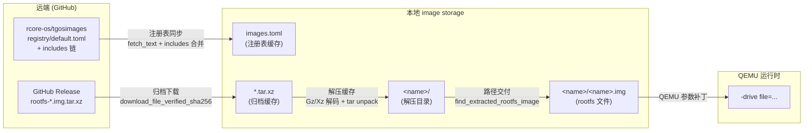
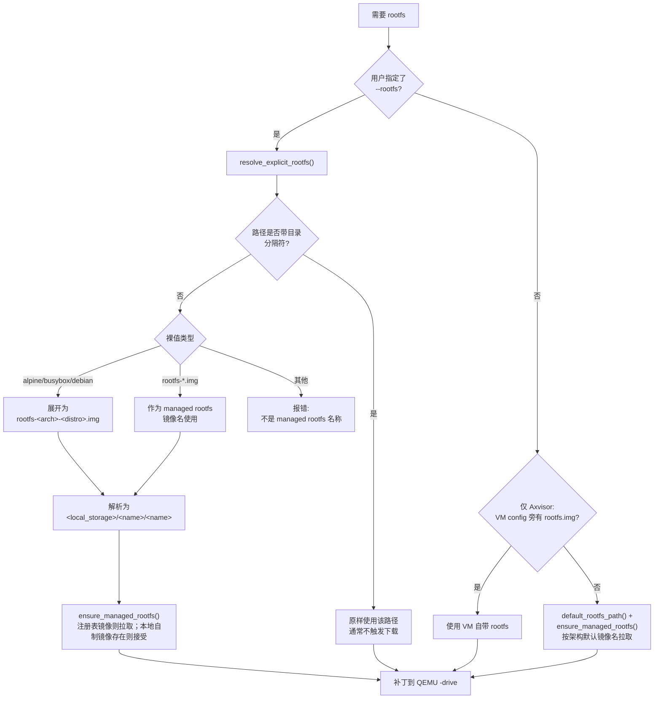
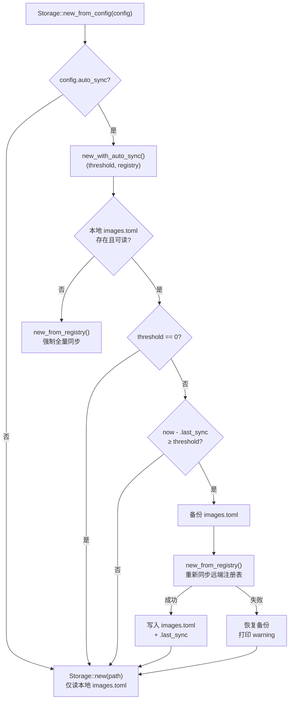
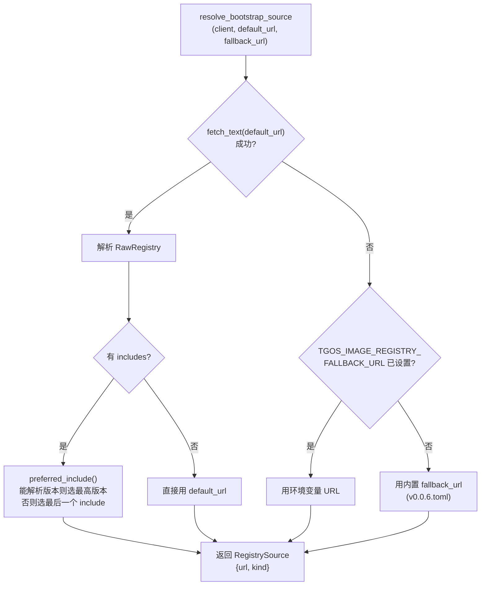
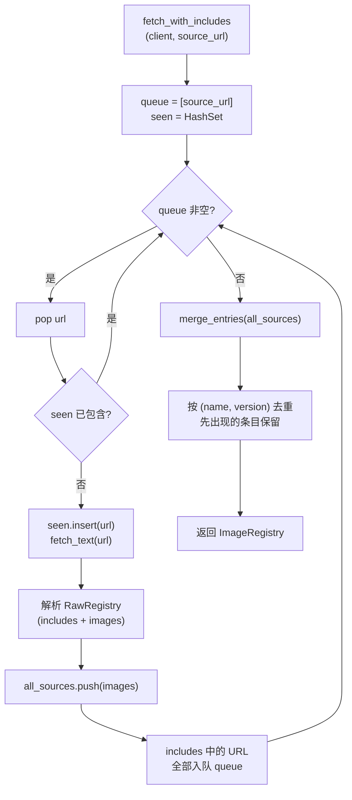
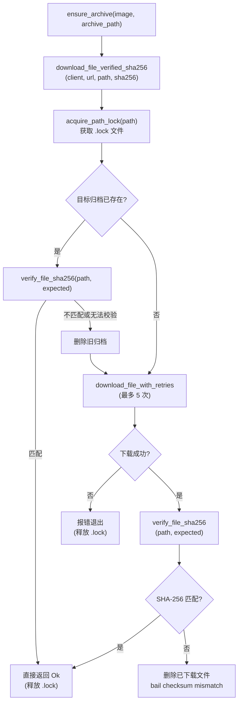
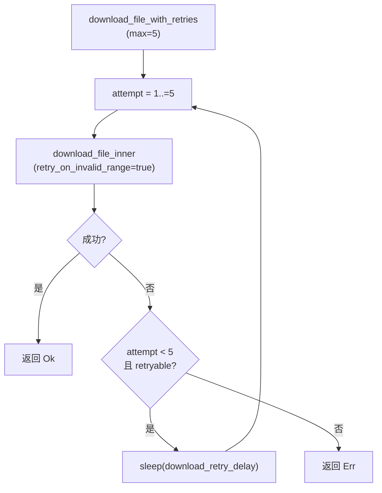
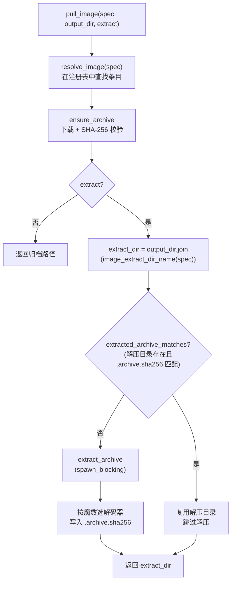

# 镜像管理

`cargo xtask image` 是 TGOSKits 统一的镜像管理命令，负责 rootfs 镜像、initramfs 和 Guest 镜像包的发现、拉取、校验、解压和扩容。它不是单独的下载脚本，而是 ArceOS、StarryOS、Axvisor 的 QEMU 运行和测试流程共同依赖的镜像基础设施：需要镜像时，axbuild 先从本地或远端注册表取得镜像元数据，将归档下载到本地 image storage 并校验 SHA-256，按需解压后把实际 `.img` 路径注入 QEMU 配置。

## 架构概览

镜像管理的数据流贯穿远端注册表、本地缓存和 QEMU 运行时三个层面。理解这条数据流有助于定位下载失败、缓存失效或路径不匹配等问题。



这些阶段各自有缓存或有效性判断，避免重复网络请求和解压：

| 阶段 | 输入 | 输出 | 缓存判断 |
|------|------|------|---------|
| 注册表同步 | `default.toml` + includes | 本地 `images.toml` | `.last_sync` 时间戳是否超期 |
| 归档下载 | Release URL | `*.tar.xz` 归档文件 | 归档是否存在且 SHA-256 匹配 |
| 解压缓存 | `*.tar.xz` 归档 | `<name>/` 解压目录 | `.archive.sha256` 标记是否与注册表一致 |
| 路径交付 | 解压目录 | `<name>/<name>.img` | 在解压目录中递归查找同名 rootfs 文件 |

源码分布：

| 代码位置 | 作用 |
|----------|------|
| `scripts/axbuild/src/image.rs` | CLI 入口与子命令分发 |
| `scripts/axbuild/src/image/config.rs` | 默认注册表 URL、本地存储路径与配置读写 |
| `scripts/axbuild/src/image/registry.rs` | 远端注册表解析、includes 递归合并与镜像查找 |
| `scripts/axbuild/src/image/storage.rs` | `Storage` 抽象：缓存、下载、解压与 rootfs 路径解析 |
| `scripts/axbuild/src/image/spec.rs` | `ImageSpec` / `ImageSpecRef`：`name:version` 解析 |
| `scripts/axbuild/src/support/download.rs` | 断点续传、重试退避、并发锁与 SHA-256 校验 |
| `scripts/axbuild/src/rootfs/resize.rs` | ext rootfs 镜像扩容（`e2fsck` + `resize2fs`） |

## 镜像仓库

### 远端注册表

TGOSKits 不在本仓库保存 rootfs 大文件。远端镜像由 [rcore-os/tgosimages](https://github.com/rcore-os/tgosimages) 维护，入口注册表写在 `ImageConfig` 默认值中：

```text
https://raw.githubusercontent.com/rcore-os/tgosimages/refs/heads/main/registry/default.toml
```

当前 `default.toml` 只保存 includes，指向版本化注册表，例如：

```toml
[[includes]]
url = "https://raw.githubusercontent.com/rcore-os/tgosimages/refs/heads/main/registry/v0.0.6.toml"
```

版本化注册表中的每个 `[[images]]` 条目才是实际镜像元数据。rootfs 的远端归档通常位于 GitHub Release，例如：

```toml
[[images]]
name = "rootfs-riscv64-alpine.img"
version = "0.0.6"
description = "Alpine rootfs image for riscv64"
sha256 = "32741d425ffb817aa3a63d639af6accd2a560b2c13c36516c3e1fd0fa77c60e8"
arch = "riscv64"
url = "https://github.com/rcore-os/tgosimages/releases/download/v0.0.6/rootfs-riscv64-alpine.img.tar.xz"
released_at = "2026-04-27T03:13:58Z"
```

注意两个版本字符串的区别：Release tag 带 `v`，镜像条目的 `version` 当前不带 `v`。因此显式指定版本时使用 `rootfs-riscv64-alpine.img:0.0.6`。

### 本地存储

默认本地存储根目录是 `<workspace>/tmp/axbuild/rootfs`。第一次读取配置时，`ImageConfig::read_config()` 会在 `<workspace>/tmp/axbuild/.image.toml` 生成配置文件，默认内容等价于：

```toml
local_storage = "<workspace>/tmp/axbuild/rootfs"
registry = "https://raw.githubusercontent.com/rcore-os/tgosimages/refs/heads/main/registry/default.toml"
auto_sync = true
auto_sync_threshold = 604800
```

修改本地存储位置的三种方式（优先级从低到高）：

| 方式 | 示例 |
|------|------|
| 修改 `tmp/axbuild/.image.toml` | `local_storage = "/data/tgos-images"` |
| 环境变量 | `TGOS_IMAGE_LOCAL_STORAGE=/data/tgos-images cargo xtask image ls` |
| 命令行参数 | `cargo xtask image -S /data/tgos-images pull --arch riscv64` |

本地存储目录同时保存注册表缓存、下载归档和解压结果：

```text
tmp/axbuild/rootfs/
├── images.toml                               # 合并后的注册表缓存
├── .last_sync                                # 上次同步的 Unix 时间戳
├── rootfs-riscv64-alpine.img.tar.xz          # 下载的归档缓存
├── rootfs-riscv64-alpine.img.tar.xz.part     # 未完成下载的临时文件（断点续传）
├── rootfs-riscv64-alpine.img.tar.xz.lock     # 下载并发锁
├── rootfs-riscv64-alpine.img/                # 解压目录
│   ├── .archive.sha256                       # 解压标记（归档 SHA-256）
│   └── rootfs-riscv64-alpine.img             # QEMU 最终使用的 rootfs 文件
└── qemu-aarch64/                             # 非 rootfs 镜像的解压目录
    └── ...
```

## Rootfs 镜像

### 默认镜像映射

默认 managed rootfs 由 `scripts/axbuild/src/context/arch.rs` 的 `ARCH_SPECS` 定义：

| 架构 | 默认 rootfs 名称 |
|------|------------------|
| `aarch64` | `rootfs-aarch64-alpine.img` |
| `x86_64` | `rootfs-x86_64-alpine.img` |
| `riscv64` | `rootfs-riscv64-alpine.img` |
| `loongarch64` | `rootfs-loongarch64-alpine.img` |

### 子系统中的使用方式

StarryOS 的常规 QEMU 路径会自动准备默认 rootfs：

```bash
cargo xtask starry qemu --arch riscv64
```

也可以显式准备并打印 rootfs 路径：

```bash
cargo xtask starry rootfs --arch riscv64
```

显式传入 rootfs 时，`alpine`、`busybox`、`debian` 这类裸关键字会展开成 managed rootfs 名称；`rootfs-*.img` 形式的裸文件名会解析到本地 image storage 下的 managed rootfs 路径；带目录的路径通常视为用户自己管理的镜像：

```bash
cargo xtask starry qemu --arch riscv64 --rootfs alpine
cargo xtask arceos qemu --arch x86_64 --rootfs /path/to/custom.img
cargo xtask axvisor qemu --arch aarch64 --rootfs rootfs-aarch64-debian.img
```

实际传给 QEMU 的路径形如：

```text
tmp/axbuild/rootfs/rootfs-riscv64-alpine.img/rootfs-riscv64-alpine.img
```

### 选择策略

各子系统在 QEMU 运行前大致通过以下规则确定 rootfs 路径：



`resolve_rootfs_path()` 判断裸值的逻辑：检查路径的 `parent()` 是否为空。`alpine`、`busybox`、`debian` 会被展开为 `rootfs-<arch>-<distro>.img`；其他裸字符串会作为 managed rootfs 镜像名处理，并且必须满足 `rootfs-*.img` 命名约束；含目录分隔符的路径（如 `/path/to/custom.img`）原样返回。后续是否下载由 `ensure_managed_rootfs()` 决定：只有解析到 `local_storage` 或历史 `tmp/axbuild/rootfs` 下的 managed 路径时才会尝试从注册表拉取。

checked-in QEMU config 中如果还写着历史路径 `tmp/axbuild/rootfs/rootfs-*.img`，`resolve_managed_rootfs_path()` 会把它当作 managed rootfs 引用，解析到当前 image storage 下的解压后 `.img`。

Axvisor 还有一条特殊路径：如果 VM config 的 `kernel.kernel_path` 旁边已经存在 `rootfs.img`，Axvisor 会优先使用这个 VM 自带 rootfs；否则才使用架构默认 managed rootfs。

## 拉取机制

### 注册表同步

`Storage::new_from_config()` 是 `image ls`、`image pull` 和 managed rootfs 准备路径的统一入口。`image check` 和 `image resize` 只处理本地文件，不创建 `Storage`。创建 `Storage` 时会根据 `ImageConfig` 决定是否触发远端同步：



启用 `auto_sync` 时，触发同步的条件是：

| 条件 | 来源 |
|------|------|
| 本地 `images.toml` 不存在或解析失败 | `Storage::new()` 返回 `Err` |
| `auto_sync_threshold > 0` 且 `.last_sync` 超期 | 时间戳比较 |

当 `auto_sync = false` 时，`Storage::new_from_config()` 只读取本地 `images.toml`，不会访问远端；如果本地注册表不存在或损坏，会直接报错。`auto_sync_threshold = 0` 只跳过过期检查：如果本地 `images.toml` 不存在或不可读，仍会先同步一次。

`new_from_registry()` 执行实际的远端同步，分两步：**引导**（`resolve_bootstrap_source`）确定从哪个 URL 开始读取，**递归合并**（`fetch_with_includes`）收集所有层级的镜像条目。

**引导流程**（`resolve_bootstrap_source`）：



`preferred_include()` 通过字符串拆分解析 include URL 末尾的 `v<major>.<minor>.<patch>.toml`，按三段数字元组选最高版本。若所有 URL 都不符合格式，则取 includes 列表最后一个。

**递归合并**（`fetch_with_includes`）：



`merge_entries` 按 `(name, version)` 元组去重，**先出现的条目优先保留**（`HashMap::or_insert` 语义）。由于 BFS 从 bootstrap URL 开始，bootstrap 中的条目优先级高于其 includes 中的条目。合并结果序列化为 `images.toml` 写入本地存储。

### 镜像查找

注册表合并完成后，`ImageRegistry::find()` 按 `ImageSpec` 查找：

| spec.version | 查找行为 |
|--------------|---------|
| `Some(version)` | 精确匹配 `(name, version)`，找不到返回 `None` |
| `None` | 过滤所有同名条目，按 `released_at` 选最新（`None` 视为最旧） |

因此 `cargo xtask image pull rootfs-riscv64-alpine.img`（省略版本）会自动拉取该镜像发布时间最新的版本。

### 归档下载与校验

归档下载由 `download_file_verified_sha256()` 负责，在 `download_file_with_retries()` 之上增加一层 SHA-256 校验：



重试逻辑（`download_file_with_retries`）：



**可重试错误**（`retryable_download_error`）：

| 错误类型 | 是否重试 |
|----------|---------|
| HTTP 429 Too Many Requests | 是 |
| HTTP 5xx Server Error | 是 |
| 连接错误（`is_connect`） | 是 |
| 超时（`is_timeout`） | 是 |
| 请求/Body 错误（`is_request`/`is_body`） | 是 |
| HTTP 4xx（非 429） | 否 |
| 其他非 HTTP 错误 | 否 |

**退避延迟**（`download_retry_delay`）：`DOWNLOAD_RETRY_BASE_DELAY * 2^(attempt-1)`，指数上限 `2^3 = 8` 倍。生产环境基数为 2 秒，5 次尝试的退避依次为：2s → 4s → 8s → 16s（第 5 次失败后不等待直接报错）。

**断点续传**（`download_file_inner`）：

| 场景 | 行为 |
|------|------|
| 目标归档已存在且完整 | 直接返回（由上层 SHA-256 校验确认） |
| 存在 `.part` 文件 | 发送 `Range: bytes={size}-` 请求剩余部分，追加写入 |
| 服务器返回 206 Partial Content | 追加写入 `.part` |
| 服务器返回 200 OK（不支持 Range） | 从头覆盖写入 `.part` |
| 服务器返回 416 Range Not Satisfiable | 删除 `.part`，去掉 Range 头重试一次 |
| 下载完成 | `rename .part → 最终路径` |

**并发文件锁**（`acquire_path_lock`）：

| 机制 | 说明 |
|------|------|
| 锁文件 | `<archive>.lock`，原子创建（`create_new(true)`），写入 `pid=<PID>` |
| 轮询间隔 | 100ms（`DOWNLOAD_LOCK_WAIT`） |
| 过期时间 | 2 小时（`DOWNLOAD_LOCK_STALE_AFTER`） |
| 孤儿锁回收 | 读取 PID，通过 `/proc/<pid>` 检查进程是否存活（仅 Unix） |
| 过期锁回收 | 检查锁文件 mtime，超过 2 小时自动清理 |
| RAII 释放 | `PathLock` 的 `Drop` 实现删除锁文件 |

归档文件名（`image_archive_filename`）优先取 URL 最后一段（`archive_filename_from_url`）；如果 URL 没有可用文件名，才回退到 `<name>.tar.gz` 或 `<name>-<version>.tar.gz`。

### 解压缓存

`pull_image()` 下载并校验归档后，根据 `extract` 参数决定是否解压：



解压目录名（`image_extract_dir_name`）：

| spec.version | 解压目录名 |
|--------------|-----------|
| `None` | `<name>`（如 `rootfs-riscv64-alpine.img`） |
| `Some(version)` | `<name>-<version>`（如 `rootfs-riscv64-alpine.img-0.0.6`） |

解压过程（`extract_archive`，在 `spawn_blocking` 线程中执行）：

1. 如果解压目录已存在，先 `remove_dir_all` 清空
2. 读取归档前 6 字节魔数判断格式：
   - `[0x1f, 0x8b]` → `GzDecoder`（`.tar.gz`）
   - `[0xfd, b'7', b'z', b'X', b'Z', 0x00]` → `XzDecoder`（`.tar.xz`）
   - 其他 → 普通 `tar::Archive`（无压缩）
3. `tar::Archive::unpack` 解压到目录
4. 写入 `.archive.sha256` 标记文件，内容为归档的 SHA-256

下次拉取同一镜像时，`extracted_archive_matches()` 比对 `.archive.sha256` 与注册表中的 `sha256`，一致则跳过解压。

对于 managed rootfs，`pull_rootfs_image()` 在解压后额外调用 `find_extracted_rootfs_image()`：在解压目录中递归搜索与镜像同名的 `.img` 文件（处理归档内部可能有多层目录的情况），返回该文件的完整路径。

## 命令参考

### 列出镜像

```bash
cargo xtask image ls
cargo xtask image ls rootfs
cargo xtask image ls -v 'rootfs-.*-alpine'
```

`ls` 默认按镜像名聚合版本；`-v` 显示每个版本的架构和描述。过滤参数能编译成正则时按正则匹配，否则按子串匹配。

### 拉取默认 rootfs

```bash
cargo xtask image pull --arch riscv64
```

`--arch` 会拉取该架构默认 managed rootfs，并打印最终 `.img` 路径。这个模式不允许 `--output-dir` 或 `--no-extract`，因为它必须落在 image storage 中供 OS 流程复用。

### 拉取指定镜像

```bash
cargo xtask image pull rootfs-riscv64-alpine.img
cargo xtask image pull rootfs-riscv64-alpine.img:0.0.6
cargo xtask image pull qemu-aarch64
```

省略版本时，`ImageRegistry::find()` 会按 `released_at` 选择最新条目。

当显式镜像名没有配合 `--output-dir` 或 `--no-extract` 使用时，CLI 会先尝试把它作为 managed rootfs 拉取并返回最终 `.img` 文件；如果它不是 `rootfs-*.img`，或者解压目录里找不到同名 rootfs 文件，才退回 generic image 拉取并返回解压目录。

### 只下载归档

```bash
cargo xtask image pull rootfs-riscv64-alpine.img --no-extract
```

只保存 `.tar.xz` / `.tar.gz` 归档，不创建解压目录。该选项只适用于显式镜像名，不适用于 `--arch`。

### 解压到指定目录

```bash
cargo xtask image pull qemu-aarch64 -o /tmp/tgos-qemu-aarch64
```

`-o/--output-dir` 只适用于显式镜像名。归档和解压目录都会放到指定目录下，而不是默认 image storage。

### 校验本地镜像

```bash
cargo xtask image check tmp/axbuild/rootfs/rootfs-riscv64-alpine.img/rootfs-riscv64-alpine.img
cargo xtask image check /path/to/rootfs.img --sha256 <expected-sha256>
```

不传 `--sha256` 时只打印本地文件 SHA-256；传入期望值时不匹配会返回非零退出码。

### 扩容 rootfs

```bash
cargo xtask image resize tmp/axbuild/rootfs/rootfs-riscv64-alpine.img/rootfs-riscv64-alpine.img --size-mib 2048
cargo xtask image resize rootfs.img --size-mib 4096 -o rootfs-4g.img
```

`resize` 只支持 ext2/3/4 镜像扩容，不支持缩容。实现会先调整文件大小，再运行 `e2fsck -fy` 和 `resize2fs`。如系统没有可直接调用的工具，可通过 `E2FSCK` 和 `RESIZE2FS` 环境变量指定路径。

## 子系统集成

`image/storage.rs` 暴露以下函数供 ArceOS、StarryOS、Axvisor 的构建和运行流程调用。用户通常不直接使用这些函数，而是通过 `cargo xtask <os> qemu/test` 间接触发：

| 函数 | 签名 | 调用方 | 行为 |
|------|------|--------|------|
| `ensure_rootfs_for_arch` | `(workspace, arch) -> PathBuf` | StarryOS `rootfs` 命令、Starry app rootfs 准备 | 按架构默认镜像名拉取并返回 `.img` 路径 |
| `ensure_managed_rootfs` | `(workspace, arch, path) -> ()` | QEMU 配置引用了 managed 路径时 | 解析路径为镜像名后拉取；非注册表镜像但本地已存在则跳过 |
| `ensure_optional_managed_rootfs` | `(workspace, arch, path?) -> ()` | Starry QEMU run/test、Axvisor QEMU run | 若 path 为 managed 路径则调用 `ensure_managed_rootfs`；传入 None 则跳过 |
| `pull_rootfs_image` | `(spec) -> PathBuf` | `image pull --arch`、`ensure_rootfs_for_arch`、`ensure_managed_rootfs` | 显式按 spec 拉取，校验名称符合 `rootfs-*.img`，返回解压后 `.img` 路径 |
| `resolve_explicit_rootfs` | `(workspace, arch, rootfs) -> PathBuf` | `--rootfs` 显式参数 | 解析裸关键词后复用 managed 流程，含目录的路径原样返回 |
| `resolve_rootfs_path` | `(workspace, arch, rootfs) -> PathBuf` | 同上（底层实现） | 带目录的路径原样返回；裸值解析为 managed rootfs storage 路径 |
| `resolve_managed_rootfs_path` | `(workspace, path) -> Option<PathBuf>` | QEMU 配置中的 managed rootfs 路径验证 | 将 `tmp/axbuild/rootfs/` 或 `local_storage` 下的路径映射到实际解压位置 |
| `default_rootfs_path` | `(workspace, arch) -> PathBuf` | 计算默认 managed 路径（不触发下载） | 返回 `<local_storage>/<name>/<name>` 但不拉取 |
| `rootfs_dir` | `(workspace) -> Result<PathBuf>` | 路径判断 | 返回 `ImageConfig.local_storage` |

`ensure_managed_rootfs` 的特殊行为：如果一个 managed rootfs 路径对应的镜像名不在注册表中，但本地文件已存在（例如由 StarryOS app 的 `prebuild.sh` 在宿主端自行烘焙的 rootfs），函数会直接接受该文件而不报错。这使得 app 自定义 rootfs 和注册表 rootfs 可以共存于同一存储目录。

## 环境变量与配置

### 环境变量

| 变量 | 默认值 | 说明 |
|------|--------|------|
| `TGOS_IMAGE_LOCAL_STORAGE` | 未设置 | 镜像本地存储根路径（设置后覆盖 `ImageConfig.local_storage`；未设置时使用配置文件中的路径） |
| `TGOS_IMAGE_REGISTRY_FALLBACK_URL` | `.../rcore-os/tgosimages/.../v0.0.6.toml` | 注册表 fallback URL（当 `default.toml` 拉取失败时使用） |
| `E2FSCK` | — | `image resize` 使用的 `e2fsck` 可执行文件路径 |
| `RESIZE2FS` | — | `image resize` 使用的 `resize2fs` 可执行文件路径 |

### 命令行全局选项

| 选项 | 说明 |
|------|------|
| `-S/--local-storage <PATH>` | 本地存储路径（最高优先级） |
| `-R/--registry <URL>` | 远端注册表 URL（覆盖配置文件中的 `registry`） |
| `-N/--no-auto-sync` | 禁用注册表自动同步（设置后输出 `auto_sync = false`） |
| `--auto-sync-threshold <SECS>` | 自动同步过期阈值秒数（覆盖配置文件中的值） |

### 配置示例

使用自定义 registry：

```bash
cargo xtask image -R https://example.com/registry/default.toml ls
```

使用持久化共享缓存：

```bash
TGOS_IMAGE_LOCAL_STORAGE=/data/tgos-images cargo xtask starry qemu --arch riscv64
```

离线或内网环境中复用已有本地 registry：

```bash
cargo xtask image -N ls
cargo xtask image --auto-sync-threshold 0 pull --arch riscv64
```

修改 fallback registry：

```bash
TGOS_IMAGE_REGISTRY_FALLBACK_URL=https://mirror.example.com/tgosimages/registry/v0.0.6.toml \
  cargo xtask image ls
```

## 故障排查

### 确认 rootfs 实际路径

```bash
cargo xtask starry rootfs --arch riscv64
```

输出的 `rootfs ready at ...` 就是 QEMU 使用的 `.img` 文件路径。

### 强制重新下载

删除本地归档后重新拉取：

```bash
rm tmp/axbuild/rootfs/rootfs-riscv64-alpine.img.tar.xz
cargo xtask image pull --arch riscv64
```

如果怀疑解压目录过期或被手工改坏，删除解压目录：

```bash
rm -rf tmp/axbuild/rootfs/rootfs-riscv64-alpine.img
cargo xtask image pull --arch riscv64
```

### 刷新注册表

删除本地注册表缓存，或把同步阈值设成很小：

```bash
rm tmp/axbuild/rootfs/images.toml tmp/axbuild/rootfs/.last_sync
cargo xtask image ls
```

### 下载中断恢复

一般不需要手工处理。下次执行 `image pull` 时会复用 `.part` 断点续传；如果服务器不支持续传，会自动从头下载。如果 `.lock` 是异常退出留下的，进程不存在或超过 2 小时后会自动清理。
