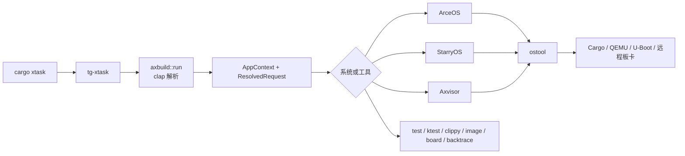

# axbuild 概述

`scripts/axbuild` 是 TGOSKits 的统一构建、运行和测试引擎。用户通过 `cargo xtask` 选择 ArceOS、StarryOS 或 Axvisor，axbuild 负责解析请求、装配 Cargo/ostool 配置、准备镜像和测试资产，再调用 ostool 执行 Cargo、QEMU、U-Boot 或远程板卡流程。

它不是简单的 shell 命令集合。当前实现将“构建什么”“启用什么能力”“如何启动”“如何验证”拆成独立契约，从而使命令行、板卡配置和测试用例能够复用同一执行路径。

## 1. 命令执行链

从 `cargo xtask` 到运行器的边界决定了配置由谁消费：`tg-xtask` 只转发 CLI，`AppContext` 解析请求，而各系统模块把已解析的请求交给 ostool。下图展示这个依赖方向，便于定位参数是在解析、构建还是运行阶段生效。



`xtask/src/main.rs` 只负责进入 `axbuild::run()` 并映射退出状态。命令定义位于 `scripts/axbuild/src/lib.rs`，三套系统的执行入口分别位于 `arceos/mod.rs`、`starry/mod.rs` 和 `axvisor/mod.rs`。

## 2. 配置职责

### 2.1 构建能力

共享 `BuildInfo` 包含 `features`、`log`、`max_cpu_num` 和 `[env]`。板卡 build config 可以再携带 target、package 或 VM 配置，但 QEMU machine、CPU、firmware 和设备不属于这里。

### 2.2 启动语义

选中的 `qemu-*.toml` 定义 arch 相关参数、CPU flags、firmware、UEFI 和 ELF/BIN 启动格式。`test/qemu/boot.rs` 只追加 SMP、timeout 和 drive snapshot 等显式测试控制。

### 2.3 特性所有权

`BuildInfo::validate_features()` 验证 feature 名称，`into_prepared_base_cargo_config_with_metadata()` 再根据应用与 `ax-std` 的 Cargo metadata 分发 feature。SMP、驱动、文件系统和虚拟化后端均由 Build Config 中的显式 feature 决定。

### 2.4 构建产物

共享 Cargo 配置以 `to_bin = false` 创建 ELF 产物；QEMU、U-Boot 和板卡运行器根据自身配置在启动阶段选择 ELF 或准备 BIN。

### 2.5 请求复用

`tmp/axbuild/.{arceos,starry,axvisor}.toml` 保存最近使用的 arch、target、config 和运行路径。`context/resolve.rs` 将 CLI 选择器、配置选择器和 Snapshot 按请求类型合并，并在 arch/target 切换时重新解析对应映射。

完整规则见 [参数与配置](./configuration)。

## 3. 源码分层

源码目录按请求解析、构建装配、系统流程和通用运行基础设施分层。维护时应优先修改拥有该契约的层，而不是在调用方重复补丁。

```text
scripts/axbuild/src/
├── lib.rs                 # 顶层 CLI 与命令分派
├── context/               # arch/target、workspace、Snapshot、请求解析
├── build/                 # BuildInfo、feature 验证、std PIE target/linker
├── arceos/                # app/C app 构建、运行与测试
├── starry/                # 内核、rootfs、app、perf、kmod 与测试
├── axvisor/               # hypervisor、VM 配置、rootfs 与测试
├── test/                  # 三系统共享的 case、QEMU、资产构建基础设施
├── rootfs/                # rootfs 注入、扩容、QEMU drive 补丁
├── image/                 # 镜像注册表、下载、校验与本地存储
├── clippy/                # workspace clippy 选择与执行矩阵
├── backtrace/             # QEMU 日志捕获和 host 端符号化
├── board.rs               # ostool-server 板卡管理
└── support/               # 进程、下载、Git、日志等通用支持
```

其中：

- `context/resolve.rs` 是 CLI、Snapshot 和配置选择器的合并入口。
- `build/info.rs` 定义 BuildInfo 到 Cargo 配置的转换。
- `build/std_build.rs` 准备 musl PIE JSON target、交叉 C 环境、占位库和 linker wrapper。
- `test/qemu/boot.rs` 处理 SMP、timeout 和 per-drive snapshot 等测试运行控制。
- `image/storage.rs` 是 managed rootfs 的统一存储和拉取入口。

固件路径由镜像存储、QEMU TOML 或具体设备流程提供；`scripts/axbuild/src/` 中的运行模块只消费这些已解析的路径。

## 4. 系统职责

三套系统复用请求和工具链基础设施，但各自拥有不同的构建单元和运行资产。下表用于识别应进入哪个系统模块维护特定行为。

| 系统 | 构建单元 | 默认架构 | 专属配置 | 运行资产 |
| --- | --- | --- | --- | --- |
| ArceOS | 一个 workspace app；也支持 `app-c` | aarch64 | `package`、可选 `app-c` | 默认 QEMU 使用新建 FAT32 镜像 |
| StarryOS | `starryos` 内核 | riscv64 | board target、可选 `.its` | managed Alpine rootfs、kallsyms、可选 uImage |
| Axvisor | `axvisor` + 一个或多个 VM config | aarch64 | `vm_configs`、x86 `vmx`/`svm` | managed/VM 推导 rootfs、guest 镜像和 firmware |

三者共享 `build/qemu/uboot/board/defconfig/config ls/test` 基础命令契约；StarryOS额外提供 `app`、`perf`、`kmod`、`rootfs`，Axvisor 额外提供 `test uboot`。
