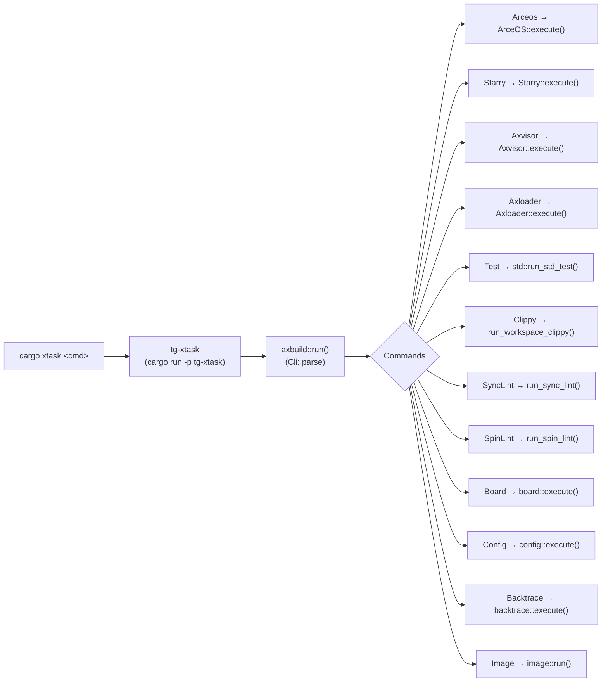
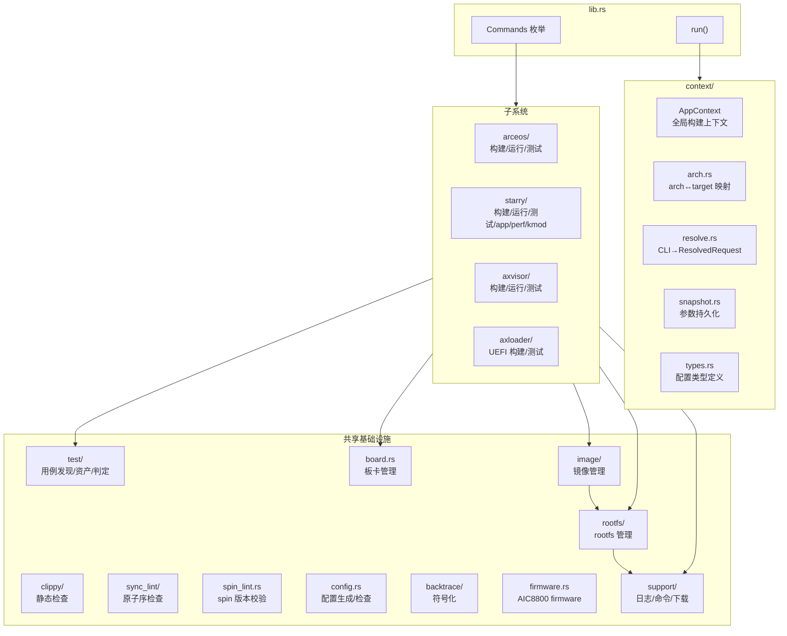
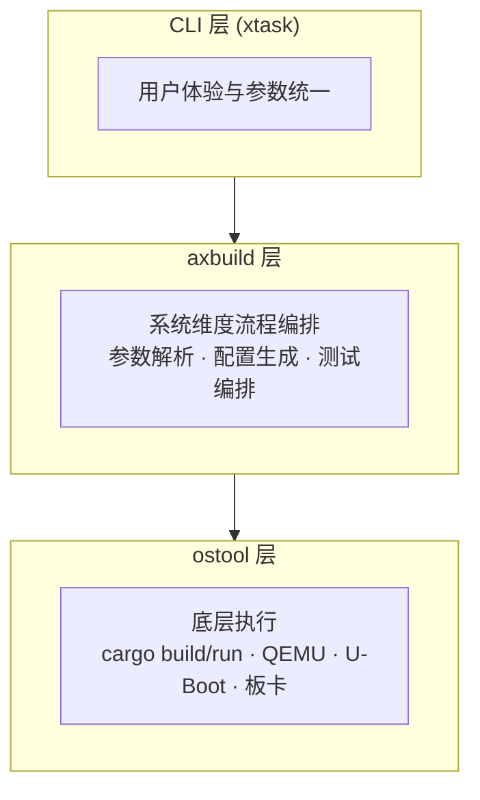

# 概述

`scripts/axbuild` 是 TGOSKits 的统一构建、运行和测试引擎。它将 ArceOS、StarryOS、Axvisor 三套操作系统的编译、QEMU/板卡运行和自动化测试收敛到一套命令行接口中，消除了各子系统各自维护独立脚本带来的重复与不一致。用户无需直接操作底层工具链（cargo、QEMU、ostool），只需通过 `cargo xtask` 入口即可完成从源码到产物再到验证的全流程。

axbuild 的设计围绕三个核心目标：**统一的命令接口**（一个 `cargo xtask` 覆盖所有 OS）、**配置驱动**（通过 TOML 文件声明构建和运行参数，支持 Snapshot 持久化复用）、以及**测试基础设施共享**（用例发现、资产准备、结果判定的通用框架被三套子系统复用）。

## 调用链

用户通过 `cargo xtask <cmd>` 发起命令，经 `tg-xtask` 包转发到 `axbuild::run()`，由 clap 解析后分派到各个子系统的执行入口。

`xtask/src/main.rs` 仅调用 `axbuild::run()` 并映射退出码，所有业务逻辑封装在 `scripts/axbuild` 中，这使得 axbuild 既可以作为 xtask 的后端使用，也可以作为独立库被其他工具集成。

## 三大能力

axbuild 的三大能力层层递进：**构建**是基础，负责将源码编译为可执行产物；**运行**在构建之上增加目标环境部署（QEMU 虚拟机、U-Boot 引导、远程板卡）；**测试**在运行之上进一步增加用例发现、资产准备和结果判定逻辑。每个子系统（ArceOS/StarryOS/Axvisor）对三大能力都有自己的实现，但共享底层的参数解析、配置管理和 ostool 执行基础设施。

| 能力 | 命令 | 说明 |
|------|------|------|
| **构建** | `cargo xtask <os> build` | 编译 OS 产物（ELF / BIN） |
| **运行** | `cargo xtask <os> qemu/uboot/board` | 在 QEMU、U-Boot 或物理板上运行 |
| **测试** | `cargo xtask <os> test qemu/board` | 自动发现用例、构建一次、逐 case 运行并判定 |

## 模块结构

axbuild 的代码组织分为四层：`lib.rs` 作为顶层入口，负责命令分发；`context/` 提供全局构建上下文和参数管理，被所有子系统共享；各子系统（`arceos/`、`starry/`、`axvisor/`）实现各自的构建、运行和测试流程；`test/`、`rootfs/`、`board.rs`、`support/` 等共享基础设施为三个子系统提供通用能力。

`context/` 是整个系统的配置中枢：`arch.rs` 维护架构与 target triple 的双向映射；`resolve.rs` 将 CLI 参数与 Snapshot 合并为 `ResolvedRequest`；`snapshot.rs` 将最近一次的参数持久化到 `.{os}.toml` 文件中，使得后续的短命令可以复用之前的配置。

`image/` 统一管理 rootfs 和 Guest 镜像的注册表、拉取、校验和缓存（详见 [镜像管理](./image)），`rootfs/` 的下载逻辑已收敛到 `image/storage.rs`，`rootfs/` 自身仅保留 `inject`（内容注入）、`qemu`（参数补丁）、`runtime`（依赖同步）和 `resize`（扩容）四块。

## 各模块详解

axbuild 的每个 `cargo xtask <cmd>` 都对应一篇专门文档。完整的命令索引见 [命令索引](./commands)，下面按类别列出：

**横切工具命令**（不绑定特定 OS）：

| 模块 | 命令 | 文档 | 一句话职责 |
|------|------|------|-----------|
| `test/std.rs` | `cargo xtask test` | [Std 白名单测试](./test) | 对 `std_crates.csv` 白名单逐一跑 `cargo test` |
| `clippy/` | `cargo xtask clippy` | [Clippy 检查](./clippy) | 按 feature × target 矩阵对 workspace 做 fail-fast clippy |
| `sync_lint/` | `cargo xtask sync-lint` | [Sync Lint](./sync_lint) | 用 `syn` 识别可疑的 `Relaxed` 原子序同步模式 |
| `spin_lint.rs` | `cargo xtask spin-lint` | [Spin Lint](./spin_lint) | 守护 vendored `spin` 迁移结果，禁止外部 `spin` 与 `spin::RwLock` |
| `board.rs` | `cargo xtask board` | [板卡管理](./board) | 远程板卡分配、串口连接与服务器配置 |
| `config.rs` | `cargo xtask config` | [Config 辅助命令](./config_cmd) | axconfig 平台包定位、配置读取/生成、Makefile 字段检查 |
| `backtrace/` | `cargo xtask backtrace symbolize` | [Backtrace 符号化](./backtrace) | 把 guest 输出的原始 `ip` 地址块符号化为函数+文件:行号 |
| `image/` | `cargo xtask image` | [镜像管理](./image) | TGOS rootfs/guest 镜像注册表、下载、校验、解压 |
| `axloader/` | `cargo xtask axloader build/test` | [Axloader](./axloader) | 构建 UEFI bootloader 并用 QEMU + HTTP smoke 验证网络引导 |

**OS 子系统命令**（`<os> build/qemu/uboot/board/test`）：

| 子系统 | 命令 | 文档 |
|--------|------|------|
| ArceOS | `cargo xtask arceos` | [ArceOS](./arceos/overview) |
| StarryOS | `cargo xtask starry` | [StarryOS](./starry/overview) |
| Axvisor | `cargo xtask axvisor` | [Axvisor](./axvisor/overview) |

三套 OS 子系统各自有完整的命令文档（构建、运行、测试及其他特有命令），不再有独立的"共享"章节——通用的参数解析、Snapshot、Build Info、axconfig 机制集中在 [参数与配置](./configuration)，各 OS 目录（`arceos/`、`starry/`、`axvisor/`）内含完整的构建/运行/测试文档及该 OS 特有的其他命令（如 StarryOS 的 app/perf/kmod/rootfs）。

## 三层架构

三层架构将关注点清晰地分离：CLI 层提供用户友好的命令行接口；axbuild 层负责 OS 特有的流程编排（如 ArceOS 的 axconfig 生成、StarryOS 的 rootfs 管理、Axvisor 的 VM 配置注入）；ostool 层则封装了与外部工具（cargo、QEMU、ostool-server）的直接交互，处理环境变量设置、进程管理等底层细节。

| 层级 | 职责 |
|------|------|
| **CLI 层** | 用户体验与参数统一（`cargo xtask` 别名） |
| **axbuild 层** | 系统维度的流程编排、参数解析、配置生成、测试编排 |
| **ostool 层** | 底层 cargo build/run、QEMU/U-Boot/板卡运行 |
