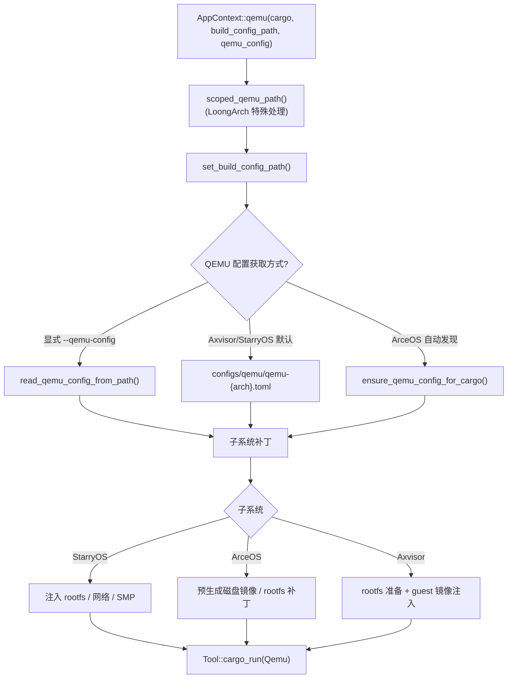
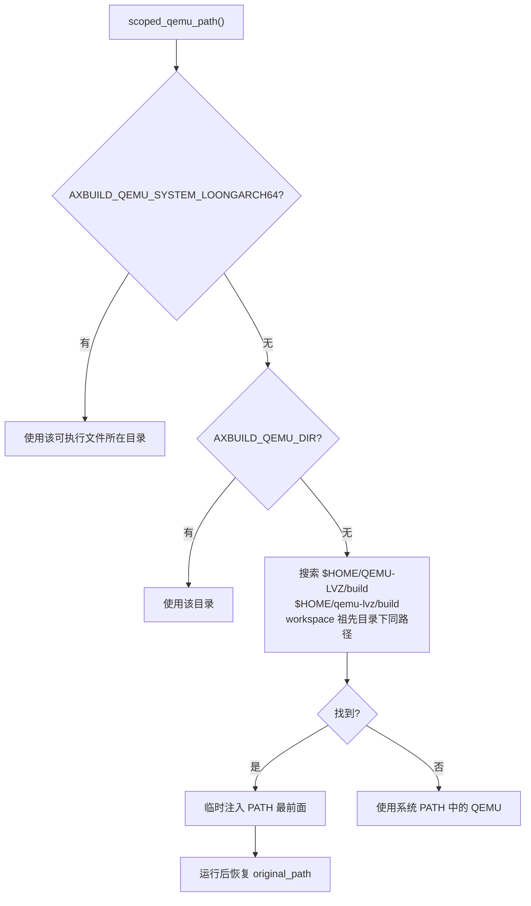
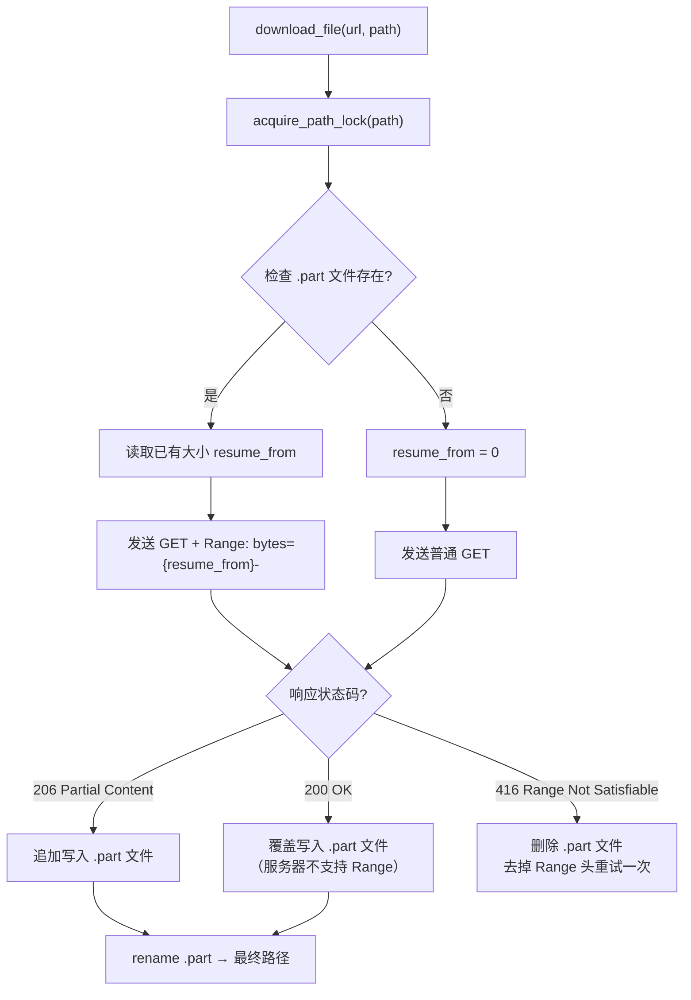
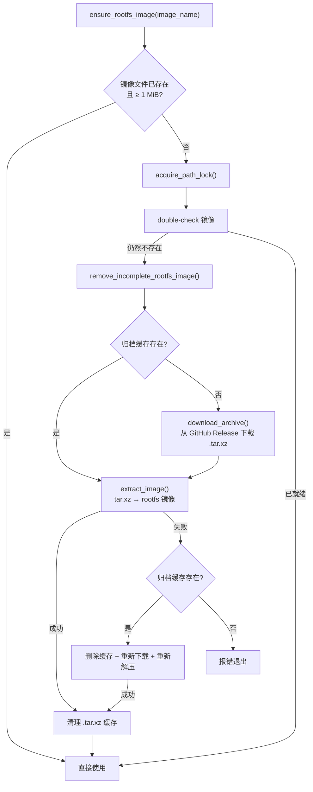
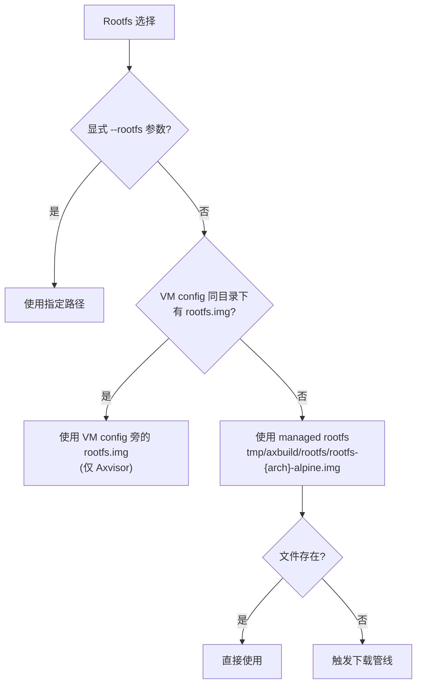
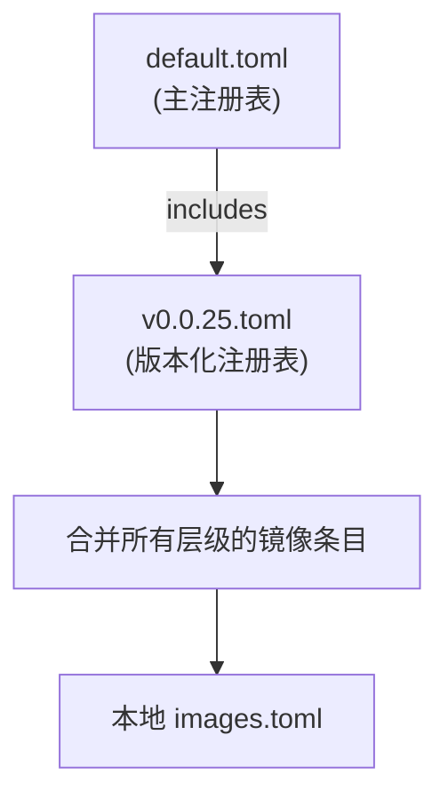

# 运行时环境

`cargo xtask <os> qemu/uboot/board` 在构建基础上增加运行环节。运行过程的核心是**将编译好的 OS 产物部署到目标环境（QEMU 虚拟机、U-Boot 引导或物理板卡）中执行**，并收集运行输出。`AppContext` 封装了五个执行方法，将底层编译和运行委托给 `ostool::Tool`。

运行阶段与构建阶段共享同一个 `AppContext` 实例。当用户执行 `cargo xtask <os> qemu` 时，系统会先完成完整的构建流程（见 [构建](/docs/build)），然后将编译产物配置到目标运行环境中。三个运行目标（QEMU、U-Boot、Board）的差异主要体现在配置获取方式和运行时环境准备上。

## 执行方法

`AppContext` 提供五个方法覆盖构建到运行的各种组合：

| 方法 | 功能 | ostool 调用 |
|------|------|-------------|
| `build()` | 纯编译 | `Tool::cargo_build()` |
| `qemu()` | 编译 + QEMU 运行 | `Tool::cargo_run(Qemu)` |
| `run_qemu()` | 仅 QEMU 运行（已构建） | `Tool::run_qemu()` |
| `uboot()` | 编译 + U-Boot 运行 | `Tool::cargo_run(Uboot)` |
| `board()` | 编译 + 板卡运行 | `Tool::cargo_run_board()` |

五个方法中，`build()` 仅编译不运行；`qemu()`、`uboot()` 和 `board()` 先编译再运行；`run_qemu()` 仅运行已编译好的产物，用于测试场景中每组构建后逐 case 运行。

---

## QEMU 运行

QEMU 运行是三个运行目标中最复杂的，需要准备完整的虚拟机环境。流程分为四个阶段：**配置获取**（从显式路径或自动发现得到 QEMU 配置）、**环境准备**（子系统特有的 rootfs、网络、磁盘等准备）、**子系统补丁**（将子系统特定的运行时参数注入 QEMU 配置）、**执行**（通过 ostool 启动 QEMU 并等待运行完成）。

### 整体流程



### QEMU 配置获取

1. **显式指定**：`--qemu-config <path>` → `Tool::read_qemu_config_from_path_for_cargo()`
2. **子系统默认模板**：Axvisor 使用 `os/axvisor/configs/qemu/qemu-{arch}.toml`，StarryOS 使用 `os/StarryOS/configs/qemu/qemu-{arch}.toml`
3. **ostool 自动发现**：ArceOS 未指定时由 ostool 根据包名和 target 自动查找 → `Tool::ensure_qemu_config_for_cargo()`

显式指定用于测试场景（每个测试用例有自己的 `qemu-{arch}.toml`）。Axvisor 和 StarryOS 在各自的 `configs/qemu/` 目录下预置了各架构的 QEMU 配置模板，未显式指定时自动使用对应模板。ArceOS 依赖 ostool 的标准路径搜索机制。

### LoongArch 特殊处理

Axvisor 的 loongarch64 target 需要带 LVZ 扩展的定制 QEMU。`AppContext::scoped_qemu_path()` 自动搜索：



龙芯架构的虚拟化需要 LVZ（Loongson Virtualization Extension）支持的 QEMU，而标准发行版的 QEMU 不包含此扩展。axbuild 通过 `scoped_qemu_path()` 自动定位 LVZ 版 QEMU，搜索优先级如下：

1. `AXBUILD_QEMU_SYSTEM_LOONGARCH64` 环境变量指向的 QEMU 可执行文件所在目录
2. `AXBUILD_QEMU_DIR` 环境变量指向的目录
3. `$HOME/QEMU-LVZ/build` 和 `$HOME/qemu-lvz/build`（默认安装路径）
4. workspace 根目录及其所有祖先目录下的 `QEMU-LVZ/build` 和 `qemu-lvz/build`

搜索时检查目录中是否存在 `qemu-system-loongarch64` 可执行文件。找到后通过 `PathRestoreGuard` 临时将该目录添加到 PATH 最前面（使用 RAII 模式确保运行完成后恢复原始 PATH）。

### ArceOS 运行时资产准备

ArceOS 某些包在运行前需要额外的宿主端资产准备（`ensure_package_runtime_assets`）：

| 包名 | 准备内容 |
|------|---------|
| `arceos-test-suit` | Rust 测试集启用 `fs-basic` 或 `all` 时，自动生成 64M FAT32 临时磁盘镜像 `tmp/axbuild/runtime-assets/arceos/rust/disk.img`（通过 `truncate` + `mkfs.fat`） |
| 其他 | 无额外准备 |

资产准备在构建和运行之前执行，仅在文件不存在时触发创建，已有文件直接复用。

---

## U-Boot 运行

编译后通过 U-Boot 运行，调用 `Tool::cargo_run(Uboot)`。U-Boot 配置通过 `--uboot-config` 指定，否则由 ostool 自动检测。

U-Boot 运行模式用于需要通过 U-Boot 引导加载器的场景（如物理板卡的网络启动）。与 QEMU 运行相比，U-Boot 运行需要额外的引导配置（TFTP 服务器地址、内核加载地址等），这些参数在 U-Boot 配置文件中定义。

---

## 板卡运行

编译后在远程板卡运行，通过 `ostool-server` 交互。接收 `BoardRunConfig` 和 `RunBoardOptions`（含 `server`、`port`、`board_type`）。

板卡运行是三个运行目标中最接近真实硬件的。`ostool-server` 运行在连接物理板卡的宿主机上，提供板卡分配、固件部署和串口交互的 API。axbuild 将编译产物和运行配置发送给 ostool-server，后者负责将固件刷写到板卡并收集串口输出。

板卡管理命令：

| 子命令 | 说明 |
|--------|------|
| `cargo xtask board ls` | 列出可用远程板卡类型 |
| `cargo xtask board connect -b <type>` | 分配板卡并连接串口 |
| `cargo xtask board config` | 编辑板卡服务器配置 |

---

## 下载基础设施

`scripts/axbuild/src/support/download.rs` 为 rootfs 镜像和 Axvisor guest 镜像提供统一的文件下载能力。所有网络下载都经过此模块，具备**断点续传**、**并发锁保护**和**进度条显示**。

### HTTP 客户端

`http_client()` 创建一个配置了以下超时的 `reqwest::Client`：

| 参数 | 值 |
|------|-----|
| 连接超时 | 30 秒 |
| 总超时 | 30 分钟 |

`fetch_text()` 用于拉取小文本资源（如 Axvisor 镜像注册表），`download_file()` 用于下载大文件（如 rootfs 压缩包）。

### 断点续传

`download_file()` 支持基于 HTTP Range 头的断点续传：



关键行为：

- **`.part` 临时文件**：下载先写入 `<name>.part` 临时文件，完成后 `rename` 为最终文件名，确保最终路径要么不存在要么是完整文件
- **Range 请求**：如果 `.part` 文件已存在且有大小，发送 `Range: bytes={size}-` 请求剩余部分
- **服务器不支持 Range**：收到 `200 OK`（而非 `206 Partial Content`）时，从头开始覆盖下载
- **无效 Range**：收到 `416 Range Not Satisfiable` 时，删除 `.part` 文件并重试一次（不带 Range 头），最多重试一次以防止无限循环

### 并发文件锁

`acquire_path_lock()` 使用 `<name>.lock` 文件实现跨进程互斥，防止多个 axbuild 实例同时下载同一个文件：

| 机制 | 说明 |
|------|------|
| 锁文件 | `<name>.lock`，创建时写入 `pid=<PID>` |
| 创建方式 | `create_new(true)` 原子创建，已存在则等待 |
| 轮询间隔 | 100ms（`DOWNLOAD_LOCK_WAIT`） |
| 过期时间 | 2 小时（`DOWNLOAD_LOCK_STALE_AFTER`） |

锁恢复策略（`recoverable_lock`）：

1. **孤儿锁**：读取锁文件中的 PID，通过 `/proc/<pid>` 检查进程是否存活（仅 Unix），已死进程的锁自动清理
2. **过期锁**：检查锁文件的 `mtime`，超过 2 小时的锁视为过期自动清理
3. **正常锁**：其他情况等待并重试

`PathLock` 使用 RAII 模式（`Drop` trait）确保锁文件在作用域结束时自动删除。

### 进度条

`progress_bar()` 基于 `indicatif` 库提供两种模式：

| 模式 | 触发条件 | 显示 |
|------|---------|------|
| 进度条 | 服务器返回 `Content-Length` | `下载中 [████████------] 50MB/100MB (2MB/s, ETA 25s)` |
| 旋转器 | 未知总大小 | `下载中 ⠋` |

---

## Rootfs 基础设施

`scripts/axbuild/src/rootfs/` 提供三套子系统共享的 rootfs 管理：

| 模块 | 职责 |
|------|------|
| `store` | 镜像查找、命名、下载、缓存（按 arch 区分） |
| `inject` | 通过 `debugfs` 提取与修改 rootfs 内容（文件读写、overlay 注入） |
| `qemu` | 将 rootfs 路径补丁到 QEMU 配置（`-drive`、`-device`、`-netdev`） |
| `runtime` | 运行时 ELF 依赖同步（自动补齐 overlay 中的动态库） |

### Rootfs 下载管线

下载管线由 `rootfs/store` 模块实现。当 managed rootfs 不存在时，`ensure_rootfs_image()` 触发完整的下载流程：



**远程仓库**：rootfs 归档从 GitHub `rcore-os/tgosimages` 仓库的 Release 资产下载（版本号 `TGOSIMAGES_ROOTFS_RELEASE`，当前 `v0.0.5`），URL 格式为：

```
https://github.com/rcore-os/tgosimages/releases/download/{version}/rootfs-{arch}-{distro}.img.tar.xz
```

**完整性验证**：

| 检查点 | 条件 | 处理 |
|--------|------|------|
| 镜像太小 | 文件 < 1 MiB（`MIN_ROOTFS_IMAGE_SIZE`） | 删除并重新下载（可能上次解压中断） |
| 解压失败 | tar/xz 解析出错 | 删除归档缓存 + 重新下载 + 重试一次 |
| 归档损坏 | 归档文件存在但无法解压 | 删除后重新下载 |

**解压过程**（`extract_image`）：

1. 在 `spawn_blocking` 线程中执行，避免阻塞 tokio 运行时
2. 使用 `xz2` 流式解码 + `tar::Archive` 遍历归档条目
3. 只解压与目标 `image_name` 匹配的条目，跳过其他文件
4. 先解压到 `.tmp` 临时文件，完成后 `rename` 为最终文件名（原子性保证）

**命名与路径解析**（`resolve_rootfs_path`）：

| 输入 | 解析结果 |
|------|---------|
| `alpine` | `tmp/axbuild/rootfs/rootfs-{arch}-alpine.img` |
| `busybox` | `tmp/axbuild/rootfs/rootfs-{arch}-busybox.img` |
| `debian` | `tmp/axbuild/rootfs/rootfs-{arch}-debian.img` |
| `/path/to/custom.img` | 原样使用（含目录分隔符的路径视为显式路径） |

裸关键词（`alpine`/`busybox`/`debian`）自动展开为 managed rootfs 命名规则；含目录分隔符的路径视为用户显式指定，跳过自动下载。

### Rootfs 选择策略



三级回退策略：

1. **用户显式指定**（`--rootfs <path>`）：最高优先级，直接使用
2. **VM 配置推断**（仅 Axvisor）：遍历 `--vmconfigs` 指定的 VM 配置文件，解析 `[kernel] kernel_path` 字段，检查其同目录下是否存在 `rootfs.img`
3. **Managed rootfs**：自动下载并缓存的 Alpine Linux 镜像，存储在 `tmp/axbuild/rootfs/`

### Rootfs 内容操作

`rootfs/inject` 模块通过宿主端的 `debugfs` 工具操作 ext2/3/4 文件系统镜像内容：

| 函数 | 功能 |
|------|------|
| `read_text_file(img, path)` | 从镜像中读取文本文件（返回 `None` 表示文件不存在） |
| `replace_file(img, path, source)` | 替换镜像中的文件（`rm` → `write` → `sif mode`） |
| `extract_rootfs(img, dir)` | 将整个镜像内容提取到宿主目录（`rdump /`） |
| `inject_overlay(img, overlay_dir)` | 将 overlay 目录树递归注入镜像 |

`inject_overlay` 的实现：

1. 递归遍历 overlay 目录树
2. 为每个目录生成 `mkdir` 命令，为每个文件生成 `rm` + `write` + `sif mode` 命令（保留 Unix 权限）
3. 将所有命令合并为一个 `debugfs` 脚本，通过管道一次性执行
4. 空的 overlay 目录直接跳过（`overlay_has_entries` 检查）

### Rootfs 运行时依赖同步

`rootfs/runtime` 模块的 `sync_runtime_dependencies()` 自动补齐 overlay 目录中的 ELF 动态库依赖：

1. 扫描 overlay 目录中所有常规文件
2. 通过 ELF 魔数（`\x7fELF`）检测二进制文件
3. 调用宿主端 `readelf -d` 读取 `NEEDED` 共享库列表
4. 在 staging root 的 `lib/`、`usr/lib/`、`usr/local/lib/` 中查找缺失的 `.so`
5. 将找到的动态库复制到 overlay 对应位置，保留原始权限模式
6. 递归处理新复制的库本身可能依赖的其他库

### QEMU 参数补丁

`rootfs/qemu` 模块将 rootfs 镜像路径注入 QEMU 配置，支持两种补丁模式：

| 模式 | 使用场景 | 行为 |
|------|---------|------|
| `ReplaceDriveOnly` | Axvisor | 仅替换或插入 `disk0` 驱动参数 |
| `EnsureDiskBootNet` | ArceOS | 确保完整的磁盘 + virtio 块设备 + 用户网络基线 |

**ReplaceDriveOnly**：扫描现有 `-drive` 参数，替换匹配 `id=disk0,if=none,format=raw,file=` 的参数。如果没有匹配的 `-drive`，则在 `virtio-blk-pci,drive=disk0` 或 `virtio-blk-device,drive=disk0` 声明之后插入新的 `-drive` 参数。

**EnsureDiskBootNet**：完整检查并补全四组 QEMU 参数：

| 参数 | 默认值 | 检查逻辑 |
|------|--------|---------|
| `-device virtio-blk-pci,drive=disk0` | `virtio-blk-pci` 或 `virtio-blk-device` | 不存在则追加 |
| `-drive id=disk0,if=none,format=raw,file=<rootfs>` | — | 替换或追加 |
| `-device virtio-net-pci,netdev=net0` | `virtio-net-pci` 或 `virtio-net-device` | 不存在则追加 |
| `-netdev user,id=net0` | — | 不存在则追加 |

---

## 各子系统 Rootfs 管理

### StarryOS rootfs

StarryOS rootfs 管理最为复杂，除了基础的镜像下载外，还需要在 rootfs 内配置网络和软件源：

**APK 区域配置**（`ensure_apk_region_in_rootfs`）：

1. 通过 `looks_like_ext_image()` 检测 rootfs 是否为 ext2/3/4 格式（读取偏移 0x438 处的 superblock 魔数 `0x53EF`）
2. 读取 `/etc/apk/repositories` 内容
3. 根据 `STARRY_APK_REGION` 环境变量重写软件源

| 环境变量值 | 区域 |
|-----------|------|
| `china` / `cn`（默认） | `mirrors.cernet.edu.cn/alpine` |
| `us` / `usa` | `dl-cdn.alpinelinux.org/alpine` |

重写机制（`rewrite_apk_repositories_content()`）逐行扫描 `/etc/apk/repositories`，对包含 `/alpine/` 的 URL 行执行域名替换：将原始镜像域名替换为区域对应的镜像域名，保留协议、路径及缩进格式不变。以 `#` 开头的注释行和空行保持原样。未设置环境变量时默认使用中国镜像源。

**DNS 注入**：写入 `/etc/resolv.conf`，内容为 `nameserver 10.0.2.3`（QEMU slirp 模式的内置 DNS 服务器地址）。此处注入的 DNS 地址是 QEMU 运行时使用的 slirp 内置 DNS，确保 rootfs 在 QEMU 虚拟机中可以解析域名。注意：测试流程中 C/Python Pipeline 的 staging root DNS 注入（`starry/resolver.rs`）与此处不同——staging root 使用宿主端的外网 DNS（过滤 loopback 和 slirp 地址），用于在 qemu-user 环境下执行 prebuild 脚本和 APK 安装。

**写入优化**：所有文件替换操作（`replace_rootfs_text_file_if_changed`）先比较内容是否已相同，相同则跳过写入，避免不必要的 `debugfs` 调用。

### Axvisor rootfs

Axvisor 的 rootfs 选择具有独特的 VM 配置推断机制（`infer_rootfs_path`）：

1. 遍历所有 `--vmconfigs` 指定的 VM 配置文件
2. 解析 TOML 中 `[kernel] kernel_path` 字段
3. 检查 kernel 同目录下是否存在 `rootfs.img`
4. 找到则使用该 rootfs，否则回退到 managed rootfs

Axvisor 使用 `ReplaceDriveOnly` 模式补丁 QEMU 配置（因为 QEMU 配置文件通常已经包含完整的设备声明，只需替换驱动路径）。

### ArceOS rootfs

ArceOS 使用 `EnsureDiskBootNet` 模式（因为某些 ArceOS QEMU 配置可能不包含完整的设备声明，需要自动补全）。仅在用户通过 `--rootfs` 显式指定时才注入 rootfs。

---

## Axvisor Guest 镜像管理

Axvisor 独有的 `image` 子命令管理 Guest 虚拟机镜像（如 Linux 内核、文件系统），与 rootfs 管理独立。

### 镜像注册表

`axvisor/image/registry` 模块管理 Guest 镜像信息。注册表使用 TOML 格式存储，支持 `includes` 机制实现层级引用：



**注册表引导**：启动时先尝试从 `DEFAULT_REGISTRY_URL`（`arceos-hypervisor/axvisor-guest` GitHub 仓库的 `HEAD`）拉取 `default.toml`，失败后依次回退到 `AXVISOR_REGISTRY_FALLBACK_URL` 环境变量和内置默认 URL。拉取成功后解析 TOML 中的 `includes` 列表——这是一个按版本号排序的 URL 列表（如 `v0.0.25.toml`、`v0.0.24.toml`），选择其中版本号最高的条目拉取。所有层级的镜像条目最终合并为完整的镜像注册表并缓存到本地 `images.toml`。

**自动同步**：本地注册表缓存有有效期（`auto_sync_threshold`，默认 7 天）。每次执行 `image ls` 或 `image pull` 时检查缓存年龄，过期或不存在时自动拉取最新注册表。可通过 `--no-auto-sync` 或全局选项 `-N` 禁用。

### 镜像存储

`axvisor/image/storage` 模块管理 Guest 镜像的本地存储：

| 配置项 | 默认值 | 环境变量覆盖 |
|--------|--------|-------------|
| 本地存储路径 | `$TMPDIR/.axvisor-images` | `AXVISOR_IMAGE_LOCAL_STORAGE` |
| 注册表 URL | `arceos-hypervisor/axvisor-guest/registry/default.toml` | — |
| 自动同步 | 开启 | — |
| 同步阈值 | 7 天 | — |

**镜像拉取流程**（`pull_image`）：

1. 从注册表中查找匹配的镜像条目（`name:tag` 格式）
2. 下载归档到本地存储（支持断点续传，复用 `download_file`）
3. SHA256 校验：下载后计算哈希并与注册表中的 `sha256` 字段比对，不匹配则重新下载
4. 解压：`.tar.gz` 归档解压到以镜像名命名的目录
5. 去重：已解压且 SHA256 匹配的镜像直接复用，跳过重复解压
