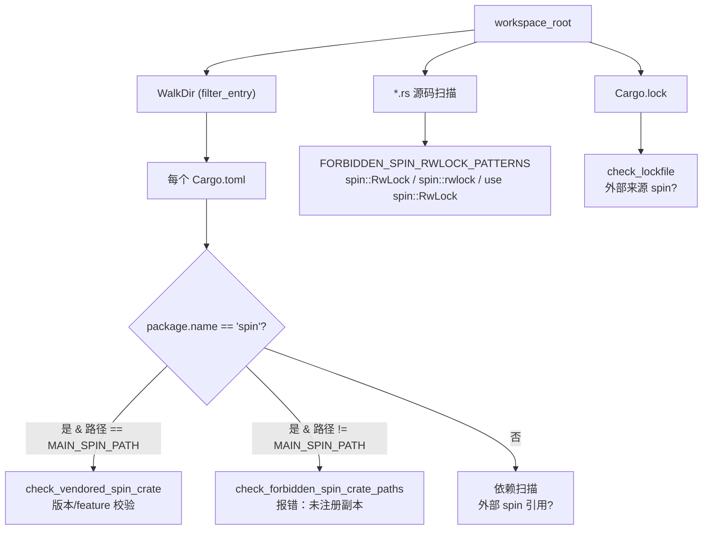

# Spin Lint

`cargo xtask spin-lint` 是 axbuild 为 TGOSKits 内部 `spin` crate 迁移而设的看门狗检查。TGOSKits 已经把上游 `spin` 0.12 fork 到 `components/spin` 并做了一项关键改造：**移除了 `rwlock` feature**，所有原本用 `spin::RwLock` 的代码统一改用 `ax_kspin::SpinRwLock`。spin-lint 通过扫描 workspace 的所有 `Cargo.toml`、`Cargo.lock` 和源码，确保这个迁移结果不被悄悄回退——任何外部 `spin`、多份 vendored 副本、或残留的 `spin::RwLock` 引用都会让它失败。

> spin-lint 是仓库级的不变量守护：它检查的不是代码风格，而是“我们承诺过的迁移状态是否依然成立”。

## 五项检查

`lint_workspace` 依次运行下面五项检查，任何一项发现都会累积到 `Vec<Finding>` 并最终使命令失败：

| 检查 | 函数 | 失败原因 |
|------|------|----------|
| **Vendored 主副本** | `check_vendored_spin_crate(MAIN_SPIN_PATH, "0.12.0")` | `components/spin/Cargo.toml` 缺失、包名不是 `spin`、版本不是 `0.12.0`，或保留了被禁用的 `rwlock` feature |
| **禁用副本路径** | `check_forbidden_spin_crate_paths` | 在 `MAIN_SPIN_PATH` 之外的任何位置出现名为 `spin` 的包（迁移期遗留的重复副本） |
| **根 manifest** | `check_root_manifest` | workspace 根 `Cargo.toml` 仍声明外部 `spin` 依赖 |
| **子 manifest** | `check_workspace_manifests` | 任意成员 crate 的 `Cargo.toml` 声明外部 `spin` 依赖 |
| **源码 RwLock 用法** | `check_no_spin_rwlock_usage` | 源码中出现 `spin::RwLock`、`spin::rwlock`、`use spin::RwLock` 等模式（`FORBIDDEN_SPIN_RWLOCK_PATTERNS`） |
| **Cargo.lock** | `check_lockfile` | `Cargo.lock` 中解析到了外部来源（非 path）的 `spin` 包 |

主副本的 feature 检查尤其严格：不仅 `features.rwlock` 这一键的存在会失败，`features.default` 数组里混入 `rwlock` 也会单独按 index 报告，避免通过默认 feature 间接恢复被禁用的功能。

## 架构概览



## 五项检查详解

### 1. Vendored 主副本校验

`check_vendored_spin_crate` 检查 `components/spin/Cargo.toml` 的完整性：

| 校验项 | 期望值 | 失败 finding |
|--------|--------|-------------|
| 文件存在 | `components/spin/Cargo.toml` 存在 | `vendored spin manifest is missing` |
| 包名 | `spin` | `expected package \`spin\` ..., found name \`...\`` |
| 版本 | `0.12.0` | `expected ... version \`0.12.0\`, found ... version \`...\`` |
| `features.rwlock` 键 | 不存在 | `vendored spin must not expose the upstream rwlock feature` |
| `features.default[]` 含 `rwlock` | 不含 | `vendored spin default features must not include rwlock`（按 index 报告） |

feature 检查分两层：先检查 `features` 表中是否存在 `rwlock` 键（`features.rwlock`），再遍历 `features.default` 数组逐元素检查是否有 `"rwlock"`（`features.default[N]`）。这种双重检查确保 `rwlock` 既不能作为独立 feature 存在，也不能通过 default feature 间接恢复。

### 2. 禁用副本路径

`check_forbidden_spin_crate_paths` 用 `WalkDir` 遍历整个 workspace，对每个 `Cargo.toml` 检查其 `package.name`。如果发现名为 `spin` 但路径不是 `components/spin/Cargo.toml` 的包，报告为 `unregistered vendored spin copy is not allowed`。路径比较经过 `normalize_path` 规范化（处理 `..`、`.` 等），避免因路径写法差异绕过检查。

`should_visit_spin_crate_entry` 作为 `WalkDir::filter_entry` 过滤掉无关目录（`.git`、`target`、`tmp`、`.cache`），同时**跳过 `MAIN_SPIN_PATH` 自身的子目录**（避免把主副本自身的文件误判为禁用副本）。

### 3 & 4. Manifest 依赖扫描

`check_root_manifest` 和 `check_workspace_manifests` 扫描 workspace 根和各成员 crate 的 `Cargo.toml`，检查 `dependencies`、`dev-dependencies`、`build-dependencies` 三张表中是否存在外部 `spin` 依赖（递归检查 target-specific 依赖表如 `[target.'cfg(...)'.dependencies]`）。

`is_spin_dependency` 判定一个依赖条目是否为 spin：依赖名是 `spin`，或 `package = "spin"` 的别名依赖。

依赖来源分类处理：

| 依赖写法 | 判定 | 处理 |
|----------|------|------|
| `spin = "0.12"` | 版本字符串 → crates.io 解析 | 报错：`resolves through crates.io` |
| `spin = { workspace = true }` | workspace 继承 | 通过（继续检查 workspace 根的定义） |
| `spin = { path = "..." }` | 显式 path | 检查 path 是否指向 `components/spin`、版本是否匹配 |
| `spin = { version = "..." }` | 版本要求 → crates.io | 报错：`must not rely on crates.io version resolution` |

正确的写法只有两种：`spin = { workspace = true }`（workspace 继承）或 `spin = { path = "../../components/spin" }`（显式 path 指向注册副本）。

### 5. 源码 RwLock 用法

`check_no_spin_rwlock_usage` 遍历 workspace 所有 `.rs` 文件（跳过 `spin_lint.rs` 自身，因为它包含这些模式字符串），逐行检查是否包含 `FORBIDDEN_SPIN_RWLOCK_PATTERNS` 中的任一模式：

| 模式 | 匹配场景 |
|------|----------|
| `spin::RwLock` | 直接使用完全限定路径 |
| `spin::rwlock` | 引用 rwlock 模块 |
| `use spin::RwLock` | use 导入 |

匹配到任一模式即报告 forbidden `<pattern>` usage，help 提示 use `ax_kspin::SpinRwLock` for non-sleeping read-write locks。这是逐行文本匹配（非 AST 分析），因为模式本身足够明确，不会误报。

### 6. Cargo.lock 校验

`check_lockfile` 解析 `Cargo.lock`，检查是否存在来源不是 workspace path 的 `spin` 包。如果 Cargo.lock 中出现了从 crates.io 或 git 解析的 `spin`，说明某处依赖泄漏到了外部版本，报告并失败。

## 模块组成

spin-lint 是单文件实现：

| 代码位置 | 作用 |
|----------|------|
| `scripts/axbuild/src/spin_lint.rs` | 全部逻辑：CLI 入口、五项检查、finding 打印 |

关键常量：

```rust
const MAIN_SPIN_PATH: &str = "components/spin";
const FORBIDDEN_SPIN_RWLOCK_PATTERNS: &[&str] =
    &["spin::RwLock", "spin::rwlock", "use spin::RwLock"];
```

`should_visit_spin_crate_entry` 作为 `WalkDir::filter_entry` 的过滤器，跳过 `target/`、`.git/` 等无关目录，避免扫描产物和元数据。

## 报告格式

每条 finding 输出三行：

```text
<path>: <location>: <message>
  help: <修复建议>
```

`location` 通常是 TOML 中的标签位置（如 `main migration copy`、`features.rwlock`、`features.default[2]`）或源码路径。所有 finding 都带有可操作的 `help`，例如：

- `restore \`components/spin\` or update spin-lint if the migration copy changed`
- `use \`ax_kspin::SpinRwLock\` instead of restoring \`spin::RwLock\``
- `remove this package; only \`components/spin\` may remain until migration completes`

存在任何 finding 即 `bail!("spin-lint found N issue(s)")`，命令退出码非零。

## 用法

```bash
cargo xtask spin-lint
```

无任何参数。CI 中通常作为强制门禁运行，任何对 `Cargo.toml`、`Cargo.lock` 或 `spin::RwLock` 引用的回归都会被它拦截。正确做法是：

- 需要 spin lock → 使用 vendored `components/spin` 的 `SpinLock`（path 依赖）。
- 需要 rwlock → 使用 `ax_kspin::SpinRwLock`，不要恢复 `spin::RwLock`。
- 引入新的需要 `spin` 的上游 crate → 评估能否在其 feature 配置中关闭 spin 依赖，或在 `Cargo.toml` 中用 path 指向 `components/spin`。
