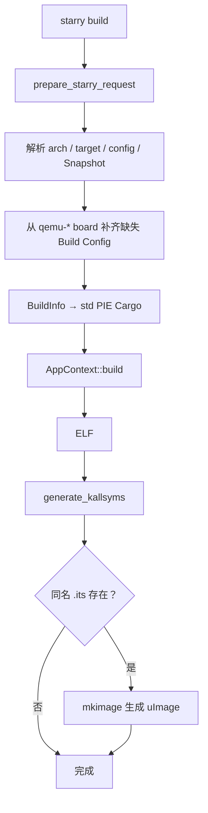

# StarryOS 构建

`cargo xtask starry build` 构建固定 package `starryos`。执行链位于 `starry/mod.rs` 和 `starry/build.rs`：先解析共享请求并加载 board-derived Build Config，再生成 std-aware Cargo 配置，最后在 ELF 构建成功后写入 kallsyms，并按需生成 uImage。

## 1. 构建流程

Starry 构建在共享 Cargo 装配后追加符号表和可选镜像处理；图中的后处理阶段解释了它与普通 `cargo build` 的差异。



### 1.1 配置装载

默认路径是：

```text
tmp/axbuild/config/starryos/build-<target>.toml
```

如果路径不存在，`starry/config.rs::ensure_default_build_config_for_target()` 查找与 target 匹配的默认 `qemu-*` board 配置并复制它。显式 `--config` 具有最高优先级；找不到默认 board 时请求返回配置错误。

典型 board-derived 配置：

```toml
target = "riscv64gc-unknown-none-elf"
features = [
  "ax-driver/serial",
  "ax-driver/virtio-blk",
  "ax-driver/virtio-net",
]
log = "Warn"
max_cpu_num = 4
```

CLI `--smp` 覆盖配置或 Snapshot 中的 `max_cpu_num`。`FEATURES` 环境变量经 `apply_makefile_features()` 验证后并入 BuildInfo；字段和 feature 的验证规则见 [参数与配置](../configuration)。

### 1.2 Cargo 装配

`starry/build.rs::load_cargo_config()` 使用共享 BuildInfo 实现：

- 逻辑裸机 target 映射到 `scripts/targets/std/pie/` 的 musl PIE JSON target；
- 使用 `build-std = ["std", "panic_abort"]`，release 采用 `panic = "abort"`、`lto = false`；
- 准备 musl C 交叉编译环境、占位库和 linker wrapper；
- 固定 package 为 `starryos`，并确保 Cargo 选择其 binary；
- 写入 `AX_ARCH`、`AX_TARGET`，以及来自 BuildInfo 的 `AX_LOG`、`SMP`、`[env]`。

共享基础配置的 `to_bin` 为 `false`。因此 `starry build` 的直接产物是 ELF；运行和部署阶段按 QEMU 或板卡配置决定是否转换。

## 2. 产物后处理

Starry 在 ELF 构建成功后按固定顺序处理内核符号和可选的启动镜像；这些步骤不会改变请求解析或 Cargo feature 选择。

### 2.1 符号表处理

`build_starry_artifact()` 每次成功构建后调用 `postprocess_starry_artifact()`：

1. `rust-nm -n <elf>` 只保留文本和静态数据等可用符号；
2. 将符号流交给 `gen_ksym`；
3. 查询 ELF 中 `.kallsyms` 的预留大小；
4. 生成内容超限时失败，否则零填充到该大小；
5. 使用 `rust-objcopy --update-section .kallsyms=<temp>` 原地更新 ELF。

这要求构建产物中保留链接脚本预留的 `.kallsyms` section。若遇到“generated kallsyms exceed section”错误，应清理陈旧 ELF 并重新构建，或恢复链接脚本的预留容量。

### 2.2 镜像生成

`uimage_generation_plan()` 查找当前 Build Config 同目录、同 basename 的 `.its`。找到时，axbuild 调用 `mkimage` 将已后处理的 ELF 生成 uImage；`defconfig` 会将 board 的 companion ITS 一同复制，使该板卡的启动格式随配置一起被选择。

## 3. 命令示例

以下示例分别使用默认请求、显式 SMP 和 checked-in board Build Config，以验证配置选择和后处理路径。

```bash
cargo xtask starry build
cargo xtask starry build --arch aarch64 --smp 4
cargo xtask starry build --config os/StarryOS/configs/board/qemu-riscv64.toml
```

QEMU rootfs、UEFI 和 `to_bin` 的运行契约见 [StarryOS 运行](./runtime)。
