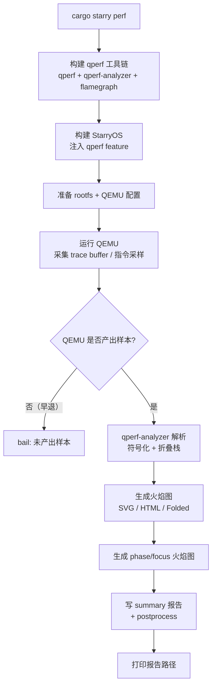

# StarryOS 性能剖析

`cargo xtask starry perf` 构建 StarryOS 并通过 qperf 进行性能剖析，输出火焰图（SVG/HTML/Folded）、Pprof 或 callchain 数据。这是 StarryOS 独有的命令，[ArceOS](../arceos/overview) 和 [Axvisor](../axvisor/overview) 没有。

## 剖析流程



## 参数

| 参数 | 说明 |
|------|------|
| `-c/--case <NAME>` | 性能测试用例名（默认 `boot`） |
| `--arch <ARCH>` | 目标架构（默认 `riscv64`） |
| `--freq <HZ>` | 采样频率（默认 99） |
| `--format` | 输出格式：`Folded`/`Svg`/`Pprof`/`All`（默认 `All`） |
| `--mode` | 采样模式：`Tb`（trace buffer，默认）/ `Insn`（指令级） |
| `--max-depth <N>` | 最大调用栈深度（默认 128） |
| `--timeout <SEC>` | 采集超时（默认 20） |
| `--output-dir`/`--out <DIR>` | 输出根目录，报告位于 `<DIR>/perf/<arch>/latest` |
| `--host-time`/`--no-host-time` | 收集/禁用 QEMU 进程的 host CPU 时间 |
| `--host-perf` | 在 host 侧用 `perf stat` 采集 QEMU 进程指标 |
| `--host-perf-events` | host perf stat 事件（逗号分隔） |
| `--shell-init-cmd`/`--workload` | Guest shell 出现 boot 提示后发送的命令 |
| `--shell-prefix` | 发送 `--shell-init-cmd` 前匹配的提示子串 |
| `--start-marker`/`--stop-marker` | Guest stdout 标记，控制采样窗口起止 |
| `--workload-timeout <SEC>` | 采样窗口超时，超时则停止 QEMU |
| `--qperf-metrics` | 启用 feature-gated 的 in-guest qperf 指标计数 |
| `--flamegraph` | 即使 `--format` 非 SVG 也生成火焰图 |
| `--flamegraph-kind` | 火焰图格式：`Svg`（默认）/`Html`/`Folded` |
| `--full-stack` | 保留本构建可采集的最深栈 |
| `--callchain`/`--perf-callchain` | qperf callchain 模式：`Leaf`/`Fp`/`Logical` |
| `--debuginfo`/`--perf-debuginfo` | 添加 DWARF 调试信息并保留符号 |
| `--force-frame-pointers`/`--perf-force-frame-pointers` | 强制帧指针以支持 FP 解栈 |
| `--demangle` | 在 qperf-analyzer 中强制 Rust demangle |
| `--no-truncate` | 火焰图中保留极小帧（min width 设为 0） |
| `--include-kernel-symbols` | 包含内核符号（StarryOS 默认开启） |
| `--include-user-symbols` | 包含用户符号 |
| `--symbol-style` | 折叠栈符号风格：`Full`（默认）/`Short`/`Module` |
| `--focus <REGEX>` | 为匹配正则的帧生成额外的聚焦折叠栈/火焰图 |
| `--kernel-filter` | 仅保留内核态帧 |
| `--smp <N>` | CPU 核数 |
| `--debug` | debug 构建 |

## 采样模式

| 模式 | 说明 |
|------|------|
| `Tb`（trace buffer，默认） | 从 qperf 的内核 trace buffer 读取采样，开销低 |
| `Insn`（指令级） | 指令级采样，精度高但开销大 |

## callchain 解栈模式

| 模式 | 说明 |
|------|------|
| `Leaf` | 最快，仅依赖采样点的 PC/LR |
| `Fp` | 需要帧指针（配合 `--force-frame-pointers`） |
| `Logical` | 逻辑推导，最完整但最慢 |

## 输出产物

报告位于 `<output-dir>/perf/<arch>/latest/`，包含：

- 火焰图（`.svg` / `.html`）
- 折叠栈（`.folded`）
- 原始采样（`.raw`）
- 符号化统计（`resolve_stats`、`stack_depth_summary`）
- phase/focus 火焰图（按采样窗口分段）
- `summary.md` 汇总报告

## 用法示例

```bash
# 默认 riscv64 性能剖析（boot 用例）
cargo starry perf

# 指定输出格式和架构
cargo starry perf --format Svg --arch aarch64

# 指令级采样 + 帧指针解栈
cargo starry perf --mode Insn --callchain Fp --force-frame-pointers

# 自定义工作负载采样窗口
cargo starry perf --shell-init-cmd "/bin/run_benchmark.sh" \
    --start-marker "BENCH_START" --stop-marker "BENCH_END" \
    --workload-timeout 30
```
