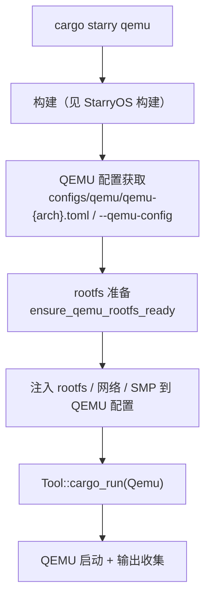

# StarryOS 运行

`cargo xtask starry qemu/uboot/board` 在构建基础上增加运行环节：将编译好的 StarryOS 内核部署到 QEMU 虚拟机、U-Boot 引导或远程板卡中执行。本节描述 StarryOS 三种运行目标的特有行为；通用的 QEMU 配置获取、ostool 执行机制详见 [参数与配置](../configuration)，构建详见 [StarryOS 构建](./build)。

StarryOS 是三套子系统中**运行目标最全**的：同时支持 QEMU、U-Boot 和远程板卡，且运行强依赖 rootfs（Alpine/Debian 用户空间）。

## 子命令

| 子命令 | 运行目标 | 说明 |
|--------|----------|------|
| `cargo starry qemu` | QEMU 虚拟机 | 编译并在 QEMU 中运行（含 rootfs 准备） |
| `cargo starry uboot` | U-Boot 引导 | 编译并通过 U-Boot 运行 |
| `cargo starry board` | 远程板卡 | 编译并在远程板卡运行 |

## QEMU 运行



### QEMU 配置获取

StarryOS 未显式指定 `--qemu-config` 时，使用 `os/StarryOS/configs/qemu/qemu-{arch}.toml` 预置模板。测试场景下每个用例有自己的 `qemu-{arch}.toml`，通过 `--qemu-config` 显式指定。

### rootfs 是一等公民

StarryOS 运行强依赖 rootfs。`cargo starry qemu` 在运行前自动准备 rootfs（`ensure_qemu_rootfs_ready`）：按架构默认镜像名（`rootfs-<arch>-alpine.img`）从 image storage 拉取。`--rootfs` 可显式指定镜像路径（裸关键词 `alpine`/`busybox`/`debian` 自动展开为 managed 镜像名）。rootfs 镜像的下载/缓存/注入逻辑详见 [镜像管理](../image)。

### DNS 与 APK 区域配置

StarryOS 在 rootfs 准备时额外完成两项 [ArceOS](../arceos/runtime) 和 [Axvisor](../axvisor/runtime) 不做的操作：

- **DNS 注入**（`starry/resolver.rs`）：读取宿主 DNS 配置写入 rootfs `/etc/resolv.conf`，过滤 loopback 和 QEMU slirp 地址
- **APK 区域配置**（`starry/apk.rs`）：根据 `STARRY_APK_REGION` 重写 `/etc/apk/repositories` 镜像源（`china`/`cn` 用 `mirrors.cernet.edu.cn/alpine`，`us`/`usa` 用 `dl-cdn.alpinelinux.org`）

## U-Boot 运行

`cargo starry uboot` 编译后通过 U-Boot 运行，调用 `Tool::cargo_run(Uboot)`。U-Boot 配置通过 `--uboot-config` 指定，否则由 ostool 自动检测。U-Boot 运行模式用于需要通过 U-Boot 引导加载器的场景（如物理板卡的网络启动）。

## 板卡运行

`cargo starry board` 编译后在远程板卡运行，通过 ostool-server 交互。需要指定 `--server` 和 `--port` 参数或通过 `cargo xtask board config` 预先配置。板卡管理命令详见 [板卡管理](../board)。

板卡运行流程：编译 StarryOS → 发送固件和运行配置给 ostool-server → ostool-server 刷写固件到板卡 → 收集串口输出。

## 参数

**通用参数**（`qemu` / `uboot` / `board`）：`--arch`、`--target`、`--config`、`--smp`、`--debug`。默认架构 `riscv64`。

**QEMU 额外参数**：`--qemu-config <PATH>`、`--rootfs <IMAGE>`
**Board 额外参数**：`--board-config <PATH>`、`-b/--board-type <TYPE>`、`--server <HOST>`、`--port <PORT>`

## 用法示例

```bash
# 默认 riscv64 在 QEMU 运行
cargo starry qemu

# 切换架构
cargo starry qemu --arch aarch64

# 显式指定 rootfs
cargo starry qemu --rootfs alpine

# U-Boot 运行
cargo starry uboot

# 板卡运行
cargo starry config ls
cargo starry defconfig orangepi-5-plus
cargo starry board
```
