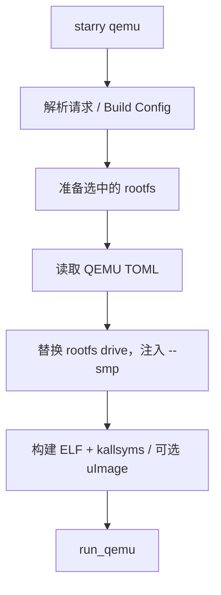

# StarryOS 运行

StarryOS 的 `qemu`、`uboot`、`board` 都先构建并后处理内核 ELF。QEMU 运行在此基础上选择 rootfs、读取启动 TOML、补充显式 SMP，并以配置要求决定是否准备 BIN。

## 1. QEMU 启动

QEMU 路径在内核 ELF 构建后补根文件系统和显式 SMP；启动 TOML 本身仍拥有 machine、UEFI 和设备参数。下图对应 `starry/rootfs.rs` 与 `run_qemu_artifact()` 的调用顺序。



未给出 `--qemu-config` 时，默认路径为：

```text
os/StarryOS/configs/qemu/qemu-<arch>.toml
```

QEMU 的 machine、CPU、UEFI、firmware 和 device 全部来自该文件。`--smp` 仅替换或追加 `-smp`；axbuild 不会为架构选择硬编码 CPU/firmware 参数。

### 1.1 根文件系统

`starry/rootfs.rs` 按下列优先级选择 QEMU rootfs：

1. `--rootfs <IMAGE>`，先经 image storage 解析；
2. 默认 managed rootfs，即当前 arch 的 `rootfs-<arch>-alpine.img`。

在默认 QEMU 路径中，axbuild 确保 managed 镜像已存在，再通过 `patch_rootfs()` 更新 QEMU `-drive`。显式 rootfs 同样经过路径解析和存在性检查；它不会被默认镜像覆盖。

`rootfs` patch 同时依据 QEMU drive 合同处理启动和网络所需参数。应用和测试用例可声明自己的 rootfs 与资产流程，因此其行为以各 case 的 TOML 为准。

### 1.2 启动产物

基础 Cargo 构建保留 ELF。QEMU TOML 的 `to_bin` 决定运行阶段是否生成 BIN；例如仓库的 aarch64/riscv64/x86_64 默认配置均明确设置该值。x86_64 与 loongarch64 默认配置启用 UEFI 且请求 BIN。

当应用或测试用例声明全局 `-snapshot` 且 QEMU 启用 UEFI 时，`apply_drive_snapshot_without_global_snapshot()` 删除全局标记，并给每个 `-drive` 加上 `snapshot=on`。这保留磁盘写时复制，同时避免全局 snapshot 破坏 EFI 可写设备的语义。

## 2. U-Boot 启动

`cargo xtask starry uboot` 读取 `--uboot-config`；未提供时使用 ostool 的 U-Boot 配置发现。构建完成的 ELF 先经过 kallsyms 和可选 ITS/uImage 后处理，再由 `run_prepared_uboot()` 启动。

## 3. 板卡启动

`cargo xtask starry board` 通过 ostool-server 运行。显式 `--board-config` 优先；否则在 workspace 中为当前 Cargo 配置查找或创建 board run config。axbuild 先构建并后处理 ELF，再使用 Cargo 配置的 `to_bin` 调用 `board_prepared_elf()`。

## 4. 命令示例

这些命令分别展示默认 managed rootfs、显式启动配置和两个非 QEMU 运行目标。

```bash
# 默认 riscv64 QEMU 与 managed rootfs
cargo xtask starry qemu

# 指定 rootfs 与启动配置
cargo xtask starry qemu --arch aarch64 \
  --rootfs rootfs-aarch64-alpine.img \
  --qemu-config os/StarryOS/configs/qemu/qemu-aarch64.toml --smp 4

# U-Boot 与板卡
cargo xtask starry uboot --uboot-config path/to/uboot.toml
cargo xtask starry board --board-config path/to/board.toml
```
