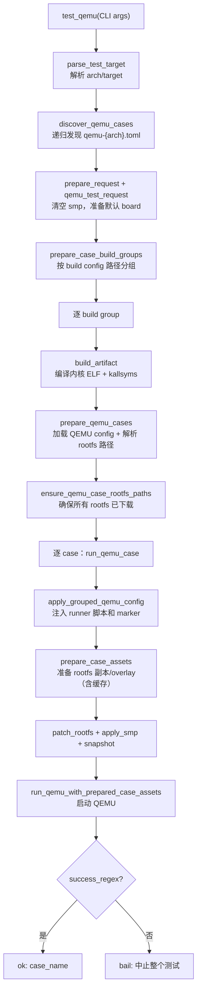

# StarryOS 测试

StarryOS 测试直接从 `test-suit/starryos/` 根目录发现用例，通过 **build wrapper**（含 `build-{target}.toml` 的目录）划分构建组。同一 wrapper 下的 case 共享一次内核构建，避免重复编译。

测试编排（用例发现、分组构建、资产准备、结果判定）由 `scripts/axbuild/src/test/` 提供统一框架，核心原则是 **OS 只构建一次，逐 case 运行**——具有相同构建配置的用例归入同一 build wrapper，组内共享一次内核编译。共享框架的完整说明见 [测试基础设施](../test_infra)；本文描述 StarryOS 特有的测试目录结构和用例组织方式。

## 命令

```text
cargo xtask starry test qemu --arch <arch> [--test-case <case>] [--list]
cargo xtask starry test board --board <type> --server <host> --port <port> [--test-case <case>] [--list]
```

`--arch` 与 `--target`/`--list` 三选一（`test qemu`）。

## 目录结构

StarryOS 的测试目录组织为**平铺 + build wrapper**：

```text
test-suit/starryos/
├── qemu-smp1/                    ← build wrapper（含 build-riscv64gc-unknown-none-elf.toml）
│   ├── build-riscv64gc-unknown-none-elf.toml
│   └── system/
│       └── qemu-riscv64.toml     ← 子 case（继承 wrapper 的 build config）
├── qemu-smp4/                    ← 另一个 build wrapper（不同 SMP 配置）
│   ├── build-riscv64gc-unknown-none-elf.toml
│   └── system/
│       └── qemu-riscv64.toml
└── board-*/                      ← 板级 build wrapper
    └── <case>/board-{board}.toml
```

与 [ArceOS 测试](../arceos/test)（区分 `rust/` 和 `c/` 子目录）不同，StarryOS 从 `test-suit/starryos/` 根目录直接发现 QEMU/board 用例，不按语言分子目录。

### Build Wrapper 的意义

`qemu-smp1` 和 `qemu-smp4` 分别测试单核和多核场景，它们的构建配置不同（SMP 核数不同），因此必须分别编译；每个 wrapper 下的 `system` 聚合用例使用完全相同的内核，只需编译一次并启动一次。发现算法通过识别 `build-{target}.toml` 文件来自动划分构建边界，build wrapper 是含 `build-{target}.toml` 的目录，定义一组共享相同构建配置的用例。

## QEMU 测试执行流程

StarryOS 的 QEMU 测试执行链位于 `starry/test/qemu_run.rs::test_qemu()`。核心是 **build group 分组 → 每组一次内核编译 → 逐 case 注入 rootfs 资产并运行 QEMU**。下图描述从 CLI 到结果判定的完整数据流。



### 关键步骤源码行为

| 步骤 | 源码位置 | 行为 |
|------|----------|------|
| 用例发现 | `qemu_discovery.rs::discover_qemu_cases()` | 递归扫描 `test-suit/starryos/`，通过 `nearest_build_wrapper()` 关联每个用例到最近的 `build-*.toml` |
| 默认 board | `board::default_board_for_target()` | 从 `os/StarryOS/configs/board/` 查找 target 匹配的 `qemu-*` board，缺失时报错 |
| 构建分组 | `qemu_test::prepare_case_build_groups()` | 按 `build_config_path` 分组，每组共享 `(request, cargo)` |
| 内核编译 | `build_artifact()` | 调用共享 Cargo 装配 + `postprocess_starry_artifact()`（kallsyms + 可选 uImage） |
| QEMU config | `read_qemu_config_from_path_for_cargo()` | 从用例的 `qemu-<arch>.toml` 加载，替换 managed rootfs 路径 |
| rootfs 准备 | `ensure_qemu_case_rootfs_paths()` | 区分 default rootfs（`ensure_rootfs_in_tmp_dir`）和 managed rootfs（`ensure_optional_managed_rootfs`） |
| grouped 校验 | `validate_grouped_qemu_commands()` | 检查 `test_commands` 非空且无空命令 |

### 单个 case 运行（`run_qemu_case`）

每个 case 在 QEMU 运行前完成以下处理：

1. **Grouped runner 注入**：`apply_grouped_qemu_config()` 设置 `shell_init_cmd`、`success_regex`（`STARRY_GROUPED_TESTS_PASSED`）和 `fail_regex`。
2. **SMP 覆盖**：`apply_smp_qemu_arg()` 从 QEMU config 反读 `-smp` 值（`smp_from_qemu_arg`），写入用例声明的核数。
3. **Timeout 缩放**：`apply_timeout_scale()` 按 `AXBUILD_TEST_TIMEOUT_SCALE` 放大。
4. **资产准备**：`prepare_case_assets()` 进入共享的 `test/case/` 层（见 [测试基础设施](../test_infra#7-资产准备与-rootfs-缓存)），StarryOS 的 `prepare_staging_root` 钩子额外完成 DNS 注入和 APK 区域配置。
5. **rootfs 补丁**：`patch_rootfs()` 把 prepared rootfs 路径写入 QEMU `-drive`，模式为 `EnsureDiskBootNet`。
6. **UEFI snapshot**：若 `qemu.uefi`，调用 `apply_drive_snapshot_without_global_snapshot()` 改写全局 snapshot 为 per-drive。
7. **Host HTTP**：`start_qemu_case_host_http_server()` 按需启动。
8. **Backtrace capture**：Build Config 启用 `BACKTRACE`/`DWARF` 时，流式捕获 backtrace 块并可选符号化。

### 失败语义

StarryOS QEMU 测试采用**首例失败即中止**策略：任一 case 失败时 `bail!("starry qemu test aborted: case ... failed")`，不继续运行后续 case。这与 ArceOS/Axvisor 的"收集全部失败后汇总"策略不同。

## Board 测试

板级用例通过 `board-{board_name}.toml` 配置文件定义，发现算法递归扫描目录匹配 `board-*.toml`，每个 board case 通过 `nearest_build_wrapper()` 向上查找最近的 build wrapper 确定构建配置。`--test-case` 和 `--board` 支持按用例名和板卡名过滤。

## GroupedCaseRunnerConfig

StarryOS 的 grouped runner 标记前缀由 `GroupedCaseRunnerConfig` 定义（`starry/test/assets.rs`），生成的日志形如：

```text
STARRY_GROUPED_TEST_BEGIN: step=1/3 epoch=... command=/usr/bin/test-a
STARRY_GROUPED_TEST_PASSED: step=1/3 epoch=... status=0 command=/usr/bin/test-a
STARRY_GROUPED_TESTS_PASSED
```

axbuild 通过这些结构化标记精确统计每条命令的通过/失败状态。`success_regex` 设为 `STARRY_GROUPED_TESTS_PASSED`（全部通过），`fail_regex` 含 `STARRY_GROUPED_TESTS_FAILED` 和单步 `STARRY_GROUPED_TEST_FAILED`。runner 脚本生成和 marker 协议的完整说明见 [测试基础设施](../test_infra#8-grouped-runner-协议)。
