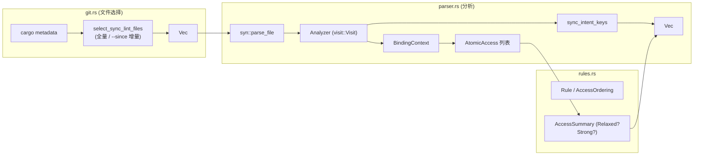

# Sync Lint

`cargo xtask sync-lint` 是 axbuild 自带的、面向同步语义的静态检查器。Clippy 并不会报告“用 `Relaxed` 排序的原子量在同步路径上是否安全”，而这种误用正是内核/并发代码里最难调试的 bug 来源之一。sync-lint 用 `syn` 对 workspace 内全部 Rust 源文件做语法分析，识别三类**高置信度**的 `Relaxed` 误用模式并直接报错。

> “高置信度”意味着 sync-lint 故意保持保守：它只报告那些在常见同步原语（自旋等待、release/acquire 配对、混合排序）中几乎肯定是 bug 的模式，不做跨函数/跨 crate 的复杂推导，因此误报率低、可在 CI 上 `-D` 强制执行。

## 三条规则

| Rule | label | 触发条件 |
|------|-------|----------|
| `WaitCondition` | `suspicious_relaxed_wait_condition` | 自旋等待闭包/循环的条件中出现了 `Relaxed` 的 atomic load |
| `PublishBeforeNotify` | `suspicious_relaxed_publish_before_notify` | 同一语句块中先做 `Relaxed` 写（publish），紧接下一句做 notify/wake 类调用 |
| `MixedOrdering` | `suspicious_relaxed_mixed_ordering` | 同一同步变量上同时存在 `Relaxed` 和更强排序的访问 |

被判定为“同步意图”的变量来源包括：等待循环条件中读取的原子量、publish-then-notify 模式中的写目标、以及显式被 `core::sync::atomic` / `atomino` / 项目内 atomic 类型访问的表达式（详见 `parser.rs::atomic_accesses_in_expr` 及 `mark_sync_intent_expr`）。`MixedOrdering` 要求该变量同时被 Relaxed 和 Strong 两种方式访问，才会对 Relaxed 那次访问点报错。

## 架构概览



## 模块组成

| 代码位置 | 作用 |
|----------|------|
| `scripts/axbuild/src/sync_lint/mod.rs` | CLI 入口、`SyncLintArgs`、结果打印与退出码 |
| `scripts/axbuild/src/sync_lint/git.rs` | 通过 cargo metadata 枚举 workspace 包和 Rust 源文件；`--since` 增量选择 |
| `scripts/axbuild/src/sync_lint/parser.rs` | `syn` 语法分析与 `Analyzer` 访问者，产生 `Finding` |
| `scripts/axbuild/src/sync_lint/rules.rs` | 规则枚举、`AtomicAccess` / `AccessSummary` / `AnalysisResult` 数据模型 |
| `scripts/axbuild/src/sync_lint/tests.rs` | 每条规则的回归用例 |

## 语法分析架构

`Analyzer` 基于 `syn::visit::Visit` trait 实现，遍历 AST 时维护三类状态：

```rust
struct Analyzer<'a> {
    path: &'a Path,              // 当前文件路径（用于 finding 定位）
    lines: Vec<&'a str>,         // 源码行（用于 ignore 注释检查）
    result: AnalysisResult,      // 累积的 accesses / sync_intent_keys / findings
    bindings: BindingContext,    // 变量绑定作用域栈
    impl_self_types: Vec<String>, // 当前所在的 impl Self 类型
}
```

`AnalysisResult` 收集三类信息：

| 字段 | 类型 | 含义 |
|------|------|------|
| `accesses` | `Vec<AtomicAccess>` | 所有检测到的原子访问（含 key、span、ordering） |
| `sync_intent_keys` | `HashSet<String>` | 被判定为"同步意图"的变量 key 集合 |
| `findings` | `Vec<Finding>` | 最终报告的问题列表 |

`finish()` 方法在遍历结束后做交叉分析：对每个"既是同步意图、又同时存在 Relaxed 和 Strong 访问"的变量，对其 Relaxed 访问点报告 `MixedOrdering`。

### 变量绑定与作用域

`BindingContext` 维护一个作用域栈（`Vec<HashMap<String, String>>`），把源码中的变量名映射到唯一的 `binding#N` key。这样即使两个不同函数中都叫 `flag` 的变量，也能区分开，不会误报 `MixedOrdering`。

作用域在以下节点压栈/出栈：

| AST 节点 | 行为 |
|----------|------|
| `visit_item_fn` | 绑定函数参数，遍历函数体后出栈 |
| `visit_impl_item_fn` | 绑定 `self`（关联到 impl 的 Self 类型 key）和参数 |
| `visit_expr_closure` | 绑定闭包参数 |
| `visit_expr_for_loop` | 绑定循环变量 |
| `visit_block` | 压栈（支持嵌套块） |
| `visit_local` | `let` 绑定：先访问初始化表达式，再绑定模式 |

`bind_pat` 递归处理模式匹配（`Ident`、`Or`、`Paren`、`Reference`、`Slice`、`Struct`、`Tuple` 等），确保解构赋值中的每个绑定变量都能获得唯一 key。

`visit_item_impl` 维护 `impl_self_types` 栈，使得 `visit_impl_item_fn` 中的 `self` 参数能绑定到 `receiver:<Self类型>`，区分不同 impl 块中的 `self` 引用。

### `#[app]` 宏展开

`visit_item_macro` 特殊处理 `#[app]` 宏（ArceOS 的应用入口宏）：如果宏路径的最后一段是 `app`，则尝试把宏 token 解析为 `File` 并递归访问。这使得宏体内定义的函数和原子访问也能被分析。

## 三条规则的检测算法

### WaitCondition

在两种场景下检测"等待条件中的 Relaxed load"：

**场景 1：等待闭包**（`check_wait_closure`）

当 `Analyzer` 遇到已知等待函数/方法（如 `spin::SpinLock::wait_while`）的闭包参数时，检查闭包体内是否存在 Relaxed load：

```rust
// 会触发 WaitCondition
lock.wait_while(|| flag.load(Ordering::Relaxed) == 0);
```

等待函数/方法的识别由 `is_wait_function` / `is_wait_method` 完成（基于函数名匹配）。

**场景 2：阻塞 while 循环**（`visit_expr_while`）

`while` 循环条件中出现 Relaxed load **且**循环体含阻塞调用（`block_contains_blocking_call`，识别 `sleep`、`yield_now`、`spin_loop_hint` 等）时报 `WaitCondition`：

```rust
// 会触发 WaitCondition（条件 Relaxed + 体含 sleep）
while flag.load(Ordering::Relaxed) == 0 {
    core::hint::spin_loop();
}
```

两种场景都会把闭包/条件中的原子访问标记为同步意图（`mark_sync_intent_expr`），供 `MixedOrdering` 交叉分析使用。

### PublishBeforeNotify

`check_block_for_publish_before_notify` 检查语句块中**相邻两条语句**的模式：第一条是原子写（publish），第二条是观察者事件（wake/notify/调度）。

```rust
// 会触发 PublishBeforeNotify
{
    data.store(42, Ordering::Relaxed);  // 第一句：Relaxed publish
    waker.wake();                        // 第二句：notify
}
```

`atomic_write_access` 判定第一条语句是否为原子写，`is_observer_event_expr` 判定第二条是否为 wake/notify/调度类调用。使用 `statements.windows(2)` 滑动窗口检查所有相邻对。当写是 Relaxed 时报告 `PublishBeforeNotify`；无论写排序如何，都把该变量标记为同步意图。

正确的写法应为 publish 使用 `Release` 排序，确保 notify 前的数据写入对被唤醒者可见。

### MixedOrdering

`finish()` 中的交叉分析：对每个变量，如果它同时满足三个条件，则对其 Relaxed 访问点报告 `MixedOrdering`：

1. 是同步意图（被 `WaitCondition` 或 `PublishBeforeNotify` 标记）
2. 存在 Relaxed 访问
3. 存在 Strong（Acquire/Release/AcqRel/SeqCst）访问

```rust
// 会触发 MixedOrdering（同一变量混用 Relaxed 和 Acquire）
flag.store(1, Ordering::Relaxed);       // Relaxed 写
while flag.load(Ordering::Acquire) {}    // Acquire 读
```

这个规则不单独检查某一行，而是基于整个文件中同一变量的所有访问汇总判断。`AccessSummary` 记录每个变量是否有 Relaxed / Strong 访问。

## 文件选择

`SyncLintArgs` 仅有一个 `--since <REF>` 参数：

- 省略：扫描整个 workspace 全部 Rust 源文件（`workspace_rust_source_files`）。
- 指定：通过 `support::git::changed_paths_since` 取得 `<REF>..HEAD` 的变更路径，过滤出 `.rs`、且位于 workspace 包目录内的文件。
- 若 git diff 失败或变更路径越出 workspace，**自动回退到全量扫描**并打印回退原因，确保 CI 不会因为 ref 不可解析而静默放过问题。

## 并行分析

`files_findings` 按 `available_parallelism` 把文件列表切片，在 `thread::scope` 中并行分析；每个 worker 独立 `syn::parse_file` 并收集 `Finding`，最后按 `(path, line, column, rule, message)` 排序输出。文件数较少或单核时回退到 `files_findings_sequential`，避免线程开销。

## 报告与抑制

每个 finding 输出 `path:line:column: <message> [<rule_label>]`，与 cargo/gcc 风格一致，便于 IDE 跳转。存在任何 finding 即 `bail!`，使 CI 失败。

可以通过在触发行**前三行内**添加注释来抑制单条规则：

```rust
// sync-lint: ignore suspicious_relaxed_wait_condition
while flag.load(Ordering::Relaxed) == 0 {}
```

注释中包含具体 rule label 时仅抑制该规则；不包含任何 `suspicious_relaxed_` 子串时（即只写 `sync-lint: ignore`）则抑制全部三条规则——后者应谨慎使用，PR review 时通常会被要求改成具名抑制。抑制判定见 `Analyzer::is_ignored`。

## 用法示例

```bash
# 全量扫描（CI 默认）
cargo xtask sync-lint

# 增量扫描：只检查自 origin/main 以来变更的 Rust 文件
cargo xtask sync-lint --since origin/main
```

> sync-lint 是语法层分析，不做跨函数数据流，因此只能识别**局部**可判定的可疑模式。对于真正复杂的同步（跨函数、跨 crate 的 happens-before 推理）仍需依赖 review 和 lockdep/运行时校验。它的设计目标是“零误报地挡住最常见的 Relaxed 误用”，而不是替代人工分析。
