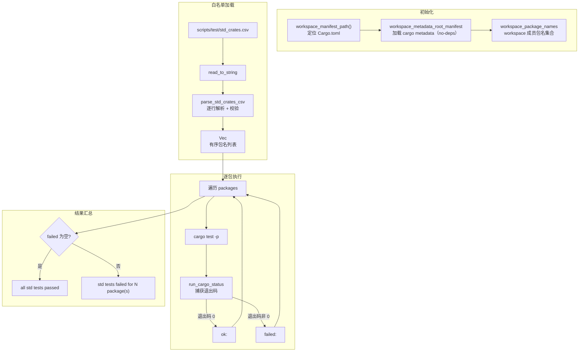

# Std 白名单测试

`cargo xtask test` 是 axbuild 在 host 端执行的 Rust std 测试入口。它不是 `cargo test --workspace`：TGOSKits workspace 中混合了大量 `#![no_std]` 内核 crate，它们无法在标准 `cargo test` 环境下运行；盲目全量测试会因平台/特性不兼容大面积失败。本命令只对一份**显式维护的白名单**中的 crate 逐一执行 `cargo test -p <package>`，确保这些已知能在 host 环境通过测试的 crate（如纯算法库、工具库、无硬件依赖的组件）保持回归覆盖。

## 为什么需要白名单

TGOSKits workspace 目前包含近 150 个 crate，其中绝大多数是面向裸机/内核环境的 `#![no_std]` crate，依赖 `axcpu`、特定 target triple、`axconfig.toml` 等才能编译。直接对全 workspace 跑 `cargo test` 会触发两类系统性失败：

1. **`no_std` crate 无法在 std 环境编译**：这些 crate 的 `#[cfg(test)]` 模块通常不存在，或依赖内核特性。
2. **target/feature 不匹配**：许多 crate 需要 `--target aarch64-unknown-none-softfloat` 和特定 feature 组合才能编译，host 端 `cargo test` 无法满足。

白名单机制把 host 可测的 crate（算法库、工具库、序列化库等）显式列出，CI 对这一固定集合做全量回归，既保证覆盖又避免噪声。

## 架构概览



## 白名单文件

白名单位于 `scripts/test/std_crates.csv`，格式极简——每行一个包名，首行为表头 `package`：

```csv
package
aarch64_sysreg
ax-errno
ax-io
ax-kspin
bitmap-allocator
irq-framework
memory_addr
page_table_entry
rsext4
scope-local
...
```

当前白名单包含约 50 个 crate，覆盖架构寄存器、错误码、I/O 抽象、锁原语、内存地址、页表项、文件系统、调度器、中断框架等可在 host 端独立测试的组件。

### 解析与校验

`parse_std_crates_csv` 对 CSV 内容执行严格校验，确保白名单与 workspace 实际状态一致：

| 校验项 | 规则 | 失败行为 |
|--------|------|----------|
| 文件非空 | 至少有表头行 | `std crate csv is empty` |
| 表头 | 首行必须为 `package`（自动去除 BOM `\u{feff}` 前缀） | `invalid header at line N: expected 'package', found '...'` |
| 空行 | 空行与首尾空白被忽略，不产生条目 | 跳过 |
| 已知包 | 每个包名必须是当前 workspace 的成员（对照 `workspace_package_names`） | `unknown workspace package at line N` |
| 去重 | 同一包名不允许出现两次 | `duplicate package at line N` |

所有错误信息都带**行号**，便于快速定位 CSV 中的问题条目。`workspace_package_names` 通过 `cargo metadata`（`--no-deps` 模式，因为只需要 workspace 成员信息）获取当前 workspace 的全部成员包名集合——这意味着如果某个包被从 workspace 移除但 CSV 未同步更新，校验阶段就会报错。

### BOM 处理

CSV 文件首行可能包含 UTF-8 BOM（`\u{feff}`），常见于 Windows 编辑器保存的文件。`parse_std_crates_csv` 通过 `header.trim_start_matches('\u{feff}')` 自动去除 BOM 后再校验表头，确保跨平台兼容。

## 执行模型

`run_std_test_command` 是 CLI 入口（`Commands::Test` → `test::std::run_std_test_command()`）。加载白名单后，`run_std_tests` 对每个包依次执行 `cargo test -p <package>`：

```rust
fn cargo_test_args(package: &str) -> Vec<String> {
    vec!["test".into(), "-p".into(), package.into()]
}
```

关键设计决策：

| 决策 | 说明 |
|------|------|
| **非 fail-fast** | 单包失败不中断后续包，所有包都会跑完，最终汇总全部失败 |
| **无 feature 展开** | 不做 `--no-default-features` 或 feature 矩阵展开（与 [Clippy](./clippy) 的 feature × target 矩阵不同） |
| **无 target 指定** | 使用 host 默认 target，不交叉编译 |
| **继承进程环境** | `cargo test` 继承当前进程的全部环境变量 |

非 fail-fast 的设计动机：std 测试是回归门禁，开发者需要一次性看到所有失败包，而非逐个修复后再跑。这与 [Clippy](./clippy) 的 fail-fast（快速暴露首个问题以减少 CI 资源占用）形成互补——两者面向不同场景。

### 执行输出

每个包执行时打印进度和结果：

```text
[1/50] cargo test -p aarch64_sysreg
ok: aarch64_sysreg
[2/50] cargo test -p ax-errno
ok: ax-errno
...
[15/50] cargo test -p memory_addr
failed: memory_addr
...
```

进度前缀 `[N/M]` 中 M 是白名单总数，N 是当前序号（从 1 开始）。

## 结果汇总

全部包执行完毕后，根据 `failed` 列表判定最终结果：

| 情况 | 输出 | 退出码 |
|------|------|--------|
| 全部通过 | `all std tests passed` | 0 |
| 存在失败 | `std tests failed for N package(s): <pkg1>, <pkg2>, ...` | 非 0（`bail!`） |

失败列表以逗号分隔，按执行顺序（非字母序）排列。

## CargoRunner 抽象与可测试性

`CargoRunner` trait 把"执行 cargo test"这一副作用抽象出来，便于单元测试：

```rust
trait CargoRunner {
    fn run_test(&mut self, workspace_root: &Path, package: &str) -> anyhow::Result<bool>;
}
```

生产代码使用 `ProcessCargoRunner`（实际调用 `cargo` 子进程），测试代码使用 `FakeCargoRunner`（按预设的 `HashMap<package, success>` 返回结果）。`std.rs` 的 `#[cfg(test)] mod tests` 覆盖：

- CSV 解析：合法格式、空行、空文件、非法表头、未知包、重复包
- 执行器：多包部分失败时正确收集全部失败包名、全部通过时返回空失败列表
- workspace 集成：`workspace_package_name_extraction_reads_current_workspace` 确认能正确读取当前 workspace 的包名

## 白名单维护

白名单不是静态的——随着 workspace 演进，新的可测 crate 需要加入，不再适用的需要移除。审计与更新流程由 `update-std-tests` 技能封装（`.claude/skills/update-std-tests/SKILL.md`）：

- 比较 workspace packages 与 CSV，列出"在 workspace 中但不在 CSV"的候选（可能需要加入）
- 列出"在 CSV 中但不在 workspace"的条目（必须移除，否则校验报错）
- 对候选包逐一验证 `cargo test -p <pkg>` 是否在 host 通过，通过的才加入白名单

手动编辑 CSV 时，确保每个新增包名是 workspace 成员且 `cargo test -p <pkg>` 在 host 通过即可。

## 模块组成

| 代码位置 | 作用 |
|----------|------|
| `scripts/axbuild/src/test/std.rs` | 全部逻辑：CLI 入口 `run_std_test_command`、CSV 解析 `parse_std_crates_csv`、执行器 `run_std_tests` + `CargoRunner` trait、单元测试 |
| `scripts/test/std_crates.csv` | 白名单数据（包名一行一个，首行表头 `package`） |

## 用法

```bash
# 运行白名单中所有 crate 的 std 测试（CI 默认）
cargo xtask test
```

无任何参数。要新增或移除白名单条目，直接编辑 `scripts/test/std_crates.csv`（或在 review 中按 `update-std-tests` 技能的流程核对）。
