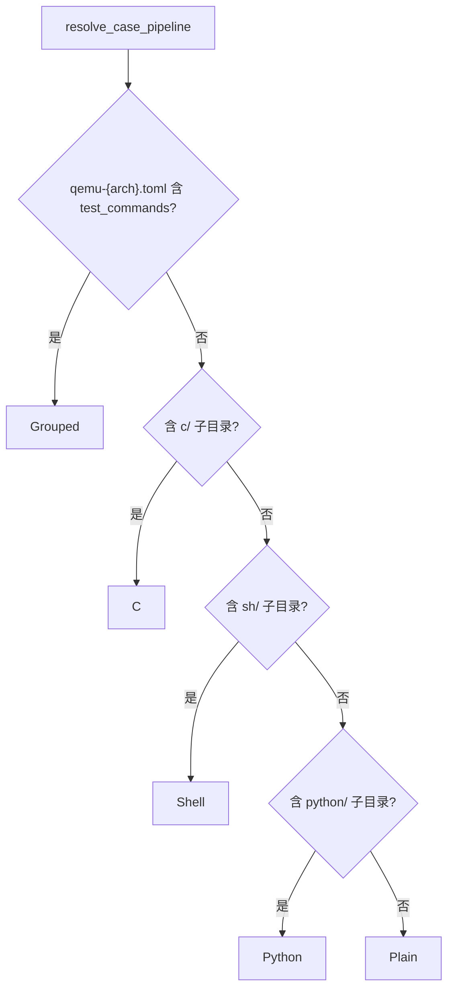
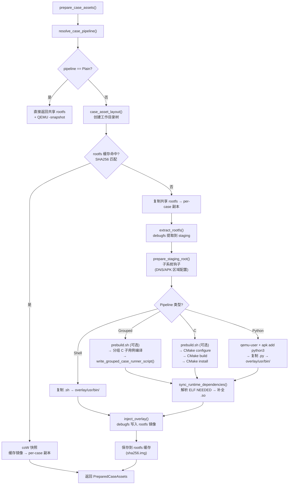

# 资产准备

资产准备是用例发现与 QEMU 执行之间的桥梁。它根据每个用例的类型（Plain/C/Shell/Python/Grouped），决定是否需要向 rootfs 镜像中注入额外的文件（可执行程序、脚本、Python 解释器等），并生成 per-case 的 rootfs 副本供 QEMU 使用。

资产准备的性能优化依赖 **SHA256 内容哈希缓存**：当用例源文件和 rootfs 基础镜像都没有变化时，直接从缓存复制（利用 CoW 快照），跳过 CMake 编译和 overlay 注入等耗时操作。这使得重复运行测试套件的速度大幅提升。

## Pipeline 判定

`resolve_case_pipeline()` 根据用例目录内容判定资产处理方式，**互斥**（只能选一种）：



| Pipeline | 触发条件 | 处理方式 |
|----------|----------|----------|
| **Plain** | 无 `c/`、`sh/`、`python/`，无 `test_commands` | 直接使用共享 rootfs，QEMU `-snapshot` |
| **Grouped** | `test_commands` 非空 | 生成 runner 脚本 → overlay 注入 rootfs |
| **C** | 含 `c/` 子目录 | CMake 交叉编译 → 安装到 overlay → 注入 rootfs |
| **Shell** | 含 `sh/` 子目录 | 复制脚本到 `/usr/bin/` → overlay 注入 rootfs |
| **Python** | 含 `python/` 子目录 | 安装 python3 + 复制 `.py` → overlay 注入 rootfs |

Pipeline 判定的优先级顺序是有意义的：`test_commands` 优先于目录检测，因为 Grouped 模式可能在没有任何资产子目录的情况下使用。五种 Pipeline 的处理复杂度从 Plain（零成本）到 C（需要完整的交叉编译工具链）递增。

## Rootfs 内容操作原语

所有需要注入的 pipeline 都依赖三个底层原语对 ext2/3/4 rootfs 镜像进行内容操作，由 `rootfs/inject.rs` 和 `rootfs/runtime.rs` 提供：

| 原语 | 函数 | 工具 | 说明 |
|------|------|------|------|
| **提取** | `extract_rootfs()` | `debugfs -R "rdump / ..."` | 将 rootfs 镜像完整提取到 staging 目录 |
| **注入** | `inject_overlay()` | `debugfs` 写脚本 | 遍历 overlay 目录树，生成 `rm/write/sif` 命令批量写入镜像 |
| **同步** | `sync_runtime_dependencies()` | `readelf` + `debugfs` | 扫描 overlay 中的 ELF 二进制，解析 NEEDED 共享库依赖，从 staging root 补全缺失的 `.so` |

其中 `sync_runtime_dependencies()` 是一个递归发现的过程：遍历 overlay 中的每个 ELF 文件 → 用 `readelf -d` 读取 NEEDED 列表 → 在 staging root 的 `lib/`、`usr/lib/`、`usr/local/lib/` 中查找对应文件 → 复制到 overlay → 对新复制的 `.so` 文件递归执行同样检查。这确保了交叉编译的二进制在 Alpine Linux rootfs 中能找到所有运行时依赖。

## 总体流程

`prepare_case_assets()` 根据 pipeline 类型决定完整的资产准备链路：



对于 Plain 用例，资产准备几乎是零开销——直接使用共享的 rootfs 镜像，配合 QEMU 的 `-snapshot` 选项实现无写回的只读运行。对于需要注入的用例，完整流程为：创建 per-case 工作目录 → 检查缓存 → 缓存未命中时复制共享 rootfs → `debugfs rdump` 提取 rootfs 到 staging → 子系统钩子准备 staging 环境 → 执行具体 pipeline 构建 → `sync_runtime_dependencies()` 补全 ELF 依赖 → `debugfs` 注入 overlay → 写入缓存。缓存命中时使用 `cp --reflink=auto`（在 Btrfs/XFS 等支持 CoW 的文件系统上几乎是瞬间完成）。

## 工作目录布局

每个需要注入的 case 会创建以下目录树：

```text
target/{target}/qemu-cases/{case_name}/
├── cache/
│   ├── apk-cache/              APK 包缓存（跨 run 复用）
│   └── rootfs/                 预注入 rootfs 缓存（{sha256}.img）
└── runs/{pid}-{sequence}/
    ├── staging-root/            rootfs 内容提取暂存
    ├── build/                   CMake 构建目录
    ├── overlay/                 overlay 注入内容
    │   └── usr/bin/             可执行文件/脚本
    ├── cross-bin/               交叉编译 wrapper 脚本
    ├── guest-bin/               guest 命令 wrapper
    ├── cmake-toolchain.cmake    CMake 工具链文件
    └── case-rootfs.img          per-case rootfs 副本
```

工作目录按 `case_name` 隔离，使得不同用例的构建产物和缓存互不干扰。`cache/` 目录在多次运行间持久存在（缓存命中检查在此进行），`runs/` 目录按 `{pid}-{sequence}` 命名以支持并发执行。`overlay/` 目录中的内容会被整体注入到 rootfs 镜像中——`inject_overlay()` 函数遍历 overlay 目录树，将文件逐个复制到 rootfs 对应路径。

## Rootfs 缓存

为避免重复的资产准备（CMake 编译、overlay 注入、debugfs 写操作），系统使用 **SHA256 内容哈希** 缓存。缓存的 per-case rootfs 镜像以 `{sha256}.img` 文件名存储在 `cache/rootfs/` 目录下。

缓存键（`case_asset_cache_key()`）由以下因素组合计算：

| 因素 | 说明 |
|------|------|
| 版本标记 `v2` | 缓存格式版本，变更时全局失效 |
| `arch`、`target` | 目标架构和 triple |
| `case.display_name` | 用例标识 |
| `pipeline` 类型 | Plain/C/Sh/Python/Grouped |
| `cache_env_vars` | 子系统指定的环境变量（如 `STARRY_APK_REGION`），运行时取值纳入哈希 |
| CMake 工具链模板 | 仅 C pipeline，`include_str!("cmake-toolchain.cmake.in")` |
| Python 版本标记 | 仅 Python pipeline（`python-apk-v1`） |
| rootfs 镜像元数据 | **仅文件大小**（不含 mtime，因为在 Docker/NFS/CI 中 mtime 不可靠） |
| case 目录递归哈希 | case_dir 下所有文件的路径+内容的 SHA256 |
| QEMU 配置文件 | 仅当 `qemu_config_path` 不在 `case_dir` 内时纳入 |

缓存命中检查还要求文件大小 ≥ 1 MiB（`is_valid_rootfs_cache_image()`），防止不完整写入导致的假命中。

缓存命中时，直接 `cp --reflink=auto`（CoW 快照）复制缓存镜像，跳过所有构建和注入步骤。`--reflink=auto` 在 Btrfs/XFS 等支持 `FICLONE` ioctl 的文件系统上实现零拷贝快照，在 ext4 上退化为 `fs::copy()`。

## Grouped Pipeline

Grouped case 的完整流程为：

1. `extract_rootfs` → `prepare_staging_root`（与 C Pipeline 相同的 staging 准备）
2. 如果包含 C 子用例（`subcases[].kind == C`）：按子用例分别执行 `prebuild.sh` + CMake configure/build/install
3. `write_grouped_case_runner_script()` — 生成一个 shell runner 脚本，按顺序执行 `test_commands` 中的每条命令
4. `sync_runtime_dependencies()` — 递归补全 ELF 运行时依赖
5. `inject_overlay()` — 将 overlay（runner + 子用例产物 + 依赖库）写入 rootfs

生成的 runner 脚本按顺序执行每条命令，输出带有结构化标记的日志：

```bash
#!/bin/sh
set -u
failed=0
printf '%s\n' 'SUITE_GROUPED_TEST_BEGIN: /usr/bin/test-a'
if sh -c '/usr/bin/test-a'; then
    printf '%s\n' 'SUITE_GROUPED_TEST_PASSED: /usr/bin/test-a'
else
    status=$?
    printf '%s status=%s\n' 'SUITE_GROUPED_TEST_FAILED: /usr/bin/test-a' "$status"
    failed=1
fi
# ... 更多命令 ...
if [ "$failed" -eq 0 ]; then
    printf '%s\n' 'SUITE_GROUPED_TESTS_PASSED'
    exit 0
fi
printf '%s\n' 'SUITE_GROUPED_TESTS_FAILED'
exit 1
```

QEMU 配置被覆盖：`shell_init_cmd` → runner 路径，`success_regex` / `fail_regex` → grouped 专用正则（通过 `apply_grouped_qemu_config()` 实现）。

Grouped Pipeline 的设计动机是支持一个用例内执行多条命令并分别判定结果。生成的 runner 脚本按顺序执行每条命令，输出带有结构化标记（`{PREFIX}_GROUPED_TEST_BEGIN/PASSED/FAILED`，前缀如 `STARRY` 由各子系统的 `GroupedCaseRunnerConfig` 定义）的日志，使得 axbuild 可以通过正则匹配精确统计每条命令的通过/失败状态。QEMU 配置中的 `shell_init_cmd` 和正则被自动覆盖为 grouped 专用版本。

此外，Grouped 用例可以包含 C 子用例（通过 `discover_qemu_subcases()` 检测子目录中的 `c/` 目录），这些子用例会被独立执行 CMake 构建，产物注入到与 runner 相同的 overlay 中。

## C Pipeline

C 用例通过 CMake 交叉编译，并将产物注入到 rootfs。完整流程为：

1. `extract_rootfs(rootfs_img, staging_root)` — 用 `debugfs rdump` 将 rootfs 提取到 staging 目录
2. `prepare_staging_root(staging_root)` — 子系统钩子（StarryOS 注入 DNS/AKP 配置，ArceOS 跳过）
3. `write_musl_loader_search_path(arch, staging_root)` — 写入 `/etc/ld-musl-{arch}.path` 配置动态链接器搜索路径
4. 可选 `prebuild.sh` — 如果 `c/prebuild.sh` 存在，在 qemu-user 环境下执行（用于需要 guest 环境的构建步骤）
5. `prepare_host_cross_build_env(arch, layout, qemu_runner)` — 生成 `cmake-toolchain.cmake`（含 CC、CXX、AR、RANLIB、SYSROOT、CMAKE_SYSTEM_PROCESSOR）
6. `cmake -B build -DCMAKE_INSTALL_PREFIX=/usr -DCMAKE_TOOLCHAIN_FILE=...`
7. `cmake --build build`
8. `cmake --install build --prefix overlay/usr`
9. `sync_runtime_dependencies(staging_root, overlay)` — 解析 CMake 产物的 ELF NEEDED，从 staging root 补全缺少的 `.so`
10. `inject_overlay(rootfs, overlay)` — 通过 `debugfs` 将 overlay 目录树写入 rootfs 镜像

C Pipeline 是最复杂的资产处理流程，涉及完整的交叉编译工具链配置、qemu-user 环境下的 prebuild 脚本执行、以及运行时依赖的递归解析。`cross_compile_spec(arch)` 根据目标架构返回 musl 交叉编译器的路径前缀（如 `aarch64-linux-musl-`）和 LLVM target triple。

## Shell Pipeline

最简单的注入方式：

1. 复制 `sh/` 下所有文件到 `overlay/usr/bin/`
2. 设置可执行权限（0o755）
3. `inject_overlay(rootfs_copy, overlay_dir)`

Shell Pipeline 不涉及编译，仅做文件复制和权限设置。注入的脚本文件会被放到 rootfs 的 `/usr/bin/` 目录下，使得 QEMU 内的 shell 可以直接通过文件名调用。
