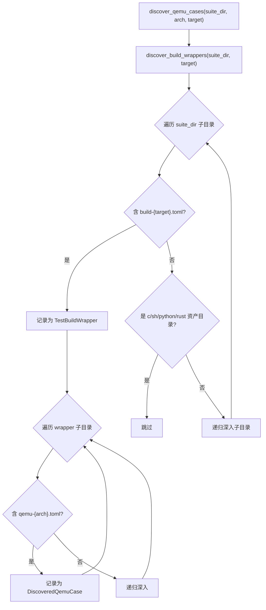

# 用例发现

用例发现是测试流程的第一个阶段，负责从 `test-suit/<os>/` 或子系统定义的测试根目录中扫描并收集所有可执行的测试用例。发现算法的核心逻辑是**识别 build wrapper（含 `build-{target}.toml` 的目录）和其中的 QEMU 用例（含 `qemu-{arch}.toml` 的目录）**，跳过资产目录（`c/`、`sh/`、`python/`、`rust/`）以避免误识别。

发现过程产生两级结构：外层是 `TestBuildWrapper`（定义构建边界），内层是 `DiscoveredQemuCase`（定义运行边界）。这两个结构体是实现"构建一次、逐 case 运行"的基础——分组函数根据 `build_config_path` 将 case 归入对应的 wrapper。

## 发现流程

发现算法采用两阶段栈式 DFS，先定位 build wrapper 再在其中查找 QEMU 用例：



整个发现流程分为两个阶段：第一阶段 `discover_build_wrappers()` 扫描出所有构建边界，第二阶段在每个 wrapper 内扫描出具体的测试用例。两阶段设计确保了构建边界和运行边界的清晰分离——一个 wrapper 定义"用什么配置编译"，一个 case 定义"运行什么、如何判定"。

## 核心数据结构

发现结果由两个核心结构体承载，分别表示构建边界和运行边界：

```rust
// 发现的构建包装器
struct TestBuildWrapper {
    name: String,                // 相对于测试根目录的路径（如 `qemu-smp1`）
    dir: PathBuf,               // 包装器目录路径
    build_config_path: PathBuf, // build-{target}.toml 路径
}

// 发现的 QEMU 测试用例
struct DiscoveredQemuCase {
    name: String,               // 用例名
    display_name: String,       // 显示名（含 build group 前缀，如 `qemu-smp1/system`）
    case_dir: PathBuf,          // 用例目录
    qemu_config_path: PathBuf,  // qemu-{arch}.toml 路径
    build_group: String,        // 所属 build wrapper 名称
    build_config_path: PathBuf, // 继承的构建配置路径
}
```

`TestBuildWrapper` 的 `name` 字段是相对于测试根目录的路径（如 `qemu-smp1`），用于构建分组的键。`DiscoveredQemuCase` 的 `display_name` 包含 build group 前缀（如 `qemu-smp1/system`），用于结果报告中区分来自不同构建组的同名用例。每个 case 都通过 `build_config_path` 回溯到所属的 wrapper，这是分组函数的工作基础。

## 发现算法细节

### Build Wrapper 发现

`discover_build_wrappers()` 采用**栈式 DFS**：
1. 从测试根目录开始，压栈所有子条目
2. 对每个目录，检查是否包含 `build-{target}.toml`
3. 若包含，记录为 `TestBuildWrapper`（不再深入）
4. 若是资产目录（`c/`、`sh/`、`python/`、`rust/`），跳过
5. 否则递归深入

栈式 DFS（而非递归）避免了深层嵌套目录时的栈溢出风险。当一个目录被识别为 build wrapper 后，算法不再深入其子目录——因为 wrapper 内的所有内容（包括子 case）都在第二阶段的 QEMU 用例发现中处理。资产目录（`c/`、`sh/` 等）被跳过是因为它们是用例的附属资源，而非独立的测试入口。

### QEMU 用例发现

`discover_qemu_cases()` 在 build wrapper 基础上：
1. 先检查 wrapper 根目录是否有 `qemu-{arch}.toml`（wrapper root case）
2. 再遍历 wrapper 子目录，查找含 `qemu-{arch}.toml` 的 case
3. 支持 `--test-case` 过滤：精确匹配 wrapper 名或 case 名
4. 跳过包含独立 `build-*.toml` 的子目录（避免误入嵌套 wrapper）

Wrapper root case 是一个特殊场景：当 `qemu-{arch}.toml` 直接位于 wrapper 目录下（而非子目录中）时，该 wrapper 自身也是一个可运行用例。`--test-case` 参数支持精确匹配，使得开发者可以只运行特定用例进行调试，而无需等待整个测试套件完成。

### 用例名称解析

| 场景 | 用例目录 | display_name |
|------|----------|-------------|
| wrapper root case | `qemu-custom/` + `qemu-riscv64.toml` | `qemu-custom` |
| wrapper 子 case | `qemu-smp1/system/` + `qemu-riscv64.toml` | `qemu-smp1/system` |
| 嵌套子 case | `qemu-custom/sub/deep/` + `qemu-riscv64.toml` | `qemu-custom/sub/deep` |

display_name 的命名规则确保了每个用例的唯一标识：以 build group 名为前缀，加上相对于 wrapper 的路径。嵌套子 case 场景支持在 wrapper 内进一步组织目录结构（如按功能分类），不影响分组的正确性。

## 按构建配置分组

发现的 case 通过 `BuildConfigRef` trait 和 `group_cases_by_build_config()` 函数按 `build_config_path` 分组：

```rust
// BuildConfigRef trait —— 所有子系统 case 都实现此 trait
trait BuildConfigRef {
    fn build_group(&self) -> &str;
    fn build_config_path(&self) -> &Path;
}

// 分组函数
fn group_cases_by_build_config<T: BuildConfigRef>(cases: &[T])
    -> Vec<QemuCaseGroup<'_, T>>
```

`BuildConfigRef` trait 是子系统间共享分组逻辑的关键抽象。ArceOS、StarryOS、Axvisor 各有自己的 case 类型，但都实现了此 trait，使得通用的 `group_cases_by_build_config()` 函数可以统一处理。

分组结果示例：

| build_group | build_config_path | cases |
|-------------|-------------------|-------|
| `qemu-smp1` | `.../qemu-smp1/build-riscv64gc-unknown-none-elf.toml` | system |
| `qemu-smp4` | `.../qemu-smp4/build-riscv64gc-unknown-none-elf.toml` | system |

上例中，`qemu-smp1/system` 和 `qemu-smp4/system` 分别共享各自 wrapper 的构建配置，每个聚合 case 在一次 StarryOS 启动内运行对应子测例。

### Board 用例发现

`discover_board_runtime_configs()` 递归扫描目录，匹配 `board-*.toml` 文件：

```rust
struct BoardRuntimeConfig {
    case_dir: PathBuf,       // board config 所在目录
    board_name: String,      // 从文件名提取（board-{name}.toml）
    config_path: PathBuf,    // board config 文件路径
}
```

每个 board config 通过 `nearest_build_wrapper()` 向上查找最近的 build wrapper 来确定构建配置。

`filter_board_test_groups()` 支持按 `--test-case` 和 `--board` 过滤。

Board 用例发现与 QEMU 用例发现的区别在于：board 配置文件按板卡名命名（如 `board-orangepi-5-plus.toml`），而非按架构。一个 board case 可能同时在多个架构上运行（只要板卡支持），因此 board 发现不按架构过滤。`nearest_build_wrapper()` 函数向上遍历目录树查找最近的 `build-{target}.toml`，使得 board case 可以复用已有 wrapper 的构建配置，也可以定义自己的构建配置。
