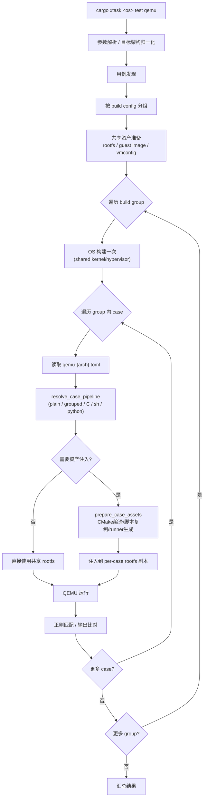

# 测试概述

`cargo xtask <os> test qemu/board` 命令在构建和运行的基础上增加了**用例发现、分组构建、资产准备和结果判定**。核心设计原则是 **OS 只构建一次，逐 case 运行**——具有相同构建配置的用例被归入同一组，组内共享完全相同的 OS 构建参数，因此只需编译一次。共享资产（rootfs 镜像等）在构建前准备完毕。然后进入双层循环：外层遍历 build group（每组构建一次 OS），内层遍历组内用例（每个用例独立准备资产、运行 QEMU、匹配结果）。最后汇总所有用例的通过/失败结果。

测试系统需要解决的核心问题是：在多种架构、多种用例类型（Rust/C/Shell/Python/Grouped）、多种运行环境（QEMU/Board）的组合下，提供统一的测试编排能力。axbuild 通过一套共享的测试基础设施（`scripts/axbuild/src/test/`）实现这一点，各子系统只需提供自己的目录结构和少量子系统特有逻辑。

## 总体流程

测试流程从参数解析开始，经历发现、分组、构建、资产准备、运行到结果汇总：



测试流程从参数解析开始，确定目标架构和测试组。接着进入用例发现阶段（DFS 扫描测试目录），发现的结果按构建配置分组——同一组内的用例共享完全相同的 OS 构建参数，因此只需编译一次。共享资产（rootfs 镜像等）在构建前准备完毕。然后进入双层循环：外层遍历 build group（每组构建一次 OS），内层遍历组内用例（每个用例独立准备资产、运行 QEMU、匹配结果）。最后汇总所有用例的通过/失败结果。

## 共享测试基础设施

`scripts/axbuild/src/test/` 提供所有子系统复用的测试原语：

| 模块 | 职责 | 关键类型/函数 |
|------|------|---------------|
| `suite.rs` | 测试套件目录解析 | `suite_root()`, `group_dir()`, `discover_group_names()`, `require_group_dir()` |
| `qemu/` | QEMU 用例发现、分组、结果聚合、SMP 注入、超时缩放、动态平台 boot 补丁 | `discover_qemu_cases()`, `group_cases_by_build_config()`, `finalize_qemu_test_run()`, `apply_smp_qemu_arg()`, `apply_timeout_scale()`, `apply_dynamic_platform_qemu_boot()`, `validate_grouped_qemu_commands()` |
| `board.rs` | 板级用例发现与结果聚合 | `discover_board_runtime_configs()`, `filter_board_test_groups()`, `finalize_board_test_run()` |
| `case/` | 用例资产编排、pipeline 判定、缓存管理、Grouped runner 生成、Host HTTP server | `TestQemuCase`, `CasePipeline`, `CaseAssetConfig`, `CaseAssetLayout`, `PreparedCaseAssets`, `HostHttpServerConfig`, `prepare_case_assets()`, `resolve_case_pipeline()`, `apply_grouped_qemu_config()` |
| `build/` | C/Grouped/Python 资产构建、交叉编译环境准备、CMake 工具链、prebuild 脚本 | `prepare_c_case_assets_sync()`, `prepare_grouped_case_assets_sync()`, `prepare_python_case_assets_sync()`, `CrossCompileSpec`, `HostCrossBuildEnv` |
| `host_http.rs` | 测试用 Host HTTP server（QEMU guest 通过 slirp 网关拉取资产） | `HostHttpServerGuard::start()` |
| `rootfs/` (共享) | Rootfs 内容操作、运行时依赖同步 | `extract_rootfs()`, `inject_overlay()`, `sync_runtime_dependencies()`, `replace_file()` |
| `std.rs` | Host std 白名单测试 | `run_std_test_command()`, `load_std_crates()` |
| `timing.rs` | 测试耗时计时与汇总 | duration 格式化辅助 |

`suite.rs` 是测试目录结构的入口，提供统一的路径解析函数，使得各子系统无需硬编码自己的测试目录路径。`qemu.rs` 和 `board.rs` 分别封装了 QEMU 和板级测试的发现与结果聚合逻辑。`case.rs` 是资产编排的核心，负责判定用例类型、准备 per-case rootfs 和管理缓存。`build.rs` 处理需要编译步骤的资产（C、Grouped、Python）。

## 测试目录结构

三个子系统的测试资产统一位于 `test-suit/` 目录下，按 OS 名称分组：

```text
test-suit/
├── arceos/             ArceOS 测试
│   ├── c/              C 语言测试（helloworld、pthread 等）
│   │   └── <case>/
│   │       ├── *.c           C 源码
│   │       ├── axbuild.mk    C 测试标识文件
│   │       ├── features.txt  可选 features
│   │       ├── test_cmd      测试调用定义
│   │       └── expect_*.out  预期输出
│   └── rust/           Rust 测试（每个包一个目录）
│       └── <package>/
│           ├── Cargo.toml
│           ├── src/main.rs
│           ├── build-{target}.toml
│           └── qemu-{arch}.toml
├── starryos/           StarryOS 测试
│   ├── qemu-smp1/      QEMU 单核 build wrapper
│   │   └── system/qemu-{arch}.toml
│   ├── qemu-smp4/      QEMU 多核 build wrapper
│   │   └── system/qemu-{arch}.toml
│   └── board-*/        板级 build wrapper
│       └── <case>/board-{board}.toml
└── axvisor/            Axvisor 测试
    └── normal/
        └── <case>/qemu-{arch}.toml
```

三个子系统的测试目录结构有所不同：ArceOS 区分 Rust 和 C 测试（分别放在 `rust/` 和 `c/` 子目录），StarryOS 从 `test-suit/starryos/` 根目录直接发现 QEMU/board 用例，Axvisor 使用自己的测试组目录。但无论哪种结构，核心的发现算法（通过 `build-{target}.toml` 定位构建组、通过 `qemu-{arch}.toml` 定位用例）是统一的。

### Build Wrapper 目录

测试目录中的关键概念是 **build wrapper**——包含 `build-{target}.toml` 的目录。它定义了一组共享相同构建配置的用例：

```text
test-suit/starryos/
├── qemu-smp1/                    ← build wrapper（含 build-riscv64gc-unknown-none-elf.toml）
│   ├── build-riscv64gc-unknown-none-elf.toml
│   └── system/
│       └── qemu-riscv64.toml     ← 子 case（继承 wrapper 的 build config）
└── qemu-smp4/                    ← 另一个 build wrapper（不同 SMP 配置）
    ├── build-riscv64gc-unknown-none-elf.toml
    └── system/
        └── qemu-riscv64.toml
```

同一 build wrapper 下的所有 case 共享一次 OS 构建。

Build Wrapper 的设计动机是避免重复编译。例如 `qemu-smp1` 和 `qemu-smp4` 分别测试单核和多核场景，它们的构建配置不同（SMP 核数不同），因此必须分别编译；每个 wrapper 下的 `system` 聚合用例使用完全相同的内核，只需编译一次并启动一次。发现算法通过识别 `build-{target}.toml` 文件来自动划分构建边界。

## 章节导航

| 章节 | 内容 |
|------|------|
| [用例发现](./discovery) | Build Wrapper 发现、DFS 算法、名称解析、构建分组 |
| [资产注入与缓存](./assets) | Pipeline 判定、C/Shell/Python/Grouped 处理、Rootfs 缓存 |
| [运行配置文件](./config) | QEMU / Board 运行配置、SMP 注入、超时缩放 |
| [ArceOS 测试](./arceos) | Rust / C 测试流程 |
| [StarryOS 测试](./starry) | 平铺 test-suit、QEMU 聚合 case、Board 测试 |
| [Axvisor 测试](./axvisor) | QEMU / U-Boot / Board 测试 |
| [Host 端检查](./host) | std 白名单、clippy、sync-lint |
