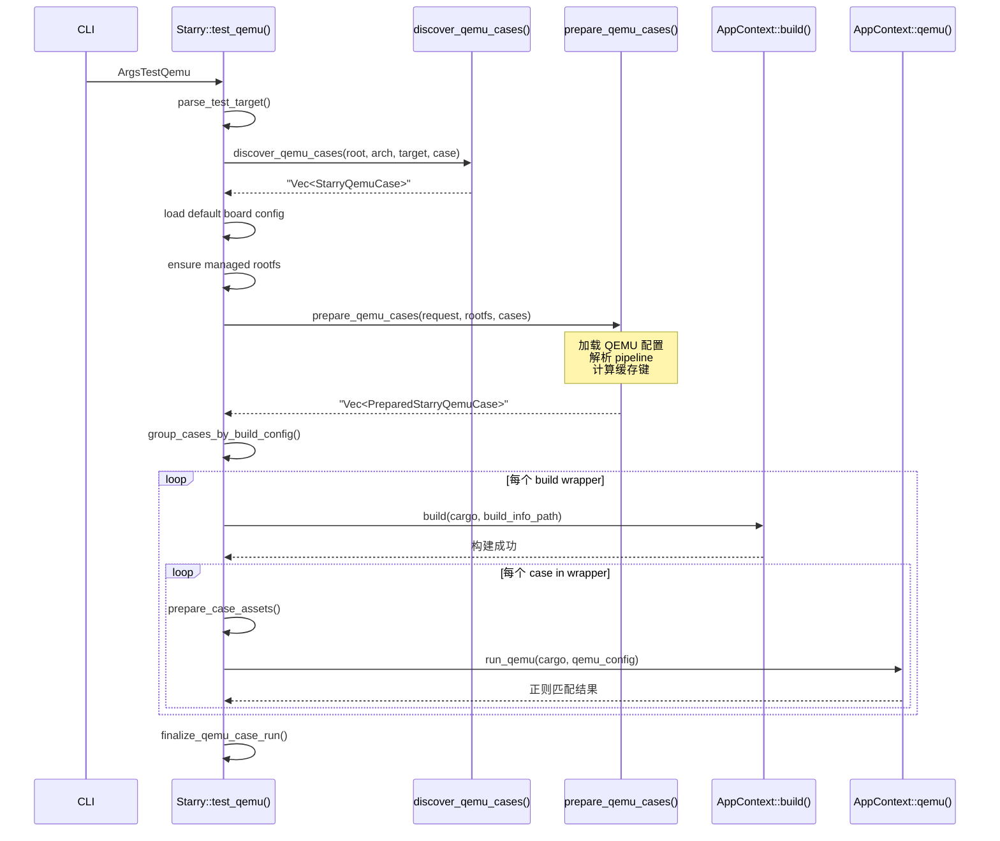

# StarryOS 测试

StarryOS 的测试体系围绕 QEMU、board 两类 test-suit 用例，以及 `apps/starry/`
下的 app 用例展开。与 ArceOS 不同，StarryOS 编译的是完整的操作系统内核
而非单个 app，因此同一 build wrapper 内的多个用例可以共享一个 StarryOS
内核镜像。测试命令在 rootfs 的用户空间中执行，内核负责提供系统调用和进程管理。

## 命令

StarryOS 提供 QEMU 和板级两个 test-suit 入口：

```text
# QEMU 测试
cargo xtask starry test qemu --arch <arch> [--test-case <case>]

# 板级测试
cargo xtask starry test board [--test-case <case>] [--board <name>] [--board-type <type>] [--server <host>] [--port <port>]
```

`-l/--list` 可以列出发现的用例。旧的 Starry `--test-group` 和 `--stress`
入口已经移除；stress、K230、visual/golden 等重型或 app/integration 类测试迁到
`apps/starry/`，使用 `cargo xtask starry app ...` 或对应脚本运行。

板级测试中 `--board` 和 `--board-type` 是两个不同用途的参数：

- `--board <name>`：按板卡名称过滤 `test-suit` 中的测试用例，例如 `orangepi-5-plus`
- `--board-type <type>`（或 `-b`）：指定物理板卡类型，用于 ostool-server 部署目标选择

两者可以组合使用：`--board` 控制运行哪些测试用例，`--board-type` 控制部署到哪块物理板卡。

## 目录结构

StarryOS test-suit 直接扫描 `test-suit/starryos/` 根目录：

```text
test-suit/starryos/
  qemu-smp1/
    build-<target>.toml
    system/
      qemu-<arch>.toml
      <subcase>/c/CMakeLists.txt
  qemu-smp4/
    build-<target>.toml
    system/
      qemu-<arch>.toml
      <subcase>/c/CMakeLists.txt
  board-orangepi-5-plus/
    build-aarch64-unknown-none-softfloat.toml
    npu-yolov8/
      board-orangepi-5-plus.toml
```

`qemu-smp1` 和 `qemu-smp4` 根目录只作为 build wrapper，`system` 是各自唯一的
聚合 QEMU case。`qemu-smp*/system/<subcase>` 下只放测例资产，不再放
子测例级 `qemu-<arch>.toml`。

## 用例类型

StarryOS 支持五种 pipeline 类型，取决于用例目录中是否包含 `c/`、`sh/`、
`python/` 子目录或 `test_commands`：

- **Plain**：仅 `qemu-{arch}.toml`
- **C**：含 `c/` 子目录，CMake 交叉编译
- **Shell**：含 `sh/` 子目录
- **Python**：含 `python/` 子目录
- **Grouped**：`qemu-{arch}.toml` 中使用 `test_commands`

`qemu-smp1/system` 和 `qemu-smp4/system` 使用 grouped runner，一次 StarryOS 启动运行所有安装到
`/usr/bin/starry-test-suit/` 的子测例，并以 `STARRY_GROUPED_TESTS_PASSED`
作为成功标记。

## QEMU 执行流程

完整的 QEMU 测试流程从 CLI 参数解析开始，经过用例发现、rootfs 准备、资产注入、
分组构建到逐 case 运行和结果汇总：



关键步骤说明：

1. **参数解析**：`parse_test_target()` 解析目标架构。
2. **用例发现**：`discover_qemu_cases()` 从 `test-suit/starryos/` 根目录 DFS 扫描，返回所有匹配的 `StarryQemuCase`。
3. **rootfs 准备**：确保目标架构的 rootfs 镜像已下载并缓存。
4. **资产准备**：`prepare_qemu_cases()` 为每个用例判定 pipeline 类型、计算缓存键、准备 per-case rootfs。
5. **分组构建**：按 build config 分组后，每组只调用一次 `AppContext::build()` 编译 StarryOS 内核。
6. **逐 case 运行**：每个用例独立准备资产、运行 QEMU、通过正则判定结果。
7. **结果汇总**：`finalize_qemu_case_run()` 收集所有用例的通过/失败状态，输出结构化报告。

## 结果报告

StarryOS 测试完成后输出结构化报告：

```text
starry qemu test summary:
passed (2):
  qemu-smp1/system (12.34s)
  qemu-smp4/system (3.67s)
failed (1):
  board-orangepi-5-plus/net-smoke (5.89s)
total: 21.90s
```

报告按通过和失败分类列出每个用例的 display name 和耗时，最后给出总耗时。

## Board 执行流程

板级测试复用与 QEMU 测试相同的构建和发现基础设施，差异仅在于运行目标为物理板卡：

1. 从 `test-suit/starryos/` 根目录递归发现 `board-*.toml`
2. 每个 board config 关联到最近的 build wrapper
3. 按 case / board 过滤
4. 逐组构建 -> 加载 board run config -> `AppContext::board()` 运行

每个 board 配置文件通过 `nearest_build_wrapper()` 向上查找最近的构建配置，复用已有的 build wrapper 定义。`AppContext::board()` 将编译好的 StarryOS 内核通过 ostool-server 部署到目标板卡，等待串口输出并进行结果判定。
