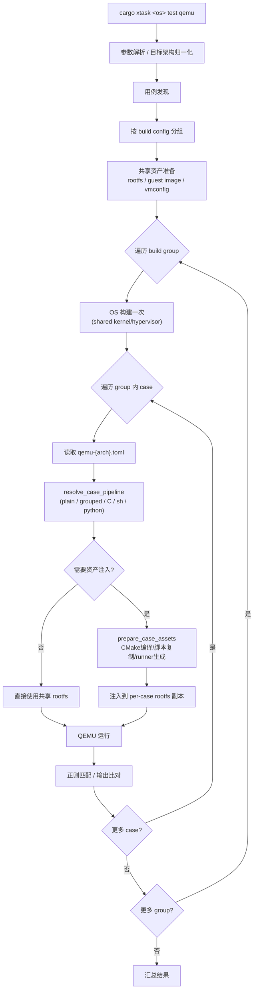
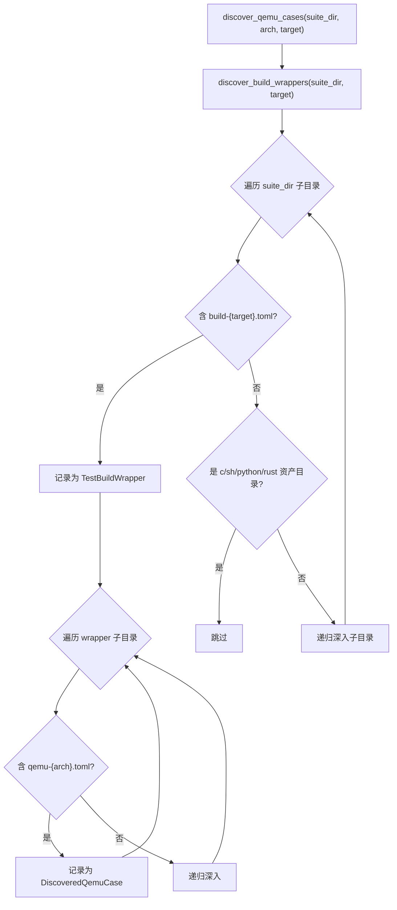
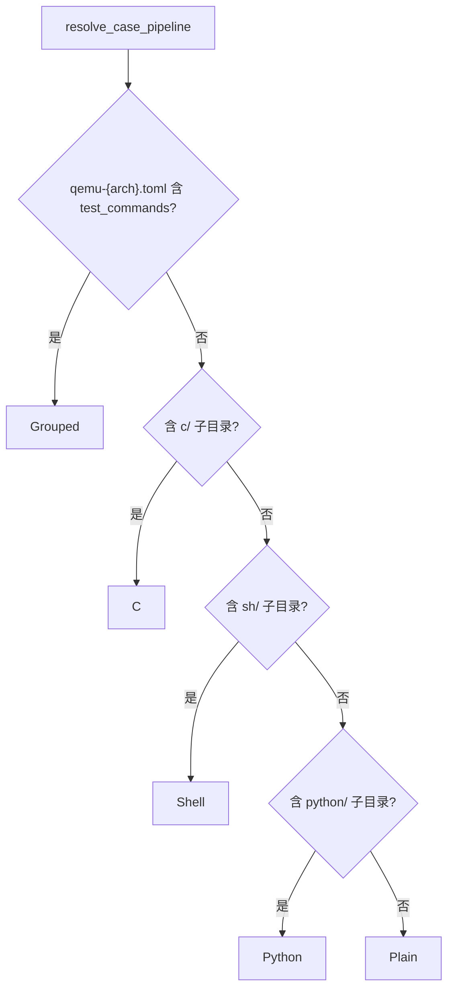
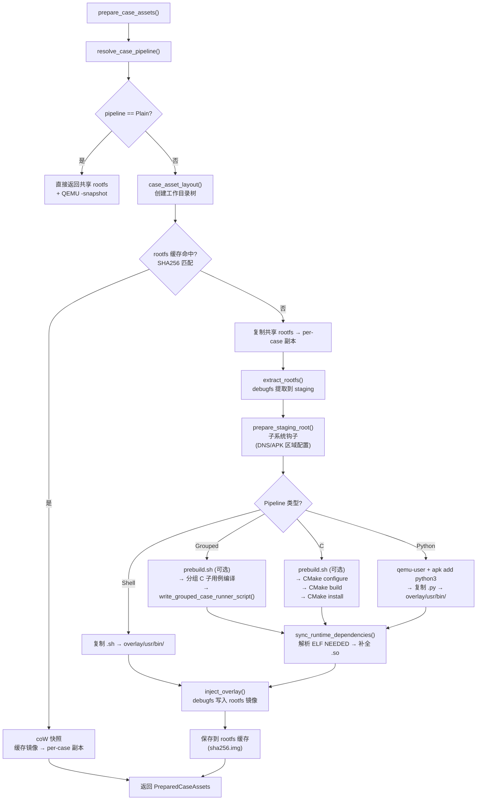

# 测试框架

本文描述 [ArceOS](./arceos/test)、[StarryOS](./starry/test)、[Axvisor](./axvisor/test) 三套子系统共享的测试编排框架（用例发现、分组构建、资产准备、结果判定）。各子系统的测试目录结构和特有用例类型见各自目录下的测试文档。Host 端检查（`cargo xtask test`、`cargo xtask clippy`、`cargo xtask sync-lint`、`cargo xtask spin-lint`）不属于 OS 测试体系，详见 [Std 白名单测试](./test)、[Clippy](./clippy)、[Sync Lint](./sync_lint)、[Spin Lint](./spin_lint)。


`cargo xtask <os> test qemu/board` 命令在构建和运行的基础上增加了**用例发现、分组构建、资产准备和结果判定**。核心设计原则是 **OS 只构建一次，逐 case 运行**——具有相同构建配置的用例被归入同一组，组内共享完全相同的 OS 构建参数，因此只需编译一次。共享资产（rootfs 镜像等）在构建前准备完毕。然后进入双层循环：外层遍历 build group（每组构建一次 OS），内层遍历组内用例（每个用例独立准备资产、运行 QEMU、匹配结果）。最后汇总所有用例的通过/失败结果。

测试系统需要解决的核心问题是：在多种架构、多种用例类型（Rust/C/Shell/Python/Grouped）、多种运行环境（QEMU/Board）的组合下，提供统一的测试编排能力。axbuild 通过一套共享的测试基础设施（`scripts/axbuild/src/test/`）实现这一点，各子系统只需提供自己的目录结构和少量子系统特有逻辑。

## 总体流程

测试流程从参数解析开始，经历发现、分组、构建、资产准备、运行到结果汇总：



测试流程从参数解析开始，确定目标架构和测试组。接着进入用例发现阶段（DFS 扫描测试目录），发现的结果按构建配置分组——同一组内的用例共享完全相同的 OS 构建参数，因此只需编译一次。共享资产（rootfs 镜像等）在构建前准备完毕。然后进入双层循环：外层遍历 build group（每组构建一次 OS），内层遍历组内用例（每个用例独立准备资产、运行 QEMU、匹配结果）。最后汇总所有用例的通过/失败结果。

## 共享测试基础设施

`scripts/axbuild/src/test/` 提供所有子系统复用的测试原语：

| 模块 | 职责 | 关键类型/函数 |
|------|------|---------------|
| `suite.rs` | 测试套件目录解析 | `suite_root()`, `group_dir()`, `discover_group_names()`, `require_group_dir()` |
| `qemu/` | QEMU 用例发现、分组、结果聚合、SMP 注入、超时缩放、动态平台 boot 补丁 | `discover_qemu_cases()`, `group_cases_by_build_config()`, `finalize_qemu_test_run()`, `apply_smp_qemu_arg()`, `apply_timeout_scale()`, `apply_dynamic_platform_qemu_boot()`, `validate_grouped_qemu_commands()` |
| `board.rs` | 板级用例发现与结果聚合 | `discover_board_runtime_configs()`, `filter_board_test_groups()`, `finalize_board_test_run()` |
| `case/` | 用例资产编排、pipeline 判定、缓存管理、Grouped runner 生成、Host HTTP server | `TestQemuCase`, `CasePipeline`, `CaseAssetConfig`, `CaseAssetLayout`, `PreparedCaseAssets`, `HostHttpServerConfig`, `prepare_case_assets()`, `resolve_case_pipeline()`, `apply_grouped_qemu_config()` |
| `build/` | C/Grouped/Python 资产构建、交叉编译环境准备、CMake 工具链、prebuild 脚本 | `prepare_c_case_assets_sync()`, `prepare_grouped_case_assets_sync()`, `prepare_python_case_assets_sync()`, `CrossCompileSpec`, `HostCrossBuildEnv` |
| `host_http.rs` | 测试用 Host HTTP server（QEMU guest 通过 slirp 网关拉取资产） | `HostHttpServerGuard::start()` |
| `rootfs/` (共享) | Rootfs 内容操作、运行时依赖同步 | `extract_rootfs()`, `inject_overlay()`, `sync_runtime_dependencies()`, `replace_file()` |
| `timing.rs` | 测试耗时计时与汇总 | duration 格式化辅助 |

> Host 端 std 白名单测试（`std.rs`）、clippy、sync-lint、spin-lint 不属于 OS 测试体系，详见 [std 白名单测试](./test)、[Clippy](./clippy)、[Sync Lint](./sync_lint)、[Spin Lint](./spin_lint)。

`suite.rs` 是测试目录结构的入口，提供统一的路径解析函数，使得各子系统无需硬编码自己的测试目录路径。`qemu.rs` 和 `board.rs` 分别封装了 QEMU 和板级测试的发现与结果聚合逻辑。`case.rs` 是资产编排的核心，负责判定用例类型、准备 per-case rootfs 和管理缓存。`build.rs` 处理需要编译步骤的资产（C、Grouped、Python）。

## 测试目录结构

三个子系统的测试资产统一位于 `test-suit/` 目录下，按 OS 名称分组：

```text
test-suit/
├── arceos/             ArceOS 测试
│   ├── c/              C 语言测试（helloworld、pthread 等）
│   │   └── <case>/
│   │       ├── *.c           C 源码
│   │       ├── axbuild.mk    C 测试标识文件
│   │       ├── features.txt  可选 features
│   │       ├── test_cmd      测试调用定义
│   │       └── expect_*.out  预期输出
│   └── rust/           Rust 测试（每个包一个目录）
│       └── <package>/
│           ├── Cargo.toml
│           ├── src/main.rs
│           ├── build-{target}.toml
│           └── qemu-{arch}.toml
├── starryos/           StarryOS 测试
│   ├── qemu-smp1/      QEMU 单核 build wrapper
│   │   └── system/qemu-{arch}.toml
│   ├── qemu-smp4/      QEMU 多核 build wrapper
│   │   └── system/qemu-{arch}.toml
│   └── board-*/        板级 build wrapper
│       └── <case>/board-{board}.toml
└── axvisor/            Axvisor 测试
    └── normal/
        └── <case>/qemu-{arch}.toml
```

三个子系统的测试目录结构有所不同：ArceOS 区分 Rust 和 C 测试（分别放在 `rust/` 和 `c/` 子目录），StarryOS 从 `test-suit/starryos/` 根目录直接发现 QEMU/board 用例，Axvisor 使用自己的测试组目录。但无论哪种结构，核心的发现算法（通过 `build-{target}.toml` 定位构建组、通过 `qemu-{arch}.toml` 定位用例）是统一的。

### Build Wrapper 目录

测试目录中的关键概念是 **build wrapper**——包含 `build-{target}.toml` 的目录。它定义了一组共享相同构建配置的用例：

```text
test-suit/starryos/
├── qemu-smp1/                    ← build wrapper（含 build-riscv64gc-unknown-none-elf.toml）
│   ├── build-riscv64gc-unknown-none-elf.toml
│   └── system/
│       └── qemu-riscv64.toml     ← 子 case（继承 wrapper 的 build config）
└── qemu-smp4/                    ← 另一个 build wrapper（不同 SMP 配置）
    ├── build-riscv64gc-unknown-none-elf.toml
    └── system/
        └── qemu-riscv64.toml
```

同一 build wrapper 下的所有 case 共享一次 OS 构建。

Build Wrapper 的设计动机是避免重复编译。例如 `qemu-smp1` 和 `qemu-smp4` 分别测试单核和多核场景，它们的构建配置不同（SMP 核数不同），因此必须分别编译；每个 wrapper 下的 `system` 聚合用例使用完全相同的内核，只需编译一次并启动一次。发现算法通过识别 `build-{target}.toml` 文件来自动划分构建边界。


---

用例发现是测试流程的第一个阶段，负责从 `test-suit/<os>/` 或子系统定义的测试根目录中扫描并收集所有可执行的测试用例。发现算法的核心逻辑是**识别 build wrapper（含 `build-{target}.toml` 的目录）和其中的 QEMU 用例（含 `qemu-{arch}.toml` 的目录）**，跳过资产目录（`c/`、`sh/`、`python/`、`rust/`）以避免误识别。

发现过程产生两级结构：外层是 `TestBuildWrapper`（定义构建边界），内层是 `DiscoveredQemuCase`（定义运行边界）。这两个结构体是实现"构建一次、逐 case 运行"的基础——分组函数根据 `build_config_path` 将 case 归入对应的 wrapper。

## 发现流程

发现算法采用两阶段栈式 DFS，先定位 build wrapper 再在其中查找 QEMU 用例：



整个发现流程分为两个阶段：第一阶段 `discover_build_wrappers()` 扫描出所有构建边界，第二阶段在每个 wrapper 内扫描出具体的测试用例。两阶段设计确保了构建边界和运行边界的清晰分离——一个 wrapper 定义"用什么配置编译"，一个 case 定义"运行什么、如何判定"。

## 核心数据结构

发现结果由两个核心结构体承载，分别表示构建边界和运行边界：

```rust
// 发现的构建包装器
struct TestBuildWrapper {
    name: String,                // 相对于测试根目录的路径（如 `qemu-smp1`）
    dir: PathBuf,               // 包装器目录路径
    build_config_path: PathBuf, // build-{target}.toml 路径
}

// 发现的 QEMU 测试用例
struct DiscoveredQemuCase {
    name: String,               // 用例名
    display_name: String,       // 显示名（含 build group 前缀，如 `qemu-smp1/system`）
    case_dir: PathBuf,          // 用例目录
    qemu_config_path: PathBuf,  // qemu-{arch}.toml 路径
    build_group: String,        // 所属 build wrapper 名称
    build_config_path: PathBuf, // 继承的构建配置路径
}
```

`TestBuildWrapper` 的 `name` 字段是相对于测试根目录的路径（如 `qemu-smp1`），用于构建分组的键。`DiscoveredQemuCase` 的 `display_name` 包含 build group 前缀（如 `qemu-smp1/system`），用于结果报告中区分来自不同构建组的同名用例。每个 case 都通过 `build_config_path` 回溯到所属的 wrapper，这是分组函数的工作基础。

## 发现算法细节

### Build Wrapper 发现

`discover_build_wrappers()` 采用**栈式 DFS**：
1. 从测试根目录开始，压栈所有子条目
2. 对每个目录，检查是否包含 `build-{target}.toml`
3. 若包含，记录为 `TestBuildWrapper`（不再深入）
4. 若是资产目录（`c/`、`sh/`、`python/`、`rust/`），跳过
5. 否则递归深入

栈式 DFS（而非递归）避免了深层嵌套目录时的栈溢出风险。当一个目录被识别为 build wrapper 后，算法不再深入其子目录——因为 wrapper 内的所有内容（包括子 case）都在第二阶段的 QEMU 用例发现中处理。资产目录（`c/`、`sh/` 等）被跳过是因为它们是用例的附属资源，而非独立的测试入口。

### QEMU 用例发现

`discover_qemu_cases()` 在 build wrapper 基础上：
1. 先检查 wrapper 根目录是否有 `qemu-{arch}.toml`（wrapper root case）
2. 再遍历 wrapper 子目录，查找含 `qemu-{arch}.toml` 的 case
3. 支持 `--test-case` 过滤：精确匹配 wrapper 名或 case 名
4. 跳过包含独立 `build-*.toml` 的子目录（避免误入嵌套 wrapper）

Wrapper root case 是一个特殊场景：当 `qemu-{arch}.toml` 直接位于 wrapper 目录下（而非子目录中）时，该 wrapper 自身也是一个可运行用例。`--test-case` 参数支持精确匹配，使得开发者可以只运行特定用例进行调试，而无需等待整个测试套件完成。

### 用例名称解析

| 场景 | 用例目录 | display_name |
|------|----------|-------------|
| wrapper root case | `qemu-custom/` + `qemu-riscv64.toml` | `qemu-custom` |
| wrapper 子 case | `qemu-smp1/system/` + `qemu-riscv64.toml` | `qemu-smp1/system` |
| 嵌套子 case | `qemu-custom/sub/deep/` + `qemu-riscv64.toml` | `qemu-custom/sub/deep` |

display_name 的命名规则确保了每个用例的唯一标识：以 build group 名为前缀，加上相对于 wrapper 的路径。嵌套子 case 场景支持在 wrapper 内进一步组织目录结构（如按功能分类），不影响分组的正确性。

## 按构建配置分组

发现的 case 通过 `BuildConfigRef` trait 和 `group_cases_by_build_config()` 函数按 `build_config_path` 分组：

```rust
// BuildConfigRef trait —— 所有子系统 case 都实现此 trait
trait BuildConfigRef {
    fn build_group(&self) -> &str;
    fn build_config_path(&self) -> &Path;
}

// 分组函数
fn group_cases_by_build_config<T: BuildConfigRef>(cases: &[T])
    -> Vec<QemuCaseGroup<'_, T>>
```

`BuildConfigRef` trait 是子系统间共享分组逻辑的关键抽象。ArceOS、StarryOS、Axvisor 各有自己的 case 类型，但都实现了此 trait，使得通用的 `group_cases_by_build_config()` 函数可以统一处理。

分组结果示例：

| build_group | build_config_path | cases |
|-------------|-------------------|-------|
| `qemu-smp1` | `.../qemu-smp1/build-riscv64gc-unknown-none-elf.toml` | system |
| `qemu-smp4` | `.../qemu-smp4/build-riscv64gc-unknown-none-elf.toml` | system |

上例中，`qemu-smp1/system` 和 `qemu-smp4/system` 分别共享各自 wrapper 的构建配置，每个聚合 case 在一次 StarryOS 启动内运行对应子测例。

### Board 用例发现

`discover_board_runtime_configs()` 递归扫描目录，匹配 `board-*.toml` 文件：

```rust
struct BoardRuntimeConfig {
    case_dir: PathBuf,       // board config 所在目录
    board_name: String,      // 从文件名提取（board-{name}.toml）
    config_path: PathBuf,    // board config 文件路径
}
```

每个 board config 通过 `nearest_build_wrapper()` 向上查找最近的 build wrapper 来确定构建配置。

`filter_board_test_groups()` 支持按 `--test-case` 和 `--board` 过滤。

Board 用例发现与 QEMU 用例发现的区别在于：board 配置文件按板卡名命名（如 `board-orangepi-5-plus.toml`），而非按架构。一个 board case 可能同时在多个架构上运行（只要板卡支持），因此 board 发现不按架构过滤。`nearest_build_wrapper()` 函数向上遍历目录树查找最近的 `build-{target}.toml`，使得 board case 可以复用已有 wrapper 的构建配置，也可以定义自己的构建配置。

---

资产准备是用例发现与 QEMU 执行之间的桥梁。它根据每个用例的类型（Plain/C/Shell/Python/Grouped），决定是否需要向 rootfs 镜像中注入额外的文件（可执行程序、脚本、Python 解释器等），并生成 per-case 的 rootfs 副本供 QEMU 使用。

资产准备的性能优化依赖 **SHA256 内容哈希缓存**：当用例源文件和 rootfs 基础镜像都没有变化时，直接从缓存复制（利用 CoW 快照），跳过 CMake 编译和 overlay 注入等耗时操作。这使得重复运行测试套件的速度大幅提升。

## Pipeline 判定

`resolve_case_pipeline()` 根据用例目录内容判定资产处理方式，**互斥**（只能选一种）：



| Pipeline | 触发条件 | 处理方式 |
|----------|----------|----------|
| **Plain** | 无 `c/`、`sh/`、`python/`，无 `test_commands` | 直接使用共享 rootfs，QEMU `-snapshot` |
| **Grouped** | `test_commands` 非空 | 生成 runner 脚本 → overlay 注入 rootfs |
| **C** | 含 `c/` 子目录 | CMake 交叉编译 → 安装到 overlay → 注入 rootfs |
| **Shell** | 含 `sh/` 子目录 | 复制脚本到 `/usr/bin/` → overlay 注入 rootfs |
| **Python** | 含 `python/` 子目录 | 安装 python3 + 复制 `.py` → overlay 注入 rootfs |

Pipeline 判定的优先级顺序是有意义的：`test_commands` 优先于目录检测，因为 Grouped 模式可能在没有任何资产子目录的情况下使用。五种 Pipeline 的处理复杂度从 Plain（零成本）到 C（需要完整的交叉编译工具链）递增。

## Rootfs 内容操作原语

所有需要注入的 pipeline 都依赖三个底层原语对 ext2/3/4 rootfs 镜像进行内容操作，由 `rootfs/inject.rs` 和 `rootfs/runtime.rs` 提供：

| 原语 | 函数 | 工具 | 说明 |
|------|------|------|------|
| **提取** | `extract_rootfs()` | `debugfs -R "rdump / ..."` | 将 rootfs 镜像完整提取到 staging 目录 |
| **注入** | `inject_overlay()` | `debugfs` 写脚本 | 遍历 overlay 目录树，生成 `rm/write/sif` 命令批量写入镜像 |
| **同步** | `sync_runtime_dependencies()` | `readelf` + `debugfs` | 扫描 overlay 中的 ELF 二进制，解析 NEEDED 共享库依赖，从 staging root 补全缺失的 `.so` |

其中 `sync_runtime_dependencies()` 是一个递归发现的过程：遍历 overlay 中的每个 ELF 文件 → 用 `readelf -d` 读取 NEEDED 列表 → 在 staging root 的 `lib/`、`usr/lib/`、`usr/local/lib/` 中查找对应文件 → 复制到 overlay → 对新复制的 `.so` 文件递归执行同样检查。这确保了交叉编译的二进制在 Alpine Linux rootfs 中能找到所有运行时依赖。
## 交叉编译规格

C Pipeline 和 Python Pipeline（qemu-user 模式）都需要使用与目标架构匹配的交叉编译工具。`context/arch.rs` 中定义了各架构的完整交叉编译规格（`CrossCompileSpec`）：

| 架构 | GNU 工具前缀 | LLVM Target | CMAKE_SYSTEM_PROCESSOR | qemu-user 二进制 |
|------|-------------|-------------|----------------------|-----------------|
| `aarch64` | `aarch64-linux-musl` | `aarch64-linux-musl` | `aarch64` | `qemu-aarch64-static` |
| `x86_64` | `x86_64-linux-musl` | `x86_64-linux-musl` | `x86_64` | `qemu-x86_64-static` |
| `riscv64` | `riscv64-linux-musl` | `riscv64-linux-musl` | `riscv64` | `qemu-riscv64-static` |
| `loongarch64` | `loongarch64-linux-musl` | `loongarch64-linux-musl` | `loongarch64` | `qemu-loongarch64-static` |

交叉编译器使用 musl libc 变体，与 Alpine Linux rootfs 的 C 库兼容。CMake 工具链文件（`cmake-toolchain.cmake`）中的 `CMAKE_C_COMPILER` 设为 `{gnu_prefix}-gcc`（如 `aarch64-linux-musl-gcc`），`CMAKE_SYSTEM_NAME` 设为 `Generic`（裸机环境）。qemu-user 二进制用于在宿主端执行 staging rootfs 中的命令（如 `apk add python3`）和运行 prebuild 脚本。
## 总体流程

`prepare_case_assets()` 根据 pipeline 类型决定完整的资产准备链路：



对于 Plain 用例，资产准备几乎是零开销——直接使用共享的 rootfs 镜像，配合 QEMU 的 `-snapshot` 选项实现无写回的只读运行。对于需要注入的用例，完整流程为：创建 per-case 工作目录 → 检查缓存 → 缓存未命中时复制共享 rootfs → `debugfs rdump` 提取 rootfs 到 staging → 子系统钩子准备 staging 环境 → 执行具体 pipeline 构建 → `sync_runtime_dependencies()` 补全 ELF 依赖 → `debugfs` 注入 overlay → 写入缓存。缓存命中时使用 `cp --reflink=auto`（在 Btrfs/XFS 等支持 CoW 的文件系统上几乎是瞬间完成）。

## 工作目录布局

每个需要注入的 case 会创建以下目录树：

```text
tmp/axbuild/qemu-cases/{case_name}/
├── cache/
│   ├── apk-cache/              APK 包缓存（跨 run 复用）
│   └── rootfs/                 预注入 rootfs 缓存（{sha256}.img）
└── runs/{pid}-{sequence}/
    ├── staging-root/            rootfs 内容提取暂存
    ├── build/                   CMake 构建目录
    ├── overlay/                 overlay 注入内容
    │   └── usr/bin/             可执行文件/脚本
    ├── cross-bin/               交叉编译 wrapper 脚本
    ├── guest-bin/               guest 命令 wrapper
    ├── cmake-toolchain.cmake    CMake 工具链文件
    └── case-rootfs.img          per-case rootfs 副本
```

工作目录按 `case_name` 隔离，使得不同用例的构建产物和缓存互不干扰。`cache/` 目录在多次运行间持久存在（缓存命中检查在此进行），`runs/` 目录按 `{pid}-{sequence}` 命名以支持并发执行。`overlay/` 目录中的内容会被整体注入到 rootfs 镜像中——`inject_overlay()` 函数遍历 overlay 目录树，将文件逐个复制到 rootfs 对应路径。

## Rootfs 缓存

为避免重复的资产准备（CMake 编译、overlay 注入、debugfs 写操作），系统使用 **SHA256 内容哈希** 缓存。缓存的 per-case rootfs 镜像以 `{sha256}.img` 文件名存储在 `cache/rootfs/` 目录下。

缓存键（`case_asset_cache_key()`）由以下因素组合计算：

| 因素 | 说明 |
|------|------|
| 版本标记 `v2` | 缓存格式版本，变更时全局失效 |
| `arch`、`target` | 目标架构和 triple |
| `case.display_name` | 用例标识 |
| `pipeline` 类型 | Plain/C/Sh/Python/Grouped |
| `cache_env_vars` | 子系统指定的环境变量（如 `STARRY_APK_REGION`），运行时取值纳入哈希 |
| CMake 工具链模板 | 仅 C pipeline，`include_str!("cmake-toolchain.cmake.in")` |
| Python 版本标记 | 仅 Python pipeline（`python-apk-v1`） |
| rootfs 镜像元数据 | **仅文件大小**（不含 mtime，因为在 Docker/NFS/CI 中 mtime 不可靠） |
| case 目录递归哈希 | case_dir 下所有文件的路径+内容的 SHA256 |
| QEMU 配置文件 | 仅当 `qemu_config_path` 不在 `case_dir` 内时纳入 |

缓存命中检查还要求文件大小 ≥ 1 MiB（`is_valid_rootfs_cache_image()`），防止不完整写入导致的假命中。

缓存命中时，直接 `cp --reflink=auto`（CoW 快照）复制缓存镜像，跳过所有构建和注入步骤。`--reflink=auto` 在 Btrfs/XFS 等支持 `FICLONE` ioctl 的文件系统上实现零拷贝快照，在 ext4 上退化为 `fs::copy()`。

## Grouped Pipeline

Grouped case 的完整流程为：

1. `extract_rootfs` → `prepare_staging_root`（与 C Pipeline 相同的 staging 准备）
2. 如果包含 C 子用例（`subcases[].kind == C`）：按子用例分别执行 `prebuild.sh` + CMake configure/build/install
3. `write_grouped_case_runner_script()` — 生成一个 shell runner 脚本，按顺序执行 `test_commands` 中的每条命令
4. `sync_runtime_dependencies()` — 递归补全 ELF 运行时依赖
5. `inject_overlay()` — 将 overlay（runner + 子用例产物 + 依赖库）写入 rootfs

生成的 runner 脚本按顺序执行每条命令，输出带有结构化标记的日志：

```bash
#!/bin/sh
set -u
failed=0
printf '%s\n' 'SUITE_GROUPED_TEST_BEGIN: /usr/bin/test-a'
if sh -c '/usr/bin/test-a'; then
    printf '%s\n' 'SUITE_GROUPED_TEST_PASSED: /usr/bin/test-a'
else
    status=$?
    printf '%s status=%s\n' 'SUITE_GROUPED_TEST_FAILED: /usr/bin/test-a' "$status"
    failed=1
fi
# ... 更多命令 ...
if [ "$failed" -eq 0 ]; then
    printf '%s\n' 'SUITE_GROUPED_TESTS_PASSED'
    exit 0
fi
printf '%s\n' 'SUITE_GROUPED_TESTS_FAILED'
exit 1
```

QEMU 配置被覆盖：`shell_init_cmd` → runner 路径，`success_regex` / `fail_regex` → grouped 专用正则（通过 `apply_grouped_qemu_config()` 实现）。

Grouped Pipeline 的设计动机是支持一个用例内执行多条命令并分别判定结果。生成的 runner 脚本按顺序执行每条命令，输出带有结构化标记（`{PREFIX}_GROUPED_TEST_BEGIN/PASSED/FAILED`，前缀如 `STARRY` 由各子系统的 `GroupedCaseRunnerConfig` 定义）的日志，使得 axbuild 可以通过正则匹配精确统计每条命令的通过/失败状态。QEMU 配置中的 `shell_init_cmd` 和正则被自动覆盖为 grouped 专用版本。

此外，Grouped 用例可以包含 C 子用例（通过 `discover_qemu_subcases()` 检测子目录中的 `c/` 目录），这些子用例会被独立执行 CMake 构建，产物注入到与 runner 相同的 overlay 中。

## C Pipeline

C 用例通过 CMake 交叉编译，并将产物注入到 rootfs。完整流程为：

1. `extract_rootfs(rootfs_img, staging_root)` — 用 `debugfs rdump` 将 rootfs 提取到 staging 目录
2. `prepare_staging_root(staging_root)` — 子系统钩子。StarryOS 执行两步操作：
   - **DNS 注入**（`starry/resolver.rs`）：读取宿主 DNS 配置写入 staging `/etc/resolv.conf`。依次尝试 `/run/systemd/resolve/resolv.conf` → `/etc/resolv.conf` → 默认 `1.1.1.1, 8.8.8.8`，自动过滤 loopback（`127.0.0.x`）和 QEMU slirp 地址（`10.0.2.3`），确保 staging 环境有可用的外网 DNS
   - **APK 区域配置**（`starry/apk.rs`）：根据 `STARRY_APK_REGION` 环境变量重写 staging 中 `/etc/apk/repositories` 的镜像源地址，支持 `china`/`cn`（默认，使用 `mirrors.cernet.edu.cn/alpine`）和 `us`/`usa`（使用 `dl-cdn.alpinelinux.org/alpine`）
   - ArceOS 和 Axvisor 跳过此步骤（`|_| Ok(())`）
3. `write_musl_loader_search_path(arch, staging_root)` — 写入 `/etc/ld-musl-{arch}.path` 配置动态链接器搜索路径
4. 可选 `prebuild.sh` — 如果 `c/prebuild.sh` 存在，在 qemu-user 环境下执行（用于需要 guest 环境的构建步骤）
5. `prepare_host_cross_build_env(arch, layout, qemu_runner)` — 生成 `cmake-toolchain.cmake`（含 CC、CXX、AR、RANLIB、SYSROOT、CMAKE_SYSTEM_PROCESSOR）
6. `cmake -B build -DCMAKE_INSTALL_PREFIX=/usr -DCMAKE_TOOLCHAIN_FILE=...`
7. `cmake --build build`
8. `cmake --install build --prefix overlay/usr`
9. `sync_runtime_dependencies(staging_root, overlay)` — 解析 CMake 产物的 ELF NEEDED，从 staging root 补全缺少的 `.so`
10. `inject_overlay(rootfs, overlay)` — 通过 `debugfs` 将 overlay 目录树写入 rootfs 镜像

C Pipeline 是最复杂的资产处理流程，涉及完整的交叉编译工具链配置、qemu-user 环境下的 prebuild 脚本执行、以及运行时依赖的递归解析。`cross_compile_spec(arch)` 根据目标架构返回 musl 交叉编译器的路径前缀（如 `aarch64-linux-musl-`）和 LLVM target triple。

## Shell Pipeline

最简单的注入方式：

1. 复制 `sh/` 下所有文件到 `overlay/usr/bin/`
2. 设置可执行权限（0o755）
3. `inject_overlay(rootfs_copy, overlay_dir)`

Shell Pipeline 不涉及编译，仅做文件复制和权限设置。注入的脚本文件会被放到 rootfs 的 `/usr/bin/` 目录下，使得 QEMU 内的 shell 可以直接通过文件名调用。

## Python Pipeline

Python 用例需要在 rootfs 中安装 Python 解释器并将 `.py` 测试文件注入到 rootfs。完整流程为：

1. `extract_rootfs(rootfs_img, staging_root)` — 用 `debugfs rdump` 将 rootfs 提取到 staging 目录
2. `prepare_staging_root(staging_root)` — 子系统钩子（与 C Pipeline 相同，StarryOS 执行 DNS + APK 区域配置）
3. `write_musl_loader_search_path(arch, staging_root)` — 写入 `/etc/ld-musl-{arch}.path` 配置动态链接器搜索路径
4. `prepare_guest_package_env()` — 准备 guest 环境（DNS、APK 缓存路径等环境变量）
5. `find_host_binary_candidates(qemu_user_binaries)` — 查找宿主端的 qemu-user 模拟器（如 `qemu-aarch64-static`）
6. `write_guest_command_wrappers()` — 生成 cross-bin 目录下的 guest 命令 wrapper 脚本
7. **通过 qemu-user 在 staging rootfs 中执行 `apk add python3`** — 使用 busybox ash 或 `/bin/sh` 执行 APK 安装，环境变量 `PATH`、`QEMU_LD_PREFIX`、`LD_LIBRARY_PATH` 指向 staging root，确保 python3 及其依赖被安装到 staging 目录树中
8. **将 Python 安装产物从 staging 复制到 overlay** — 递归复制 `usr/bin`、`usr/lib`、`lib` 三个目录中有变更的内容到 overlay 对应位置
9. **复制 `.py` 测试文件到 overlay `/usr/bin/`** — 将 `python/` 目录中的所有文件复制到 `overlay/usr/bin/`，设置可执行权限（`0o755`）
10. `inject_overlay(rootfs, overlay)` — 通过 `debugfs` 将 overlay 目录树写入 rootfs 镜像

Python Pipeline 的关键步骤是第 7 步：利用 qemu-user 模拟器在宿主端"透明地"执行 staging rootfs 中的 APK 包管理器，从而安装 python3 及其运行时依赖（如 libpython、libz 等），而无需在宿主端安装任何交叉编译的 Python 包。安装完成后，Python 运行时和测试脚本一起被注入到 per-case rootfs 中。

**注意**：Python Pipeline 不调用 `sync_runtime_dependencies()`，因为依赖通过 `apk add` 已完整安装在 staging root 中，复制到 overlay 时已包含所有必需的 `.so` 文件。

---

测试配置文件定义了每个用例在 QEMU 或板卡上的运行参数，包括 QEMU 命令行参数、Shell 交互配置、超时设置和结果判定规则。每个测试用例通过 `qemu-{arch}.toml` 或 `board-{board_name}.toml` 描述自己的运行需求，这些配置文件是测试发现算法的识别标记，也是运行时行为的声明式定义。

## QEMU 运行配置

每个 QEMU 用例通过一个 `qemu-{arch}.toml` 文件声明运行环境参数，主要字段如下：

| 字段 | 类型 | 说明 |
|------|------|------|
| `args` | `[String]` | QEMU 命令行参数，支持 `${workspace}` 占位符 |
| `uefi` | `bool` | 是否使用 UEFI 启动 |
| `to_bin` | `bool` | 是否将 ELF 转为 raw binary |
| `shell_prefix` | `String` | Shell 提示符前缀 |
| `shell_init_cmd` | `String` | Shell 就绪后执行的命令（与 `test_commands` 互斥） |
| `test_commands` | `[String]` | 分组测试命令列表（与 `shell_init_cmd` 互斥） |
| `success_regex` | `[String]` | 成功判定正则列表 |
| `fail_regex` | `[String]` | 失败判定正则列表 |
| `timeout` | `u64` | 超时秒数（0 = 禁用） |

`args` 是最核心的字段，直接传递给 QEMU 命令行，可以指定内存大小、CPU 数量、设备挂载等。`${workspace}` 占位符在运行时替换为 workspace 根目录的绝对路径，使得配置文件可以引用项目中的文件（如 rootfs 镜像、磁盘映像）。

`shell_prefix` 和 `shell_init_cmd` 共同定义了 Shell 交互模式：axbuild 等待 QEMU 输出中出现匹配 `shell_prefix` 的字符串（表示 shell 就绪），然后发送 `shell_init_cmd` 中定义的命令。`success_regex` 和 `fail_regex` 扫描 QEMU 的全部输出来判定测试结果——如果任何 `fail_regex` 匹配，则判定为失败；如果所有 `success_regex` 都匹配且无 `fail_regex` 匹配，则判定为成功。

`test_commands` 与 `shell_init_cmd` 的互斥由 `validate_grouped_qemu_commands()` 校验。

互斥校验确保用户不会同时指定两种运行模式（单命令模式和分组命令模式），避免运行时行为不确定。

## 板级配置

板级运行配置通过 `board-{board_name}.toml` 文件定义，字段与 QEMU 配置相似，但不需要 `args`（硬件决定）和 `test_commands`：

| 字段 | 类型 | 说明 |
|------|------|------|
| `board_type` | `String` | 板型标识 |
| `shell_prefix` | `String` | Shell 提示符前缀 |
| `shell_init_cmd` | `String` | Shell 就绪后执行的命令 |
| `success_regex` | `[String]` | 成功判定正则列表 |
| `fail_regex` | `[String]` | 失败判定正则列表 |
| `timeout` | `u64` | 超时秒数 |

板级配置与 QEMU 配置类似，但不需要 `args`（板卡的 QEMU 参数由硬件决定）和 `test_commands`（板级测试目前只支持单命令模式）。`board_type` 对应 ostool-server 中注册的板卡类型标识。

## SMP 参数注入

`apply_smp_qemu_arg()` 和 `smp_from_qemu_arg()` 共同实现构建配置与 QEMU 配置之间的 SMP 双向同步。`apply_smp_qemu_arg()` 确保 QEMU 的 `-smp` 参数与传入的 CPU 数量一致，`smp_from_qemu_arg()` 从 QEMU 配置中提取 SMP 值供 reverse check 使用。

## 超时缩放

环境变量 `AXBUILD_TEST_TIMEOUT_SCALE` 可线性放大所有 case 超时（用于 CI 慢环境）。

`apply_timeout_scale()` 从 QEMU 配置中读取 `timeout` 字段，乘以缩放因子后写回。CI 环境的执行速度通常比本地开发环境慢（尤其是在共享 runner 上），直接使用本地调试时的超时值可能导致用例因超时而误报失败。`AXBUILD_TEST_TIMEOUT_SCALE` 允许 CI 脚本按比例放大所有用例的超时值（如设置为 `2.0` 将超时翻倍），而不需要逐个修改配置文件。
