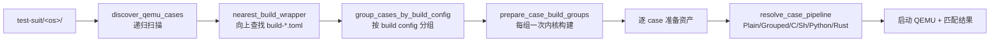
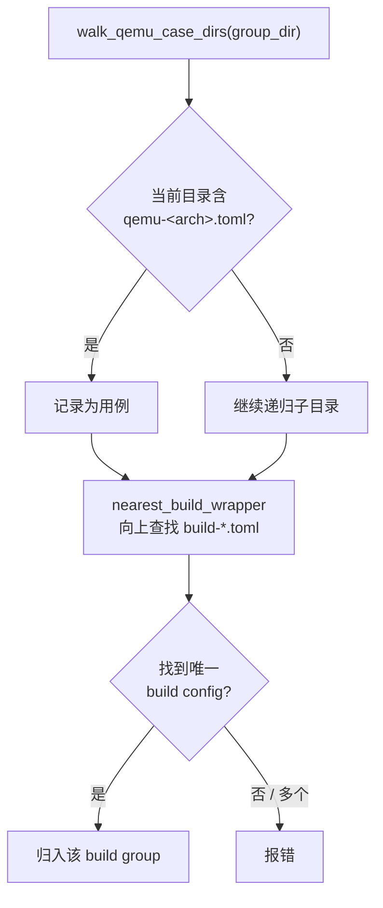

# 测试基础设施

`scripts/axbuild/src/test/` 是三套系统共享的 QEMU/板卡测试编排框架，分为两层：

- **发现与分组层**（`test/qemu/`）：用例发现、build wrapper 分组、QEMU 启动控制、结果聚合和 `--list` 渲染。ArceOS、StarryOS、Axvisor 三者共享。
- **资产注入层**（`test/case/`）：rootfs 副本、overlay 注入、rootfs 缓存、grouped runner 协议和六种 pipeline 类型。StarryOS 和 Axvisor 共享；ArceOS 使用自己的 feature-based runner（见 [ArceOS 测试](./arceos/test)），不经过 rootfs 注入。

本文从源码角度描述这套共享框架的核心契约，作为 [Std 白名单测试](./test)、[内核测试](./ktest) 和各系统测试文档（[ArceOS](./arceos/test)、[StarryOS](./starry/test)、[Axvisor](./axvisor/test)）的底层参考。

## 1. 设计原则

框架围绕一个核心原则展开：**OS 只构建一次，逐 case 运行**。具有相同 Build Config 的用例归入同一个 build group，组内共享一次内核/hypervisor 编译，随后每个 case 独立准备资产、启动 QEMU、匹配结果。这避免了 N 个用例触发 N 次内核编译。



## 2. 模块布局

源码按"发现 → 分组 → 资产 → 运行"分层，避免把目录扫描、构建编排和 QEMU 调用耦合在同一处。

| 代码位置 | 作用 |
|----------|------|
| `scripts/axbuild/src/test/mod.rs` | 模块根，声明 `board`/`build`/`case`/`qemu`/`std`/`suite`/`timing`/`host_http` 子模块 |
| `scripts/axbuild/src/test/suite.rs` | suite/group 根目录解析：`suite_root()`、`group_dir()`、`discover_group_names()` |
| `scripts/axbuild/src/test/qemu/discovery.rs` | QEMU 用例发现：`discover_qemu_cases()`、`nearest_build_wrapper()`、build wrapper 解析 |
| `scripts/axbuild/src/test/qemu/grouping.rs` | build group 分组：`group_cases_by_build_config()`、`prepare_case_build_groups()` |
| `scripts/axbuild/src/test/qemu/config.rs` | 用例 TOML 字段加载：`test_commands`、`host_http_server`、subcase 发现 |
| `scripts/axbuild/src/test/qemu/boot.rs` | QEMU 启动控制：`apply_smp_qemu_arg()`、`apply_drive_snapshot_without_global_snapshot()`、`apply_timeout_scale()` |
| `scripts/axbuild/src/test/qemu/tree.rs` | `--list` 输出的用例树渲染 |
| `scripts/axbuild/src/test/qemu/summary.rs` | `QemuTestSummary` 结果聚合 |
| `scripts/axbuild/src/test/case/types.rs` | 核心数据模型：`TestQemuCase`、`CasePipeline`、`CaseAssetLayout`、`GroupedCaseRunnerConfig` |
| `scripts/axbuild/src/test/case/assets.rs` | 资产准备入口：`prepare_case_assets()`、`resolve_case_pipeline()`、rootfs 缓存 |
| `scripts/axbuild/src/test/case/hash.rs` | rootfs 缓存键计算：`case_asset_cache_key()` |
| `scripts/axbuild/src/test/case/layout.rs` | 每个 case 的工作目录布局：`case_asset_layout()` |
| `scripts/axbuild/src/test/case/grouped_runner.rs` | grouped runner 脚本生成与 marker 协议 |
| `scripts/axbuild/src/test/case/cache.rs` | rootfs 缓存镜像读写与有效性判断 |
| `scripts/axbuild/src/test/case/shell.rs` | Shell pipeline 资产准备 |
| `scripts/axbuild/src/test/build/` | C/Python/Rust pipeline 的交叉编译编排（CMake、toolchain、wrappers） |
| `scripts/axbuild/src/test/host_http.rs` | `HostHttpServerGuard`：测试期 host 侧 HTTP fixture |
| `scripts/axbuild/src/test/timing.rs` | `AXBUILD_TIMING:` 阶段计时 |
| `scripts/axbuild/src/test/board.rs` | 板级测试的共享发现与运行 |
| `scripts/axbuild/src/test/std.rs` | host 端 std 白名单测试（独立流程，见 [Std 白名单测试](./test)） |

## 3. Suite 与 group 发现

`suite.rs` 定义测试资产的根路径约定：

```rust
pub(crate) fn suite_root(workspace_root: &Path, os_name: &str) -> PathBuf {
    workspace_root.join("test-suit").join(os_name)
}
```

`os_name` 分别是 `arceos`、`starryos`、`axvisor`。`discover_group_names()` 列出 `test-suit/<os>/` 下的子目录作为可用 group；`require_group_dir()` 在 group 不存在时列出全部支持的 group 名。

三套系统的 group 组织方式不同，但都通过同一个 `suite_root` 入口发现：

| 系统 | group 布局 |
|------|-----------|
| ArceOS | `rust/`、`c/` 是预定义 group，也支持自定义 group 目录 |
| StarryOS | `test-suit/starryos/` 根目录直接平铺 build wrapper（如 `qemu-smp1/`） |
| Axvisor | `normal/` 作为主测试组 |

## 4. 用例发现与 build wrapper

### 4.1 QEMU 用例定位

`discovery.rs` 递归扫描 group 目录，按文件特征识别用例和构建边界。核心概念是 **build wrapper**——一个含有 `build-<target>.toml`（或旧式 `build-<arch>.toml`）的目录，定义一组共享相同构建配置的用例。



`nearest_build_wrapper(test_group_dir, case_dir, ...)` 从用例目录开始**逐级向上**查找，直到遇到恰好一个 `build-*.toml` 的目录：

```rust
loop {
    let build_configs = build_config_paths(dir)?;
    match build_configs.as_slice() {
        [build_config_path] => return Ok(TestBuildWrapper { ... }),
        [] => {}  // 继续向上
        _ => bail!("...multiple build-*.toml configs..."),
    }
    if dir == test_group_dir { bail!("...not under a build wrapper..."); }
    dir = dir.parent()?;
}
```

这个设计让用例可以任意嵌套：只要向上能找到一个 build wrapper，用例就继承它的构建配置。一个 wrapper 下含多个 `build-*.toml` 时直接报错（目标推断场景下不允许歧义）。

用例由 `qemu-<arch>.toml` 标记。`qemu_config_name(arch)` 生成 `qemu-{arch}.toml`；一个用例目录可以同时含多个架构的 QEMU 配置（如 `qemu-aarch64.toml` 和 `qemu-riscv64.toml`），`--arch` 选择其中之一。

### 4.2 旧式 build config 兼容

`legacy_build_config_candidates(dir, target)` 支持旧式 `build-<arch>.toml` 命名（如 `build-aarch64.toml`），从 target 名提取 arch 前缀后查找。当前推荐使用 `build-<target>.toml`（完整 target triple）。

## 5. Build group 分组

`grouping.rs` 把发现的用例按 `build_config_path` 去重分组：

```rust
pub(crate) fn group_cases_by_build_config<T: BuildConfigRef>(
    cases: &[T],
) -> Vec<QemuCaseGroup<'_, T>> {
    // 按 build_config_path 聚合，保留首次出现顺序
}
```

`prepare_case_build_groups()` 为每个 group 调用 `prepare_context(build_config_path)`，得到该组共享的 `(ResolvedRequest, Cargo)`。随后组内每个用例复用这一次内核构建产物，只各自准备运行资产和启动 QEMU。这就是"OS 只构建一次"的实现：**分组键是 build config 路径**，而非用例名或架构。

## 6. Pipeline 类型与解析

> 本节描述的资产注入层（`test/case/`）由 **StarryOS 和 Axvisor** 共享。ArceOS 的 Rust/C 用例使用 feature-based runner（每次启动选一个 feature 运行），不经过 rootfs 注入和 pipeline 解析，详见 [ArceOS 测试](./arceos/test)。

每个 QEMU 用例在资产准备阶段由 `resolve_case_pipeline(case)` 判定其 pipeline 类型。判定基于用例目录下的特征文件，**同一目录同时命中多个 pipeline 会直接报错**：

```rust
pub(crate) fn resolve_case_pipeline(case: &TestQemuCase) -> anyhow::Result<CasePipeline> {
    let mut pipelines = Vec::new();
    if case.is_grouped() { pipelines.push(CasePipeline::Grouped); }       // test_commands 非空
    if case_c_source_dir(case).is_dir() { pipelines.push(CasePipeline::C); }        // c/
    if case_sh_source_dir(case).is_dir() { pipelines.push(CasePipeline::Sh); }      // sh/
    if case_python_source_dir(case).is_dir() { pipelines.push(CasePipeline::Python); }  // python/
    if case_rust_source_dir(case).is_dir() { pipelines.push(CasePipeline::Rust); }      // rust/
    if pipelines.len() > 1 { bail!("...defines multiple asset pipelines..."); }
    Ok(pipelines.into_iter().next().unwrap_or(CasePipeline::Plain))
}
```

六种 pipeline 的触发条件与行为：

| Pipeline | 触发条件 | 资产准备行为 |
|----------|----------|-------------|
| `Plain` | 以上均不满足 | 不创建 per-case rootfs 副本，QEMU `-snapshot` 直接从共享镜像启动 |
| `Grouped` | QEMU TOML 中 `test_commands` 非空 | 生成 runner 脚本注入 `/usr/bin/`，逐条执行 shell 命令并打印 marker |
| `C` | 含 `c/` 子目录 | CMake 交叉编译 C 程序，产物注入 overlay 的 `/usr/bin/` |
| `Sh` | 含 `sh/` 子目录 | shell 脚本注入 overlay |
| `Python` | 含 `python/` 子目录 | 交叉编译 Python wheel/site-packages，写入 musl loader 搜索路径 |
| `Rust` | 含 `rust/` 子目录（须含 `Cargo.toml`） | `cargo build --release` 交叉编译为 musl 静态二进制，注入 `/usr/bin/` |

需要注入的 pipeline（Grouped/C/Sh/Python/Rust）会创建 per-case rootfs 副本；Plain 用例不创建副本。`CasePipeline::is_str()` / `as_str()` 用于日志和缓存键。

### 6.1 Rust pipeline

Rust pipeline（`test/build/rust.rs`）交叉编译用例 `rust/` 目录下的 Cargo 项目：

1. `rust_musl_target(arch)` 把架构名映射到 musl target triple（如 `aarch64` → `aarch64-unknown-linux-musl`）；
2. `rustup target add <triple>` 确保目标已安装；
3. 解压 rootfs 获取 Alpine 交叉 linker（部分架构如 loongarch64 的 ELF 格式 host linker 无法处理）；
4. 可选执行 `prebuild.sh`（在 Alpine staging root 内通过 qemu-user 运行，用于 `apk add` 原生依赖）；
5. 设置 `CARGO_TARGET_<TRIPLE>_LINKER` 指向 staging root 中的 `ld`，执行 `cargo build --release`；
6. 产物复制到 overlay 的 `/usr/bin/`。

二进制名取自 `Cargo.toml` 的 `[[bin]]` name，缺失时回退到 package 名。

## 7. 资产准备与 rootfs 缓存

### 7.1 工作目录布局

`case_asset_layout(workspace_root, target, case_name)` 为每个需要注入的用例生成工作目录，位于 `target/<target>/qemu-cases/<case_name>/` 下：

```text
target/<target>/qemu-cases/<case_name>/
├── runs/<pid>-<seq>/                 # 每次运行独立目录（CASE_RUNS_DIR_NAME）
│   ├── staging-root/                 # 解压的 rootfs（提取 Alpine sysroot）
│   ├── build/                        # CMake 构建缓存
│   ├── overlay/                      # 注入 rootfs 的覆盖层
│   ├── guest-bin/                    # guest 命令包装脚本
│   ├── cross-bin/                    # 交叉工具链 wrapper
│   ├── cmake-toolchain.cmake         # CMake 工具链文件
│   └── case-rootfs.img               # per-case rootfs 副本
└── cache/                            # 跨运行复用
    ├── apk-cache/                    # APK 下载缓存
    └── rootfs/                       # 预注入 rootfs 缓存镜像（{sha256}.img）
```

`next_case_run_id()` 用 `<pid>-<sequence>` 生成运行目录名，`CASE_RUN_ID` 是进程级原子计数器。构建缓存（`build/`、`apk-cache/`）跨运行保留以加速重复测试；rootfs 副本在运行后删除。

### 7.2 缓存键

`case_asset_cache_key()`（`hash.rs`）计算一个 SHA-256 键，决定预注入 rootfs 缓存是否有效。缓存命中时跳过整个注入流程（C/Python pipeline 中最昂贵的步骤）：

```rust
pub(super) fn case_asset_cache_key(arch, target, pipeline, case, shared_rootfs, config) -> String {
    let mut hasher = Sha256::new();
    hash_token(&mut hasher, "v3");                          // 缓存格式版本
    hash_token(&mut hasher, arch);
    hash_token(&mut hasher, target);
    hash_token(&mut hasher, case.display_name);
    hash_token(&mut hasher, pipeline.as_str());
    for var in &config.cache_env_vars {                     // 如 STARRY_APK_REGION
        hash_token(&mut hasher, var);
        hash_token(&mut hasher, std::env::var(var).unwrap_or_default());
    }
    if pipeline == C { hash_file(CMAKE_TOOLCHAIN_TEMPLATE); }    // 仅 C pipeline
    if pipeline == Python { hash_token(PYTHON_PIPELINE_CACHE_VERSION); }
    if pipeline == Rust { hash_token(RUST_PIPELINE_CACHE_VERSION); }
    if pipeline == Grouped { hash_grouped_runner_config(...); }
    hash_rootfs_fingerprint(shared_rootfs);                 // rootfs 内容指纹
    hash_tree(case.case_dir);                               // 用例目录全部文件
    hash_file(case.qemu_config_path);                       // QEMU 配置
    format!("{:x}", hasher.finalize())
}
```

缓存键纳入的要素解释了为什么某些变更会令缓存失效：

| 变更 | 是否失效 | 原因 |
|------|---------|------|
| 修改用例目录下任何文件 | 是 | `hash_tree(case.case_dir)` |
| 修改 QEMU TOML | 是 | `hash_file(qemu_config_path)` |
| 更换/更新 rootfs 镜像 | 是 | `hash_rootfs_fingerprint` |
| 切换 `STARRY_APK_REGION` | 是 | `cache_env_vars` 含该变量 |
| 修改 CMake 工具链模板 | 仅 C pipeline | 条件性 hash |
| 修改 grouped runner 配置 | 仅 Grouped | 条件性 hash |

缓存的 rootfs 镜像存放在 `cache/rootfs/{sha256}.img`。`is_valid_rootfs_cache_image()` 检查文件存在且非空即视为有效；命中时通过 `copy_file_fast`（优先 reflink）复制到 per-case 路径，跳过 overlay 构建和 `inject_overlay`。

### 7.3 QEMU snapshot 语义

`prepare_case_assets_sync()` 返回的 `extra_qemu_args` **始终包含 `-snapshot`**，确保 guest 写入永远不会落回任何镜像文件。对于需要注入的 pipeline，注入发生在 per-case 副本上；Plain 用例直接从共享镜像启动，`-snapshot` 保证共享镜像不被污染。

运行结束后 `remove_case_rootfs_copy()` 删除 per-case 副本（仅大镜像，保留构建缓存）；失败只打印 warning，不掩盖测试本身的失败。

## 8. Grouped runner 协议

Grouped pipeline（`test_commands` 非空）通过一个生成的 shell 脚本在 guest 内顺序执行多条命令，并用结构化 marker 报告每条命令的状态。`GroupedCaseRunnerConfig` 由各子系统提供，定义 marker 前缀：

```rust
pub(crate) struct GroupedCaseRunnerConfig {
    pub(crate) runner_name: String,             // 脚本文件名
    pub(crate) runner_path: String,             // guest 内路径，如 /usr/bin/axbuild-runner
    pub(crate) autorun_profile_script: Option<String>,  // 可选：登录后自动执行
    pub(crate) begin_marker: String,            // 如 STARRY_GROUPED_TEST_BEGIN
    pub(crate) passed_marker: String,
    pub(crate) failed_marker: String,
    pub(crate) all_passed_marker: String,
    pub(crate) all_failed_marker: String,
    pub(crate) success_regex: String,           // QEMU 成功判定
    pub(crate) fail_regex: String,
}
```

StarryOS 的前缀是 `STARRY`，生成的日志形如：

```text
STARRY_GROUPED_TEST_BEGIN: step=1/3 epoch=... command=/usr/bin/test-a
STARRY_GROUPED_TEST_PASSED: step=1/3 epoch=... status=0 command=/usr/bin/test-a
...
STARRY_GROUPED_TESTS_PASSED
```

### 8.1 脚本生成

`write_grouped_case_runner_script()` 把 `test_commands` 编译为一个 shell 脚本，写入 overlay 的 `/usr/bin/`。每条命令的执行模板：

```sh
step=$((step + 1))
now=$(date +%s 2>/dev/null || printf unknown)
printf '%s: step=%s/%s epoch=%s command=%s\n' <BEGIN> "$step" "$total" "$now" <label>
if sh -c <quoted_command>; then
    printf '%s: step=%s/%s epoch=%s status=0 command=%s\n' <PASSED> ...
else
    status=$?
    printf '%s: step=%s/%s epoch=%s status=%s command=%s\n' <FAILED> ... "$status" ...
    failed=1
fi
```

命令标签（`grouped_command_label`）：单行且 ≤120 字符的命令原样使用，否则取 SHA-256 摘要前缀，避免日志过长。全部命令执行后根据 `failed` 标志输出 `all_passed_marker` 或 `all_failed_marker`。

### 8.2 自动执行

`apply_grouped_qemu_config()` 把 runner 注入 QEMU 配置：

- 无 `autorun_profile_script` 时，设置 `qemu.shell_init_cmd = "exec <runner_path>"`，guest shell 启动即执行；
- 有 `autorun_profile_script` 时，写入 `etc/profile.d/<script>.sh`，在登录 profile 阶段执行（通过 `AXBUILD_GROUPED_AUTORUN_DONE` 防止重复）。

同时把 `success_regex` 设为 `all_passed_marker`，并把 `fail_regex` 追加 `all_failed_marker`。

## 9. QEMU 启动控制

`boot.rs` 只负责显式的测试运行控制，**不**管理 QEMU machine/CPU/firmware（那些由 QEMU TOML 提供）：

| 函数 | 作用 |
|------|------|
| `apply_smp_qemu_arg(qemu, smp)` | 把 CLI `--smp` 写入 `-smp <n>`，覆盖 TOML 中的值 |
| `smp_from_qemu_arg(qemu)` | 从 QEMU args 反读 `-smp` 值（取逗号前的核数） |
| `apply_timeout_scale(qemu)` | 按 `AXBUILD_TEST_TIMEOUT_SCALE` 整数倍放大 QEMU timeout |
| `apply_drive_snapshot_without_global_snapshot(qemu)` | UEFI 路径下把全局 `-snapshot` 改写为各 `-drive` 的 `snapshot=on` |
| `qemu_timeout_summary(qemu)` | 提取 timeout 信息用于日志 |

### 9.1 UEFI 与 snapshot

UEFI 启动需要可写的 EFI pflash/ESP，全局 `-snapshot` 会把所有盘变为写时复制，破坏 UEFI 写语义。`apply_drive_snapshot_without_global_snapshot()` 的处理：

1. 移除全局 `-snapshot` 参数；
2. 遍历所有 `-drive`，对每个 drive 追加或改写 `snapshot=on`。

这样系统盘保持写时复制（保护镜像），而 EFI pflash/ESP 不受全局 snapshot 影响。`ensure_drive_snapshot_on()` 保证每个 drive 的 `snapshot=` 字段为 `on`。

## 10. Host HTTP fixture

部分测试用例需要在 guest 内通过 HTTP 访问 host 提供的固定内容（如测试网络栈、下载逻辑）。QEMU TOML 中可声明 `[host_http_server]`：

```toml
[host_http_server]
bind = "127.0.0.1"
port = 0
body = "ArceOS local HTTP fixture\n"
# 或提供目录静态服务（支持 autoindex）
# dir = "host/wheels"
```

`HostHttpServerGuard`（`host_http.rs`）在 QEMU 启动前绑定监听，在 `Drop` 时停止：

- `bind_listener` 在端口被占用时按 50ms 间隔重试，最长 180s（`BIND_RETRY_TIMEOUT`）；
- `set_nonblocking(true)` + 10ms 轮询配合 `AtomicBool` stop 标志优雅退出；
- 支持固定 body（`body` / `body_byte` / `body_size`）和目录静态服务（`dir`，带 `/` autoindex）；
- body 写入设 30s per-write timeout（`BODY_WRITE_TIMEOUT`），防止慢 guest 阻塞服务器线程。

QEMU user-net 把 host 映射为 `10.0.2.2`，guest 通过该地址访问 host HTTP 服务。运行后 `AXBUILD_KEEP_QEMU_LOG` 保留 QEMU 日志便于事后符号化。

## 11. 测试计时

`timing.rs` 在资产准备和运行阶段输出 `AXBUILD_TIMING:` 前缀的结构化计时行：

```text
AXBUILD_TIMING: scope=qemu-asset case=fs-basic phase=resolve-pipeline elapsed=1.234ms
```

`TimingStage::new(scope, fields)` 记录开始时刻，`finish()` 打印并返回耗时。字段以 `key=value` 形式附加，便于 CI 日志解析。`scope` 标识阶段（如 `qemu-asset`、`grouped-c`），`phase` 标识子步骤（如 `resolve-pipeline`、`cache-hit-copy`、`compile-total`）。

## 12. 子系统差异化钩子

StarryOS 和 Axvisor 通过 `CaseAssetConfig` 注入差异，共享框架不包含任何系统特有逻辑。ArceOS 不使用此机制（其 feature-based runner 独立处理资产）：

```rust
pub(crate) struct CaseAssetConfig {
    pub(crate) grouped_runner: GroupedCaseRunnerConfig,   // marker 前缀
    pub(crate) script_env: CaseScriptEnvConfig,           // 脚本环境变量
    pub(crate) cache_env_vars: Vec<String>,               // 纳入缓存键的环境变量
    pub(crate) prepare_staging_root: fn(&Path) -> Result<()>,  // rootfs 解压后钩子
    pub(crate) prepare_guest_package_env: Option<GuestPackageEnvPrepareFn>,
}
```

| 子系统 | `prepare_staging_root` | `cache_env_vars` | grouped marker 前缀 |
|--------|------------------------|------------------|---------------------|
| StarryOS | DNS 注入 + APK 区域配置 | `STARRY_APK_REGION` | `STARRY` |
| Axvisor | 空操作 `\|_| Ok(())` | — | `AXVISOR` |

StarryOS 的 `prepare_staging_root` 额外完成：读取宿主 DNS 写入 staging `/etc/resolv.conf`（过滤 loopback 和 slirp 地址），并根据 `STARRY_APK_REGION` 重写 `/etc/apk/repositories`。`STARRY_APK_REGION` 同时出现在 `cache_env_vars` 中，因此切换区域会使 rootfs 缓存失效。
