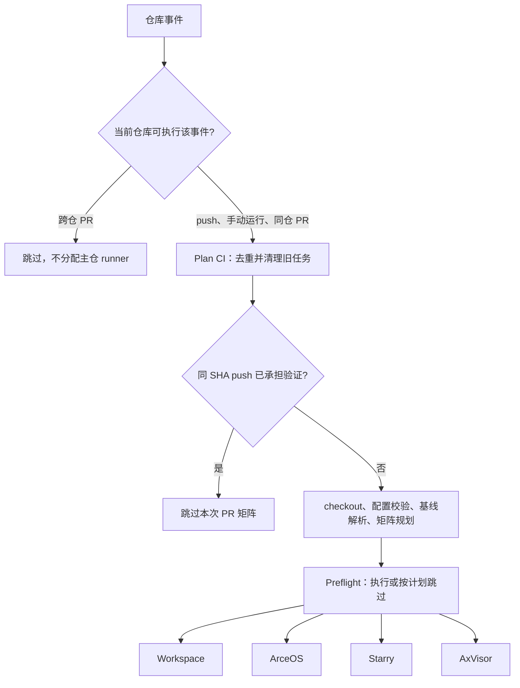

# 自动化验证

TGOSKits 的项目自动化包括主 CI、定时应用验证、容器发布、文档构建部署和软件包发布。各工作流分别声明事件、权限、执行资源和产物，不组成一条隐含的串行流水线。文档按此分为两组：主 CI 与定时应用验证归入“测试”，容器、文档和软件包发布归入“发布”。

## 1. 测试

测试组包含主 CI 与定时应用验证两条工作流。主 CI 将仓库事件转成检查矩阵，再通过 `cargo xtask` 执行静态检查、宿主测试、QEMU 测试和实体板卡测试：`.github/workflows/ci.yml` 负责事件路由和阶段依赖，`scripts/test/ci_plan.py` 决定检查范围，`reusable-check-matrix.yml` 执行每一行。主 CI 成功不代表镜像、站点或软件包已经发布。

### 1.1 主 CI 阶段关系

主 CI 先判断是否应在当前仓库运行，再决定是否复用同一提交的已有验证。只有确实需要检查的事件才进入 checkout、配置校验和矩阵规划。

`plan_ci` 输出 `should_run`、`since_ref` 和各组的矩阵及启用标志。普通运行先经过 `Preflight`，随后四个测试分组独立调度；纯测试套件改动可以按计划跳过 `Preflight`。

图中的四个测试分组没有相互依赖。`Preflight` 失败会阻止它们启动，但某个测试分组失败不会通过依赖关系阻断另一个分组。完整条件由 `ci.yml` 的 `needs` 和 job 级 `if` 决定，详见[矩阵执行](testing/execution.md)。

### 1.2 主 CI 验证范围

`.github/ci/checks/` 按职责维护检查，不把固定矩阵行数写进文档。平台新增、用例注册和 PR 影响分析都可能改变实际行数。

| Actions 分组  | 主要输入                      | 验证内容                                   |
| ------------- | ----------------------------- | ------------------------------------------ |
| `Plan CI`   | 工作流事件、Git 历史、CI 配置 | 来源限制、push/PR 去重、配置契约、影响分析 |
| `Preflight` | `static.toml`               | 格式、软件包发布预检、增量同步检查         |
| `Workspace` | `workspace.toml`            | Clippy、std 白名单测试、qperf 专项测试     |
| `ArceOS`    | `arceos.toml`、独立测试声明 | QEMU 套件、启动与 SMP 场景、相关内核测试   |
| `Starry`    | `starry.toml`               | QEMU 套件、内核测试、已注册板卡测试        |
| `AxVisor`   | `axvisor.toml`              | QEMU、KVM 虚拟化场景及已注册板卡测试       |

一个矩阵行可以顺序执行多个命令，也可以由任务工具展开成多个用例。因此 Actions 中的一个绿色 job 不等于只运行了一个测试；反过来，未被选择的检查没有产生通过证据。

### 1.3 定时应用验证

`starry-apps.yml` 为 Starry 应用提供独立于主 CI 的定时和手动验证。定时入口按 UTC 每日 18:00 运行四架构应用 smoke 和 NixOS 场景，手动入口可追加完整 Clippy。工作流读取 `.github/ci/checks/starry-apps.toml`，由 `scripts/test/ci_plan.py` 的 `build_starry_apps_plan()` 规划，再交给 `reusable-check-matrix.yml` 执行；它不使用主 CI 的 PR 变更范围或 push/PR 去重结果。应用检查的结果不能替代主 CI 的系统套件或板卡测试，详见[应用验证](testing/applications.md)。

## 2. 发布

发布组包含容器、文档和软件包三条链路。它们各自声明触发条件并独立调度，主 CI 成功不是任何一条发布链路的前置条件；发布产物也不是主 CI 检查矩阵的输入门禁。

### 2.1 容器发布

`container-publish.yml` 在 `main` 或 `dev` 上由 `container/Dockerfile`、`container/Dockerfile.axvisor-lvz` 或 `rust-toolchain.toml` 的变更触发，也可手动选择目标。工作流负责选择目标和登录 GHCR，`.github/actions/publish-container/action.yml` 负责单个镜像的名称规范化、标签生成、构建和推送，产出 base 与 AxVisor LVZ 两个 GHCR 镜像；这些镜像提供部分矩阵行的执行环境，但主 CI 直接消费镜像标签，不通过 `needs` 等待发布完成，详见[容器发布](publishing/containers.md)。

### 2.2 文档发布

`docs.yml` 在 `main` 的 `docs/**` 或工作流自身变更时触发，使用 Node.js 24 和 Yarn 按 `docs/package.json` 与 `docs/yarn.lock` 安装依赖并构建 Docusaurus 站点；站点结构由 `docs/docusaurus.config.js` 和 `docs/sidebars.docs.js` 决定，构建产物经 Pages artifact 交给独立的 `deploy` job 部署 GitHub Pages。构建成功是部署的前置，但整条链路独立于 Rust、QEMU 和板卡检查，详见[文档发布](publishing/documentation.md)。

### 2.3 软件包发布

`release-plz.yml` 在 `dev` 分支 push 或手动触发，使用 stable 工具链按根目录 `release-plz.toml` 运行 Release-plz：`release-plz-release` 执行实际发布，`release-plz-pr` 创建或更新版本发布 PR。两个 job 没有 `needs` 依赖，且仅允许主仓运行，详见[软件包发布](publishing/releases.md)。

## 3. 实现分层

CI 的配置、选择算法和实际执行器分开维护。排查问题时，应先确定错误来自哪一层，再读取对应实现，而不是直接修改超时或成功匹配规则。

### 3.1 代码职责

下表列出从入口到测试结果的主要代码对象。路径均相对于仓库根目录。

| 位置或对象                               | 职责                                               |
| ---------------------------------------- | -------------------------------------------------- |
| `.github/workflows/ci.yml`             | 触发过滤、来源门禁、去重、取消旧 run、分组依赖     |
| `.github/ci/checks/*.toml`             | 检查命令、影响范围、测试套件注册及执行选项         |
| `.github/ci/runner-profiles.toml`      | runner 标签、容器环境、owner 限制及 KVM 要求       |
| `ci_impact.py` 的 `CiImpact`         | 保存变更路径、受影响软件包、OS、平台输入和套件路径 |
| `ci_suite.py` 的 `SuiteSelection`    | 将套件变更映射到已注册模板和精确运行命令           |
| `ci_plan.py` 的 `_build_main_plan()` | 组合静态检查、普通检查及精确套件行，输出分组矩阵   |
| `reusable-check-matrix.yml` 的 `run` | checkout、环境检查、缓存及 artifact 恢复、命令执行 |
| `scripts/axbuild/src/test/`            | 测试发现、构建分组、资产准备、运行与结果汇总       |

Python 文件均位于 `scripts/test/`。任务工具和各 OS 的适配层决定具体构建与启动行为；CI 只选择这些已有入口，不另造一套内核测试执行协议。

### 3.2 工作流边界

测试与发布的工作流各自建立依赖关系。跨工作流的相同提交、共同镜像名或同一仓库，并不自动形成 `needs` 门禁。

| 工作流                    | 职责                                                               | 与主 CI 的关系                                 |
| ------------------------- | ------------------------------------------------------------------ | ---------------------------------------------- |
| `container-publish.yml` | [容器发布](publishing/containers.md)：构建 base 和 AxVisor LVZ 镜像并推送 GHCR | 提供部分矩阵需要的环境，不是主 CI 的依赖 job   |
| `starry-apps.yml`       | [应用验证](testing/applications.md)：定时或手动运行应用矩阵                 | 使用同一矩阵执行器，维护独立检查清单           |
| `docs.yml`              | [文档发布](publishing/documentation.md)：构建 Docusaurus 并部署 Pages          | 构建成功后才部署，独立于 Rust、QEMU 和板卡检查 |
| `release-plz.yml`       | [软件包发布](publishing/releases.md)：发布软件包、创建或更新发布 PR            | 主仓专用，没有等待主 CI 成功的工作流依赖       |

工作流的具体命令和权限是自动化行为的事实来源；仓库保护规则、runner group 授权和外部 registry 状态不由这些 YAML 完整表达。测试框架的内部构建与用例协议由[测试基础设施](../build/test_infra.md)维护。
