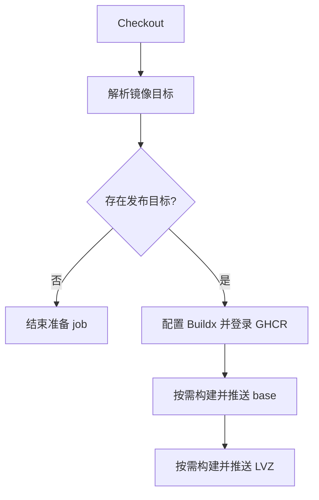

# 容器发布

`.github/workflows/container-publish.yml` 构建并发布测试所需的 base 与 AxVisor LVZ 镜像。工作流负责选择目标、配置 Buildx 和登录 GHCR，`.github/actions/publish-container/action.yml` 负责单个镜像的名称规范化、标签生成、构建及推送。

## 1. 输入与目标

容器发布不由主 CI 的检查矩阵调用。它有自己的触发路径和发布条件，两个镜像的选择也分别计算。

### 1.1 自动触发

push 必须位于 `main` 或 `dev`，且变更匹配下表中的路径。`Detect changed image inputs` 使用本地 Git 差异过滤，为后续 `Resolve publish targets` 提供 `base` 和 `axvisor` 输出。

| 变更路径 | base 镜像 | LVZ 镜像 |
| --- | --- | --- |
| `container/Dockerfile` | 选择 | 不因这一项自动选择 |
| `container/Dockerfile.axvisor-lvz` | 不因这一项自动选择 | 选择 |
| `rust-toolchain.toml` | 选择 | 选择 |

修改发布工作流或 composite action 本身不在该 push 路径列表中，不能假定这些改动会自动重建镜像。base Dockerfile 变化也不会自动重建派生的 LVZ 镜像；两者的选择逻辑以当前过滤器为准。

### 1.2 手动选择

`workflow_dispatch` 的 `target` 输入允许 `base`、`axvisor-lvz`、`both`，默认 `both`。目标解析仍要求当前 ref 名称为 `main` 或 `dev`；手动选择其他分支会执行准备 job，但不进入 Buildx、登录和镜像发布步骤。

`Resolve publish targets` 输出 `base`、`axvisor`、`any`、`base_image`、`axvisor_image`。后续步骤分别以 `any` 或具体目标标志作为条件，避免没有目标时仍初始化构建与推送环境。

## 2. 构建环境

两个 Dockerfile 定义了 CI 消费的工具链环境。镜像版本、编译选项和安装路径由 Dockerfile 固定，不能从 `ubuntu-latest` 这一宿主标签推断容器内部内容。

### 2.1 base 镜像

`container/Dockerfile` 基于 `ubuntu:24.04`，安装构建工具、用户态 QEMU、文件系统工具及交叉编译环境，并构建 `QEMU_VERSION` 指定的系统模拟器。Rust 工具链通过复制进镜像的 `rust-toolchain.toml` 准备，相关路径加入 `PATH`。

镜像名为 `ghcr.io/<repository>-container`，其中 repository 被转换为小写。主仓与 fork 使用各自的仓库命名空间，不把 fork 的镜像自动发布到主仓名下。

### 2.2 LVZ 派生镜像

`container/Dockerfile.axvisor-lvz` 通过 `BASE_IMAGE` 继承 base 镜像，并按固定的 `QEMU_LVZ_REF` 构建 LoongArch LVZ 模拟器。`AXBUILD_QEMU_SYSTEM_LOONGARCH64` 指向 `/opt/qemu-lvz/bin/qemu-system-loongarch64`，构建参数包含 `--disable-kvm`。

工作流将 `BASE_IMAGE` 设置为当前仓库 base 镜像的 `latest`。只选择 LVZ 时，依赖 registry 中已经存在的 base；同时选择两个目标时，先完成 base 推送，再构建 LVZ。

## 3. 发布链路

整个工作流使用一个 `ubuntu-latest` job。两个镜像是顺序步骤，不是两行独立矩阵，base 发布失败时后续 LVZ 发布不会继续。

### 3.1 构建和推送

`publish` job 的执行关系如下，条件判断只选择需要运行的步骤，不创建额外 runner。

composite action 使用仓库根目录作为 Docker build context，调用 `docker/build-push-action` 并设置 `push=true`。这是真实发布，不是 dry-run；主 CI 的 `cargo publish --dry-run` 与该动作无关。

### 3.2 标签与缓存

`docker/metadata-action` 配置 `latest` 标签以及 tag 事件对应的 ref 标签。不过当前工作流的自动入口不是 tag push，手动分支也受目标解析限制，不能把 composite 中的 tag 规则当成已启用的镜像版本发布流程。

构建缓存使用 GHA backend：base 的 scope 为 `container`，LVZ 为 `container-axvisor-lvz`，写入使用 `mode=max`。这是 Docker 构建层缓存，不是 Rust cache，也不是 `tg-xtask-bin` artifact。

### 3.3 权限与一致性

工作流声明 `contents: read`、`packages: write`，通过 `github.actor` 和 `GITHUB_TOKEN` 登录 GHCR。名称规范化只处理大小写，不验证仓库是否已经授权发布或消费该镜像。

concurrency group 按 ref 区分，设置 `cancel-in-progress=false`。`main` 和 `dev` 可以分别运行，但两者生成相同的仓库镜像名和 `latest` 标签，因此 ref 隔离不等于镜像标签隔离。

主 CI 直接消费镜像标签，没有等待容器工作流的 `needs` 或 digest 绑定。镜像变更的发布结果、镜像身份和使用它的测试结果是三个独立事实；镜像构建失败不会自动把另一个已经开始的 CI run 变成失败。
