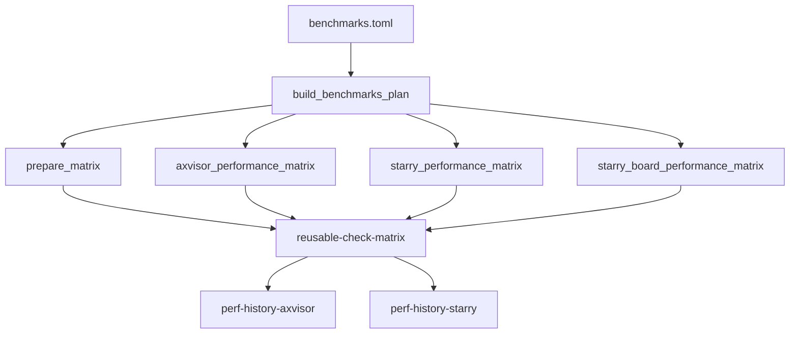

# 性能基准验证

TGOSKits 的三条日常验证入口分别承担应用 smoke、AxVisor 功能 nightly 和性能基准。`.github/workflows/starry-apps.yml` 只负责 Starry 应用 smoke、NixOS 与可选 Clippy，`.github/workflows/axvisor-nightly.yml` 只负责非性能 AxVisor nightly，`.github/workflows/benchmarks.yml` 负责所有来自 `.github/ci/checks/benchmarks.toml` 的性能 check。这样，某个性能组的板卡失败不会阻断另一个日常入口，也不会把性能检查混入应用或功能 nightly 的矩阵。

## 1. 所有者与调度

性能 check 的唯一定义位置是共享清单 `.github/ci/checks/benchmarks.toml`。`load_catalog()` 在文件名识别为 `benchmarks.toml` 时自动为每个 check 设置 `nightly_only` 与 `performance_report`，因此单项不再重复声明这两个字段；`group` 仍由每个 check 覆盖，用来选择矩阵和报告前缀。

### 1.1 三条入口

三条入口都使用 `cron` 和 `workflow_dispatch`，但各自维护独立的并发组和 `dev` revision。下表说明工作流边界，具体命令仍以检查清单为准。

| 工作流 | 负责内容 | 规划入口 |
| --- | --- | --- |
| `starry-apps.yml` | 四架构应用 smoke、NixOS、可选完整 Clippy | `build_starry_apps_plan()` |
| `axvisor-nightly.yml` | `phase = "nightly"` 的 AxVisor 功能场景 | `build_axvisor_nightly_plan()` |
| `benchmarks.yml` | `benchmarks.toml` 中全部 AxVisor 与 Starry 性能 check | `build_benchmarks_plan()` |

`benchmarks.yml` 的 `plan` job 读取 `dev` 后固定 revision，并把 `prepare_matrix`、`axvisor_performance_matrix`、`starry_performance_matrix` 和 `starry_board_performance_matrix` 传给后续 caller。`prepare_matrix` 只构建 Starry 性能行消费的 `tg-xtask` artifact，AxVisor 性能行不被这个 artifact 门禁耦合。

### 1.2 基准调度

性能工作流按 UTC `40 21 * * *` 调度，对应北京时间次日 05:40；它与 Starry Apps 的 `0 18 * * *`、AxVisor Nightly 的 `20 19 * * *` 分开。该时间给 AxVisor 当前最长的 90 分钟板卡检查留出间隔，但 GitHub 调度延迟、runner 排队和实体板卡占用仍可能改变实际开始时间。

`benchmarks.yml` 的 workflow concurrency group 使用 `benchmarks-${{ github.ref }}` 且 `cancel-in-progress: false`。因此新事件不会取消正在运行的同一分支基准任务；两个历史发布 job 另用 `perf-data-publish` 串行保护 `perf-data` 分支。

## 2. 清单与矩阵

统一清单只定义检查，不控制执行入口。`build_benchmarks_plan()` 通过 `BENCHMARK_GROUPS` 明确接受 `AxVisor` 与 `Starry Apps` 两组，遇到未知组会返回 `PlanError`，避免新增性能 check 被静默遗漏。

### 2.1 矩阵分组

`build_benchmarks_plan()` 在启用检查后按 `group` 和 `runs_on` 拆分矩阵。AxVisor 性能 check 进入 `axvisor_performance_matrix`；Starry Apps 中不含 `board` 的行进入 `starry_performance_matrix`，含 `board` 的行进入 `starry_board_performance_matrix`。当前清单因此规划为 3 个 AxVisor、6 个 Starry QEMU 和 5 个 Starry 板卡 check。

| `group` | 矩阵 | 运行环境 | 报告前缀 |
| --- | --- | --- | --- |
| `AxVisor` | `axvisor_performance_matrix` | 板卡 profile | `axvisor-nightly-performance` |
| `Starry Apps` | `starry_performance_matrix` | 托管 QEMU profile | `starry-apps-nightly-performance` |
| `Starry Apps` | `starry_board_performance_matrix` | 板卡 profile | `starry-apps-nightly-performance` |

Starry 板卡矩阵在 `benchmarks.yml` 中设置 `max_parallel: 1`，避免同一入口同时占用多个实体板卡。QEMU 矩阵保持并行；AxVisor 性能矩阵保持原有 `fail_fast: false`，一个板卡场景失败不会取消其他性能用例。

### 2.2 数据流

下图说明从统一清单到两个独立历史发布入口的分支关系。关键是两个历史入口只依赖自己的矩阵结果，不共享聚合结果或彼此的成功状态。

## 3. 报告与历史

`reusable-check-matrix.yml` 仍负责单个 check 的报告渲染和 artifact 上传：`matrix.performance_report` 为真时，它调用 `scripts/test/ci_perf_report.py` 生成 Markdown 与 JSON，并把 artifact 命名为 `${performance_artifact_prefix}-${check_id}`。前缀由 `_normalize_check()` 根据解析后的 `group` 推导，因此统一清单中的两个性能组不会混用历史来源。

### 3.1 汇总结果

`benchmarks.yml` 的 `result` job 同时下载两个报告前缀，把每个 check 的 Markdown 合并到 workflow summary，并报告四个阶段的结果。它不负责修改 `perf-data`，也不替代矩阵 job 里的详细日志；失败检查的原始输出仍在对应 Actions job。

### 3.2 历史发布

`perf-history-axvisor` 与 `perf-history-starry` 分别读取自己的报告 artifact，分别调用 `scripts/test/ci_perf_dashboard.py`。前者固定 `--source axvisor`，后者固定 `--source starry`，保持现有 dashboard JSON 格式和作者、提交信息约定。两个 job 都通过 `perf-data-publish` 串行写入同一个数据分支，但条件只检查各自矩阵，成功组的历史不会因为另一组失败而丢失。

发布完成后，两个 job 各自执行 `gh workflow run docs.yml --ref dev`。`docs.yml` 继续把 `perf-data` 合并进站点；性能工作流本身不修改 Pages 部署。
