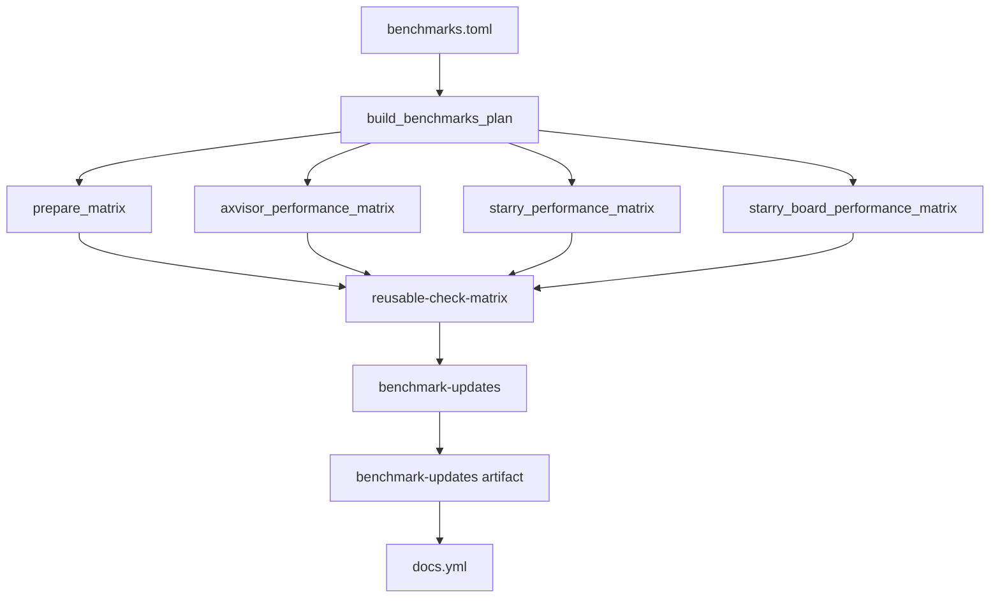

# 性能基准验证

TGOSKits 的三条日常验证入口分别承担应用 smoke、AxVisor 功能 nightly 和性能基准。`.github/workflows/starry-apps.yml` 只负责 Starry 应用 smoke、NixOS 与可选 Clippy，`.github/workflows/axvisor-nightly.yml` 只负责非性能 AxVisor nightly，`.github/workflows/benchmarks.yml` 负责所有来自 `.github/ci/checks/benchmarks.toml` 的性能 check。这样，某个性能组的板卡失败不会阻断另一个日常入口，也不会把性能检查混入应用或功能 nightly 的矩阵。

## 1. 所有者与调度

性能 check 的唯一定义位置是共享清单 `.github/ci/checks/benchmarks.toml`。`load_catalog()` 在文件名识别为 `benchmarks.toml` 时自动为每个 check 设置 `nightly_only` 与 `performance_report`，因此单项不再重复声明这两个字段；`group` 仍由每个 check 覆盖，用来选择矩阵和报告前缀。

### 1.1 三条入口

三条入口都使用 `cron` 和 `workflow_dispatch`，但各自维护独立的并发组和 `dev` revision。下表说明工作流边界，具体命令仍以检查清单为准。

| 工作流 | 负责内容 | 规划入口 |
| --- | --- | --- |
| `starry-apps.yml` | 四架构应用 smoke、NixOS、可选完整 Clippy | `build_starry_apps_plan()` |
| `axvisor-nightly.yml` | `phase = "nightly"` 的 AxVisor 功能场景 | `build_axvisor_nightly_plan()` |
| `benchmarks.yml` | `benchmarks.toml` 中全部 AxVisor 与 Starry 性能 check | `build_benchmarks_plan()` |

`benchmarks.yml` 的 `plan` job 读取 `dev` 后固定 revision，并把 `prepare_matrix`、`axvisor_performance_matrix`、`starry_performance_matrix` 和 `starry_board_performance_matrix` 传给后续 caller。`prepare_matrix` 只构建 Starry 性能行消费的 `tg-xtask` artifact，AxVisor 性能行不被这个 artifact 门禁耦合。

### 1.2 基准调度

性能工作流按 UTC `40 21 * * *` 调度，对应北京时间次日 05:40；它与 Starry Apps 的 `0 18 * * *`、AxVisor Nightly 的 `20 19 * * *` 分开。该时间给 AxVisor 当前最长的 90 分钟板卡检查留出间隔，但 GitHub 调度延迟、runner 排队和实体板卡占用仍可能改变实际开始时间。

`benchmarks.yml` 的 workflow concurrency group 使用 `benchmarks-${{ github.ref }}` 且 `cancel-in-progress: false`。因此新事件不会取消正在运行的同一分支基准任务。结束后的 `benchmark-updates` job 只整理本次增量并 dispatch `docs.yml`；Pages 发布由 docs workflow 的 `docs-pages` 队列串行处理。

## 2. 清单与矩阵

统一清单只定义检查，不控制执行入口。`build_benchmarks_plan()` 通过 `BENCHMARK_GROUPS` 明确接受 `AxVisor` 与 `Starry Apps` 两组，遇到未知组会返回 `PlanError`，避免新增性能 check 被静默遗漏。

### 2.1 矩阵分组

`build_benchmarks_plan()` 在启用检查后按 `group` 和 `runs_on` 拆分矩阵。AxVisor 性能 check 进入 `axvisor_performance_matrix`；Starry Apps 中不含 `board` 的行进入 `starry_performance_matrix`，含 `board` 的行进入 `starry_board_performance_matrix`。当前清单因此规划为 3 个 AxVisor、6 个 Starry QEMU 和 5 个 Starry 板卡 check。

| `group` | 矩阵 | 运行环境 | 报告前缀 |
| --- | --- | --- | --- |
| `AxVisor` | `axvisor_performance_matrix` | 板卡 profile | `axvisor-nightly-performance` |
| `Starry Apps` | `starry_performance_matrix` | QCS 自托管 profile | `starry-apps-nightly-performance` |
| `Starry Apps` | `starry_board_performance_matrix` | 板卡 profile | `starry-apps-nightly-performance` |

Starry 板卡矩阵在 `benchmarks.yml` 中设置 `max_parallel: 1`，避免同一入口同时占用多个实体板卡；这只是矩阵内的并行上限，不是板卡行串行的唯一机制。运行在同一块 OrangePi 5 Plus 上的基准板卡行（三条 AxVisor 性能行与四条 Starry 板卡行）都在清单里声明 `resource_group = "orangepi-5-plus"`，复用矩阵据此把受保护的 `schedule` 与 `workflow_dispatch` 运行放进共享的 `ci-resource-orangepi-5-plus` concurrency group，使它们与其它工作流中同样使用该资源组的 OrangePi 检查串行，避免跨工作流同时占用同一块实体板卡。QEMU 矩阵保持并行；AxVisor 性能矩阵保持原有 `fail_fast: false`，一个板卡场景失败不会取消其他性能用例。

AxVisor 板卡性能用例位于 `benchmarks/axvisor`；`board_test_group_roots()` 将该目录纳入默认 `normal` 组，因此 `--board` 和 `--test-case` 仍通过原入口选择用例。`vm_configs` 是宿主 initramfs 的打包输入，客户机启动资源由 `prepare_guest_payload()` 放到 `/guest/builtin`，不再嵌入宿主内核。无宿主块设备的 VCPU 用例直接保留内存根。

OrangePi IVC 用例的 Starry 内核由同一检出的 `cargo xtask starry build` 生成并打入归档；Zephyr 启动镜像由 `ensure_guest_image_bundles()` 取得，板卡 Linux rootfs 仍需提供匹配的 Starry 用户态 IVC 工作负载。自带镜像和用户态工作负载有各自的来源，不能使用旧 `/guest/starry` 内核替代当前构建产物。

### 2.2 数据流

下图说明从统一清单到 Pages 历史更新的数据流。矩阵仍按自己的成功条件选择数据，最后的桥接 job 只把本次增量交给唯一 Pages publisher，不承担累计历史。

`benchmark-updates` 只在 `plan`、`axvisor_performance`、`starry_performance` 与 `starry_board_performance` 全部成功时运行。任一性能矩阵失败时，该 job 不收集报告，也不上传 `benchmark-updates` artifact 或 dispatch `docs.yml`。

## 3. 报告与历史

`reusable-check-matrix.yml` 仍负责单个 check 的报告渲染和 artifact 上传：`matrix.performance_report` 为真时，它调用 `scripts/test/ci_perf_report.py` 生成 Markdown 与 JSON，并把 artifact 命名为 `${performance_artifact_prefix}-${check_id}`。前缀由 `_normalize_check()` 根据解析后的 `group` 推导，因此统一清单中的两个性能组不会混用历史来源。

### 3.1 汇总结果

`benchmarks.yml` 的 `result` job 同时下载两个报告前缀，把每个 check 的 Markdown 合并到 workflow summary，并报告四个阶段的结果。它不负责发布历史，也不替代矩阵 job 里的详细日志；失败检查的原始输出仍在对应 Actions job。

### 3.2 历史发布

`benchmark-updates` 从报告 artifact 中收集本次数据，并且只在 `plan`、`axvisor_performance`、`starry_performance` 与 `starry_board_performance` 全部成功时运行。AxVisor 只有在 `axvisor_performance` 成功时下载并纳入，Starry 只有在 QEMU 与 board 矩阵都成功时才下载并纳入。只要任一被纳入来源有 metric，job 就把本次增量写成 `axvisor.json` / `starry.json`，上传为保留 30 天的 `benchmark-updates` artifact，为 docs-pages 排队或短暂部署故障保留恢复窗口，并执行 `gh workflow run docs.yml --ref dev`，携带 benchmark run ID、固定 revision 和 UTC 日期。任一性能矩阵失败或没有任何新 metric 时，都不上传 artifact 且不触发 docs。

`docs.yml` 是唯一 Pages publisher。`Prepare performance dashboard` 步骤只准备环境变量并调用 `scripts/test/ci_perf_pages.py`，该脚本通过 `actions/configure-pages` 的 `base_url` 读取线上 `benchmark/index.html` 和 `benchmark/history.json`，并在脚本内复用 `ci_perf_dashboard.py` 的 `load_history`/`update_history`/`render_dashboard` 合并增量。页面存在时只使用 Pages 内容；仅当两份文件都返回 404 时，才一次性只读 `perf-data` 分支中的 `history.json` 与 `index.html` 作为 bootstrap。该 bootstrap 必须完整成功，普通文档发布才复制遗留 dashboard；fetch 失败、任一文件缺失或为空都会阻止 Pages 部署。benchmark dispatch 还必须拿到线上或遗留 history 作为 seed，否则构建失败，避免空历史覆盖累计数据。随后脚本按原 schema 合并本次增量，生成的 `history.json` 和 `index.html` 仍经现有 Pages artifact 与 deploy job 发布。线上读取使用 `Cache-Control: no-cache` 请求头和 cache-buster；线上读取的网络错误、单文件 404 或其它非预期状态会阻止部署。首次 Pages 发布成功后，唯一持久历史是 Pages，`perf-data` 分支冻结且不再被任何 workflow 写入、推送或部署。
