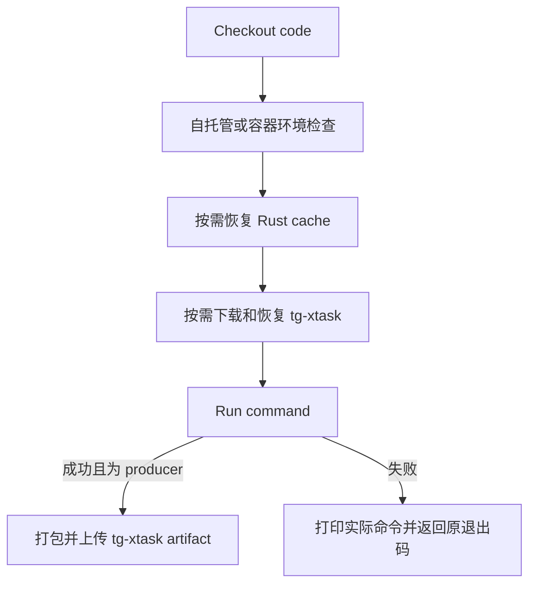

# CI 矩阵执行

`ci_plan.py` 输出的是执行计划，不是测试结果。实际覆盖需要顺着 `ci.yml` 的分组依赖、`reusable-check-matrix.yml` 的步骤日志和 `cargo xtask` 的用例汇总逐层确认。

## 1. 分组门禁

`_build_main_plan()` 生成静态检查，`_build_test_group_outputs()` 按 Workspace、ArceOS、Starry、AxVisor 分组生成 `*_matrix` 和 `*_required`。某组未被选择时，caller 不调用空矩阵。

### 1.1 Preflight

普通运行的 `static.toml` 包含两类前置检查。它们可以作为同一矩阵中的不同 job 调度，不能假定两者按表格顺序执行。

| 检查 | 当前命令 | 作用 |
| --- | --- | --- |
| Formatting + publish dry-run | `cargo fmt --all -- --check`，随后 `cargo publish --workspace --dry-run --no-verify` | 验证格式和打包预检，不实际发布软件包 |
| Synchronization lint | `cargo xtask sync-lint --since "$SINCE_REF"` | 验证共享实现同步约束，并构建后续可复用的任务工具 |

`static_checks` 必须满足规划成功、`should_run=true` 且 `static_required=true`。exclusive 套件模式有意不执行此阶段，不能把这种 skipped 当成格式已经通过。

### 1.2 测试分组

四个下游 caller 都要求 `plan_ci` 成功、自己的 `*_required=true`，并接受 Preflight 成功或 skipped。它们使用 `always()` 检查依赖结果，使有意跳过 Preflight 的精确套件仍能运行，但不会放行失败的 Preflight。

| 分组 | 代表性执行链路 |
| --- | --- |
| Workspace | 增量 Clippy；std 白名单测试；qperf 的构建、ABI 和采样检查 |
| ArceOS | 各架构 `arceos test qemu`；部分行先验证启动、SMP 或追加 task-ipi 场景 |
| Starry | `starry test qemu` 后追加 `ktest qemu -p starry-kernel`；独立板卡行运行 `starry test board` |
| AxVisor | 按清单运行 QEMU、Intel VMX、AMD SVM 和具体板卡场景；一行可包含多个启动变体 |

完整命令以 `.github/ci/checks/*.toml` 的 `command` 为准。ArceOS、Starry 和 AxVisor 的集成测试不能用一次宿主 `cargo test` 替代，Workspace 的 std 测试也不证明内核启动或硬件行为。

### 1.3 并行与失败范围

主 CI 为各组启用 `fail_fast`，执行器默认 `max_parallel=256`。一个矩阵行失败可能取消该组剩余行，但不会通过这一设置取消其他 caller 的矩阵；等待标签匹配的行也不意味着存在 256 台机器。

已取消的兄弟行没有完成验证，不能和 success 一起计为通过。工作流级队列及取消旧 run 的机制见[事件与调度](events.md)，它们与这里的组内 fail-fast 是不同层次。

## 2. 单行执行

执行器只有一个 matrix job。它在 job 级来源检查通过后，才按 `matrix.runs_on`、`matrix.container_image` 和 `matrix.timeout_minutes` 准备执行环境。

### 2.1 环境与输入

`run.steps` 的顺序决定了环境故障会出现在哪一个阶段。排障应定位第一个失败步骤，而不是只看最终红色 job。

自托管预检确认 `rustc`、`cargo` 可用；KVM 行还检查 `/dev/kvm` 的读写权限。容器预检按 `container_preflight` 检查 Git、用户态 QEMU 和交叉编译器；它不等于已经执行了内核 QEMU 测试。

`fetch_depth` 来自矩阵。配置中的 `full` 会由 planner 转为托管环境的完整历史或自托管环境的浅历史策略，不能仅从单词 `full` 推断 checkout 实际参数。需要增量历史的检查应结合其实际深度和基线日志确认。

### 2.2 命令与凭据

`Run command` 将 `matrix.command` 写入 runner 临时目录的脚本，用 `bash -e -o pipefail` 执行。脚本失败后打印展开后的命令并返回相同退出码，不把错误转换成绿色步骤。

`SINCE_REF`、`STARRY_APK_REGION` 等通过环境变量传入。Wi-Fi 凭据仅在 `wifi_secrets=true` 的矩阵行提供；其他行显式取消这两个变量。`CLAW_API_KEY` 由调用者按工作流配置传入。调试时不要打印凭据，也不要把是否获得 secrets 当作机器隔离的证明。

### 2.3 artifact 与缓存

`run-sync-lint` 成功后，把 `target/debug/tg-xtask` 打包成 `tg-xtask-bin` artifact。声明 `download_xtask_bin_artifact` 的后续行下载、解包并检查可执行文件；这与 `Swatinem/rust-cache` 的依赖缓存不是同一个机制。

当消费者命令是单行 `cargo xtask ...` 时，执行器可以改写为 `target/debug/tg-xtask ...`。多行命令不会自动逐行改写，因此 Starry 等清单会显式写出二进制路径。新增消费者时要同时核对 producer、job 依赖和命令形态。

exclusive 套件行禁用 artifact 依赖并直接调用 `cargo xtask`。自托管行的 `cache_key` 始终为空；只有显式非空键才启用 Rust cache，主 CI 只在 `main` 或 `dev` 的 push 下允许保存该缓存。

## 3. 从命令到用例

一个 OS 测试命令通常会继续展开测试目录、构建配置和多个用例。CI 矩阵关注平台与能力选择，任务工具负责构建和逐例运行，二者的去重边界不能混淆。

### 3.1 发现与构建

`scripts/axbuild/src/test/qemu/discovery.rs` 的 `discover_qemu_cases()` 发现配置并查找最近的构建包装文件，`group_cases_by_build_config()` 按构建配置归组，`prepare_case_build_groups()` 为各组准备构建。共享框架尽量复用相同构建，但不同配置和独立矩阵 job 并不自动共用一次编译。

Starry、AxVisor 的资产层还会选择 `CasePipeline` 并准备 rootfs、overlay 和测试程序；ArceOS 使用自己的 feature-based runner。完整实现与系统差异见[测试基础设施](../../build/test_infra.md)、[ArceOS 测试](../../build/arceos/test.md)、[StarryOS 测试](../../build/starry/test.md)及[AxVisor 测试](../../build/axvisor/test.md)。

### 3.2 运行与判定

测试配置里的 `success_regex`、`fail_regex` 和 `timeout` 属于用例协议。比如 Starry 分组系统测试要求最终的 `STARRY_GROUPED_TESTS_PASSED`，并把 panic、锁依赖致命错误和 `STARRY_GROUPED_TEST_FAILED:` 作为失败信号；看到前面某个子测试打印成功，不能代替最终分组结果。

`QemuTestSummary` 记录每个用例的成功或失败，`finalize_qemu_test_run()` 在存在失败项时返回错误。这个结果继续传到任务工具、`Run command`、矩阵 job 和 workflow。板卡测试走对应板卡执行链路，需要同时考虑板卡服务、文件传输、启动和测试输出，不能直接套用 QEMU 的宿主环境假设。

### 3.3 超时层级

至少要区分矩阵 `timeout_minutes`、用例配置 `timeout` 和具体测试程序内部的等待。前者限制整个 job，后者限制一次运行；构建、镜像下载和资产准备也消耗 job 时间。

当任务被外层超时或 fail-fast 取消时，可能没有完整用例汇总。应先确定超时发生在构建、启动还是测试阶段，再考虑修复；不要通过统一增加超时、削弱失败匹配或反复重跑把真实错误掩盖掉。
