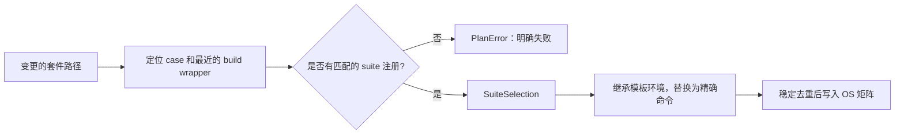

# 检查规划

`scripts/test/ci_impact.py` 回答“改动影响哪些能力”，`ci_suite.py` 回答“具体套件对应哪些运行入口”，`ci_plan.py` 再把这两类结果与检查清单组合成矩阵。影响分析只收缩需要单独执行的 PR 矩阵，push 和手动运行不按路径收缩矩阵。

## 1. 基线与输入

工作流的 `Resolve incremental base revision` 产生 `since_ref`，它既用于 PR 影响分析，也传给支持增量检查的命令。二者使用同一输入，但不是同一个选择过程。

### 1.1 基线解析

`ci.yml` 按事件选择基线。读取日志时应保留这一个具体引用，不能用排障时已经移动的 `origin/dev` 代替原始基线。

| 情况 | `since_ref` 来源 |
| --- | --- |
| PR | 事件中的 `pull_request.base.sha`，必要时尝试 fetch |
| push 且 `before` 非空、非全零 | 事件中的 `before` SHA |
| 手动运行且指定有效的 `since_sha` 字符串 | 用户输入 |
| 其他情况且存在父提交 | `HEAD~1` |
| 无可用父提交 | 尝试取得 `origin/dev` 并计算 merge base，最后回退到 `HEAD` |

这里的“有效”首先是排除空值和全零值，不意味着所有引用已经由每个下游命令验证。历史不完整或引用无法解析时，要检查实际日志中的后续回退或错误。

### 1.2 两种增量范围

`changed_paths_since()` 使用 `git diff --name-only --no-renames -z "${since_ref}...HEAD"` 取得 PR 变更，按三点 diff 计算，而不是只看最后一个提交。

push 和手动运行的 `_matches_impact()` 不缩小矩阵，但选中的 Clippy、sync-lint 等命令仍可带 `--since "$SINCE_REF"`。因此“运行完整矩阵”不等于“每一项命令都忽略增量参数”。`workspace.toml` 的 std 测试则在普通运行使用 `cargo xtask test`，在非全量 PR 选择中通过 `pull_request_command` 使用 `--since`。

## 2. 软件包影响

`CiImpact` 保存事实和选择依据，后续 `render_summary()` 将其输出到 Actions summary。排查多跑或漏跑时，应从这些字段推导矩阵，而不是从显示名称反推影响关系。

### 2.1 数据结构

`analyze_pull_request()` 先区分无需分析的路径、全局输入和可精确分析的输入，再调用 `analyze_changed_paths()`。关键字段的含义如下。

| 字段 | 含义 |
| --- | --- |
| `full`、`reason` | 是否回退完整矩阵及原因 |
| `changed_paths` | 参与本次差异记录的路径 |
| `ignored_markdown`、`ignored_apps` | 不扩大运行时覆盖的文档和普通应用路径 |
| `changed_packages`、`affected_packages` | 直接变更软件包及反向依赖闭包 |
| `affected_oses` | 任意目标上被依赖关系影响的 OS |
| `targets`、`input_selections` | 架构目标和精确平台输入 |
| `test_suite_paths`、`exclusive` | 待展开的套件路径及是否只运行精确套件 |

没有填写 `impact_targets` 或 `impact_packages` 的检查通常作为公共检查保留。被忽略的应用路径只是不扩大 OS 运行时检查，并不保证这个 PR 的全部 CI 都不运行。

### 2.2 反向依赖传播

`load_metadata_by_arch()` 为 AArch64、x86_64、RISC-V 和 LoongArch 的 bare-metal target 分别读取带 `--locked --all-features` 的 Cargo metadata。`_affected_package_ids()` 从变更软件包计算反向依赖，检查是否触达 `OS_ROOT_PACKAGES` 中的根软件包。

只要任意架构触达 ArceOS 的 `arceos-test-suit`、Starry 的 `starryos` 或 AxVisor 的 `axvisor`，该 OS 就进入 `affected_oses`。`_matches_impact()` 随后保留该 OS 的全部可用注册检查，包括其他架构、KVM 和板卡，不只保留最初命中的架构。

独立 axtest 软件包还通过 `_affected_axtest_runs_in_arceos_ci()` 补充其声明架构的 ArceOS 测试目标。AxLoader 等专项检查通过 `impact_packages` 选择；不应把所有跨平台组件都硬编码成某一个 OS 的路径规则。

### 2.3 配置与保守回退

`_known_input_selections()` 识别具名 QEMU、board 配置。能精确定位的平台只选择对应检查；已知属于某个 OS、却没有匹配注册的输入由 `_resolve_input_fallbacks()` 扩大到该 OS 的覆盖范围。

`Cargo.toml`、工具链、`.cargo`、CI 配置、planner、`xtask` 和 `scripts/axbuild` 等全局输入会触发完整矩阵。未知源码、依赖信息缺失或分析异常也回退完整矩阵，而不是默默缩小范围。

`Cargo.lock` 是 `SOFT_GLOBAL_PATHS` 中的软全局输入：仅有锁文件等软全局输入时回退全量；它与可解释的源码或套件一起变化时，不会单独扩大已有选择。普通 `apps/**` 被忽略，但 `apps/arceos/virtio-blk-test/**` 是显式的 AxVisor AArch64 QEMU 输入。

## 3. 套件精确选择

纯 `test-suit/**` 变更使用与普通软件包传播不同的路径。`resolve_suite_selections()` 将实际目录、配置和构建包装文件映射成 `SuiteSelection`，而不是直接把修改文件的父目录拼成命令。

### 3.1 模板和运行行

`SuiteSelection` 关联 `template_id`、`row_id`、显示名称、命令和来源路径。模板来自检查清单中的 `[[check.suite]]`，其中 QEMU 声明架构，board 声明板卡，可用 `cases` 限制模板覆盖的用例。

缺少 CI 模板或所需模板在当前上下文不可用，会使规划失败，不能把它解释为该测试已通过或可无声跳过。fork 向主仓提 PR 则更早被来源门禁阻止，不进入这条路径。

### 3.2 exclusive 模式

有效影响输入全部是套件路径时，`CiImpact.exclusive` 为真。`_build_main_plan()` 不生成 `Preflight`，也不加入 Workspace 和普通 OS 聚合检查，只执行已注册的精确用例并集。

`_normalize_suite_selection()` 关闭动态行的 artifact 上传和下载，并保留精确的 `cargo xtask` 命令，因此不依赖本次没有执行的 sync-lint producer。显示名称按平台、架构或板卡、case 区分，例如 `ArceOS / QEMU riscv64 · rust/task-ipi`。

多个 suite 变更取稳定去重并集；共享 build wrapper 的变更展开到其覆盖的已注册用例。Starry 分组系统测试的子目录可以映射到 `qemu/<subcase>` selector，并分别选择拥有配置和注册的架构。

### 3.3 混合变更

suite 与普通软件包同时变化时，不自动进入 exclusive。若软件包影响已经扩大到整个 OS，`_plan_suite_rows()` 不再为这个 OS 重复生成精确行；其他 OS 的独立 suite 仍可精确追加。

可以用以下典型输入理解选择结果。实际是否在主仓运行，仍先受[事件来源与去重](events.md)控制。

| 变更示例 | 选择结果 |
| --- | --- |
| 共享组件通过反向依赖影响 Starry | Starry 全部可用注册检查，加公共检查 |
| 仅修改已注册的 ArceOS task-ipi 用例 | exclusive 精确行，不运行普通 Preflight |
| 仅修改 Starry 的一个具名板卡配置 | 对应板卡检查，加公共检查 |
| suite 与同一 OS 的核心软件包一起改动 | 以 OS 范围检查为主，不再重复精确 suite 行 |
| 仅修改 `Cargo.lock` | 完整矩阵 |
| 修改 `ci_plan.py` 或检查清单 | 完整矩阵并运行 CI 配置回归 |

Actions summary 同时列出选中与未选中的检查、平台输入和回退原因。看到额外架构被选中时，应先确认是否命中了 OS 级传播，而不是立即收窄测试。
