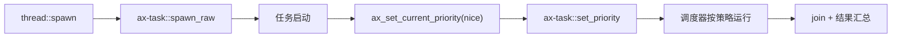
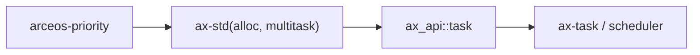

# `arceos-priority`

> 路径：`test-suit/arceos/task/priority`
> 类型：测试入口 crate
> 分层：测试层 / ArceOS 任务优先级回归
> 版本：`0.1.0`
> 文档依据：`Cargo.toml`、`src/main.rs`、`qemu-riscv64.toml`

`arceos-priority` 通过 5 个计算量不同、优先级不同的任务，验证 `ax_set_current_priority()` 这条任务优先级设置链是否仍然可用。它会同时检查计算结果是否正确，并记录每个任务的离开时间；在特定调度器与单核条件下，还会额外断言短任务的完成顺序是否符合优先级预期。

最关键的边界是：**这不是调度器性能 benchmark，也不是通用优先级框架；它只是一个围绕“设置当前任务优先级后，系统行为是否还自洽”的回归入口。**

## 架构设计
### 1.1 工作负载设计
源码里定义了 5 组 `TaskParam`：

- 4 个短任务：`nice = 19 / 10 / 0 / -10`
- 1 个长任务：`nice = 0`

每个任务都对一组固定数据执行 `load()` 计算，`load()` 的运行时间基本随输入值线性增长。这样设计的目的是：

- 让任务持续足够久，能观察到调度差异
- 保持总结果可被精确校验

### 1.2 真实调用关系


`ax_set_current_priority()` 在 `ax_api::task` 中最终更新当前线程的 Fair policy；这个值是 `nice`，范围为 `-20..=19`，生产调度器使用 EEVDF 的 Linux nice weight 表。

### 1.3 为什么不固定完成顺序
默认 QEMU 使用多核，完成顺序会受并行执行和唤醒时序影响。当前用例因此只验证 nice API、线程执行和 join 的正确性；EEVDF 的 lag、eligibility 和 virtual deadline 由 `ax-task` 的确定性模型测试覆盖。

## 核心功能
### 2.1 测试覆盖内容
这个 crate 实际覆盖了三件事：

1. `ax_set_current_priority()` 可以被调用且不会破坏任务执行。
2. 多个带不同 `nice` 的任务仍能正确完成工作并 `join`。
3. 改变优先级不会破坏线程生命周期或计算结果。

### 2.2 为什么还要比较 `expect` 与 `actual`
如果只看离开时间，不足以判断调度路径是否正确。源码先对所有任务输入做一次基线求和，再把各任务结果汇总比较：

- `expect`：主线程串行计算得到
- `actual`：子任务并发完成后汇总得到

这样就能确认优先级调度没有把任务执行结果本身搞坏。

### 2.3 边界澄清
它不负责：

- 证明某个调度器一定更高效
- 给出稳定的跨平台性能排序
- 评估多核抢占细节

它只在可控场景下验证优先级设置接口及其基本可观察效果。

## 依赖关系


### 直接依赖
- `ax-std(alloc, multitask)`：需要堆对象、线程和 `join`。

### 间接依赖
- `ax_api::task::ax_set_current_priority`
- `ax-task::set_priority`
- ax-task 的线程 policy 与 EEVDF fair runqueue

### 主要消费者
- `ax-task` 调度器优先级路径改动后的回归。
- `cargo arceos test qemu` 自动收集的任务语义测试集合。

## 开发指南
### 接入方式
```bash
cargo xtask arceos run --package arceos-priority --arch riscv64
```

或：

```bash
cargo arceos test qemu --target riscv64gc-unknown-none-elf
```

### 注意事项
1. 若要验证顺序，必须明确是单核还是多核。
2. 若要验证 EEVDF 的 `nice` 语义，应使用单核确定性调度模型，避免把 QEMU wall-clock 顺序当作断言。
3. 不要把输出时间当成性能基准报告；这里只能做相对语义检查。

### 4.3 更强验证的推荐方式
如果你要真正验证“高优先级更早完成”的行为，建议额外准备：

1. 单核 QEMU 配置
2. 显式把线程 policy 设置为 Fair
3. 保持当前工作负载和虚拟时间事件稳定

否则默认 4 核配置下，顺序本来就不应被写死。

## 测试
### 5.1 当前自动化形态
`qemu-riscv64.toml` 使用：

- `-smp 4`
- `success_regex = ["Priority tests run OK!"]`
- panic 关键字失败匹配

说明它已进入自动回归，但默认更像“优先级设置 smoke test”。

### 5.2 成功标准
- 所有任务计算都能完成
- `actual == expect`
- 最终打印 `Priority tests run OK!`

### 5.3 风险点
- 多核下不要误把日志顺序波动理解为 bug。
- 调度策略或 nice weight 改动后，要同步运行 `ax-task` 的 reference scheduler 测试。

## 跨项目定位
### ArceOS
它是 ArceOS 调度器优先级语义的专门回归入口，但只关注任务侧行为，不属于可复用子系统。

### StarryOS
StarryOS 不直接运行它；不过共享任务调度实现改动时，这种短路径回归依然具有预警价值。

### Axvisor
Axvisor 也不会直接依赖它。它的跨项目意义只在于：先用简单工作负载确认共享调度基础没有回退，再进入更复杂场景。
