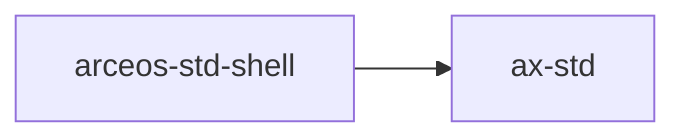

# `arceos-std-shell`

> 路径：`apps/arceos/shell`
> 类型：二进制 crate
> 分层：ArceOS 层 / ArceOS 示例程序
> 版本：`0.3.0`
> 文档依据：当前仓库源码、`Cargo.toml` 与 未检测到 crate 层 README

`arceos-std-shell` 的核心定位是：ArceOS 示例程序

## 架构设计
- 目录角色：ArceOS 示例程序
- crate 形态：二进制 crate
- 工作区位置：子工作区 `os/arceos`
- feature 视角：该 crate 没有显式声明额外 Cargo feature，功能边界主要由模块本身决定。
- 关键数据结构：可直接观察到的关键数据结构/对象包括 `CmdHandler`、`LF`、`CR`、`DL`、`BS`。

### 模块结构
- `cmd`：内部子模块

### 核心机制
- 该 crate 是入口/编排型二进制，复杂度主要来自初始化顺序、配置注入和对下层模块的串接。

## 核心功能
- 功能定位：ArceOS 示例程序
- 对外接口：从源码可见的主要公开入口包括 `run_cmd`。
- 典型使用场景：主要作为仓库中的专用支撑 crate 被上层组件调用。
- 关键调用链示例：按当前源码布局，常见入口/初始化链可概括为 `main()` -> `run_cmd()`。

## 依赖关系


### 直接依赖
- `ax-std`

### 间接依赖
- `ax-api`
- `ax-arm-pl031`
- `axaddrspace`
- `ax-alloc`
- `ax-allocator`
- `axbacktrace`
- `axconfig`
- `ax-config-gen`
- `ax-config-macros`
- `ax-cpu`
- `ax-display`
- 另外还有 `66` 个同类项未在此展开

### 3.3 被依赖情况
- 当前未发现本仓库内其他 crate 对其存在直接本地依赖。

### 被依赖情况
- 当前未发现更多间接消费者，或该 crate 主要作为终端入口使用。

### 外部依赖
- 当前依赖集合几乎完全来自仓库内本地 crate。

## 开发指南
### 接入方式
```toml
# `arceos-std-shell` 是二进制/编排入口，通常不作为库依赖。
# 更常见的接入方式是直接执行命令，而不是在 Cargo.toml 中引用。
```

```bash
cargo run --manifest-path "apps/arceos/shell/Cargo.toml"
```

### 初始化
1. 在 `Cargo.toml` 中接入该 crate，并根据需要开启相关 feature。
2. 若 crate 暴露初始化入口，优先调用 `init`/`new`/`build`/`start` 类函数建立上下文。
3. 在最小消费者路径上验证公开 API、错误分支与资源回收行为。

### API 使用
- 优先关注函数入口：`run_cmd`。

## 测试
### 测试覆盖
- 当前 crate 目录中未发现显式 `tests/`/`benches/`/`fuzz/` 入口，更可能依赖上层系统集成测试或跨 crate 回归。

### 单元测试
- 建议覆盖公开 API、状态转换和异常分支。

### 集成测试
- 建议补充最小消费者路径，验证该 crate 在真实调用链中可用。

### 覆盖率
- 覆盖率建议：公开 API、边界条件和关键错误处理路径需要显式覆盖。

## 跨项目定位
### ArceOS
`arceos-std-shell` 直接位于 `os/arceos/` 目录树中，是 ArceOS 工程本体的一部分，承担 ArceOS 示例程序。

### StarryOS
当前未检测到 StarryOS 工程本体对 `arceos-std-shell` 的显式本地依赖，若参与该系统，通常经外部工具链、配置或更底层生态间接体现。

### Axvisor
当前未检测到 Axvisor 工程本体对 `arceos-std-shell` 的显式本地依赖，若参与该系统，通常经外部工具链、配置或更底层生态间接体现。
