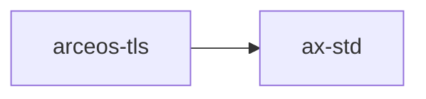

# `arceos-tls`

> 路径：`test-suit/arceos/rust/task/tls`
> 类型：二进制 crate
> 分层：测试层 / 系统级测试与回归入口
> 版本：`0.3.0`
> 文档依据：当前仓库源码、`Cargo.toml` 与 未检测到 crate 层 README

`arceos-tls` 的核心定位是：ArceOS 系统级测试与回归入口

## 架构设计
- 目录角色：系统级测试与回归入口
- crate 形态：二进制 crate
- 工作区位置：根工作区
- feature 视角：该 crate 没有显式声明额外 Cargo feature，功能边界主要由模块本身决定。
- 关键数据结构：该 crate 暴露的数据结构较少，关键复杂度主要体现在模块协作、trait 约束或初始化时序。
- 设计重心：该 crate 的主线不是提供稳定库 API，而是构造可复现的系统级测试场景，并通过日志、退出行为或 QEMU 结果判断是否回归通过。

### 模块结构
- 当前 crate 未显式声明多个顶层 `mod`，复杂度更可能集中在单文件入口、宏展开或下层子 crate。

### 核心机制
- 该 crate 主要承载系统级测试入口、QEMU/平台配置或断言编排，核心机制是测试场景构造与结果判定。

## 核心功能
- 功能定位：ArceOS 系统级测试与回归入口
- 对外接口：该 crate 的公开入口主要是 `main()` 或命令子流程，本身不强调稳定库 API。
- 典型使用场景：用于验证固定功能点、特定 bug 回归或系统语义是否符合预期，通常通过 QEMU 日志或退出状态判断成功与否。 这类 crate 的核心使用方式通常是运行入口本身，而不是被别的库当作稳定 API 依赖。
- 关键调用链示例：按当前源码布局，常见入口/初始化链可概括为 `main()`。

## 依赖关系


### 直接依赖
- `ax-std`

### 间接依赖
- `ax-alloc`
- `ax-allocator`
- `ax-api`
- `ax-arm-pl031`
- `ax-cpu`
- `ax-cpumask`
- `ax-crate-interface`
- 另外还有 `65` 个同类项未在此展开

### 3.3 被依赖情况
- 当前未发现本仓库内其他 crate 对其存在直接本地依赖。

### 被依赖情况
- 当前未发现更多间接消费者，或该 crate 主要作为终端入口使用。

### 外部依赖
- 当前依赖集合几乎完全来自仓库内本地 crate。

## 开发指南
### 4.1 运行入口
```toml
# `arceos-tls` 主要作为测试/验证入口使用，通常不作为普通库依赖。
# 推荐通过 xtask 统一测试入口或单包运行命令触发。
```

```bash
cargo arceos test qemu --target riscv64gc-unknown-none-elf
cargo xtask arceos run --package arceos-tls --arch riscv64
```

### 初始化
1. 先明确该测试场景对应的目标架构、QEMU 配置和成功/失败判据。
2. 优先通过 `cargo arceos test qemu` 跑完整测试入口，单包调试再退回 `run --package`。
3. 修改测试时同步检查日志匹配、预期 panic、退出状态和 feature 组合，保证回归结果可复现。

### API 使用
- 该 crate 的关键接入点通常是运行命令、CLI 参数或入口函数，而不是稳定库 API。

## 测试
### 测试覆盖
- 该 crate 本身就是系统级测试入口，测试价值主要来自 QEMU/平台运行结果而非 host 侧库测试。

### 单元测试
- 若该 crate 含辅助库逻辑，可对断言解析、日志匹配和测试输入构造做单元测试。

### 集成测试
- 重点是保持测试矩阵可复现：架构、平台、QEMU 配置、成功/失败判据都应纳入回归。

### 覆盖率
- 覆盖率要求以场景覆盖为主：应覆盖正常路径、预期失败路径和关键平台/feature 组合。

## 跨项目定位
### ArceOS
当前未检测到 ArceOS 工程本体对 `arceos-tls` 的显式本地依赖，若参与该系统，通常经外部工具链、配置或更底层生态间接体现。

### StarryOS
当前未检测到 StarryOS 工程本体对 `arceos-tls` 的显式本地依赖，若参与该系统，通常经外部工具链、配置或更底层生态间接体现。

### Axvisor
当前未检测到 Axvisor 工程本体对 `arceos-tls` 的显式本地依赖，若参与该系统，通常经外部工具链、配置或更底层生态间接体现。
