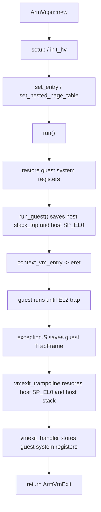
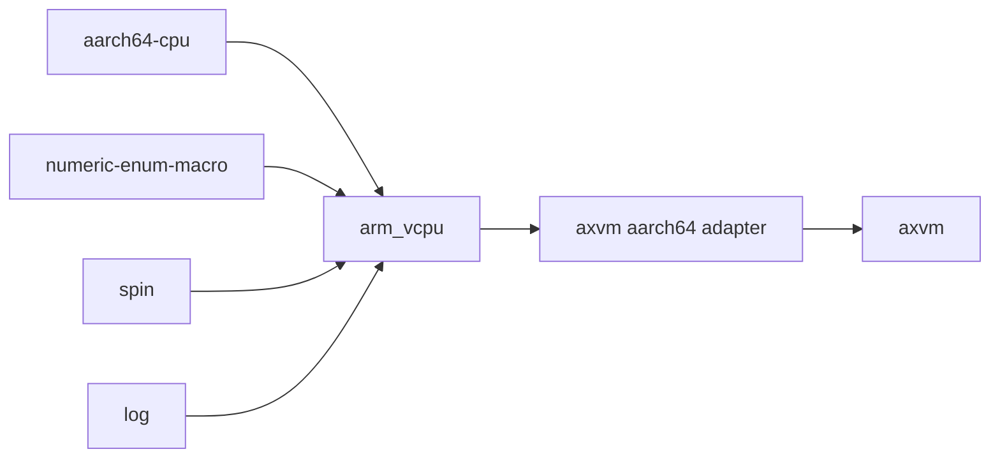

# `arm_vcpu`

> 路径：`virtualization/arm_vcpu`
> 类型：库 crate
> 分层：组件层 / AArch64 虚拟化 core

`arm_vcpu` 是 OS-neutral 的 AArch64 vCPU core。它只负责 EL2 entry/exit、guest trap frame、guest EL1/EL0 系统寄存器保存恢复、trap decode、Stage-2 寄存器语义和少量可在 vCPU core 内部完成的架构处理。它不直接绑定 AxVM、ArceOS、`ax-percpu`、`ax-crate-interface`、`axvm-types` 或 `ax-errno`。

AxVM/ArceOS 接入层位于 `virtualization/axvm/src/arch/aarch64`：该 adapter 把 `ArmVcpu<H>` / `ArmPerCpu` 包装成 `axvm_types::VmArchVcpuOps` / `VmArchPerCpuOps`，并负责 `ArmVmExit`、`ArmVcpuError` 和 AxVM 类型之间的转换。

## 架构设计

### 设计定位

- `arm_vcpu` 本体是 AArch64 硬件虚拟化执行 core，不是 VM 生命周期管理层。
- 宿主 OS/VMM 策略通过 `ArmHostOps` 注入，包括虚拟中断注入、pending host IRQ 获取和 current-EL host IRQ 处理。
- AxVM 仍是本仓库默认 consumer，但 AxVM trait glue 已经属于 AxVM adapter，而不是 `arm_vcpu` core。
- `arm_vgic` 仍独立维护虚拟 GIC 设备模型，本 crate 不把 vGIC 泛化进 vCPU core。

### 模块结构

- `src/lib.rs`：crate 入口与对外导出，导出 `ArmVcpu`、`ArmPerCpu`、`ArmHostOps`、`ArmVmExit`、`ArmNestedPagingConfig`、`ArmVcpuError` 和兼容别名。
- `src/types.rs`：OS-neutral 地址、访问宽度、nested paging config、VM exit 和错误类型。
- `src/host.rs`：`ArmHostOps` trait，以及 current-EL IRQ handler 的泛型到汇编入口桥接。
- `src/vcpu.rs`：vCPU 主体、EL2 guest entry/exit 协议、guest 系统寄存器恢复、VM exit 分类。
- `src/pcpu.rs`：per-CPU EL2 本地状态，负责异常向量安装和硬件虚拟化开关。
- `src/exception.rs` / `src/exception.S`：EL2 异常入口、VM exit trampoline、同步异常和系统寄存器 trap 处理。
- `src/context_frame.rs`：guest `TrapFrame` 和 `GuestSystemRegisters` 保存恢复。
- `src/exception_utils.rs`：ESR/FAR/HPFAR 解析与辅助汇编宏。
- `src/smc.rs`：SMC 调用封装。

### 关键数据结构

- `ArmVcpu<H: ArmHostOps>`：核心 vCPU 对象。前两个字段布局由汇编使用：
  - `ctx: TrapFrame`
  - `host: HostRuntimeContext { stack_top, sp_el0 }`
- `TrapFrame` / `Aarch64ContextFrame`：保存 guest GPR、guest `SP_EL0`、`ELR_EL2` 和 `SPSR_EL2`。
- `GuestSystemRegisters`：保存 guest EL1/EL0 系统寄存器和 EL2 虚拟化控制寄存器，不再保存 `SP_EL0`。
- `ArmPerCpu`：每 CPU 的 EL2 本地状态。
- `ArmVmExit`：vCPU core 输出的 OS-neutral VM exit。
- `ArmNestedPagingConfig`：由外层 VMM 选择的 Stage-2 配置，使用纯整数表达。

兼容别名仍保留：

```rust
pub type Aarch64VCpu<H> = ArmVcpu<H>;
pub type Aarch64PerCpu = ArmPerCpu;
pub type Aarch64VCpuCreateConfig = ArmVcpuCreateConfig;
pub type Aarch64VCpuSetupConfig = ArmVcpuSetupConfig;
```

### Entry/Exit 主线



Guest `SP_EL0` 只保存在 `TrapFrame.sp_el0`。Host `SP_EL0` 保存在私有 `HostRuntimeContext.sp_el0`，并在 `vmexit_trampoline` 返回 Rust 前恢复，避免 host Rust 或 IRQ handler 运行时仍持有 guest `SP_EL0`。

### AxVM Adapter

`virtualization/axvm/src/arch/aarch64` 定义：

- `AxvmArmHostOps`：把 `ArmHostOps` 连接到 AxVM 当前的 GIC host 能力。
- `AxvmArmVcpu(ArmVcpu<AxvmArmHostOps>)`：实现 `VmArchVcpuOps`。
- `AxvmArmPerCpu(ArmPerCpu)`：实现 `VmArchPerCpuOps`。

该层负责：

- `ArmVmExit` 到 `axvm_types::VmExit` 的转换。
- `ArmVcpuError` 到 `ax_errno::AxError` 的转换。
- `axvm_types::NestedPagingConfig`、`GuestPhysAddr` 等 AxVM 类型到 `arm_vcpu` OS-neutral 类型的转换。

## 依赖关系



### 直接依赖

- `aarch64-cpu`：系统寄存器访问。
- `numeric-enum-macro`：异常类型编码。
- `spin`：轻量同步原语。
- `log`：日志宏。

`arm_vcpu` 不直接依赖 `axvm-types`、`ax-errno`、`ax-percpu` 或 `ax-crate-interface`。

## 开发指南

1. `ArmVcpu` 的 `TrapFrame` 和 `HostRuntimeContext` 字段顺序与 `exception.S`、`vmexit_trampoline` 强绑定，修改布局必须同步更新布局常量和测试。
2. `run_guest()`、`context_vm_entry`、`vmexit_trampoline` 是一组完整汇编/Rust 协议，不能单边改动。
3. 新增宿主能力时，优先判断它是否真的是 vCPU core 必需能力；不是的话应放在 AxVM adapter 或更上层 VMM。
4. 新增 VM exit variant 后，需要同步更新 AxVM AArch64 adapter 的转换测试。
5. 系统寄存器 trap 的新增处理应先区分：属于 vCPU core 可自处理的架构语义，还是属于 `arm_vgic` 或上层 VMM 设备模型。

## 测试

重点覆盖：

- `arm_vcpu` manifest 不引入 AxVM/ArceOS runtime 依赖。
- `TrapFrame` 大小和 host runtime context 偏移。
- OS-neutral API、错误类型和 VM exit 类型。
- AxVM AArch64 adapter 的 error/exit 转换。
- AArch64 Axvisor smoke 场景下的 guest entry/exit、IRQ、HVC/SMC、MMIO 和 IPI 路径。

常用验证：

```bash
cargo fmt
cargo xtask clippy --package arm_vcpu
cargo xtask clippy --package axvm
cargo xtask axvisor test qemu --arch aarch64 --test-group normal --test-case smoke
```
