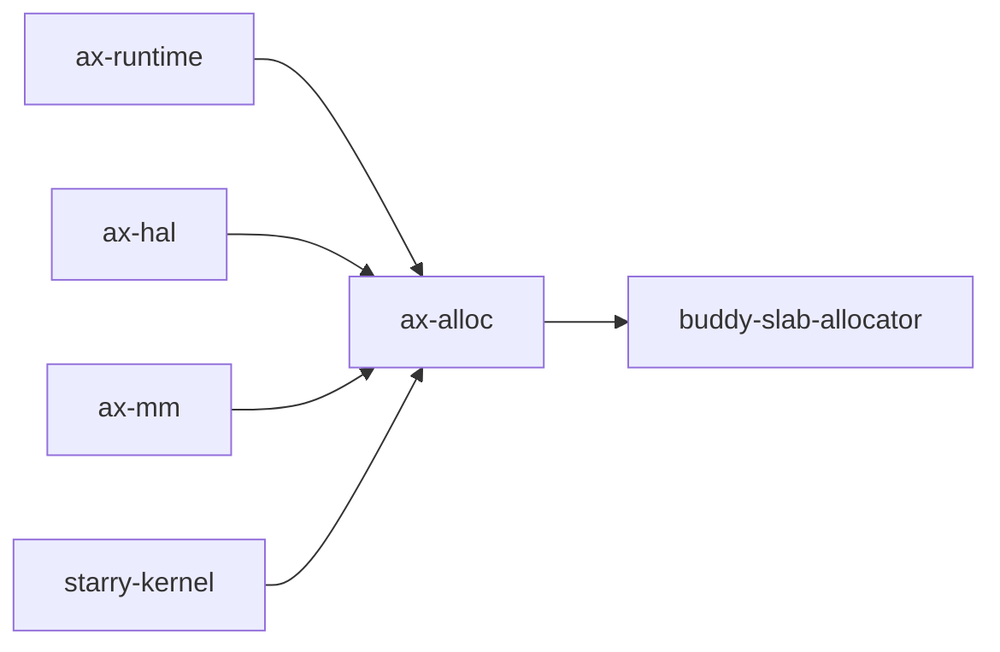

# `ax-alloc`

> 路径：`memory/ax-alloc`
> 类型：`no_std` 库 crate
> 分层：公共内存层 / 运行时分配入口
> 版本：`0.8.12`

`ax-alloc` 是原有同名 crate 从 `os/arceos/modules/axalloc` 迁移后的公共组件，不是由 `ax-allocator` 改名而来。原 `ax-allocator` 是可切换算法集合，整改后已经删除；其职责没有整体迁入 `ax-alloc`，生产后端固定为独立的 `buddy-slab-allocator`。

## 组件变更

| 原组件 | 处理 | 当前职责归属 |
| --- | --- | --- |
| `os/arceos/modules/axalloc` 中的 `ax-alloc` | 保留 crate 名并迁移目录 | `memory/ax-alloc` |
| `ax-allocator` | 删除，不保留兼容包或别名 | 页和小对象算法统一由 `buddy-slab-allocator` 提供 |
| `bitmap-allocator` | 随旧位图页分配路径删除 | 不再参与生产依赖 |
| TLSF、RLSF、stub、`hv` backend 分支 | 删除 | 不再提供可切换运行时后端 |

因此当前依赖方向是：



## 职责边界

`ax-alloc` 负责：

- 初始化和扩展运行时 Buddy 管理的物理内存区；
- 提供内核小对象堆和 `GlobalAlloc`；
- 提供带 zone、对齐和用途信息的连续页分配；
- 初始化每 CPU Slab；
- 保存统一的分配统计快照。

`ax-alloc` 不负责：

- 启动固件内存描述解析；
- 页表遍历和 PTE 编码；
- VMA、COW、Linux overcommit 或回收策略；
- DMA map/unmap、cache ownership 或 IOMMU；
- 在分配失败后调用 VFS、阻塞或隐式重试。

## 公共类型

### `MemoryZone` 与 `PageRequest`

`MemoryZone` 只有 `Normal` 和 `Dma32`。`Dma32` 表示分配结果的物理地址必须完全位于 4 GiB 以下，不表示独立保留的 Linux 式 DMA zone。

`PageRequest` 同时携带：

- `count`：4 KiB 页数量；
- `align`：字节对齐，必须是至少 4 KiB 的 2 次幂；
- `zone`：物理地址约束。

公共页入口为：

```rust
pub fn alloc_pages(
    request: PageRequest,
    usage: UsageKind,
) -> AllocResult<GlobalPage>;
```

### `GlobalPage`

`GlobalPage` 保存分配地址、原始 `PageRequest` 和 `UsageKind`。对象 Drop 时按照原 zone 和用途归还页面，避免调用方重新推导释放参数。

页表 provider、任务栈和必须适配分离式 alloc/free trait 的边界可以使用内部 raw pair；raw 释放是 `unsafe`，adapter 必须证明地址仍由自己唯一持有、请求和用途未改变且只释放一次。普通调用方应使用 `GlobalPage`。

### `AllocatorStats`

统计只保存一张 `AllocationSource × UsageKind` 计数表：

- source：`Normal`、`Dma32`；
- usage：Rust 堆、虚拟内存、page cache、页表、DMA 和通用页对象。

底层每个 bucket 使用一个 Relaxed 原子计数，每次 alloc/free 只更新一个 bucket，不使用统计全局锁串行化 Slab 命中。`stats()` 返回快照；`source()`、`usage()` 和 `total()` 从快照计算，不维护第二份可漂移的统计状态。

## 后端和并发

`buddy-slab-allocator` 是唯一生产后端：

- Buddy 管理多个不连续物理内存 section、连续页、对齐和 DMA32 过滤；
- 固定 size class 的 per-CPU Slab 处理小对象；
- 跨 CPU 释放通过受限 remote-free 路径回到 owner Slab；
- byte alloc/free 只在完整操作期间禁止任务迁移，不在 `buddy-slab-allocator` 外再持有跨 CPU 全局锁；
- 默认页分配仍使用单一全局 Buddy 锁，不提前引入完整 PCP、NUMA 或页迁移机制。

`global_init()` 注册第一段运行时内存，`global_add_memory()` 接入后续可用段。启动 bump allocator 的冻结和内存描述交接由 `someboot` 负责，不由 `ax-alloc` 重新解析固件信息。

## 可选能力

| Feature | 作用 |
| --- | --- |
| `global-allocator` | 注册 crate 提供的全局堆分配器 |
| `smp` | 启用多核锁和 per-CPU Slab 路径 |
| `tracking` | 记录堆分配布局、代次和回溯 |

`embedded-default`、`starry` 和 `hypervisor` 是系统配置组合，不是 `ax-alloc` feature 名称。

## 依赖关系

直接依赖中的内存算法只有 `buddy-slab-allocator`。`ax-alloc` 还依赖：

- `ax-memory-addr`：物理和虚拟地址类型；
- `ax-plat`：地址转换；
- `ax-percpu`：每 CPU Slab；
- `ax-kspin`：非睡眠锁；
- `ax-errno`、`thiserror`：错误边界；
- 可选 `axbacktrace`：分配跟踪。

直接消费者包括 `ax-runtime`、`ax-hal`、`ax-mm`、`ax-api`、`ax-posix-api`、`ax-std`、`axklib` 和 `starry-kernel`。

`ax-page-table` 不依赖 `ax-alloc`，页来源通过 `PageFrameProvider` 注入。`starry-mm` 也不直接控制该分配器；允许回收时，由 Starry kernel adapter 在外层组织一次有界重试。

## 验证

修改该 crate 后至少执行：

```bash
cargo test -p ax-alloc
cargo xtask clippy --package ax-alloc
cargo test -p buddy-slab-allocator
cargo test -p buddy-slab-allocator --test stress_test -- --ignored
```

系统级验证还需要覆盖多段启动内存交接、SMP per-CPU Slab、DMA32 物理边界、页表分配、Starry COW/fault 和 Axvisor Guest RAM。

更完整的启动交接、运行时算法和性能约束见[内存管理架构](../../architecture/memory/overview.md)与[运行时分配器](../../architecture/memory/runtime-allocator.md)。
