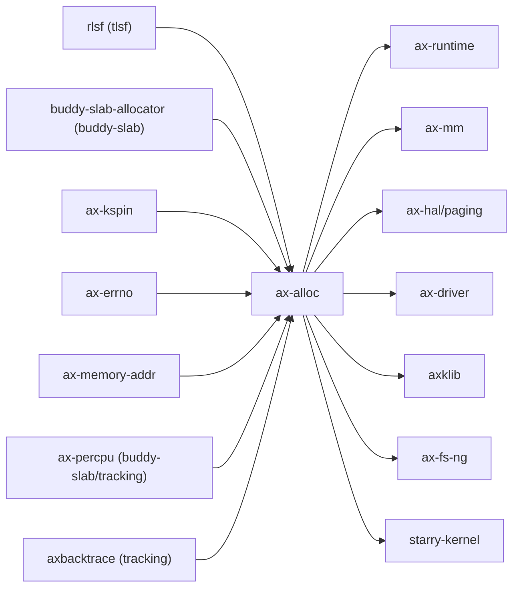

# `ax-alloc`

> 路径：`memory/ax-alloc`
> 类型：库 crate
> 分层：内存层 / 全局内存分配运行时基础件
> 文档依据：`Cargo.toml`、`README.md`、`src/lib.rs`、`src/tlsf_impl.rs`、`src/buddy_slab.rs`、`src/page.rs`、`src/tracking.rs`

`ax-alloc` 是 ArceOS 的全局分配入口。它提供可挂到
`#[global_allocator]` 的 `GlobalAllocator`，并向运行时、页表、DMA、
页缓存和 StarryOS 内核路径暴露统一的堆/页分配接口。

## 架构设计

`ax-alloc` 只负责分配服务，不负责物理内存发现、页表策略或地址空间管理：

- 向下按 feature 选择 `tlsf` 或 `buddy-slab` 后端。
- 向上通过 `global_allocator()`、`GlobalPage`、`UsageKind` 和 `Usages` 提供统一入口。
- 横向通过 page reclaim callback 支持页缓存回收，缓解运行期页分配压力。

## 后端

- `tlsf`：使用 `rlsf` 作为 TLSF 分配器，页分配通过页对齐的大块 TLSF 分配完成。
- `buddy-slab`：使用 `buddy-slab-allocator`，组合 buddy 页分配和 per-CPU slab 小对象分配。
- 未选择上述后端时，构建会落到 stub 实现，仅保留接口形状。

## 核心对象

- `GlobalAllocator`：后端导出的全局分配器实现。
- `DefaultByteAllocator`：当前后端对应的字节分配器类型别名。
- `UsageKind`：把内存使用划分为 `RustHeap`、`VirtMem`、`PageCache`、`PageTable`、`Dma`、`Global`。
- `Usages`：按用途累计的统计视图。
- `GlobalPage`：连续页块的 RAII 所有权对象。
- `PageReclaimFn`：页分配失败时可调用的回收钩子。

## 依赖关系

```mermaid
graph LR
    rlsf["rlsf (tlsf)"] --> ax_alloc["ax-alloc"]
    buddy_slab["buddy-slab-allocator (buddy-slab)"] --> ax_alloc
    ax_kspin["ax-kspin"] --> ax_alloc
    ax_errno["ax-errno"] --> ax_alloc
    ax_memory_addr["ax-memory-addr"] --> ax_alloc
    ax_percpu["ax-percpu (buddy-slab/tracking)"] --> ax_alloc
    axbacktrace["axbacktrace (tracking)"] --> ax_alloc

    ax_alloc --> ax_runtime["ax-runtime"]
    ax_alloc --> ax_mm["ax-mm"]
    ax_alloc --> ax_hal["ax-hal/paging"]
    ax_alloc --> ax_driver["ax-driver"]
    ax_alloc --> axklib["axklib"]
    ax_alloc --> axfs_ng["ax-fs-ng"]
    ax_alloc --> starry_kernel["starry-kernel"]
```

## 使用场景

- `global_init()` / `global_add_memory()`：由 `ax-runtime` 在启动期接入可用内存区域。
- `global_allocator().alloc()` / `dealloc()`：服务 Rust 堆分配和上层 API 转发。
- `global_allocator().alloc_pages()` / `dealloc_pages()`：服务虚拟内存、页表、DMA、页缓存等页级消费者。
- `register_page_reclaim_fn()`：允许文件页缓存等上层在内存压力下释放可回收页。
- `tracking` feature：记录分配地址、`Layout`、backtrace 和分配代次，用于诊断泄漏或内存大户。

## 注意事项

1. 修改后端能力时，要保持 `AllocatorOps` 的错误语义一致。
2. 修改 `UsageKind` 或统计规则时，要避免堆扩展和堆内分配重复记账。
3. `GlobalPage` 只表示连续页块所有权，不表达映射属性、cache 属性或 IOMMU 语义。
4. `buddy-slab` 依赖 per-CPU slab 初始化，CPU bring-up 路径必须先调用 `init_percpu_slab()`。

## 验证

`ax-alloc` 的主验证来自运行时集成：

- ArceOS 启动链调用 `global_init()` 后能完成堆初始化。
- `ax-mm`、`ax-hal`、DMA 和页缓存路径能稳定分配/释放页。
- `tracking` 打开后，StarryOS memtrack 视图能观察到对应分配记录。
- `buddy-slab` 组合下 per-CPU slab 与 DMA32 页分配路径可用。
