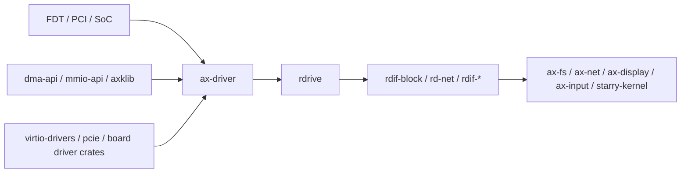

# `ax-driver`

> 路径：`drivers/ax-driver`
> 类型：库 crate
> 分层：共享驱动聚合层 / ArceOS glue

`ax-driver` 是当前仓库的共享驱动聚合入口。重构后，旧驱动接口包组已移除，驱动实现、总线探测和 RDIF/rdrive adapter 集中在 `drivers/ax-driver` 以及 `drivers/*` 下的可复用 crate 中。

## 架构定位

`ax-driver` 负责把平台发现结果转成上层可消费的设备能力：

- 向下连接 FDT、PCI、VirtIO、SoC/板级驱动和 MMIO/DMA 能力。
- 向上通过 `rdrive` 注册表和 `rdif-block`、`rd-net`、`rdif-display`、`rdif-input`、`rdif-vsock` 暴露设备。
- 在 ArceOS、StarryOS、Axvisor 之间复用驱动 core，同时把 OS glue 限定在 probe、iomap、IRQ 注册和运行时适配层。

## 主要模块

- `block/*`、`net/*`、`display/*`、`input/*`、`vsock/*`：按设备类别组织驱动绑定和 RDIF adapter。
- `virtio/*`：封装 VirtIO transport 和块设备、网卡、显示、输入、vsock adapter。
- `pci/*`：处理 PCI/FDT 探测、BAR/window 资源和平台相关 PCIe glue。
- `soc/*`、`usb/*`、`serial/*`、`time.rs`：承载 SoC、USB、串口和 RTC 等平台设备 glue。

## 自定义平台接入

`ax-driver` 不再提供面向旧平台私有路径的自动注册 feature，也不再通过 feature 选择平台探测路径。仓库内置平台路径默认使用 FDT/ACPI/PCI probe 注册设备；外部平台应优先提供可发现的设备描述，缺少固件描述时再使用 `rdrive::Platform::Static` / `PlatformSource::Static` 和 `ProbeKind::Static` 做显式设备注册。完整平台侧接入方式见 [平台层 / 设备发现](../../architecture/platform/devices)。

## 依赖关系



### 直接依赖

- `rdrive`、`rdif-block`、`rd-net`、`rdif-*`：设备注册、查询和领域能力接口。
- `dma-api`、`mmio-api`、`axklib`：DMA、MMIO 和内核映射能力边界。
- `virtio-drivers`、`pcie`、SoC/板级驱动 crate：具体硬件协议或平台 glue。
- `ax-alloc`、`ax-errno`、`ax-kspin` 等：分配、错误映射和同步路径。

## 开发约束

- 新驱动应保持 Driver Core / Capability Boundary / OS Glue 分层，portable core 不直接调用 `iomap`、IRQ 注册或任务调度 API。
- 上层模块应通过领域接口或 `rdrive` 查询设备，不重新引入 `AllDevices` 式全局容器。
- 新增设备能力时，同步检查 feature、probe 路径、RDIF adapter 和对应 ArceOS/StarryOS/Axvisor 消费方。

## 验证

修改 `ax-driver` 或平台 glue 后，至少运行：

```bash
cargo xtask clippy --package ax-driver
cargo xtask clippy --package axplat-dyn
```

涉及 ArceOS 运行路径时，继续跑对应 `cargo xtask arceos test qemu ...` 用例。
