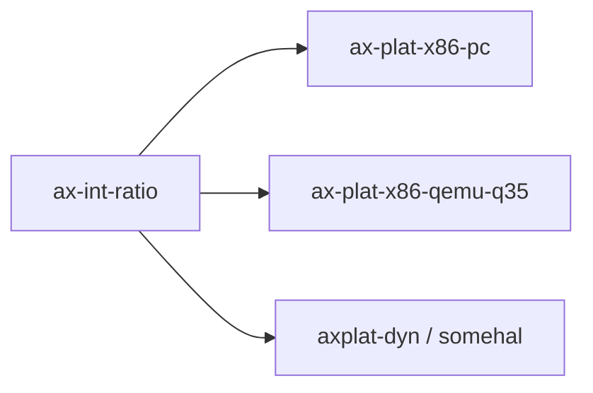

# `ax-int-ratio`

> 路径：`components/int_ratio`
> 类型：库 crate
> 分层：组件层 / 整数比例基础件
> 版本：`0.1.2`
> 文档依据：`Cargo.toml`、`README.md`、`src/lib.rs`、`tests/test_int_ratio.rs`

`ax-int-ratio` 提供一个面向内核/平台代码的小型整数比例类型 `Ratio`。它把 `numerator / denominator` 预计算成 `mult / (1 << shift)` 形式，从而在运行时把“除法换乘移位”，减少高成本整数除法。它是纯数学叶子基础件：不是时间子系统、不是频率校准器，也不是通用数值库。

## 架构设计
### 设计定位
这个 crate 要解决的问题非常具体：很多平台代码反复做“ticks 和 nanoseconds 之间的比例换算”，但在 `no_std` 场景里频繁做 `u128` 除法不划算，于是 `Ratio` 在构造时先把比例离散成适合快速乘法的表示。

当前仓库里的真实使用场景也印证了这个定位：

- `ax-plat-x86-pc/src/time.rs` 用它把纳秒转换为 LAPIC ticks。
- 动态 AArch64 平台时间路径经由 `somehal`/generic timer 逻辑使用同类比例换算。

### 1.2 核心类型
- `Ratio`：保存原始 `numerator`、`denominator`，以及预计算后的 `mult` 和 `shift`。

### 1.3 计算模型
核心等式是：

```text
numerator / denominator ~= mult / (1 << shift)
```

`Ratio::new()` 的流程可以概括为：

1. 从 `shift = 32` 开始尝试。
2. 计算 `mult = round((numerator << shift) / denominator)`。
3. 若 `mult` 超出 `u32`，持续减小 `shift`。
4. 在满足范围后，再尽量把 `mult` 的 2 因子消掉，以得到更紧凑表示。

因此 `Ratio` 的重点不是“精确保存一个分数”，而是在 `u32 + u32` 表示约束下，为后续乘法计算找到一个高精度、低成本的近似表示。

### 1.4 特殊值语义
- `Ratio::zero()` 表示特殊的 `0/0`，它被定义成“乘任何值都得到 0，求逆仍是自己”。
- `Ratio::new(0, x)` 也是零比例，但它和 `Ratio::zero()` 的语义边界略有不同：前者求逆会变成 `x/0` 并触发 panic，后者不会。

这个细节很重要，因为它说明 `Ratio::zero()` 不是数学意义上的普通分数，而是给系统初始化阶段准备的哨兵值。

## 核心功能
### 功能概览
- 构造一个可快速乘法求值的整数比例。
- 支持向上层暴露截断乘法 `mul_trunc()`。
- 支持四舍五入乘法 `mul_round()`。
- 支持快速取倒数 `inverse()`。

### 使用场景
- `Ratio::new()`：在 `ax-plat-x86-pc`、`ax-plat-x86-qemu-q35` 和动态平台时间初始化代码中使用。
- `mul_trunc()`：平台时间路径用来把 deadline 或 tick 值做快速转换。
- `inverse()`：AArch64 generic timer 初始化时直接通过现有比例求反比率。
- `Ratio::zero()`：常作为静态变量的初始化哨兵值。

### 边界说明
- `ax-int-ratio` 不做通用分数运算，没有加减除比较等完整代数接口。
- 它只支持 `u32` 分子和分母，不是大整数比例库。
- 它也不负责频率探测、校准和时间源选择；这些都属于平台时间子系统。

## 依赖关系


### 直接依赖
`ax-int-ratio` 没有本地 crate 依赖，体量非常小。

### 主要消费者
- `ax-plat-x86-pc` / `ax-plat-x86-qemu-q35`：LAPIC 计时换算。
- `axplat-dyn` / `somehal`：动态平台 generic timer 的 ticks / nanos 双向换算。

## 开发指南
### 接入方式
```toml
[dependencies]
ax-int-ratio = { workspace = true }
```

### 注意事项
1. `PartialEq` 当前比较的是 `mult` 和 `shift`，不是原始分子分母；改动表示法会直接影响相等语义。
2. `new()` 里的舍入与压缩逻辑决定了精度和边界行为，任何修改都应重新验证现有平台时间换算。
3. `Ratio::zero()` 的“可逆零哨兵”语义已经被初始化代码依赖，不能随意改成普通 `0/x`。
4. `mul_trunc()` / `mul_round()` 使用 `u128` 乘法避免溢出，若调整类型范围，要同步审视所有中间值。

### 4.3 开发建议
- 若需要更复杂的数值语义，应另建数学类型，不要把 `Ratio` 扩成“大而全分数库”。
- 若只需要启动期哨兵值，优先用 `Ratio::zero()`，不要手写 `unsafe` 的未初始化状态。
- 新增平台使用时，应先确认比例常数能安全压进 `u32/u32` 输入模型。

## 测试
### 测试覆盖
`ax-int-ratio` 同时有单元测试和集成测试：

- `src/lib.rs` 内联测试覆盖表示压缩、倒数和零值。
- `tests/test_int_ratio.rs` 覆盖等价比例、舍入/截断差异、panic 路径和大数边界。

### 单元测试
- `new()` 的 `mult` / `shift` 推导结果。
- `inverse()` 对普通比例与零哨兵的不同处理。
- `mul_trunc()` 与 `mul_round()` 在边界值上的差异。

### 集成测试
- 平台时间代码中 tick 与 nanosecond 的双向转换。
- 中断定时器 deadline 设置是否受比例误差影响。

### 覆盖率
- 对 `ax-int-ratio`，panic 路径和极端数值边界必须有覆盖。
- 只验证普通小数例子还不够，必须保留 `u32::MAX` 级别测试。

## 跨项目定位
### ArceOS
在 ArceOS 相关平台实现里，`ax-int-ratio` 主要承担高频时间换算的数学基础件角色。它服务于时间代码，但本身不是时间框架的一部分。

### StarryOS
StarryOS 若复用相同平台栈，也会间接受益于 `ax-int-ratio`。其定位仍然是底层比例计算工具。

### Axvisor
当前仓库里 Axvisor 没有直接依赖 `ax-int-ratio`；即便未来通过共享平台层复用，它也仍只是数值换算基础件，不会变成虚拟化时间管理层。
